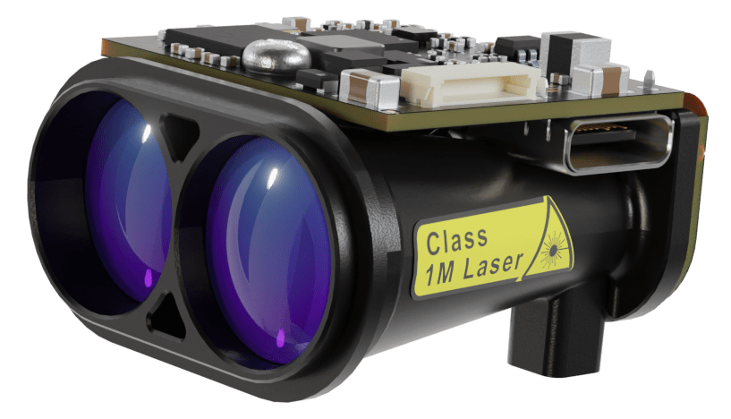

# Lightware GRF250/GRF500 Gimbal Lidar

LightWare [GRF250](https://lightwarelidar.com/shop/grf-250/) and [GRF500](https://lightwarelidar.com/shop/grf-500/) are small and light Lidar modules with a range of 250m and 500m, respectively.



::: info
The Lidar driver is not included in the default build of PX4.
You will need to [create and use a custom build](#add-the-driver-to-the-px4-build).
:::

## Where to Buy

Order these modules from:

- [GRF250](https://lightwarelidar.com/shop/grf-250/)
- [GRF500](https://lightwarelidar.com/shop/grf-500/)

## Hardware Setup

The rangefinder can be connected to any unused serial port, such as `TELEM2`.
[Parameter Configuration](#parameter-configuration) explains how to configure the port to use and the other properties of the rangefinder.

## PX4 Setup

### Add the Driver to the PX4 Build

The [lightware_grf_serial](../modules/modules_driver_distance_sensor.md#lightware-grf-serial) driver for this Lidar is not included in PX4 firmware by default.
In order to use these modules you will first need to update the firmware configuration to add the driver, and then build the firmware.

1. Update the firmware configuration. You can use either of the following options:
   - Menuconfig:
     1. Install and open [menuconfig](../hardware/porting_guide_config.md#px4-menuconfig-setup)
     2. In [menuconfig](../hardware/porting_guide_config.md#px4-menuconfig-setup), navigate to **Drivers > Distance sensors**
     3. Select/Enable `lightware_grf_serial`
     4. Save the configuration

   - Manually update `default.px4` to include the configuration key:
     1. Open the `default.px4board` config file that corresponds to the board you want to build for.
        For example, to add the driver to `fmu-v6x` boards you would update [/boards/px4/fmu-v6x/default.px4board ](https://github.com/PX4/PX4-Autopilot/blob/main/boards/px4/fmu-v6x/default.px4board)
     2. Add the following line and save the file:

        ```txt
        CONFIG_DRIVERS_DISTANCE_SENSOR_LIGHTWARE_GRF_SERIAL=y
        ```

2. [Build PX4](../dev_setup/building_px4.md) for your flight controller target and upload the new firmware.

### Parameter Configuration

You will need to configure PX4 to indicate the serial port to which the sensor is connected (as per [Serial Port Configuration](../peripherals/serial_configuration.md)) and also the orientation and other properties of the sensor.

The [parameters to change](../advanced_config/parameters.md) are listed in the table.

| Parameter                                                                                                | Description                                              |
| -------------------------------------------------------------------------------------------------------- | -------------------------------------------------------- |
| <a id="SENS_EN_GRF_CFG"></a>[SENS_EN_GRF_CFG](../advanced_config/parameter_reference.md#SENS_EN_GRF_CFG) | Set to the serial port you have the sensor connected to. |
| <a id="GRF_UPDATE_CFG"></a>[GRF_UPDATE_CFG](../advanced_config/parameter_reference.md#GRF_UPDATE_CFG)    | Set the update rate.                                     |

## Testing

You can confirm that the sensor is correctly configured by connecting QGroundControl, and observing that [DISTANCE_SENSOR](https://mavlink.io/en/messages/common.html#DISTANCE_SENSOR) is present in the [MAVLink Inspector](https://docs.qgroundcontrol.com/master/en/qgc-user-guide/analyze_view/mavlink_inspector.html).

Moving the sensor around at various distances from a surface will have the `current_distance` value change.
