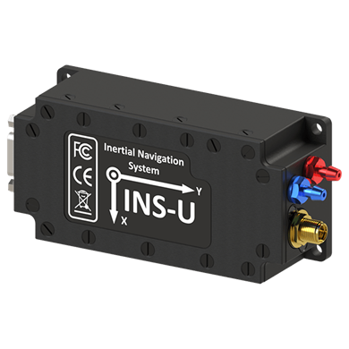

# Inertial Labs INS (All sensors, including INS-U/INS-DU)

Inertial Labs designs and develops [IMU](https://inertiallabs.com/products/imu-inertial-measurement-units/), [AHRS](https://inertiallabs.com/products/ahrs/), [GNSS/INS](https://inertiallabs.com/products/ins-inertial-navigation-systems/) and [other](https://inertiallabs.com/) solutions.
A universal protocol is used for [all Inertial Labs sensors](https://inertiallabs.com/).

Benefits to PX4 users:

- Higher accuracy heading, pitch, and roll estimates
- More robust and reliable GNSS positioning
- Improved positioning and attitude performance in GNSS-contested environments
- Performance under challenging dynamic conditions (e.g. catapult launches, VTOL operations, high-g or high angular rate operations)
- Work in different spoofing and jamming conditions

PX4 can use these in a mode that provides only raw sensor output (the default), or as an [external INS](../sensor/inertial_navigation_systems.md) that provides both sensor output and INS data such as position and velocity estimates.
The mode is configurable using a parameter.

## Where to Buy

[Get technical support or send requests to sales team](https://inertiallabs.com/inertial-labs-inc/contact-inertial-labs-team/).
Recommended sensors:

- [INS-U GNSS/INS](https://inertiallabs.com/wp-content/uploads/2026/01/INS-U_INS-U-OEM_Datasheet_REV2.18_JAN2026.pdf): Recommended for fixed-wing systems without hovering, where static heading is not necessary.
- [INS-DU DUAL GNSS/INS](https://inertiallabs.com/wp-content/uploads/2025/12/INS-DU_INS-DU-OEM_Datasheet_REV1.00_DEC2025.pdf): Recommended for multicopter systems where hovering and low dynamics requires the use of static heading.

## Hardware Setup

### Wiring

Connect the sensor to any unused flight controller serial interface, such as a spare `GPS` or `TELEM`.

### Mounting

The Inertial Labs sensors can be mounted in any orientation.
You can set offsets for coordinate axes in the sensor-configuration software that is provided with your sensor.

## Firmware Configuration

### PX4 Configuration

To use the Inertial Labs driver:

1. Build the firmware with the [ilabs](../modules/modules_driver_ins.md#ilabs) module.

   - Make sure the UART RX-buffer for the serial port connected to the INS is at least **600 bytes**.

     ::: tip
     For example, when using `TELEM2` on Pixhawk 6X, add the following setting to [defconfig](https://github.com/PX4/PX4-Autopilot/blob/main/boards/px4/fmu-v6x/nuttx-config/nsh/defconfig):
     `CONFIG_UART5_RXBUFSIZE=600`

     Note that the mapping between UART number and port name can usually be found in your board's [Serial Port Mapping](../flight_controller/pixhawk6x.md#serial-port-mapping) section.
     :::

   - Include the module in firmware in the [kconfig board configuration](../hardware/porting_guide_config.md#px4-board-configuration-kconfig) by setting the kconfig variables: `CONFIG_DRIVERS_INS_ILABS`.
     In the kconfig interface: Drivers -> INS -> ilabs.

2. [Set the parameter](../advanced_config/parameters.md) [SENS_ILABS_CFG](../advanced_config/parameter_reference.md#SENS_ILABS_CFG) to the hardware port connected to the sensor, such as a spare `GPS` or `TELEM`.

   ::: warning
   Disable or change port of other sensors that are using the same one, for example [GPS_1_CONFIG](../advanced_config/parameter_reference.md#GPS_1_CONFIG) if using GPS1 port.
   :::

3. Allow the Inerital Labs driver to initialize by restarting PX4.
4. Configure driver to provide IMU data or Raw sensors data :
   - For external INS, set [ILABS_MODE](../advanced_config/parameter_reference.md#ILABS_MODE) to `INS`.

     In this case, the [EKF2_EN](../advanced_config/parameter_reference.md#EKF2_EN), [SENS_IMU_MODE](../advanced_config/parameter_reference.md#SENS_IMU_MODE), and [SENS_MAG_MODE](../advanced_config/parameter_reference.md#SENS_MAG_MODE) parameters are disabled at startup (set to `0`). Аnd the INS's internal EKF is used for orientation.

   - For raw inertial sensors, set [ILABS_MODE](../advanced_config/parameter_reference.md#ILABS_MODE) to `Sensors Only`.

     Prioritize Inertial Labs sensors using [CAL_GYROn_PRIO](../advanced_config/parameter_reference.md#CAL_GYRO0_PRIO), [CAL_ACCn_PRIO](../advanced_config/parameter_reference.md#CAL_ACC0_PRIO), [CAL_BAROn_PRIO](../advanced_config/parameter_reference.md#CAL_BARO0_PRIO), [CAL_MAGn_PRIO](../advanced_config/parameter_reference.md#CAL_MAG0_PRIO), where `n` is the instance number of the IMU component (0, 1, etc.).

     ::: tip
     In most cases the external IMU is the highest-numbered.
     You can get a list of the IMU components available using [`uorb top -1`](../middleware/uorb.md#uorb-top-command), you can differentiate between them using the [`listener`](../modules/modules_command.md#listener) command and looking through the data, or just the rates.

     Alternatively, you can check [CAL_GYROn_ID](../advanced_config/parameter_reference.md#CAL_GYRO0_ID) to see the device id.
     The priority is 0-255, where 0 is entirely disabled and 255 is highest priority.
     :::

     ::: warning
     When configuring both Inertial Labs and Pixhawk sensors to have non-zero priority, if the selected sensor is errored (timeout), it can change during operation without being notified.
     In this case, MAVLink messages will be updated with the newly selected sensor.

     If you don't want to have this fallback mechanism, you must disable unwanted sensors.
     :::

5. Restart PX4.

Once enabled, the module will be detected on boot.

## Inertial Labs Sensor Configuration

Perform sensor configuration according to the Interface Control Document (ICD) that comes with each device.
The sensor-configuration software allows you to set the baurate and the data format, and you can also adjust the orientation axes if the sensor wasn't oriented in the normal way.
This process is usually short and takes a few minutes, depending on the sensor and the installation conditions on the vehicle.

## Published Data

These uORB topics are published:

- [sensor_accel](../msg_docs/SensorAccel.md)
- [sensor_gyro](../msg_docs/SensorGyro.md)
- [sensor_mag](../msg_docs/SensorMag.md)
- [sensor_baro](../msg_docs/SensorBaro.md)
- [sensor_gps](../msg_docs/SensorGps.md)

If enabled as an external INS, publishes:

- [vehicle_local_position](../msg_docs/VehicleLocalPosition.md)
- [vehicle_global_positon](../msg_docs/VehicleGlobalPosition.md)
- [vehicle_attitude](../msg_docs/VehicleAttitude.md)
- [estimator_status](../msg_docs/EstimatorStatus.md)
- [estimator_status_flags](../msg_docs/EstimatorStatusFlags.md)

If enabled as external sensor only:

- `external_ins_local_position`
- `external_ins_global_position`
- `external_ins_attitude`

::: tip
Published topics can be viewed using the `listener` command.
:::
