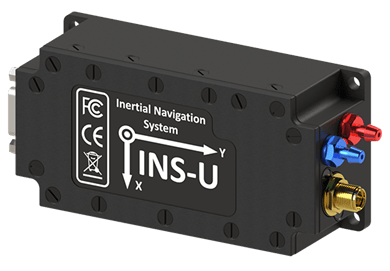

# Inertial Labs

Inertial Labs designs and develops [IMU](https://inertiallabs.com/products/imu-inertial-measurement-units/), [AHRS](https://inertiallabs.com/products/ahrs/), [GNSS/INS](https://inertiallabs.com/products/ins-inertial-navigation-systems/) and [other](https://inertiallabs.com/) solutions.

Sensors connection is "plug-and-play" and it uses universal protocol for [all Inertial Labs sensors](https://inertiallabs.com/).
Benefits to PX4 users and can be integrated for:

- Higher accuracy heading, pitch, and roll estimates
- More robust and reliable GNSS positioning
- Improved positioning and attitude performance in GNSS-contested environments
- Performance under challenging dynamic conditions (e.g. catapult launches, VTOL operations, high-g or high angular rate operations)
- Work in different spoofing and jamming conditions

PX4 can use these as an [external INS](../sensor/inertial_navigation_systems.md).
Sensor outputs configuration:

- Only raw sensor output (the default).
- Sensor output and INS data such as position and velocity estimates proccessed by internal EKF algorithm.

## Where to buy

[Get technical support or send requests to sales team](https://inertiallabs.com/inertial-labs-inc/contact-inertial-labs-team/).
Recommended sensors:

- [INS-U GNSS/INS](https://inertiallabs.com/ins-u-datasheet): Recommended for fixed-wing systems without hovering, where static heading is not necessary.
- [INS-DU DUAL GNSS/INS](https://inertiallabs.com/ins-du-datasheet): Recommended for multicopter systems where hovering and low dynamics requires the use of static heading.

## Hardware Setup

### Wiring

Connect the sensor to any unused flight controller serial interface, such as a spare `GPS` or `TELEM`.

### Mounting

The Inertial Labs sensors can be mounted in any orientation. Coordinates rotation is configurable.

## Firmware Configuration

### PX4 Configuration

To use the Inertial Labs driver:

1. Build the firmware with InertialLabs module. Include it in the [kconfig board configuration](../hardware/porting_guide_config.md#px4-board-configuration-kconfig): Drivers -> INS -> ilabs.
1. [Set the parameter](../advanced_config/parameters.md) [SENS_ILABS_CFG](../advanced_config/parameter_reference.md#SENS_ILABS_CFG) to the hardware port connected to the sensor, such as a spare `GPS` or `TELEM`. For more information see [Serial Port Configuration](../peripherals/serial_configuration.md).
1. Allow the driver to initialize by restarting PX4.
1. Configure driver as either an external INS or to provide raw data:
   - For external INS, set [ILABS_MODE](../advanced_config/parameter_reference.md#ILABS_MODE) to `INS`.
   - For raw inertial sensors data:
     1. Set [ILABS_MODE](../advanced_config/parameter_reference.md#ILABS_MODE) to `Sensors Only`
     1. If internal sensors are enabled, prioritize Inertial Labs sensors using [CAL_GYROn_PRIO](../advanced_config/parameter_reference.md#CAL_GYRO0_PRIO), [CAL_ACCn_PRIO](../advanced_config/parameter_reference.md#CAL_ACC0_PRIO), [CAL_BAROn_PRIO](../advanced_config/parameter_reference.md#CAL_BARO0_PRIO), [CAL_MAGn_PRIO](../advanced_config/parameter_reference.md#CAL_MAG0_PRIO), where _n_ is the instance number of the IMU component (0, 1, etc.).

     ::: tip
     In most cases the external IMU is the highest-numbered.
     You can get a list of the IMU components available using [`uorb top -1`](../middleware/uorb.md#uorb-top-command), you can differentiate between them using the [`listener`](../modules/modules_command.md#listener) command and looking through the data, or just the rates.
     :::

1. Restart PX4.

Once enabled, the module will be detected on boot.

## Inertial Labs sensor Configuration

You can find configuration details in the device ICD.
This process is usually short and takes a few minutes, depending on the sensor and the installation conditions on the vehicle.

## Published Data

- [sensor_accel](../msg_docs/SensorAccel.md)
- [sensor_gyro](../msg_docs/SensorGyro.md)
- [sensor_mag](../msg_docs/SensorMag.md)
- [sensor_baro](../msg_docs/SensorBaro.md)
- [sensor_gps](../msg_docs/SensorGps.md)

and, if enabled as an external INS, publishes:

- [vehicle_local_position](../msg_docs/VehicleLocalPosition.md)
- [vehicle_global_positon](../msg_docs/VehicleGlobalPosition.md)
- [vehicle_attitude](../msg_docs/VehicleAttitude.md)

or, if enabled as external sensor only, publishes:

- `external_ins_local_position`
- `external_ins_global_position`
- `external_ins_attitude`

::: tip
Published topics can be viewed using the `listener` command.
:::
