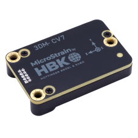

# MicroStrain (INS, IMU, VRU, AHRS)

MicroStrain by HBK provides high-performance inertial sensors engineered for reliability and precision in challenging environments.
Widely used across industries like aerospace, robotics, industrial automation, and research, MicroStrain sensors are optimized for real-time, accurate motion tracking and orientation data.

The driver currently supports the following hardware:

- [`MicroStrain CV7-AR`](https://www.hbkworld.com/en/products/transducers/inertial-sensors/vertical-reference-units--vru-/3dm-cv7-ar): Inertial Measurement Unit (IMU) and Vertical Reference Unit (VRU)
- [`MicroStrain CV7-AHRS`](https://www.hbkworld.com/en/products/transducers/inertial-sensors/attitude-and-heading-reference-systems--ahrs-/3dm-cv7-ahrs): Inertial Measurement Unit (IMU) and Attitude Heading Reference System (AHRS)
- [`MicroStrain CV7-INS`](https://www.hbkworld.com/en/products/transducers/inertial-sensors/inertial-navigation-systems--ins-/3dm-cv7-ins): Inertial Measurement Unit (IMU) and Inertial Navigation System (INS).
- [`MicroStrain CV7-GNSS/INS`](https://www.hbkworld.com/en/products/transducers/inertial-sensors/inertial-navigation-systems--ins-/3dm-cv7-gnss-ins): Inertial Measurement Unit (IMU) and Inertial Navigation System (INS) combined with dual multiband (GNSS) receivers.

PX4 can use these sensors to provide raw IMU data for EKF2 or to replace EKF2 as an external INS.
For more information, including user manuals and datasheets, please refer to the sensors product page.

## Where to Buy

MicroStrain sensors can be purchased through HBK's official [MicroStrain product page](https://www.hbkworld.com/en/products/transducers/inertial-sensors) or through authorized distributors globally.
For large orders, custom requirements, or technical inquiries, reach out directly to [sales](https://www.hbkworld.com/en/contact-us/contact-sales-microstrain)

## Hardware Setup

### Wiring

Connect the main UART port of the MicroStrain sensor to any unused serial port on the flight controller.
This port needs to be specified while starting the device.

### Mounting

The MicroStrain sensor can be mounted in any orientation.
The default coordinate system uses X for the front, Y for the right, and Z for down, with directions marked on the device.

## Firmware Configuration

### PX4 Configuration

To use the MicroStrain driver:

1. Include the module in firmware in the [kconfig board configuration](../hardware/porting_guide_config.md#px4-board-configuration-kconfig) by setting the kconfig variables: `CONFIG_DRIVERS_INS_MICROSTRAIN` or `CONFIG_COMMON_INS`.
2. Configure the driver mode by setting [MS_MODE](../advanced_config/parameter_reference.md#MS_MODE)

   - To use the MicroStrain sensor to provide raw IMU data to EKF2

     1. Set [MS_MODE](../advanced_config/parameter_reference.md#MS_MODE) to 0
     2. Update the [EKF2_MULTI_IMU](../advanced_config/parameter_reference.md#EKF2_MULTI_IMU) parameter to account for the added MicroStrain sensor.
     3. Enable EKF2 by setting [EKF2_EN](../advanced_config/parameter_reference.md#EKF2_EN) to 1
     4. To prioritize MicroStrain sensor output, adjust the priority level of individual sensors from 0-100 using the following parameters:

        - [CAL_ACCn_PRIO](../advanced_config/parameter_reference.md#CAL_ACC0_PRIO)
        - [CAL_GYROn_PRIO](../advanced_config/parameter_reference.md#CAL_GYRO0_PRIO)
        - [CAL_MAGn_PRIO](../advanced_config/parameter_reference.md#CAL_MAG0_PRIO)
        - [CAL_BAROn_PRIO](../advanced_config/parameter_reference.md#CAL_BARO0_PRIO)

        where `n` corresponds to the index of the corresponding sensor.

        ::: tip
        Sensors can be identified by their device id, which can be found by checking the parameters:

        - [CAL_ACCn_ID](../advanced_config/parameter_reference.md#CAL_ACC0_ID)
        - [CAL_GYROn_ID](../advanced_config/parameter_reference.md#CAL_GYRO0_ID)
        - [CAL_MAGn_ID](../advanced_config/parameter_reference.md#CAL_MAG0_ID)
        - [CAL_BAROn_ID](../advanced_config/parameter_reference.md#CAL_BARO0_ID)

        :::

   - To use the MicroStrain sensor as an external INS
     1. Set [MS_MODE](../advanced_config/parameter_reference.md#MS_MODE) to 1
     2. Disable EKF2 by setting [EKF2_EN](../advanced_config/parameter_reference.md#EKF2_EN) to 0

3. Reboot and start the driver
   - `microstrain start -d <port>`
   - To start the driver automatically when the flight controller powers on, set [SENS_MS_CFG](../advanced_config/parameter_reference.md#SENS_MS_CFG) to the sensor’s connected port.

## MicroStrain Configuration

1. Rates:

   - By default, accel and gyro data are published at 500 Hz, magnetometer at 50 Hz, and barometric pressure at 50 Hz.
     This can be changed by adjusting the following parameters:

     - [MS_IMU_RATE_HZ](../advanced_config/parameter_reference.md#MS_IMU_RATE_HZ)
     - [MS_MAG_RATE_HZ](../advanced_config/parameter_reference.md#MS_MAG_RATE_HZ)
     - [MS_BARO_RATE_HZ](../advanced_config/parameter_reference.md#MS_BARO_RATE_HZ)

   - Global position, local position, attitude and odometry will be published at 250 Hz by default.
     This can be configured via:

     - [MS_FILT_RATE_HZ](../advanced_config/parameter_reference.md#MS_FILT_RATE_HZ)

   - For the CV7-GNSS/INS, the GNSS receiver 1 and 2 will publish data at 5Hz by default.
     This can be changed using:

     - [MS_GNSS_RATE_HZ](../advanced_config/parameter_reference.md#MS_GNSS_RATE_HZ)

   - The driver will automatically configure data outputs based on the specific sensor model and available data streams.
   - The driver is scheduled to run at twice the fastest configured data rate.

2. Aiding measurements:

   - If supported, GNSS position and velocity aiding are always enabled.
   - Internal/external magnetometer and heading aiding, as well as optical flow aiding, are disabled by default. They can be enabled using the following parameters:

     - [MS_INT_MAG_EN](../advanced_config/parameter_reference.md#MS_INT_MAG_EN)
     - [MS_INT_HEAD_EN](../advanced_config/parameter_reference.md#MS_INT_HEAD_EN)
     - [MS_EXT_HEAD_EN](../advanced_config/parameter_reference.md#MS_EXT_HEAD_EN)
     - [MS_EXT_MAG_EN](../advanced_config/parameter_reference.md#MS_EXT_MAG_EN)
     - [MS_OPT_FLOW_EN](../advanced_config/parameter_reference.md#MS_OPT_FLOW_EN)

   - The aiding frames for external sources can be configured using the following parameters:

     - [MS_EHEAD_YAW](../advanced_config/parameter_reference.md#MS_EHEAD_YAW)
     - [MS_EMAG_ROLL](../advanced_config/parameter_reference.md#MS_EMAG_ROLL)
     - [MS_EMAG_PTCH](../advanced_config/parameter_reference.md#MS_EMAG_PTCH)
     - [MS_EMAG_YAW](../advanced_config/parameter_reference.md#MS_EMAG_YAW)
     - [MS_OFLW_OFF_X](../advanced_config/parameter_reference.md#MS_OFLW_OFF_X)
     - [MS_OFLW_OFF_Y](../advanced_config/parameter_reference.md#MS_OFLW_OFF_Y)
     - [MS_OFLW_OFF_Z](../advanced_config/parameter_reference.md#MS_OFLW_OFF_Z)
     - [SENS_FLOW_ROT](../advanced_config/parameter_reference.md#SENS_FLOW_ROT)

   - The uncertainty for optical flow and external magnetometer aiding must be specified using the following parameters:

     - [MS_EMAG_UNCERT](../advanced_config/parameter_reference.md#MS_EMAG_UNCERT)
     - [MS_OFLW_UNCERT](../advanced_config/parameter_reference.md#MS_OFLW_UNCERT)

   ::: tip
   1. When optical flow aiding is enabled, the sensor uses the vehicle_optical_flow_vel output from the flight controller as a body-frame velocity aiding measurement.
   2. If the MicroStrain sensor does not support these aiding sources but they are enabled, sensor initialization will fail.

   :::

3. Initial heading alignment:

   - Initial heading alignment is set to kinematic by default. This can be changed by adjusting

     - [MS_ALIGNMENT](../advanced_config/parameter_reference.md#MS_ALIGNMENT)

4. GNSS Aiding Source Control (GNSS/INS only)

   - The Source of the GNSS aiding data can be configured using:

     - [MS_GNSS_AID_SRC](../advanced_config/parameter_reference.md#MS_GNSS_AID_SRC)

5. Sensor to vehicle transform:

   - If the sensor is mounted in an orientation different from the vehicle frame. A sensor to vehicle transform can be enabled using

     - [MS_SVT_EN](../advanced_config/parameter_reference.md#MS_SVT_EN)

   - The transform is defined using the following parameters

     - [MS_SENSOR_ROLL](../advanced_config/parameter_reference.md#MS_SENSOR_ROLL)
     - [MS_SENSOR_PTCH](../advanced_config/parameter_reference.md#MS_SENSOR_PTCH)
     - [MS_SENSOR_YAW](../advanced_config/parameter_reference.md#MS_SENSOR_YAW)

6. IMU ranges:

   - The accelerometer and gyroscope ranges on the device are configurable using:

     - [MS_ACCEL_RANGE](../advanced_config/parameter_reference.md#MS_ACCEL_RANGE)
     - [MS_GYRO_RANGE](../advanced_config/parameter_reference.md#MS_GYRO_RANGE)

   ::: tip
   Available range settings depend on the specific [sensor](https://www.hbkworld.com/en/products/transducers/inertial-sensors) and can be found in the corresponding user manual.
   By default, the ranges are not changed.

   :::

7. GNSS Lever arm offsets:

   - The lever arm offset for the external GNSS receiver can be configured using:

     - [MS_GNSS_OFF1_X](../advanced_config/parameter_reference.md#MS_GNSS_OFF1_X)
     - [MS_GNSS_OFF1_Y](../advanced_config/parameter_reference.md#MS_GNSS_OFF1_Y)
     - [MS_GNSS_OFF1_Z](../advanced_config/parameter_reference.md#MS_GNSS_OFF1_Z)

   - For dual-antenna configurations, the second GNSS receiver’s offset is configured using:

     - [MS_GNSS_OFF2_X](../advanced_config/parameter_reference.md#MS_GNSS_OFF2_X)
     - [MS_GNSS_OFF2_Y](../advanced_config/parameter_reference.md#MS_GNSS_OFF2_Y)
     - [MS_GNSS_OFF2_Z](../advanced_config/parameter_reference.md#MS_GNSS_OFF2_Z)

## Published Data

The MicroStrain driver continuously publishes sensor data to the following uORB topics:

- [sensor_accel](../msg_docs/SensorAccel.md)
- [sensor_gyro](../msg_docs/SensorGyro.md)
- [sensor_mag](../msg_docs/SensorMag.md)
- [sensor_baro](../msg_docs/SensorBaro.md)

For GNSS/INS devices, GPS data is also published to:

- [sensor_gps](../msg_docs/SensorGps.md)

If used as an external INS replacing EKF2, it publishes:

- [vehicle_global_position](../msg_docs/VehicleGlobalPosition.md)
- [vehicle_local_position](../msg_docs/VehicleLocalPosition.md)
- [vehicle_attitude](../msg_docs/VehicleAttitude.md)
- [vehicle_odometry](../msg_docs/VehicleOdometry.md)

otherwise the same data is published to the following topics

- `external_ins_global_position`
- `external_ins_attitude`
- `external_ins_local_position`

::: tip
Published topics can be viewed using the `listener` command.
:::
