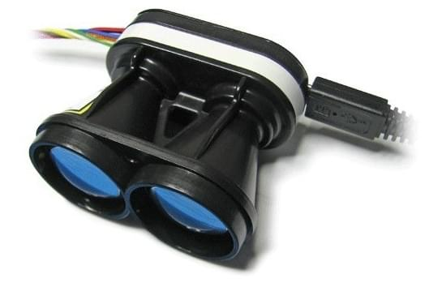
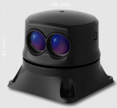
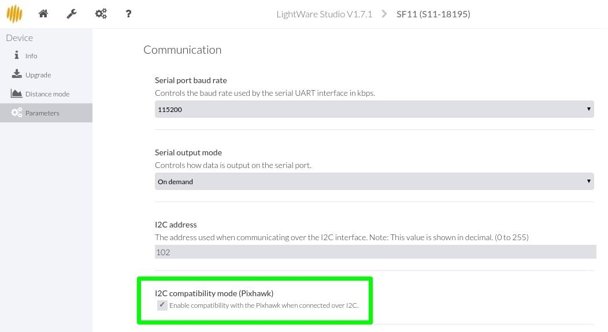
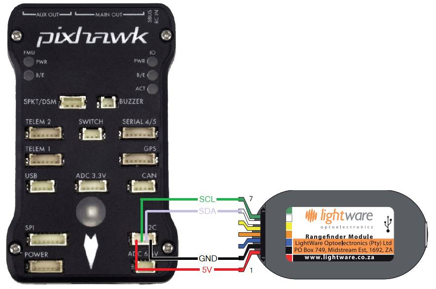

# LightWare Lidar (SF1X/SF02/LW20/SF45)

LightWare develops a range of light-weight, general purpose, laser altimeters ("Lidar") suitable for mounting on UAVs.
These are useful for applications including terrain following, precision hovering (e.g. for photography), warning of regulatory height limits, anti-collision sensing etc.

## Supported Models

The following models are supported by PX4, and can be connected to either the I2C or Serial bus (the tables below indicates what bus can be used for each model).

| Model                                                      | Range (m) | Bus               | Description                                                                                |
| ---------------------------------------------------------- | --------- | ----------------- | ------------------------------------------------------------------------------------------ |
| [SF11/C](https://lightwarelidar.com/products/sf11-c-100-m) | 100       | Serial or I2C bus |
| [LW20/C](https://lightware.co.za/products/lw20-c-100-m)    | 100       | I2C bus           | Waterproofed (IP67) with servo for sense-and-avoid applications                            |
| [SF45/B](../sensor/sf45_rotating_lidar.md)                 | 50        | Serial            | Rotary Lidar (Used for [Collision Prevention](../computer_vision/collision_prevention.md)) |

::: details Discontinued

The following models are supported by PX4 but are no longer available from the manufacturer.

| Model                                                                                              | Range | Bus           |                                                                 |
| -------------------------------------------------------------------------------------------------- | ----- | ------------- | --------------------------------------------------------------- |
| [SF02](http://documents.lightware.co.za/SF02%20-%20Laser%20Rangefinder%20Manual%20-%20Rev%208.pdf) | 50    | Serial        |                                                                 |
| [SF10/A](http://documents.lightware.co.za/SF10%20-%20Laser%20Altimeter%20Manual%20-%20Rev%206.pdf) | 25    | Serial or I2C |                                                                 |
| [SF10/B](http://documents.lightware.co.za/SF10%20-%20Laser%20Altimeter%20Manual%20-%20Rev%206.pdf) | 50    | Serial or I2C |                                                                 |
| SF10/C                                                                                             | 100m  | Serial or I2C |                                                                 |
| LW20/B                                                                                             | 50    | I2C bus       | Waterproofed (IP67) with servo for sense-and-avoid applications |

:::

## I2C Setup

Check the tables above to confirm that which models can be connected to the I2C port.

### Lidar Configuration (SF11/C)

The SF11/C hardware (only) does not ship with Pixhawk I2C compatibility enabled by default.
To enable support, you have to download [LightWare Studio](https://lightwarelidar.com/pages/lightware-studio) and got to **Parameters > Communication** and tick mark **I2C compatibility mode (Pixhawk)**

This step is not required for the other supported Lightware rangefinders.

### Hardware

Connect the Lidar the autopilot I2C port as shown below (in this case, for the [Pixhawk 1](../flight_controller/mro_pixhawk.md)).

::: info
Some older revisions cannot be used with PX4.
Specifically they may be miss-configured to have an I2C address equal to `0x55`, which conflicts with `rgbled` module.
On Linux systems you may be able to determine the address using [i2cdetect](https://linux.die.net/man/8/i2cdetect).
If the I2C address is equal to `0x66` the sensor can be used with PX4.
:::

### Parameter Setup {#i2c_parameter_setup}

Set the [SENS_EN_SF1XX](../advanced_config/parameter_reference.md#SENS_EN_SF1XX) parameter to match the rangefinder model and then reboot.

VTOL vehicles may choose to also set [SF1XX_MODE](../advanced_config/parameter_reference.md#SF1XX_MODE) to `2: Disabled during VTOL fast forward flight`.

## Serial Setup {#serial_hardware_setup}

::: tip
[SF45/B](../sensor/sf45_rotating_lidar.md) setup is covered in the linked document.
:::

### Hardware

The lidar can be connected to any unused _serial port_ (UART), e.g.: TELEM2, TELEM3, GPS2 etc.

<!-- Would be good to show serial setup! -->

### Parameter Setup {#serial_parameter_setup}

[Configure the serial port](../peripherals/serial_configuration.md) on which the lidar will run using [SENS_SF0X_CFG](../advanced_config/parameter_reference.md#SENS_SF0X_CFG).
There is no need to set the baud rate for the port, as this is configured by the driver.

::: info
If the configuration parameter is not available in _QGroundControl_ then you may need to [add the driver to the firmware](../peripherals/serial_configuration.md#parameter_not_in_firmware).
:::

Then set the [SENS_EN_SF0X](../advanced_config/parameter_reference.md#SENS_EN_SF0X) parameter to match the rangefinder model and reboot.

VTOL vehicles may choose to also set [SF1XX_MODE](../advanced_config/parameter_reference.md#SF1XX_MODE) to `2: Disabled during VTOL fast forward flight`.

## Further Information

- [Modules Reference: Distance Sensor (Driver) : lightware_laser_i2c](../modules/modules_driver_distance_sensor.md#lightware-laser-i2c)
- [Modules Reference: Distance Sensor (Driver) : lightware_laser_serial](../modules/modules_driver_distance_sensor.md#lightware-laser-serial)
