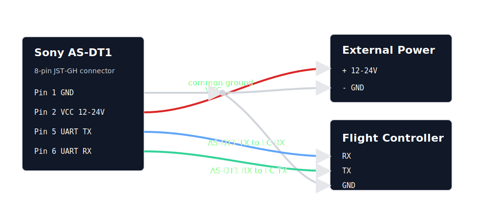

# Sony AS-DT1 LiDAR

The _Sony AS-DT1 LiDAR_ is a multipoint distance sensor that connects to PX4 over a UART/serial port.

PX4 configures the sensor for binary output and publishes the measurements to the [`obstacle_distance`](../msg_docs/ObstacleDistance.md) uORB topic.

## Supported Modes

The driver supports the AS-DT1 distance measurement range modes listed below.

| Mode   | Maximum Measurement Distance | Minimum Frame Interval | Distance Measurement Points |
| ------ | ---------------------------- | ---------------------- | --------------------------- |
| 30MSTD | 30 m                         | 33.33 ms               | 576                         |
| 30M15F | 30 m                         | 66.66 ms               | 576                         |
| 30M30F | 30 m                         | 33.33 ms               | 288                         |
| 20M    | 20 m                         | 33.33 ms               | 576                         |
| 40M    | 40 m                         | 66.66 ms               | 576                         |

The mode is selected using [SENS_ASDT1_MODE](../advanced_config/parameter_reference.md#SENS_ASDT1_MODE).

## Hardware Setup

The sensor can be connected to any unused _serial port_ (UART), such as `TELEM2`, `TELEM3`, or `GPS2`.

The AS-DT1 uses the 8-pin JST-GH connector for external power and UART.
Connect the sensor TX/RX pins to the flight controller UART and share ground between the sensor power supply and flight controller.



| AS-DT1 8-pin Connector | Function             | Connect To                         |
| ---------------------- | -------------------- | ---------------------------------- |
| Pin 1                  | GND                  | External power ground and flight controller serial GND |
| Pin 2                  | VCC                  | External 12 V to 24 V power supply |
| Pin 5                  | UART TX              | Flight controller serial RX        |
| Pin 6                  | UART RX              | Flight controller serial TX        |

The ground from AS-DT1 pin 1 must be common to both the external power supply and the flight controller serial port.
For example, splice or split the AS-DT1 ground wire so it connects to the power supply negative terminal and to the flight controller UART `GND` pin.

Do not connect the AS-DT1 UART pins directly to RS-232 or RS-422 interfaces.
The AS-DT1 UART RX input is 5 V tolerant, and the sensor should be powered from the external 12 V to 24 V supply described in the Sony hardware documentation.

## Parameter Setup

Use the Sony application to set the sensor to **Measurement (UART)** mode before connecting it to PX4

[Configure the serial port](../peripherals/serial_configuration.md) on which the sensor will run using [SENS_ASDT1_CFG](../advanced_config/parameter_reference.md#SENS_ASDT1_CFG).
There is no need to set the baud rate for the port, as this is configured by the driver.

Set [SENS_ASDT1_MODE](../advanced_config/parameter_reference.md#SENS_ASDT1_MODE) to the required measurement mode and reboot the flight controller.

If the sensor is mounted with a yaw offset from vehicle forward, set [SENS_ASDT1_ROT](../advanced_config/parameter_reference.md#SENS_ASDT1_ROT) to the offset in degrees.
Positive values are clockwise.

::: info
If the configuration parameter is not available, then you may need to [add the driver to the firmware](../peripherals/serial_configuration.md#parameter_not_in_firmware):

```plain
CONFIG_DRIVERS_DISTANCE_SENSOR_SONY_ASDT1=y
```

:::

## Testing

You can check the driver state in the _QGroundControl MAVLink Console_:

```sh
sony_asdt1 status
```

You can observe the published measurements with:

```sh
listener obstacle_distance
```

To print the sensor's saved configuration without starting measurements, run:

```sh
sony_asdt1 start -d /dev/ttyS2 -s
```

Replace `/dev/ttyS2` with the serial device for your board and port.

## Further Information

- [Modules Reference: Distance Sensor (Driver): sony_asdt1](../modules/modules_driver_distance_sensor.md#sony-asdt1)
