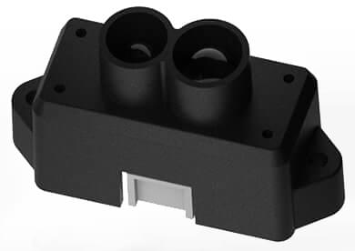

# Benewake TFmini LiDAR

The _Benewake TFmini LiDAR_ is a tiny, low cost, and low power LIDAR with 12m range.

PX4 supports all three variants in the series: TFmini-s, TFmini-i, TFmini Plus.
These must be connected to a UART/serial bus.

## Where to Buy

- [TFmini-s](https://en.benewake.com/TFminiS/index_proid_325.html)
- [TFmini-i](https://en.benewake.com/TFminii/index_proid_324.html) (industrial)
- [TFmini Plus](https://en.benewake.com/TFminiPlus/index_proid_323.html)

## Hardware Setup

TFmini can be connected to any unused _serial port_ (UART), such as: `TELEM2`, `TELEM3`, `GPS2` etc.

## Parameter Setup

[Configure the serial port](../peripherals/serial_configuration.md) on which the lidar will run using [SENS_TFMINI_CFG](../advanced_config/parameter_reference.md#SENS_TFMINI_CFG).
There is no need to set the baud rate (this is hard coded in the sensor driver as only one rate is supported).

::: info
If the configuration parameter is not available in _QGroundControl_ then the [tfmini](../modules/modules_driver_distance_sensor.md#tfmini) driver may not be in firmware.
For information on how to add it see:

- [Serial port Configuration: Configuration Parameter Missing from QGroundControl](../peripherals/serial_configuration.md#parameter_not_in_firmware)
- [PX4 Board Configuration (Kconfig)](../hardware/porting_guide_config.md#px4-menuconfig-setup).

:::
