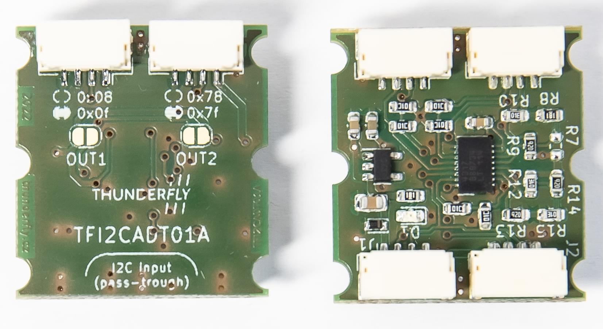
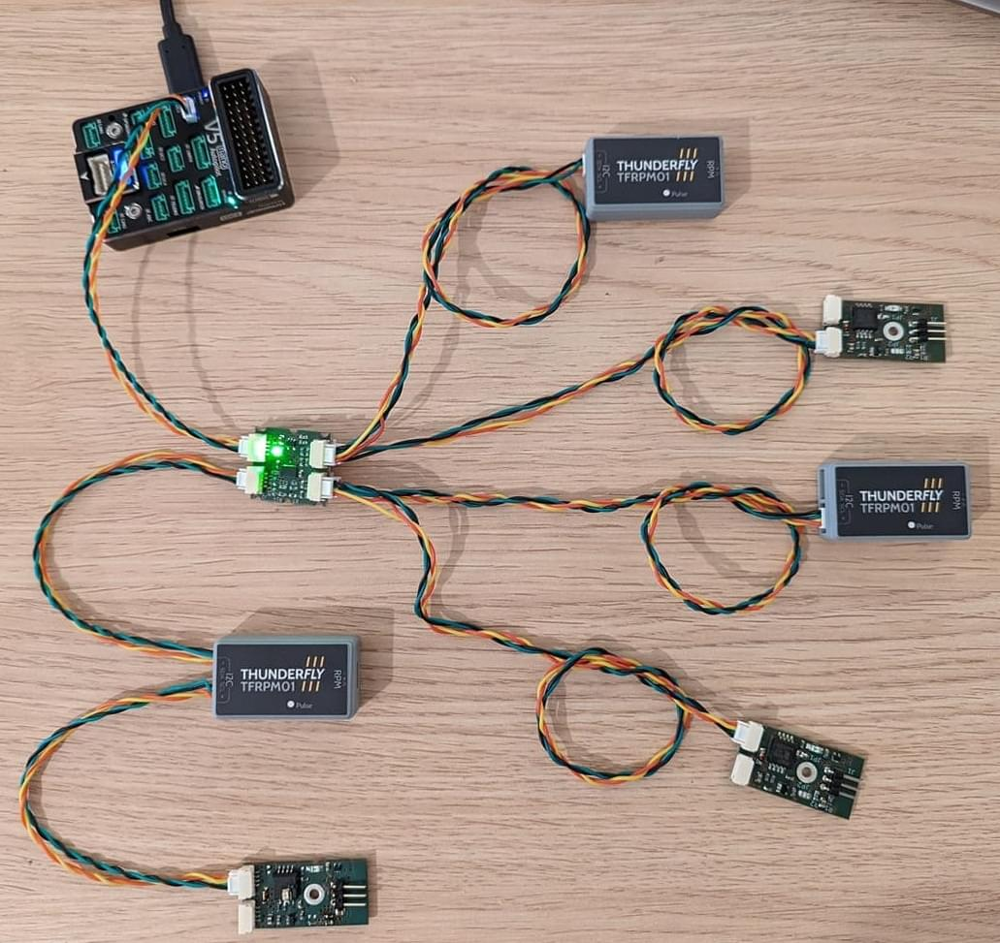

# TFI2CADT01 - I²C Address Translator

[TFI2CADT01](https://github.com/ThunderFly-aerospace/TFI2CADT01) is an address translator module that is compatible with Pixhawk and PX4.

Address translation allows multiple I2C devices with the same address to coexist on an I2C network.
The module may be needed if using several devices that have the same hard-coded address.

The module has an input and an output side.
A sensor is connected to the master device on one side.
On the output side sensors, whose addresses are to be translated, can be connected.
The module contains two pairs of connectors, each pair responsible for different translations.

::: info
[TFI2CADT01](https://github.com/ThunderFly-aerospace/TFI2CADT01) is designed as open-source hardware with GPLv3 license.
It is commercially available from [ThunderFly](https://www.thunderfly.cz/) company or from [Tindie eshop](https://www.tindie.com/products/thunderfly/tfi2cadt01-i2c-address-translator/).
:::

## Address Translation Method

TFI2CADT01 performs an XOR operation on the called address.
Therefore, a new device address can be found by taking the original address and applying an XOR operation with the value specified on the module.
By default, the output 1 performs XOR with 0x08 value and the second port with 0x78.
By short-circuiting the solder jumper you can change the XOR value to 0x0f for the first and 0x7f for the second port.

If you need your own value for address translation, changing the configuration resistors makes it possible to set any XOR value.

## Example of Use

The tachometer sensor [TFRPM01](../sensor/thunderfly_tachometer.md) can be set to two different addresses using a solder jumper.
If the autopilot has three buses, only 6 sensors can be connected and no bus remains free (2 available addresses * 3 I2C ports).
In some multicopters or VTOL solutions, there is a need to measure the RPM of 8 or more elements.
The [TFI2CADT01](https://www.tindie.com/products/thunderfly/tfi2cadt01-i2c-address-translator/) is highly recommended in this case.

The following scheme shows how to connect 6 TFRPM01 to one autopilot bus.
By adding another TFI2CADT01, 4 more devices can be connected to the same bus.

<!-- original mermaid graph
graph TD
    FMU(FMU - PX4 autopilot)
    FMU -- > AIR(Airspeed sensor)
    FMU -- > RPM1(TFRPM01C 0x50)
    FMU -- > RPM2(TFRPM01C 0x51)
    FMU -- > TFI2CEXT
    TFI2CEXT -- > ADT(TFI2CADT01: 0x0f, 0x7f)
    ADT -- > RPM3(Out1: TFRPM01C 0x50 - 0x5f)
    ADT -- > RPM4(Out1: TFRPM01C 0x51 - 0x5e)
    ADT -- > RPM5(Out2: TFRPM01C 0x50 - 0x2f)
    ADT -- > RPM6(Out2: TFRPM01C 0x52 - 0x2e)
-->

::: info
TFI2CADT01 does not contain any I2C buffer or accelerator.
As it adds additional capacitance on the bus, we advise combining it with some bus booster, e.g. [TFI2CEXT01](https://github.com/ThunderFly-aerospace/TFI2CEXT01).
:::

### Other Resources

* Datasheet of [LTC4317](https://www.analog.com/media/en/technical-documentation/data-sheets/4317fa.pdf)
