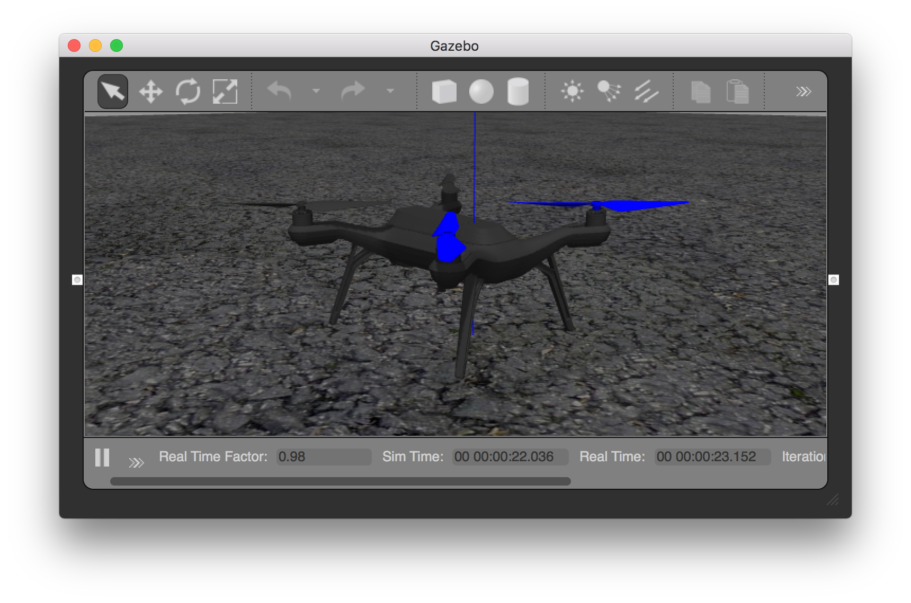
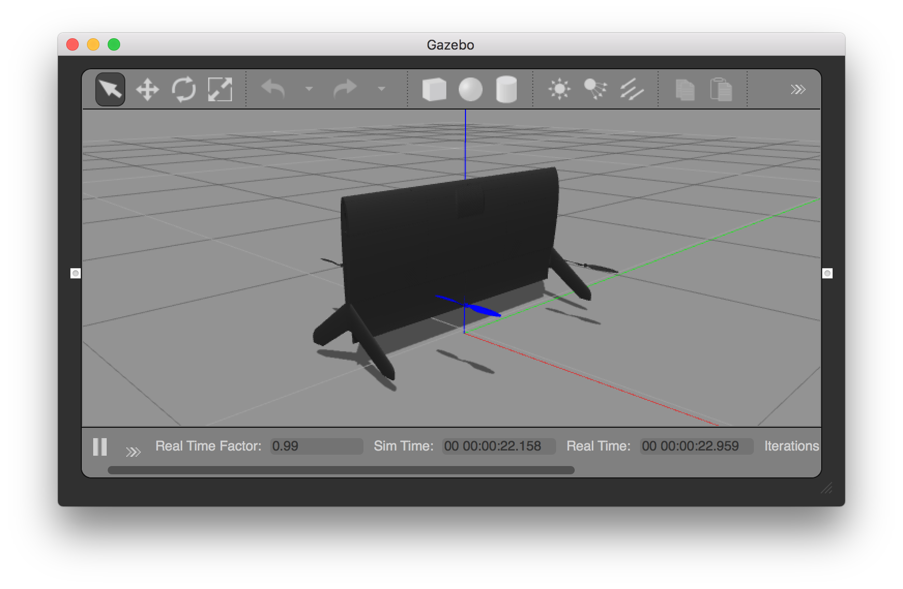
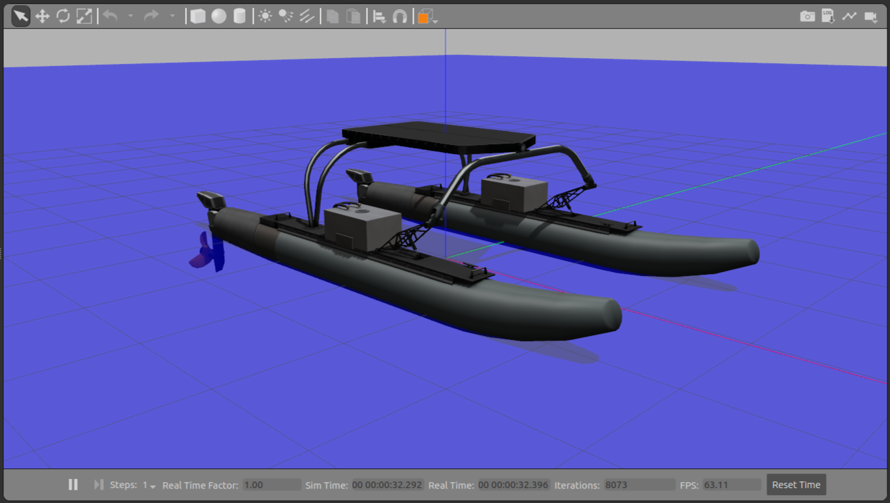

# Gazebo Classic Vehicles

This topic lists/displays the vehicles supported by the PX4 [Gazebo Classic](../sim_gazebo_classic/index.md) simulation and the `make` commands required to run them (the commands are run from a terminal in the **PX4-Autopilot** directory).

Supported vehicle types include: mutirotors, VTOL, VTOL Tailsitter, Plane, Rover, Submarine/UUV.

::: info
The [Gazebo Classic](../sim_gazebo_classic/index.md) page shows how to install Gazebo Classic, how to enable video and load custom maps, and many other configuration options.
:::

## Multicopter

### Quadrotor (Default)

```sh
make px4_sitl gazebo-classic
```

### Quadrotor with Optical Flow

```sh
make px4_sitl gazebo-classic_iris_opt_flow
```

### Quadrotor with Depth Camera

These models have a depth camera attached, modelled on the Intel® RealSense™ D455.

_Forward-facing depth camera:_

```sh
make px4_sitl gazebo-classic_iris_depth_camera
```

_Downward-facing depth camera:_

```sh
make px4_sitl gazebo-classic_iris_downward_depth_camera
```

### 3DR Solo (Quadrotor)

```sh
make px4_sitl gazebo-classic_solo
```



### Typhoon H480 (Hexrotor)

```sh
make px4_sitl gazebo-classic_typhoon_h480
```


::: info
This target also supports [video streaming simulation](../sim_gazebo_classic/index.md#video-streaming).
:::

<a id="fixed_wing"></a>

## Plane/Fixed-wing

### Standard Plane

```sh
make px4_sitl gazebo-classic_plane
```


#### Standard Plane with Catapult Launch

```sh
make px4_sitl gazebo-classic_plane_catapult
```

This model simulates hand/catapult launch, which can be used for [fixed-wing takeoff](../flight_modes_fw/takeoff.md) in position mode, takeoff mode, or missions.

The plane will automatically be launched as soon as the vehicle is armed.

## VTOL

### Standard VTOL

```sh
make px4_sitl gazebo-classic_standard_vtol
```


### Tailsitter VTOL

```sh
make px4_sitl gazebo-classic_tailsitter
```



<a id="ugv"></a>

## Unmmanned Ground Vehicle (UGV/Rover/Car)

### Ackermann UGV

```sh
make px4_sitl gazebo-classic_rover
```


### Differential UGV

```sh
make px4_sitl gazebo-classic_r1_rover
```


## Unmanned Underwater Vehicle (UUV/Submarine)

### HippoCampus TUHH UUV

```sh
make px4_sitl gazebo-classic_uuv_hippocampus
```


## Unmanned Surface Vehicle (USV/Boat)

<a id="usv_boat"></a>

### Boat (USV)

```sh
make px4_sitl gazebo-classic_boat
```



<a id="airship"></a>

## Airship

### Cloudship

```sh
make px4_sitl gazebo-classic_cloudship
```


