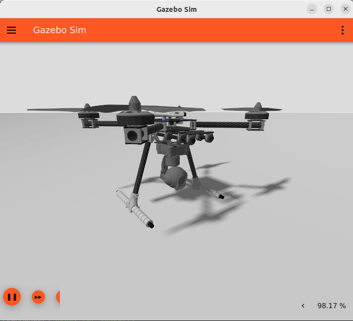

# Gazebo Vehicles

This topic lists/displays the vehicles supported by the PX4 [Gazebo](../sim_gazebo_gz/index.md) simulation, and the `make` commands required to run them (the commands are run from a terminal in the **PX4-Autopilot** directory).

The models are included in PX4 as a submodule that is fetched from the [Gazebo Models Repository](../sim_gazebo_gz/gazebo_models.md).

Supported vehicle types include: mutirotor, VTOL, Plane, Rover.

:::warning
See [Gazebo Classic Vehicles](../sim_gazebo_classic/vehicles.md) for vehicles that work with the older [Gazebo "Classic" simulation](../sim_gazebo_classic/index.md).
Note that vehicle models are not interchangable between the two versions of the simulator: the vehicles on this page only work with (new) [Gazebo](../sim_gazebo_gz/index.md).
:::

## Multicopter

### X500 Quadrotor

```sh
make px4_sitl gz_x500
```

### X500 Quadrotor with Visual Odometry

```sh
make px4_sitl gz_x500_vision
```


### X500 Quadrotor with Depth Camera (Front-facing)

This model has a forward-facting depth camera attached, modelled on the [OAK-D](https://shop.luxonis.com/products/oak-d).

```sh
make px4_sitl gz_x500_depth
```


### X500 Quadrotor with Monocular Camera

This model has a simple monocular camera sensor attached (there is no physical camera visualization on the model itself).

```sh
make px4_sitl gz_x500_mono_cam
```

::: info
The camera cannot yet be used to stream video or for image capture in QGroundControl.
[PX4-Autopilot#22563](https://github.com/PX4/PX4-Autopilot/issues/22563) can be used to track the additional work needed to fully enable these use cases.
:::

### X500 Quadrotor with Monocular Camera (Down-facing)

This model has a simple monocular camera sensor attached facing down (there is no physical camera visualization on the model itself).

This can be used with the [Aruco world](../sim_gazebo_gz/worlds.md#aruco) to test precision landing.

```sh
make px4_sitl gz_x500_mono_cam_down
```

### X500 Quadrotor with 1D LIDAR (Down-facing)

This model has a LIDAR attached to the bottom, modelled on the [Lightware LW20/C](../sensor/sfxx_lidar.md).

It has a range between 0.1 and 100m.

The model can be used for testing [rangefinder](../sensor/rangefinders.md) use cases like [landing](../flight_modes_mc/land.md) or [terrain following](../flying/terrain_following_holding.md).

```sh
make px4_sitl gz_x500_lidar_down
```


### X500 Quadrotor with 1D LIDAR (Front-facing)

This model has a LIDAR attached to the front, modelled on the [Lightware LW20/C](../sensor/sfxx_lidar.md).

It has a range between 0.2 and 100m.

The model can be used for testing [Collision Prevention](../computer_vision/collision_prevention.md#gazebo-simulation).

```sh
make px4_sitl gz_x500_lidar_front
```


### X500 Quadrotor with 2D LIDAR

This model has a 2D LIDAR attached, modelled on the [Hokuyo UTM-30LX](https://www.hokuyo-aut.jp/search/single.php?serial=169).
It has a range between 0.1 and 30m, and scans in a 270° arc.
The model can be used for testing [Collision Prevention](../computer_vision/collision_prevention.md#gazebo-simulation).

```sh
make px4_sitl gz_x500_lidar_2d
```


::: info
The sensor information is written to the [ObstacleDistance](../msg_docs/ObstacleDistance.md) UORB message used by collision prevention.
:::

### X500 Quadrotor with Gimbal (Front-facing)

This model has a [gimbal](../advanced/gimbal_control.md) attached to the front with angular ranges of

- roll: [- $\frac{\pi}{4}$, $\frac{\pi}{4}$]
- pitch: [- $\frac{3\pi}{4}$, $\frac{\pi}{4}$]
- yaw: infinite rotation

The gimbal joints uses position control with a kinematic chain ZXY.

.

```sh
make px4_sitl gz_x500_gimbal
```

## Plane/Fixed-wing

### Standard Plane

```sh
make px4_sitl gz_rc_cessna
```


### Advanced Plane

<Badge type="tip" text="PX4 v1.15" />

```sh
make px4_sitl gz_advanced_plane
```


::: info
The difference between the Advanced Plane and the "regular plane" lies in the Lift Physics that the two models use:

- You can configure the _Advanced Lift Drag_ plugin used by the model to more closely match a particular vehicle using the [Advanced Lift Drag Tool](../sim_gazebo_gz/tools_avl_automation.md).
- For more detail on the lift calculations for the Advanced Plane, see [PX4-SITL_gazebo-classic/src/liftdrag_plugin/README.md](https://github.com/PX4/PX4-SITL_gazebo-classic/blob/main/src/liftdrag_plugin/README.md)

:::

## VTOL

### Standard VTOL

```sh
make px4_sitl gz_standard_vtol
```


### Quad Tailsitter VTOL

A VTOL tailsitter model that uses differential thrust for pitch, roll, and yaw control.

```sh
make px4_sitl gz_quadtailsitter
```


### Tiltrotor VTOL

A VTOL Plane, where during the transition the front two motors will tilt forward and be used for forward thrust.

```sh
make px4_sitl gz_tiltrotor
```


## Rover

### Differential Rover

[Differential Rover](../frames_rover/differential.md) uses the [rover world](../sim_gazebo_gz/worlds.md#rover) by default.

```sh
make px4_sitl gz_r1_rover
```


### Ackermann Rover

[Ackermann Rover](../frames_rover/ackermann.md) uses the [rover world](../sim_gazebo_gz/worlds.md#rover) by default.

```sh
make px4_sitl gz_rover_ackermann
```


