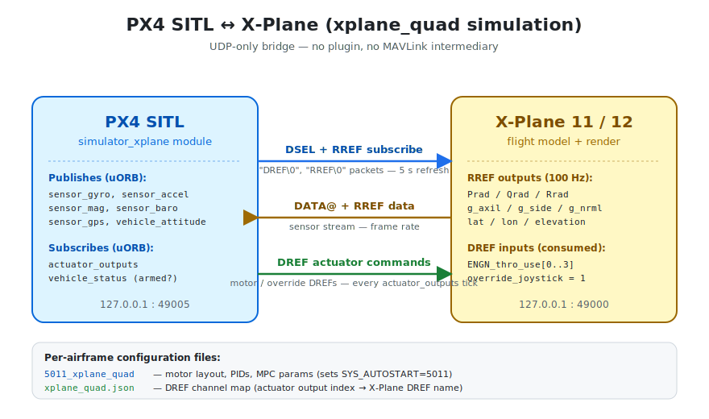

# X-Plane Simulation

:::warning
This simulator is [community supported and maintained](../simulation/community_supported_simulators.md).
It may or may not work with current versions of PX4.

See [Toolchain Installation](../dev_setup/dev_env.md) for information about the environments and tools supported by the core development team.
:::

[X-Plane](https://www.x-plane.com/) is a commercial flight simulator widely used for general aviation, with a strong rotor-wing physics model and a built-in UDP data interface.

The `simulator_xplane` module talks to X-Plane directly over UDP using the native `DATA@` / `RREF` / `DREF` protocol — there is no X-Plane plugin and no MAVLink intermediary, so installation is a single PX4 SITL build plus X-Plane itself.

**Supported Vehicles:** Quadrotor (5-inch). Additional X-Plane airframes can be added by dropping a `<model>.json` DREF map and `<model>.params` file under `ROMFS/px4fmu_common/init.d-posix/models/` (see [Adding a New Airframe](#adding-a-new-airframe) below).

::: info
See [Simulation](../simulation/index.md) for general information about simulators, the simulation environment, and simulation configuration.
:::

## How it works



PX4 subscribes to the datarefs it needs at boot. X-Plane streams them
back at the requested rate. PX4 sends motor/servo commands as `DREF`
writes. No manual data-output configuration in X-Plane is required.

## Installation

The bridge is built into the standard SITL target, so the only external
dependency is X-Plane itself.

1. Install the usual [Development Environment on Ubuntu LTS / Debian Linux](../dev_setup/dev_env_linux_ubuntu.md)
   (or the macOS / Windows equivalents).

2. Install **X-Plane 11 or 12** from the official source
   (<https://www.x-plane.com/>). Both Steam and standalone installs work;
   no X-Plane SDK is required — the bridge uses the built-in UDP
   interface, not a plugin.

3. Load a quadrotor model in X-Plane. PX4 overrides X-Plane's own joystick
   and flight-control input, so any quadrotor airframe will do — the
   model only affects mass, inertia, and visuals.

   A free 5-inch quadrotor model that pairs well with `5011_xplane_quad`:
   <https://forums.x-plane.org/files/file/100079-quadcopter/>. Unzip into
   `X-Plane 12/Aircraft/` and select it from **File → Open Aircraft**.

4. Make sure no firewall blocks UDP **49000** (X-Plane control port) or
   **49005** (PX4 bind port) on the simulation host.

## Running the Simulation

Open a terminal in the root directory of the PX4-Autopilot repository
and call `make` for the X-Plane target:

```sh
cd /path/to/PX4-Autopilot
make px4_sitl xplane_quad
```

The supported vehicles and `make` commands are listed below:

| Vehicle                  | Command                       |
| ------------------------ | ----------------------------- |
| Quadrotor (5-inch)       | `make px4_sitl xplane_quad`   |

::: info
The shell script `ROMFS/px4fmu_common/init.d-posix/px4-rc.xplanesim`
auto-selects the model name from `SYS_AUTOSTART`:

| SYS_AUTOSTART | Model name           |
|---------------|----------------------|
| 5011          | `xplane_quad`        |

For the full list of X-Plane build targets run:

```sh
make px4_sitl list_vmd_make_targets | grep xplane_
```
:::

### Running PX4 on a different host from X-Plane

Override the bridge's network destination via environment variables:

```sh
PX4_SIM_HOST_ADDR=192.168.1.50 \
XPLANE_PORT=49000 \
XPLANE_BIND_PORT=49005 \
PX4_SIM_MODEL=xplane_quad \
make px4_sitl xplane_quad
```

## Taking it to the Sky

The `make` command first builds PX4, then launches it. The PX4 shell
appears like this — press Enter to get the command prompt:

```sh
INFO  [px4] Calling startup script: /bin/sh etc/init.d-posix/rcS 0
INFO  [simulator_xplane] X-Plane 12.07 detected
INFO  [simulator_xplane] Gyro bias locked (X=0.0009 Y=-0.0001 Z=0.0048)
INFO  [mavlink] mode: Normal, data rate: 4000000 B/s on udp port 18570 remote port 14550
INFO  [logger] Opened full log file: ./log/2026-05-27/16_42_25.ulg
INFO  [px4] Startup script returned successfully

pxh>
```

Once `Gyro bias locked` and `EKF2 estimator started` appear, the vehicle
is ready to arm. You can bring it into the air with:

```sh
pxh> commander takeoff
```

_QGroundControl_ should auto-connect to the simulated vehicle on UDP
port 18570 and let you fly manually with a joystick, command waypoints,
or run any other PX4 flight mode.

## X-Plane setup

### 1. Aircraft

Load any quadrotor airframe. PX4's overrides bypass X-Plane's own
joystick/flight-control logic, so the specific model only affects mass,
inertia, and visual appearance.

A free 5-inch quadrotor model that pairs well with `5011_xplane_quad`:
<https://forums.x-plane.org/files/file/100079-quadcopter/>. Unzip into
`X-Plane 12/Aircraft/` and select it from **File → Open Aircraft** in
X-Plane.

### 2. Network

X-Plane's default UDP control port is 49000 — no configuration needed
when PX4 runs on the same machine. For a remote PX4 host:

- X-Plane → **Settings → Network → UDP Ports**: leave "Port we receive
  on" at 49000.
- Make sure no firewall blocks UDP 49000 (X-Plane) and 49005 (PX4 bind
  port) on either machine.

### 3. Data subscription

The bridge auto-subscribes by sending `DSEL` (DATA@ groups) and `RREF`
(individual datarefs) packets at boot, and re-sending them every 5 s so
PX4 can be started before X-Plane. If the auto-subscription doesn't
work (rare — usually a firewall or wrong host), you can also enable
these manually in **Settings → Data Output → Network via UDP**.

#### Send to: `<PX4-host>:49005`

Set the network destination in X-Plane → **Settings → Data Output → Network
via UDP** to the host running PX4 (use `127.0.0.1` for local), port
`49005` (matches `XPLANE_BIND_PORT`).

#### Required DATA@ groups (auto-subscribed via DSEL, or check these boxes)

In **Settings → Data Output**, enable the "Network via UDP" column for
these rows:

| # | X-Plane row name                | Used for                          |
|---|---------------------------------|-----------------------------------|
| 1 | Times                           | Frame timestamp                   |
| 4 | Mach, VVI, g-load               | Body-frame acceleration (fallback)|
| 16| Angular velocities              | Body rates (fallback)             |
| 17| Pitch, roll, & headings         | Attitude                          |

These four groups are enough to fly. Position and velocity come via
RREF (next section) instead of DATA@ groups 20/21, because the DATA@
slot layout for those groups shifts between X-Plane versions.

#### Required RREF datarefs (auto-subscribed at boot)

RREF subscriptions are pushed by PX4 at boot — no checkbox in X-Plane's
GUI is needed. For reference, the bridge subscribes at 100 Hz (the
version dataref at 1 Hz):

| Dataref                                    | Purpose                |
|--------------------------------------------|------------------------|
| `sim/version/xplane_internal_version`      | XP11 vs XP12 detection |
| `sim/flightmodel/position/Prad`            | Body roll rate         |
| `sim/flightmodel/position/Qrad`            | Body pitch rate        |
| `sim/flightmodel/position/Rrad`            | Body yaw rate          |
| `sim/flightmodel/forces/g_axil`            | Accel fore-aft (g)     |
| `sim/flightmodel/forces/g_side`            | Accel left-right (g)   |
| `sim/flightmodel/forces/g_nrml`            | Accel up (g)           |
| `sim/flightmodel/position/local_vx`        | Velocity east          |
| `sim/flightmodel/position/local_vy`        | Velocity up            |
| `sim/flightmodel/position/local_vz`        | Velocity south         |
| `sim/flightmodel/position/latitude`        | GPS latitude           |
| `sim/flightmodel/position/longitude`       | GPS longitude          |
| `sim/flightmodel/position/elevation`       | Altitude (m MSL)       |
| `sim/flightmodel/position/theta`           | Pitch (deg)            |
| `sim/flightmodel/position/phi`             | Roll (deg)             |
| `sim/flightmodel/position/psi`             | True heading (deg)     |

X-Plane on Linux/Windows typically delivers RREF at ~80 Hz even when 100
is requested. `IMU_INTEG_RATE` / `IMU_GYRO_RATEMAX` are set to 100 in
`xplane_quad.params` to keep PX4's EKF in step with that real rate.

### 4. Joystick / flight control override

The bridge sends three "fixed" DREFs that disable X-Plane's own input:

| DREF                                        | Value | Effect                          |
|---------------------------------------------|-------|---------------------------------|
| `sim/operation/override/override_joystick`     | 1 | Ignore physical joystick        |
| `sim/operation/override/override_throttles`    | 1 | PX4 owns throttle               |
| `sim/operation/override/override_flightcontrol`| 1 | PX4 owns control surfaces       |

These are pushed every 200 ms while PX4 runs, so they survive X-Plane
re-loading the aircraft.

## DREF / channel map

Each airframe ships a JSON map at
`ROMFS/px4fmu_common/init.d-posix/models/<model_name>.json` that
describes which X-Plane DREF each PX4 actuator output drives.

Full `xplane_quad.json`:

```jsonc
# X-Plane DREF map — 5-inch quadrotor (5011_xplane_quad)
#
# PX4 actuator_outputs channel layout (0-indexed):
#   channel 0 → ROTOR0  FR  CCW  → engine[0]
#   channel 1 → ROTOR1  RL  CCW  → engine[1]
#   channel 2 → ROTOR2  FL   CW  → engine[2]
#   channel 3 → ROTOR3  RR   CW  → engine[3]
#
# type "fixed"   : send value always (for X-Plane overrides)
# type "range"   : send output[channel] * range  (clamped 0..range, for motors)
# type "angle"   : send output[channel] * range  (output is -1..1, for servos)
# type "running" : send 1 when armed and output[channel] > 0.01, else 0

{
    "settings": { "debug": 0 },

    # Disable X-Plane's own joystick/throttle so all inputs come from PX4
    "sim/operation/override/override_joystick"      : { "type": "fixed", "value": 1 },
    "sim/operation/override/override_throttles"     : { "type": "fixed", "value": 1 },
    "sim/operation/override/override_flightcontrol" : { "type": "fixed", "value": 1 },

    # Engine run state (must be 1 for X-Plane to accept ENGN_thro_use)
    "sim/flightmodel/engine/ENGN_running[0]" : { "type": "running", "channel": 0 },
    "sim/flightmodel/engine/ENGN_running[1]" : { "type": "running", "channel": 1 },
    "sim/flightmodel/engine/ENGN_running[2]" : { "type": "running", "channel": 2 },
    "sim/flightmodel/engine/ENGN_running[3]" : { "type": "running", "channel": 3 },

    # Motor throttle commands (0.0 – 1.0)
    "sim/flightmodel/engine/ENGN_thro_use[0]" : { "type": "range", "channel": 0, "range": 1.0 },
    "sim/flightmodel/engine/ENGN_thro_use[1]" : { "type": "range", "channel": 1, "range": 1.0 },
    "sim/flightmodel/engine/ENGN_thro_use[2]" : { "type": "range", "channel": 2, "range": 1.0 },
    "sim/flightmodel/engine/ENGN_thro_use[3]" : { "type": "range", "channel": 3, "range": 1.0 }
}
```

Supported entry types:

| Type      | Behaviour                                                          |
|-----------|--------------------------------------------------------------------|
| `fixed`   | Always send `value`. Used for X-Plane overrides.                   |
| `range`   | Send `output[channel] × range`, clamped `[0, range]`. Motors.       |
| `angle`   | Send `output[channel] × range`. Output is `−1..1`. Servos.          |
| `running` | Send `1` when armed and `output[channel] > 0.01`, else `0`.        |

`channel` is 0-indexed and refers to `actuator_outputs.output[channel]`
— same index PX4's control allocator publishes.

## Motor layout (5011_xplane_quad)

```
                Front
                  ▲
              2       0
               \     /
                \   /
                 \ /
                 / \
                /   \
               /     \
              1       3
```

| Channel | Position    | Spin |
|---------|-------------|------|
| 0       | Front-Right | CCW  |
| 1       | Rear-Left   | CCW  |
| 2       | Front-Left  | CW   |
| 3       | Rear-Right  | CW   |

KM signs follow PX4 convention: CCW rotors `KM < 0`, CW rotors `KM > 0`.

## Adding a new airframe

1. Drop the airframe script in
   `ROMFS/px4fmu_common/init.d-posix/airframes/` (e.g. `5012_xplane_hex`),
   then list it in the sibling `CMakeLists.txt`.
2. Drop matching `<model_name>.json` and `<model_name>.params` files in
   `ROMFS/px4fmu_common/init.d-posix/models/`, then list them in
   `models/CMakeLists.txt`.
3. Map `SYS_AUTOSTART` → model name in `px4-rc.xplanesim`.
4. Make sure `CONFIG_MODULES_SIMULATION_SIMULATOR_XPLANE=y` is set in
   `boards/px4/sitl/default.px4board`.

## Troubleshooting

**`simulator_xplane: not found`** — the module wasn't compiled in. Add
`CONFIG_MODULES_SIMULATION_SIMULATOR_XPLANE=y` to
`boards/px4/sitl/default.px4board` and rebuild.

**No `X-Plane version X.XX detected` log line** — RREF reply never
arrived. Check that X-Plane is running, that UDP 49000 isn't blocked,
and that `PX4_SIM_HOST_ADDR` points at the X-Plane host.

**Motors don't spin in X-Plane after PX4 arms** — the JSON map's
`ENGN_running[N]` entry is missing or set to the wrong channel. X-Plane
won't accept `ENGN_thro_use` until `ENGN_running` is 1.

**EKF won't converge / GPS health timeout** — `xplane_quad.params`
already loosens this with `EKF2_REQ_GPS_H=1.0` and `EKF2_HGT_REF=0`. If
boot still takes more than ~30 s, check that the bridge's gyro/accel
pre-arm gate is publishing zeros (`listener sensor_gyro` should show
0 ± noise before arming).

**Yaw drifts on the ground** — X-Plane's `Prad/Qrad/Rrad` report
nonzero rates for visually stationary aircraft. The bridge nulls this
with a 500-sample (~6.25 s) gyro-bias calibration window at startup; if
the aircraft is moving during boot the window is rejected and retried.
Wait for the `gyro bias calibrated` log line before arming.
