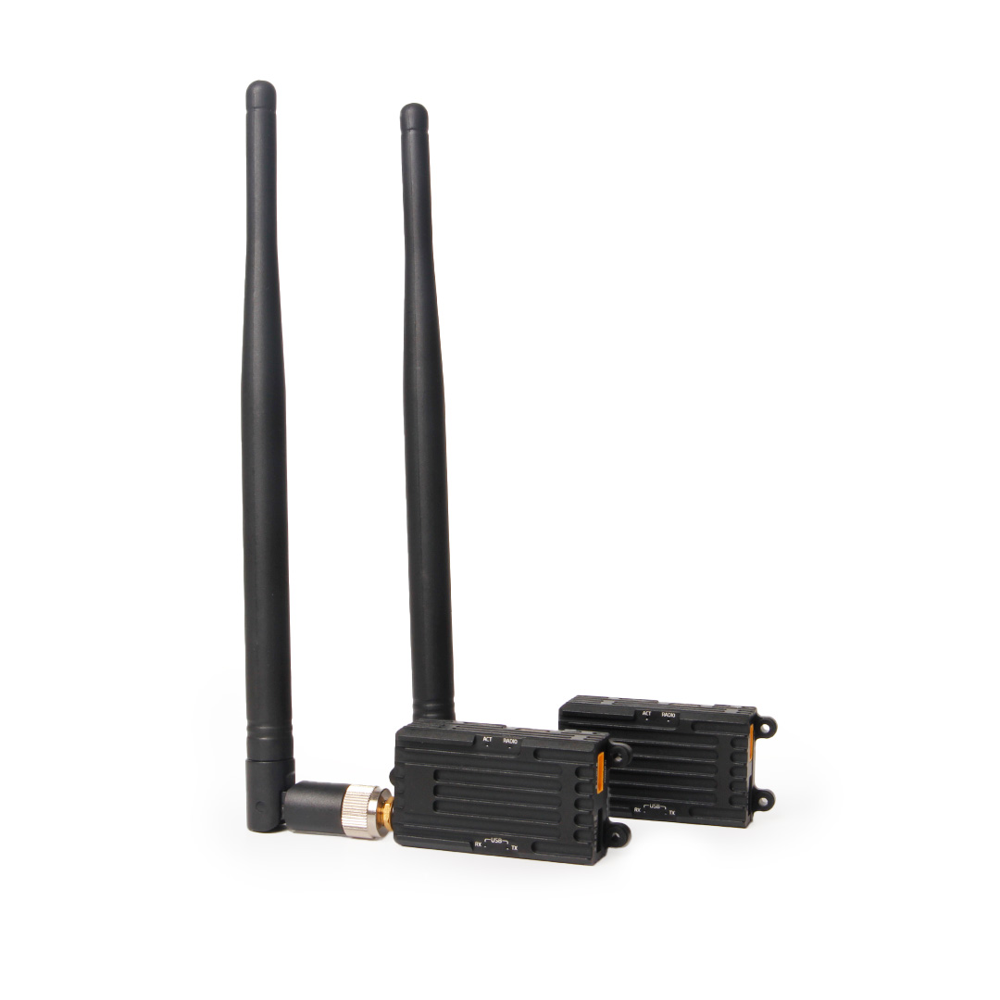
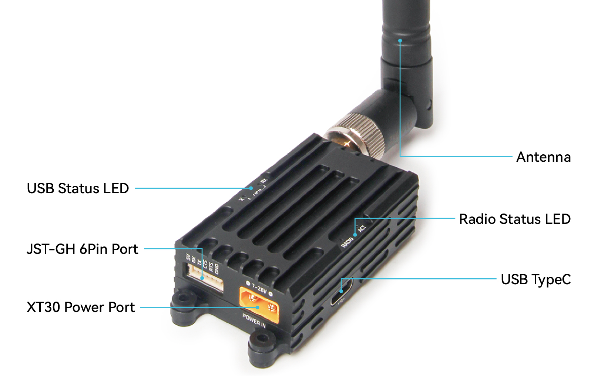
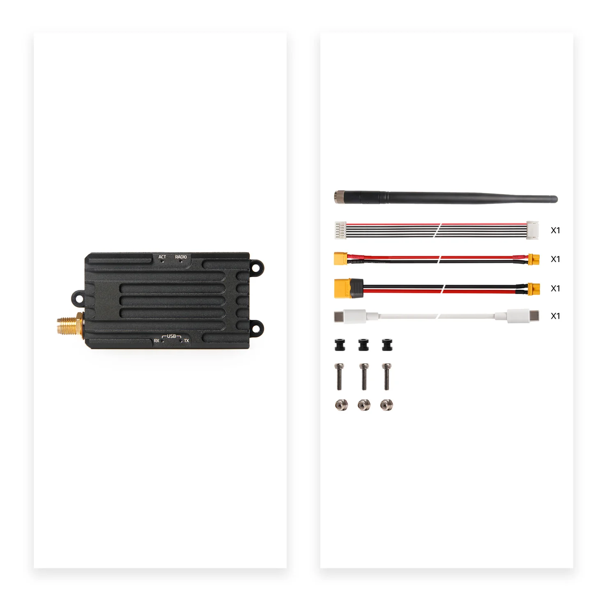
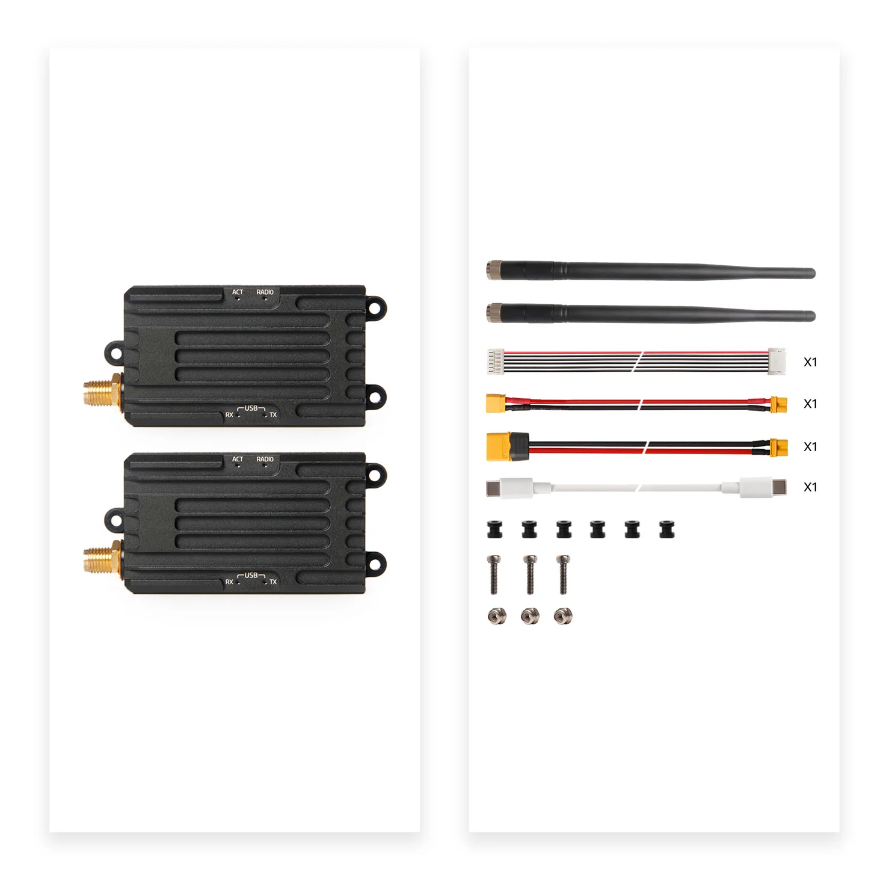


# Holybro SiK Telemetry Radio - Long Range

This Holybro SiK Long Range Telemetry Radio is a small, light, and inexpensive open-source radio platform with an extended range compared to the standard model.

This radio is plug-and-play, ready for all Pixhawk Standard and other similar flight controllers, providing the easiest way to set up a telemetry connection between your controller and a ground station. It uses open-source firmware that has been specially designed to work well with MAVLink packets and to be integrated with the Mission Planner, Ardupilot, QGroundControl, and PX4.

The radios are available in 915 MHz or 433 MHz versions. Please purchase the model that is appropriate for your country/region.

## Where to Buy

- [Holybro SiK Telemetry Radio - Long Range](https://holybro.com/collections/telemetry-radios/products/sik-telemetry-radio-1w)

## Features

- Open-source SIK firmware
- Plug-n-play for Pixhawk Standard Flight Controllers
- 1W maximum RF output
- The Easiest way to connect your controller and Ground Station
- Interchangeable air and ground radio
- 6-position JST-GH connector

## Specification

- 1 W maximum output power (adjustable) -117 dBm receive sensitivity
- RP-SMA connector
- 2-way full-duplex communication through adaptive TDM UART interface
- Transparent serial link
- MAVLink protocol framing
- Frequency Hopping Spread Spectrum (FHSS) Configurable duty cycle
- Error correction corrects up to 25% of bit errors Open-source SIK firmware
- Configurable through Mission Planner & APM Planner
- FT230X USB to BASIC UART IC
- USB Type C connector
- XT30 power connector for 7~28V DC input

## LEDs Indicators Status

The radios have four status LEDs, two LED lights indicate the reception and transmission of the USB port. The other two LED lights indicate the status of the RF circuit.

- USB-TX LED(Orange) blinking -USB port has data transmission
- USB-TX LED off - USB port has no data transmission
- USB-RX LED(Orange) blinking -USB port has data reception
- USB-RX LED off - USB port has no data reception
- Radio LED (Green)blinking - searching for another radio
- Radio LED solid - link is established with another radio
- ACT LED(Red) flashing - transmitting data
- ACT LED solid - in firmware update mode

## Connecting to Flight Controller

Supply the power (7~28V) to the radio via the XT30 connector. Use the 6-pin JST-GH connector that comes with the radio to connect the radio to your flight controller's `TELEM1` port (`TELEM2` can also be used, but the default recommendation is `TELEM1`).

## Connecting to a PC or Ground Station

First, power the module with a 7~28V DC source. Then, connect the radio to your Windows PC or Ground Station using a Type-C USB cable.

The necessary drivers should be installed automatically, and the radio will appear as a new “USB Serial Port” in the Windows Device Manager under Ports (COM & LPT).
The Mission Planner's COM Port selection drop-down should also include the newly added COM port.

## Package Includes

- Single 1W
	- 1W Radio modules with antennas *1
	- High-gain omnidirectional antenna *1
	- Male Type-C to male Type-C USB cable *1
	- Male XT30 to female XT30 adapter cable *1
	- Male XT30 to female XT60 adapter cable *1
	- JST-GH-6P to JST-GH-6P cable *1 (for Pixhawk Standard FC)
	- Rubber damping grommet *3
- Pair 1W
	- 1W Radio modules with antennas *2
	- High-gain omnidirectional antenna *2
	- Male Type-C to male Type-C USB cable *1
	- Male XT30 to female XT30 adapter cable *1
	- Male XT30 to female XT60 adapter cable *1
	- JST-GH-6P to JST-GH-6P cable *1 (for Pixhawk Standard FC)
	- Rubber damping grommet *3

