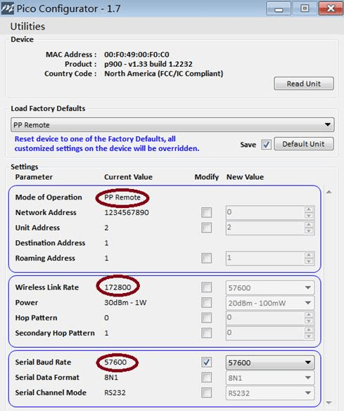

# Holybro Microhard P900 Radio

The [Holybro Microhard P900 Radio](https://holybro.com/products/microhard-radio) integrates the [Microhard Pico Serial](http://microhardcorp.com/P900.php) P900 RF module, which is capable of delivering high-performance wireless serial communications in robust and secure mesh, point-to-point or point-to-multipoint topologies.
It enables MAVLink communication between a radio on a vehicle and a GCS.

This radio operate within the 902-928 MHz ISM frequency band, using frequency hopping spread spectrum (FHSS) technology, providing reliable wireless asynchronous data transfer between most equipment types which employ a serial interface.
The radio may be configured as a primary coordinator, secondary coordinator, standby coordinator or remote in a mesh topology, or a master, repeater or remote in a PP or PMP topology.

This versatility is very convenient for the user.
This radio is configured using AT commands through the data port or using _PicoConfig_ application through the diagnosis port.

The transmit power is software selectable from 100mW to 1W, with range up to 40 miles.
A single ground station radio can be used to communicate with multiple vehicles using point to multi-point or mesh.
Vehicles must have different MAVLINK IDs.

## Features

- USB Type-C port, integrated USB to UART converter
- 6-position JST-GH connector, can be directly connected to the TELEM port on various Pixhawk-standard flight controllers such [Pixhawk 4](../flight_controller/pixhawk4.md) & [Pixhawk 5X](../flight_controller/pixhawk5x.md)
- High voltage BEC onboard, Support DC7~35V voltage supply
- UART transmission & Three-stage RSSI LED indicator
- Transmission within a public, license-exempt band of the radio spectrum
- Transparent, low latency link rates up to 276 Kbps
- Supports a robust true Mesh operation with auto-routing
- 32 bits of CRC, selectable retransmission and forward error correction
- Separate diagnostics port, transparent remote diagnostics and online network control

## Where to Buy

- [Holybro Microhard P900 Telemetry Radio (100mW - 1W)](https://holybro.com/products/microhard-radio)

## Specification

## Connecting

#### Vehicle Radio

This radio comes with a 6-Pin JST GH cable that can be connected to the `TELEM1` port on flight controllers that are compliant with the Pixhawk connector standard.
The radio must be separately powered via the 4-pin JST-GH XT30 power cable (7-35VDC).

#### Ground Station Radio

This radio has a internal USB to UART converter, the ground radio can be connected to the ground station via USB C.
The radio must be separately powered via the XT30 power cable (7-35VDC).

## Setup/Configuration

Holybro Microhard P900 Radios have been configured to point-to-point operating mode and 57600 serial baud rate in the factory.
This allows them to connect to the PX4 `TELEM1` port and _QGroundControl_ **without any further configuration**.

::: info
You can use a different baud rate, mode or flight controller port.
The only "requirement" is that the ground radio, air radio, PX4, and QGroundControl must all be set to the same baud rate.
:::

[Microhard Serial Telemetry Radios > Configuration](../telemetry/microhard_serial.md#configuration) explains how to configure the radios, _QGroundControl_, and PX4.

In order to configure the radios using the _PicoConfig_ application (as described in the link above) it must be connected through the diagnostic port:

The diagnostic port uses a 4-position JST SH connector.
If you use _PicoConfig_ application or special diagnostic commands to config the radio, you should connect to this port.
The diagnostic port is 3.3V logic level compatible.
A USB-to-serial board is needed for connecting the radio to your computer.
You can purchase a [Holybro UART to USB Converter](https://holybro.com/products/uart-to-usb-converter).

_Pico Config_ will automatically detect and connect to the configuration port.
Adjust the settings so that the baud rate matches PX4 (and the ground station).

Holding the **Config** button while powering-up the radio will boot the unit into COMMAND mode: the default serial interface will be active and temporarily set to operate at its default serial settings of 9600/8/N/1.

Note that it is also possible to configure the radios using AT commands through the data port.

### Default Configuration

The default radio configuration as shipped is shown in _PicoConfig_ below (you may need to reconfigure them as shown after firmware update or resetting the radio).

In point-to-point operating modes, there must be a master to provide network synchronization for the system, so one radio should be configured to PP master and another should be configured to PP remote.

## Status LED

The P900 Radio has 6 status LEDs: three are blue, two are orange, and one is green.
The meanings of the different LEDs are:

- Power LED(green)
  - This LED will illuminate when the P900 Radio is connected to a power source (7-35VDC).
- TX LED (orange)
  - When illuminated, this LED indicates that the Radio is transmitting data over the air.
- RX LED (orange)
  - This LED indicates that the Radio is synchronized and has received valid packets.
- RSSI LEDs (3x Blue)
  - As the received signal strength increases, starting with the furthest left, the number of active
- RSSI LEDs
  increases. Signal strength is calculated based on the last four valid received packets with correct CRC. The value of RSSI is reported in S123.

### Pinout

#### Diagnosis Port

| Pin       | Signal | Voltage |
| --------- | ------ | ------- |
| 1         | NC     | --      |
| 2 (black) | RX     | +3.3V   |
| 3 (black) | TX     | +3.3V   |
| 4 (black) | GND    | GND     |

#### Data Port

| Pin       | Signal | Voltage |
| --------- | ------ | ------- |
| 1 (red)   | NC     | --      |
| 2 (black) | RX     | +3.3V   |
| 3 (black) | TX     | +3.3V   |
| 4 (black) | CTS    | +3.3V   |
| 5 (black) | RTS    | +3.3V   |
| 6 (black) | GND    | GND     |

#### Power Port

| Pin       | Signal | Voltage |
| --------- | ------ | ------- |
| 1(red)    | BAT+   | 7-35V   |
| 2 (red)   | BAT+   | 7-35V   |
| 3 (black) | BAT-   | GND     |
| 4 (black) | BAT-   | GND     |

### Dimensions

### Power Consumption

- Supply voltage: DC7~35V from 4-pin JST-GH to XT30 (included)
- Transmit current: 200 mA/7V at 20dBm
  - 350mA/7V at 27dBm
  - 800 mA/7V at 30dBm
- Receive current: 100 mA
- Weight: 42g (without antenna)

## Further info

- [Microhard Radio](https://docs.holybro.com/telemetry-radio/microhard-radio) (docs.holybro.com)
- [Holybro Microhard P900 Downloads](https://docs.holybro.com/telemetry-radio/microhard-radio/download) (Manuals, and other docs) (Holybro)
