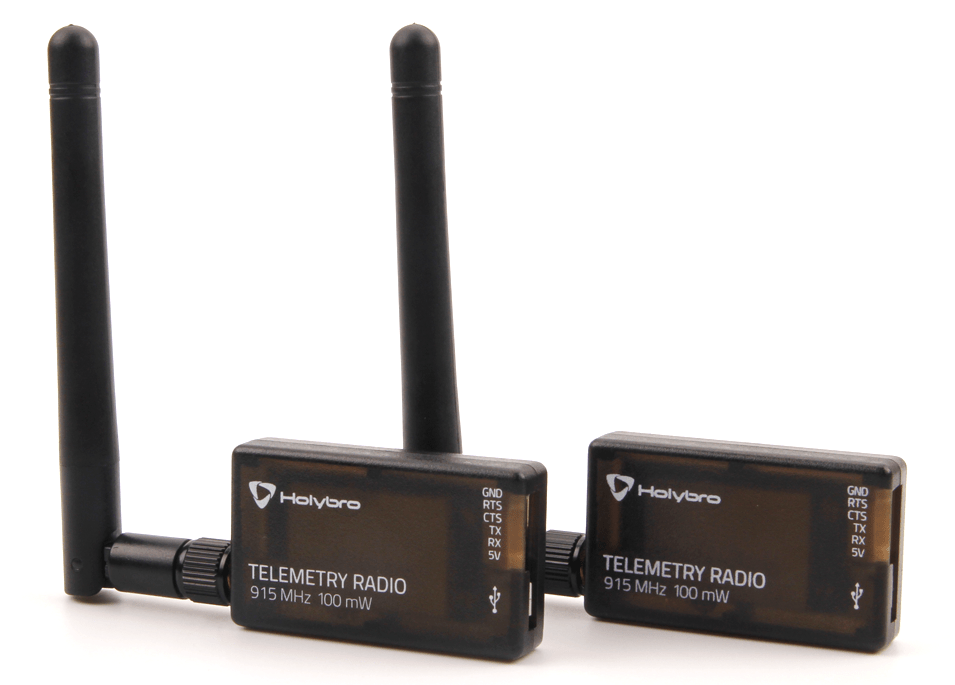
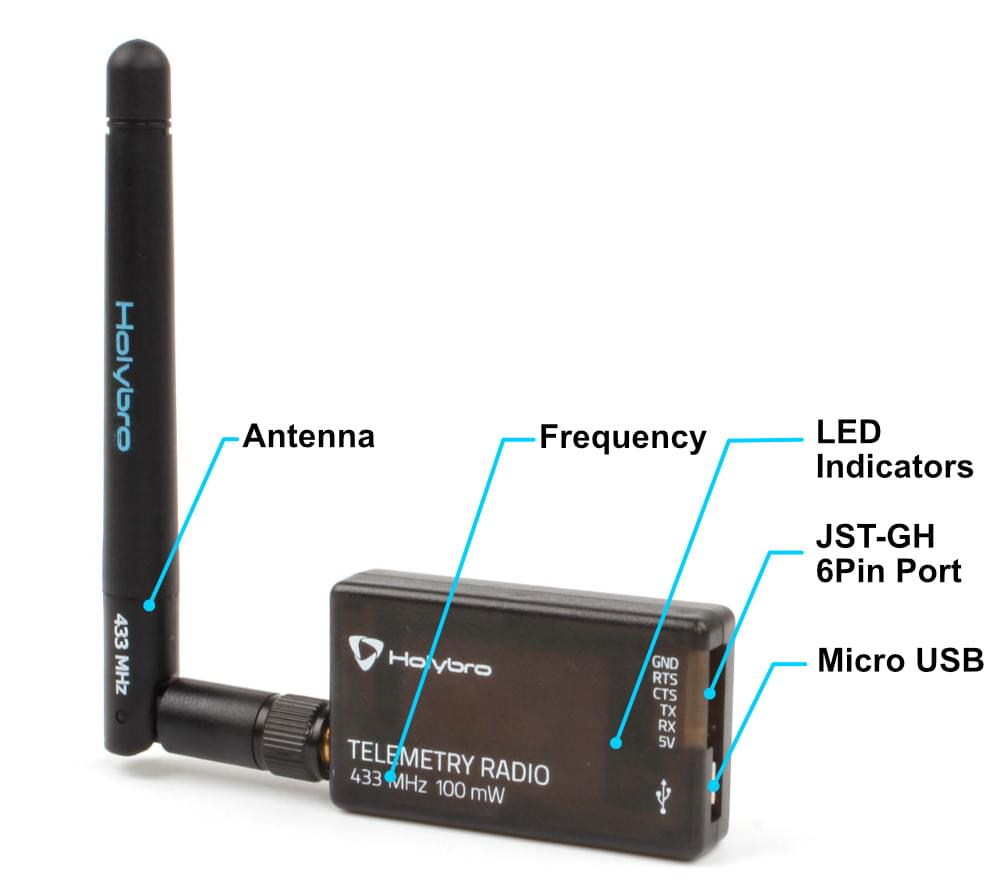
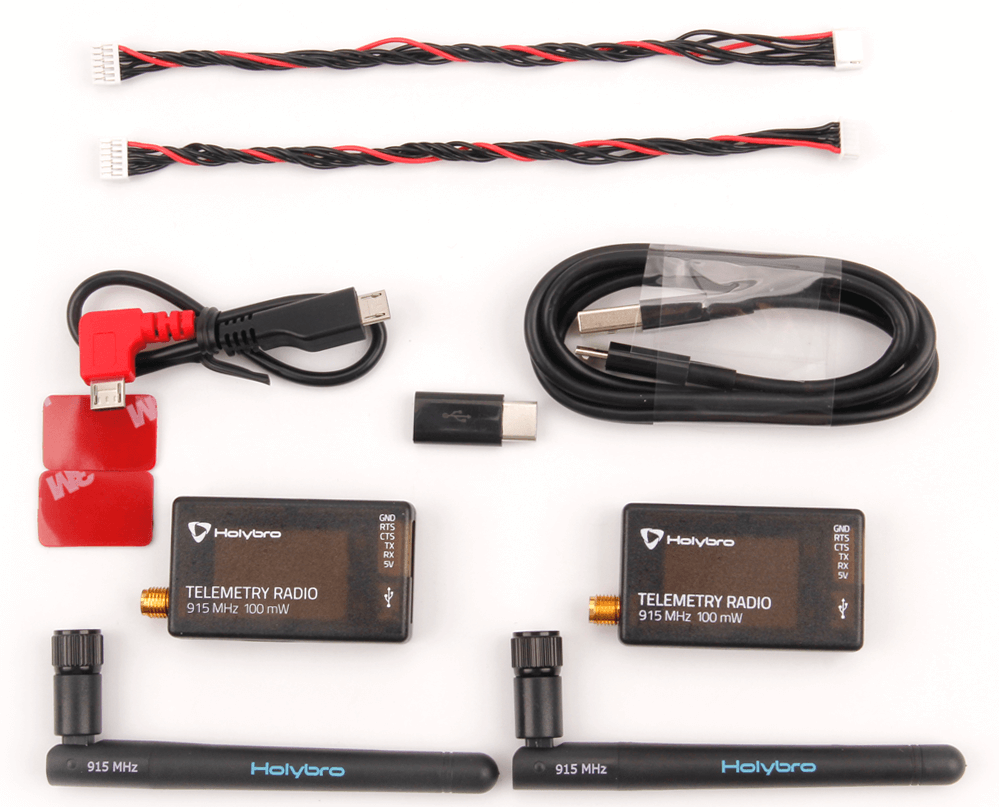

# Holybro Telemetry Radio

This Holybro [SiK](../telemetry/sik_radio.md) Telemetry Radio is a small, light and inexpensive open source "plug-and-play" radio platform to connect your Autopilot Flight Controller and Ground Station.

This radio is "plug-and-play" with all flight controllers running PX4 that have a JST-GH 6 Pin Connector TELEM port ([Pixhawk Connector Standard](https://github.com/pixhawk/Pixhawk-Standards)).
It provides the easiest way to setup a telemetry connection between your flight controller and a ground station.
It uses open source firmware that has been specially designed to work well with MAVLink packets and to be integrated with the QGroundControl & PX4 Autopilot.

They typically allow ranges of better than 300m "out of the box" (the range can be extended to several kilometers with the use of a patch antenna on the ground).

The radios can be either 915 MHz (US) or 433 MHz (EU, Asia, Africa Oceania).
Note that the regions indicated above are indicative, and you should check the rules for your locale.

## Where to Buy

- [Holybro SiK Telemetry Radio V3](https://holybro.com/collections/telemetry-radios/products/sik-telemetry-radio-v3)

## Features

- Open-source SiK firmware
- Plug-n-play for Pixhawk Standard Flight Controller
- Easiest way to connect your Autopilot and Ground Station
- Interchangeable air and ground radio
- Micro-USB port (Type-C Adapter Cable Included)
- 6-position JST-GH connector

## Specification

- 100 mW maximum output power (adjustable) -117 dBm receive sensitivity
- RP-SMA connector
- 2-way full-duplex communication through adaptive TDM UART interface
- Transparent serial link
- MAVLink protocol framing
- Frequency Hopping Spread Spectrum (FHSS) Configurable duty cycle
- Error correction corrects up to 25% of bit errors Open-source SIK firmware
- Configurable through Mission Planner & APM Planner
- FT230X USB to BASIC UART IC

## LEDs Indicators Status

The radios have 2 status LEDs, one red and one green.
The interpretation of the different LED states are:

- Green LED blinking - searching for another radio
- Green LED solid - link is established with another radio
- Red LED flashing - transmitting data
- Red LED solid - in firmware update mode

## Connecting to Flight Controller

Use the 6 pin JST-GH connector that come with the radio to connect the radio to your flight controller's `TELEM1` port (`TELEM2` can also be used but the default recommendation is `TELEM1`).

## Connecting to a PC or Ground Station

Connecting the radio to your Windows PC or Ground Station is as simple as connecting the micro/type-C USB cable (Type-C adapter included with the radio) to your PC/Ground Station.

The necessary drivers should be installed automatically and the radio will appear as a new “USB Serial Port” in the Windows Device Manager under Ports (COM & LPT).
The Mission Planner's COM Port selection drop-down should also contain the same new COM port.

## Package Includes

- Radio modules with antennas \*2
- Micro-USB to USB-A cable \*1
- Micro-USB to Micro-USB OTG adapter cable \*1
- Micro USB to Type C Adapter
- JST-GH-6P to JST-GH-6P cable \*1 (for Pixhawk Standard FC)
- JST-GH-6P to Molex DF12 6P (for Pix32, Pixhawk 2.4.6, etc.)

