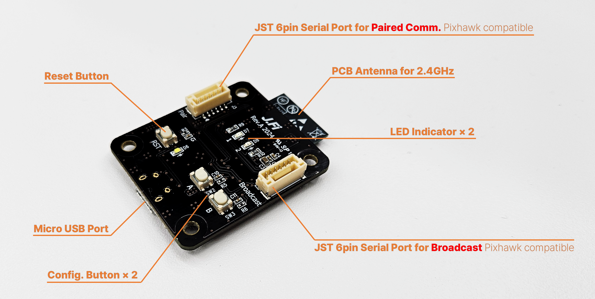
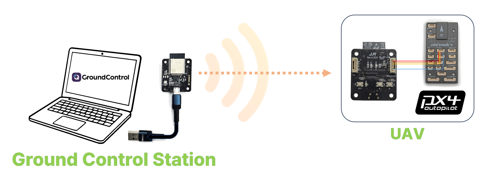
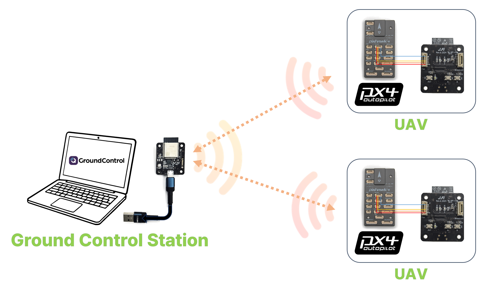
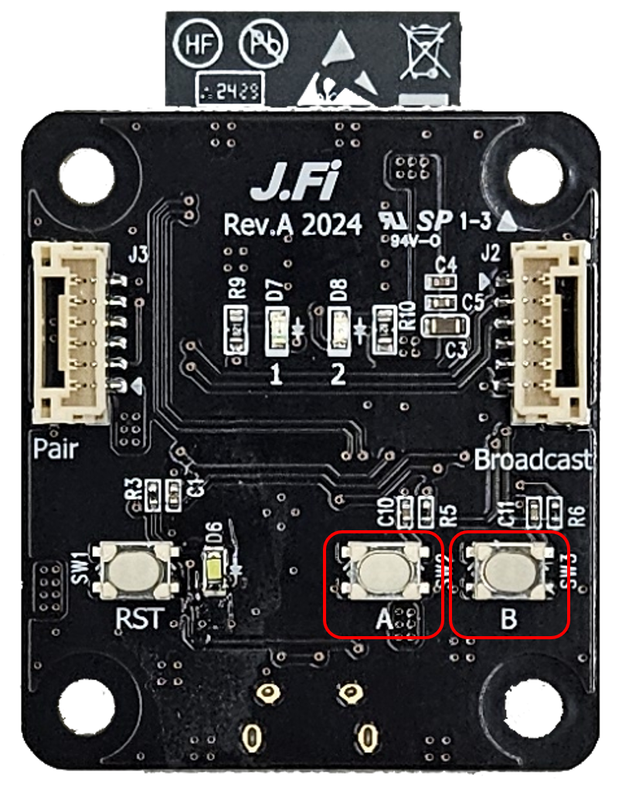
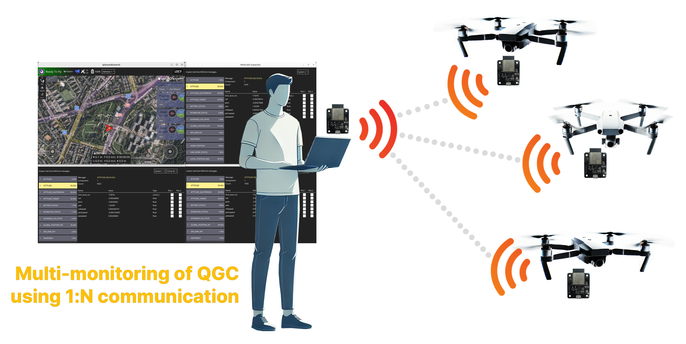
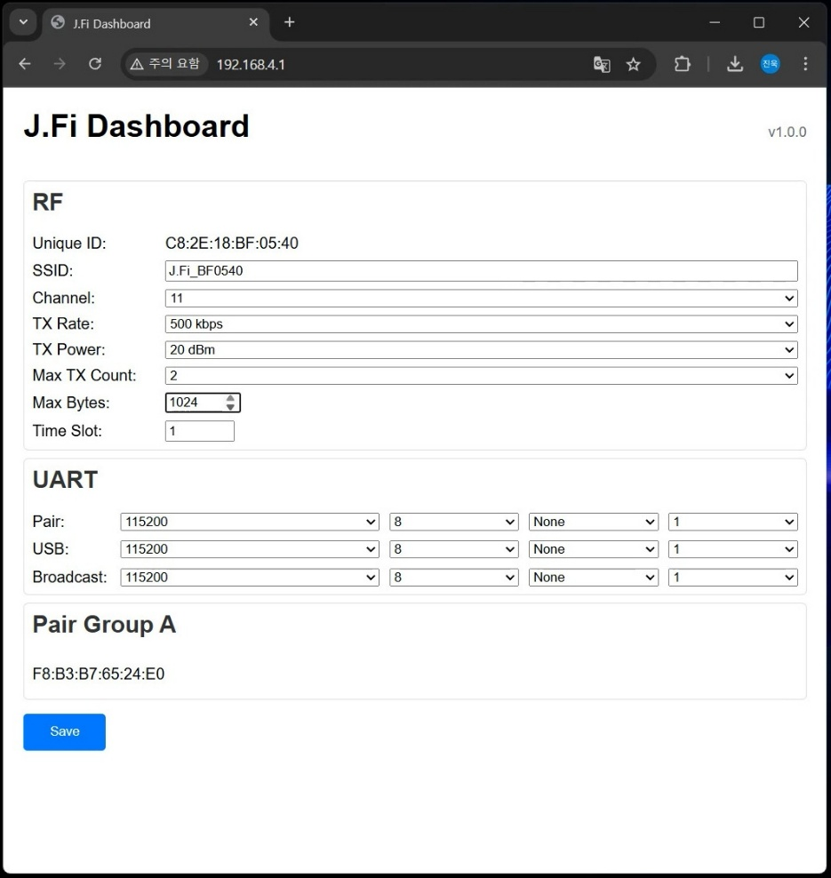

# J.Fi Wireless Telemetry Module

The J.Fi telemetry module is a compact and lightweight wireless communication device featuring a PCB-integrated antenna or external antenna, enabling seamless telemetry connections between various drone flight controllers (FC) and ground control stations.

This module utilizes a JST 6-pin TELEM connector, complying with the Pixhawk standard, ensuring compatibility with all PX4-based flight controllers.
It supports quick plug-and-play operation with default settings, requiring no additional configuration.

The J.Fi telemetry module provides reliable communication up to approximately 500 meters when using a PCB-integrated antenna.
Operating in the 2.4GHz frequency band, it allows unrestricted global use without regulatory limitations.

## Where to Buy

- [https://jmarple.ai/j-fi/](https://jmarple.ai/j-fi/)

## Technical Specifications

### Wireless Performance
- **Frequency Band:** 2.4GHz
- **Speed:** Up to 11Mbps (adjustable)
- **Range:** Up to 500 meters (varies upon environments)
- **Payload Capacity:** Up to 1400 bytes

### Network Schemes
- **Supported Topologies:** 1:1, 1:N, N:N
- **Collision Management:** Time Slot-Based Response Delay

### User-Friendly Features
- **Buttons:** Pairing and Mode Switching
- **LED Indicators:** Real-time status updates
- **Configuration:** Web browser-based setup
- **Micro USB Port for connecting to PC or GCS**

## Broadcast Communication

**With default settings enabled**, the device automatically broadcasts data to **all nearby J.Fi devices.**
Connect your external device or system to the **Broadcast port.**
No additional setup is required.

## Paired Communication
- Modules must first undergo an **initial pairing procedure.**
- Once paired, communication is **exclusively limited to paired J.Fi devices.** Connect your external device or system to the **Pair port.**

### 1:1 Pairing

- On **each device,** press and hold *button A*, then click the *RST button*. Release *button A* when *LED 1* blinks.
  - Both devices will enter pairing mode
- Choose one module and double-click *button A*
- On the other module, click *button A* once
- On the first module, click *button A* once again to finish pairing
  - Pairing complete

### 1:N Pairing
- On **each device,** press and hold *button A*, then click the *RST button*. Release *button A* when *LED 1* blinks.
  - All devices will enter pairing mode
- **Host module (1):** Double-click *button A*
- **Client modules (N):** Click *button A* once on each module to pair
- **Host module (1):** Click *button A* again to finish pairing
  - Pairing complete.

<lite-youtube videoid="CnjhTfvARmw" title="J.Fi Wireless Telemetry Module Pairing Guide"/>

## PX4 Setup

### TELEM Port Configuration
- **By default**, PX4 uses the **TELEM1** port for telemetry radios (**baud rate: 57600**). To use a different baud rate, add a new serial communication link with the desired rate (**see Application Settings → Comms Links**).
- For a **one-to-many (1:N)** MAVLink communication setup, assign a unique **System ID** to each MAVLink system (1: host, N: clients).

## Configuration
- **Device:** Press and hold *button B*, then click the *RST button*. Release *button B* when *LED 2* blinks.
  - Device enters configuration mode
- **Smart device:** Connect to Wi-Fi network named **&quot;J.Fi-xxxxxx&quot;** (x: alphanumeric characters)
- **Browser:** Go to **192.168.4.1** to open the **configuration page.**
- **Configuration page:** Adjust settings as needed, then click **Save**
  - *LED 1* blinks once upon saving

## Further info
- [User Manual](https://docs.google.com/document/d/1NaVwOLuMCuNpd0uxgilXZ_qfHAnsFgBmaPxX9WGY2h4/edit?usp=sharing)
- [ROS Github](https://github.com/SUV-Lab/J-Fi)
