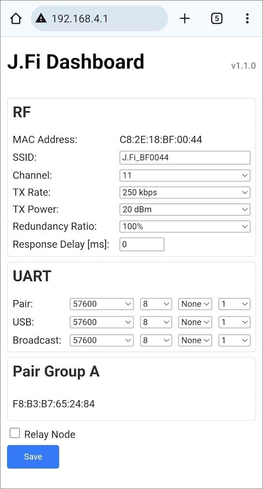

# J.Fi Wireless Telemetry Module

The J.MARPLE [J.Fi telemetry module](https://jmarple.ai/j-fi/) is a compact and lightweight wireless communication device featuring a PCB-integrated antenna or external antenna, enabling seamless telemetry connections between various drone flight controllers (FC) and ground control stations.

This module includes a Pixhawk-standard JST 6-pin `TELEM` connector, ensuring compatibility with all PX4-based flight controllers.
It supports quick plug-and-play operation to `TELEM1` with default settings, requiring no additional configuration.

The J.Fi telemetry module provides reliable communication up to approximately 500 meters when using a PCB-integrated antenna.
Operating in the 2.4GHz frequency band, it allows unrestricted global use without regulatory limitations.

## Where to Buy

- [https://jmarple.ai/j-fi/](https://jmarple.ai/j-fi/)

## Technical Specifications

### Wireless Performance

- **Frequency Band:** 2.4GHz
- **Speed:** Up to 11 Mbps (adjustable)
- **Range:** Up to 500 meters (varies upon environments)
- **Payload Capacity:** Up to 1400 bytes

### Network Schemes

- **Supported Topologies:** 1:1, 1:N, N:N
- **Collision Management:** Time Slot-Based Response Delay

### User-Friendly Features

- **Buttons:** Pairing and Mode Switching
- **LED Indicators:** Real-time status updates
- **Configuration:** Web browser-based setup
- **Micro USB Port for connecting to PC or GCS**

## Broadcast Communication

With default settings enabled, the device automatically broadcasts data to all nearby J.Fi devices.
Connect your external device or system to the **Broadcast port**.
No additional setup is required.

## Paired Communication

- Modules must first undergo an initial pairing procedure.
- Once paired, communication is _restricted to paired J.Fi devices_. Connect your external device or system to the **Pair port.**

### 1:1 Pairing

- On **each device,** press and hold _button A_, then click the _RST button_.
  Release _button A_ when _LED 1_ blinks.
  - Both devices will enter pairing mode
- Choose one module and double-click _button A_
- On the other module, click _button A_ once
- On the first module, click _button A_ once again to finish pairing
  - Pairing complete

### 1:N Pairing

- On **each device,** press and hold _button A_, then click the _RST button_.
  Release _button A_ when _LED 1_ blinks.
  - All devices will enter pairing mode
- **Host module (1):** Double-click _button A_
- **Client modules (N):** Click _button A_ once on each module to pair
- **Host module (1):** Click _button A_ again to finish pairing
  - Pairing complete.

<lite-youtube videoid="CnjhTfvARmw" title="J.Fi Wireless Telemetry Module Pairing Guide"/>

## PX4 Setup

PX4 is plug-and-play with J.Fi if connected to the `TELEM1` port, and should connect without further connection.

If you want to use another port you will need to assign a MAVLink instance to the serial port (see [MAVLink Peripherals (GCS/OSD/Companion)](../peripherals/mavlink_peripherals.md)) (and possibly unassign whatever is currently using the port).

### One-to-one (1:1) Setups

The `TELEM1` port is set to use `57600` as the baud rate by default (and J.Fi is set to match).
This default baud rate is calibrated for inexpensive low-power telemetry radios.
While this should be sufficient for 1:1 setups, J.Fi will work with much higher rates (i.e., `115200`).

If you want to change the baud rate:

1. Change [SER_TEL1_BAUD](../advanced_config/parameter_reference.md#SER_TEL1_BAUD) if you're using the `TELEM1` port (see [Serial Port Configuration](../peripherals/serial_configuration.md) for other ports).
2. Update the baud rate in the [J.Fi Configuration](#j-fi-configuration) to match.

### One-to-many (1:N) Setups

For one-to-many (1:N) setups a higher baud rate is _highly recommended_ to ensure stable data reception.
All J.Fi devices should be set to the same baud rate (although communication may work even when when devices use different baud rates).
This should be changed in both PX4 and the J.Fi modules as explained in the previous section.

You will also need to make sure that all vehicles on the MAVLink network are assigned a unique **System ID** ([MAV_SYS_ID](../advanced_config/parameter_reference.md#MAV_SYS_ID)).

<lite-youtube videoid="tPeJA2gn7Zw" title="Simultaneous Control using J.Fi Wireless Telemetry Module"/>

## QGroundControl Configuration

The J.Fi will connect plug-and-play to **QGroundControl** and automatically connect just like a SiK Radio.

However if you change the baud rate from 57600 you will need to create and use a new link configuration:

1. Disable SiK Radio in QGC (**Application Settings → General → AutoConnect**).
2. Create a new link configuration:
   - Go to **Application Settings → Comms Links**.
   - Click **Add**.
   - Set **Type** to **Serial**, configure the **Serial Port** and **Baud Rate** to match the J.Fi device.
3. Select **Connect** to connect with the new configuration.

## J.Fi Configuration

- **Device:** Press and hold _button B_, then click the _RST button_.
  Release _button B_ when _LED 2_ blinks.
  - Device enters configuration mode
- **Smart device:** Connect to Wi-Fi network named `J.Fi-xxxxxx` (x: alphanumeric characters)
- **Browser:** Go to `192.168.4.1` to open the **configuration page**.
- **Configuration page:** Adjust settings as needed, then click **Save**
  - _LED 1_ blinks once upon saving

## Further info

- [User Manual](https://docs.google.com/document/d/1NaVwOLuMCuNpd0uxgilXZ_qfHAnsFgBmaPxX9WGY2h4/edit?usp=sharing)
- [ROS Github](https://github.com/SUV-Lab/J-Fi)
