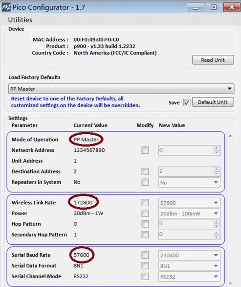
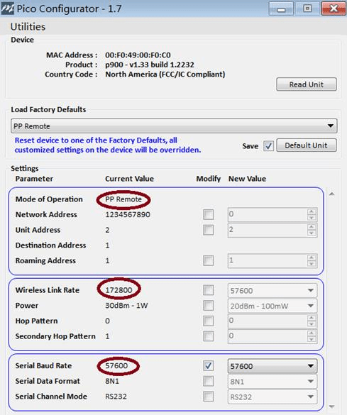

# Microhard Serial Telemetry Radios

[Microhard Pico Serial Radios](http://microhardcorp.com/P900.php) integrate the [Microhard Pico Serial](http://microhardcorp.com/P900.php) P900 RF module.

This is a relatively small size and low cost radio that supports modes including point to point, point to multi-point, and mesh modes.
It has configurable power output and can also be configured to use forward error correction.
Radios can also be ordered that support secure/encrypted channels, although this is subject to export restriction.

Manufacturers typically default-configure the radios in peer-to-peer mode and match the baud rate expected by PX4 and _QGroundControl_ (57600 baud).
This allows plug and play telemetry when the radios are connected to the usual telemetry ports on a Pixhawk flight controllers (`TELEM1` or `TELEM2`) along with auto-detection of the connection in _QGroundControl_.

Several manufacturers provide solutions based on these radios:

- [ARK Electron Microhard Serial Telemetry Radio](../telemetry/ark_microhard_serial.md)
- [Holybro Microhard P900 Telemetry Radio](../telemetry/holybro_microhard_p900_radio.md)

## Range Tradeoffs

The radio range depends on a number of factors, including: baud rate, power output, mode, whether forward error connection is enabled, whether encryption is enabled, antenna used etc.

The selection of these parameters is a tradeoff:

- increasing baud rate decreases radio range.
- increasing radio power increases range, but decreases flight time.
- point to multipoint means you can have a single ground station talking to multiple vehicles, but increases the bandwidth on the channel.
- mesh configurations provide similar convenience and cost.

The maximum range quoted in specifications is around 60km.
ARK Electron suggest an approximate range of 8km with output power set to 1W is 8km and using default settings.

## Configuration

For convenience, radios are usually default-configured so that they can be used with PX4 and _QGroundControl_ out of the box.

Developers can modify the configuration.
The only "requirement" is that the: ground radio, air radio, PX4, and _QGroundControl_ must all be set to use the **same** baud rate (and of course each MAVLink system must have a unique System ID).

### PX4 Configuration

PX4 is configured to use `TELEM1` for telemetry radios, with a default baud rate of 57600.
You can configure PX4 to use any other free serial port a different baud rate, by following the instructions in [MAVLink Peripherals](../peripherals/mavlink_peripherals.md).

### QGroundControl Configuration

QGroundControl autodetects a serial telemetry connection with the baud rate 57600.

For any other rate you will need to add a serial comms link that sets the rate that was used.
See [Application Settings > Comms Links](https://docs.qgroundcontrol.com/master/en/qgc-user-guide/settings_view/settings_view.html).

### Radio Configuration

Microhard serial radios are configured using the _PicoConfig_ application (Windows only).
This can be downloaded here: [PicoConfig-1.7.zip](https://arkelectron.com/wp-content/uploads/2021/04/PicoConfig-1.7.zip) (ARK Electron) or [picoconfig-1-10](https://docs.holybro.com/telemetry-radio/microhard-radio/download) (Holybro).

In point-to-point operating modes, there must be a master to provide network synchronization for the system, so one radio should be configured to PP master and another should be configured to PP remote.

The screen shots below show the default radio configuration settings for connecting to PX4 and _QGroundControl_.

The [Pico Series P900.Operating Manual.v1.8.7](https://github.com/PX4/PX4-user_guide/raw/main/assets/hardware/telemetry/Pico-Series-P900.Operating-Manual.v1.8.7.pdf) has additional information on radio configuration (including mesh and multipoint modes).

### Mesh and Multipoint Modes

Mesh and point to multi-point modes are supported, but all vehicles must have a unique Mavlink ID.

Anecdotally:

- At the highest link rate, with no FEC, we can have 201 drones in one mesh system transmitting 80 bytes once a second.
- You can have multiple networks working together at the same time without mutual interference using "co-located systems".
  For example, to deploy more than 500 vehicles you would need to deploy three P900 mesh coordinators, each serving up to 201 drones in their respective local networks.
