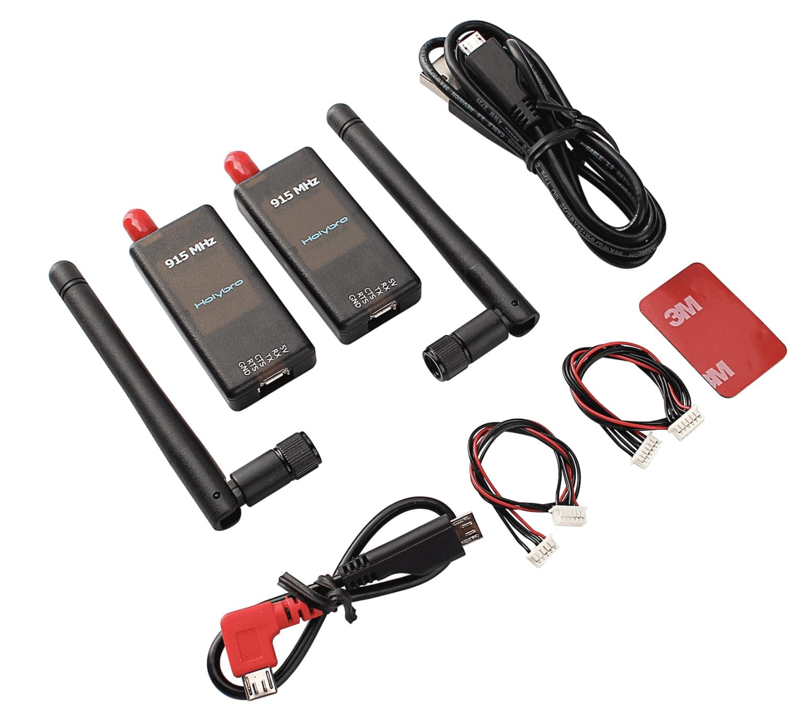

# SiK Radio

[SiK radio](https://github.com/LorenzMeier/SiK) is a collection of firmware and tools for telemetry radios.

PX4 is protocol-compatible with radios that use _SiK_.
SiK Radios often come with appropriate connectors/cables allowing them to be directly connected to [Pixhawk Series](../flight_controller/pixhawk_series.md) controllers
(in some cases you may need to obtain an appropriate cable/connector).
Typically you will need a pair of devices - one for the vehicle and one for the ground station.

Hardware for the SiK radio can be obtained from various manufacturers/stores in variants that support different range and form factors.

## Vendors

- [Holybro Telemetry Radio](../telemetry/holybro_sik_radio.md)
- [HolyBro SiK Long Range](../telemetry/holybro_sik_longrange.md)
- [RFD900 Telemetry Radio](../telemetry/rfd900_telemetry.md)
- [ThunderFly TFSIK01 Telemetry Radio](../telemetry/tfsik_telemetry.md)
- <del>_HKPilot Telemetry Radio_</del> (Discontinued)
- <del>_3DR Telemetry Radio_</del> (Discontinued)

## Setup/Configuration

The ground station-based radio is connected via USB (essentially plug-n-play).

The vehicle-based radio is connected to the flight-controller's `TELEM1` port, and typically requires no further configuration.

## Link Throughput

The serial baudrate says little about what a SiK link carries over the air.
At 57600 baud with the common 64 kbps air rate, a radio carries roughly 2000 B/s with error
correction enabled and about twice that without.

[MAV_0_RATE](../advanced_config/parameter_reference.md#MAV_0_RATE) caps what PX4 sends on
`TELEM1`. Setting it above what the link carries does not make telemetry faster: the radio
drops packets instead, which shows up as MAVLink loss and makes parameter and log downloads
slow or unreliable. Lower it if you see loss.

Two AT commands report the radio's own limits: `ATI5` lists the settings, including
`S2:AIR_SPEED` and `S5:ECC`, and `ATI6` reports `max_data_packet_length` - the largest
MAVLink packet the radio sends in one piece. Error correction roughly halves both the
throughput and that packet size.

## Firmware Update

Hardware sourced from most [vendors](#vendors) should come pre-configured with the latest firmware.
You may need to update older hardware with new firmware, for example to gain support for MAVLink 2.

You can update the radio firmware using _QGroundControl_: [QGroundControl User Guide > Loading Firmware](https://docs.qgroundcontrol.com/master/en/qgc-user-guide/setup_view/firmware.html).

## Advanced Setup/Configuration

The Development section has [additional information](../data_links/sik_radio.md) about building firmware and AT-command based configuration.
This should not be required by non-developers.
