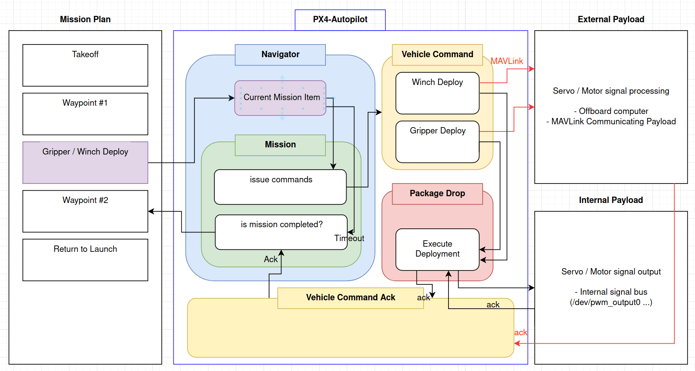

# Package Delivery in Missions

<Badge type="tip" text="PX4 v1.14" />

A package delivery mission is an extension of a waypoint mission, where a user can plan delivering a package as a waypoint.

This topic explains the architecture for the package delivery feature.
It is intended for developers working on extending the architecture, for example to support new payload delivery mechanisms.

:::info
Currently only [Grippers](../peripherals/gripper.md) can be used for package delivery.
Winches are not yet supported.
:::

:::info
The detailed documentation on how to setup a package delivery mission plan can be found [here](../flying/package_delivery_mission.md).
Setup for the `payload_deliverer` module is covered in the documentation for the delivery mechanism, such as [Gripper](../peripherals/gripper.md#px4-configuration).
:::

## Package Delivery Architecture Diagram

Package Delivery feature is centered around the [VehicleCommand](../msg_docs/VehicleCommand.md) & [VehicleCommandAck](../msg_docs/VehicleCommandAck.md) messages.

The central idea lies in having an entity that handles the `DO_GRIPPER` or `DO_WINCH` vehicle command, executes it and sends back an acknowledgement when the successful delivery is confirmed.

Because PX4 automatically broadcasts the `VehicleCommand` uORB message to a UART port configured to communicate in MAVLink as a [`COMMAND_LONG`](https://mavlink.io/en/messages/common.html#COMMAND_LONG) message, an external payload can receive the command and execute it.

Likewise, since PX4 automatically translates the [`COMMAND_ACK`](https://mavlink.io/en/messages/common.html#COMMAND_ACK) message coming in from an external source through a UART port configured for MAVLink into a `vehicle_command_ack` uORB message, an external payload's acknowledgement for a successful package deployment can be received by PX4's `navigator` module.

Below, each entity involved in the package delivery architecture is explained.

## Navigator

Navigator handles the reception of the vehicle command ACK (described below).
Upon reception of a successful deployment ack message, it sets the flag in Mission block level to signal that the payload deployment has been successful.

This allows the mission to proceed to a next item (e.g. Waypoint) safely, as we are sure with the acknowledgement that the deployment has been successful.

## Vehicle Command ACK

We are waiting for the ACK coming from either internally (via `payload_deliverer` module), or externally (external entity sending the MAVLink message `COMMAND_ACK`) to determine if the package delivery action has been successful (either `DO_GRIPPER` or `DO_WINCH`).

## Mission

The Gripper / Winch command is placed as a `Mission Item`.
This is possible since all the Mission item has the `MAV_CMD` to execute (e.g. Land, Takeoff, Waypoint, etc) which can get set to either `DO_GRIPPER` or `DO_WINCH`.

In the Mission logic (green box above) if either Gripper/Winch mission item is reached, it implements brake_for_hold functionality (which sets the `valid` flag of the next mission item waypoint to `false`) for rotary wings (e.g. Multicopter) so that the vehicle would hold it's position while the deployment is getting executed.

For fixed-wing and other vehicles, no special braking condition is considered.
So if you have a loiter mission item for a fixed-wing, it will execute the delivery whilst doing the loiter, and won’t come to a stop (as it’s impossible)

## Mission Block

`MissionBlock` is the parent class of `Mission` that handles the part "Is Mission completed?".

This all performed in the `is_mission_item_reached_or_completed` function, to handle the time delay / mission item advancement.

Also it implements the actual issue_command function, which will issue a vehicle command corresponding to the mission item's `MAV_CMD`, which will then be received by an external payload or the `payload_deliverer` module internally.

## Payload Deliverer

This is a dedicated module that handles gripper / winch support, which is used for the standard [package delivery mission plan](../flying/package_delivery_mission.md).

Setup for the `payload_deliverer` module is covered within setting up an actual package release mechanism setup documentation like [Gripper](../peripherals/gripper.md#px4-configuration).
