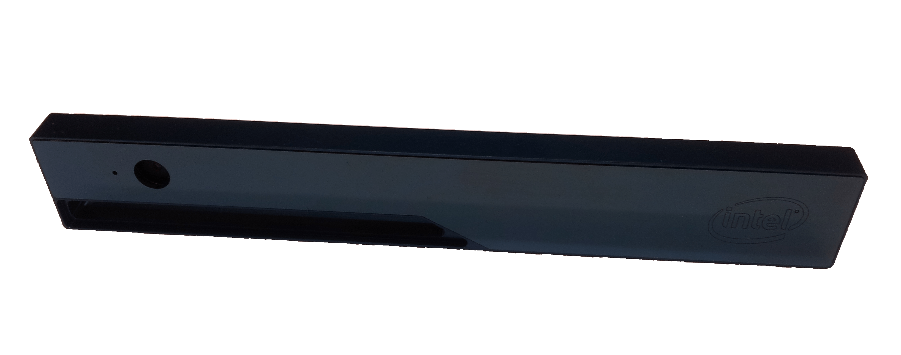

# 우분투에 인텔 리얼센스 R200 드라이버 설치

이 튜토리얼에서는 촬영 이미지를 ROS(Robot Operation System)를 통하여 액세스할 수 있도록, Linux 환경에서 Intel RealSense R200 카메라 드라이버를 설치 방법을 설명합니다.
RealSense R200 카메라 헤드는 다음과 같습니다.



버추어 박스의 게스트 운영체제로 동작하는 우분투 운영체제(OS)에서 드라이버를 설치합니다.
The specifications of the host computer where the Virtual Box is running, the Virtual Box and the guest system are given below:

- 호스트 운영체제: 윈도우 8
- 프로세서: Intel(R) Core(TM) i7-4702MQ CPU @ 2.20GHz
- 버추어박스: 오라클 가상 머신. 버전 5.0.14 r105127
- 확장: Virtual Box용 확장 패키지 설치(USB3 지원에 필요)
- 게스트 운영체제: 리눅스 - 우분투 14.04.3 LTS

지침서의 순서는 다음 방식을 따릅니다. 첫 부분에서는 버추어박스에 게스트 운영체제로 우분투 14.04 설치 방법을 설명합니다. 두번째 부분에서는 ROS 인디고와 카메라 드라이버 설치 방법을 알려줍니다. The ensuing frequently used expressions have the following meaning:

- 버추어 박스(VB): 서로 다른 가상 머신을 실행하는 프로그램. 이 경우 오라클 가상 머신입니다.
- 가상 머신(VM): 버추어 박스에서 게스트 시스템으로 실행하는 운영체제. 이 경우 우분투를 지칭합니다.

## 버추어 박스에 우분투 14.04.3 LTS 설치

- 64비트 리눅스를 설치할 새 가상 머신(VM)을 만드십시오.
- Download the iso file of Ubuntu 14.04.3 LTS: ([ubuntu-14.04.3-desktop-amd64.iso](https://ubuntu.com/download/desktop)).
- 우분투를 설치하십시오:
  - 설치 과정에서 다음 두가지 옵션을 끄십시오:
    - 설치 중 업데이트 다운로드
    - 서드파티 소프트웨어 설치
- 설치 후, 전체 데스크톱(화면)에 우분투 화면이 뜨도록 버추어 박스를 활성화합니다:
  - Start VM Ubuntu and login, Click on **Devices->Insert Guest Additions CD image** in the menu bar of the Virtual Box.
  - Click on **Run** and enter password on the windows that pop up in Ubuntu.
  - 설치가 끝난 후에 가상머신을 다시 시작하십시오.
    이제, 전체 데스크톱 화면에 가상 머신 화면이 표시되어야합니다.
  - 업데이트 설치 여부를 묻는 창이 우분투에 뜰 경우, 거절하십시오.
- 버추어 박스 USB 3 컨트롤러 활성:
  - 가상 머신을 종료합니다.
  - 가상 머신 설정에서 메뉴 선택 USB로 이동하고 "USB 3.0(xHCI)"를 선택합니다.
    Virtual Box용 확장 패키지를 설치한 경우에만 가능합니다.
  - 가상 머신을 다시 시작합니다.

## ROS 인디고 설치

- Follow instructions given at [ROS indigo installation guide](http://wiki.ros.org/indigo/Installation/Ubuntu):
  - 데스크톱 전체 버전을 설치하십시오.
  - "Initialize rosdep"과 "Environment setup" 부분에 설명한 단계를 실행하십시오.

## 카메라 드라이버 설치

- git을 설치하십시오:

  ```sh
  sudo apt-get install git
  ```

- Download and install the driver:

  - Clone [RealSense_ROS repository](https://github.com/bestmodule/RealSense_ROS):

    ```sh
    git clone https://github.com/bestmodule/RealSense_ROS.git
    ```

- Follow instructions given in [here](https://github.com/bestmodule/RealSense_ROS/tree/master/r200_install).

  - 패키지 설치할 지 여부를 물어보면 엔터키를 입력하십시오.

    ```sh
    Intel Low Power Subsystem support in ACPI mode (MFD_INTEL_LPSS_ACPI) [N/m/y/?] (NEW)
    ```

    ```sh
    Intel Low Power Subsystem support in PCI mode (MFD_INTEL_LPSS_PCI) [N/m/y/?] (NEW)
    ```

    ```sh
    Dell Airplane Mode Switch driver (DELL_RBTN) [N/m/y/?] (NEW)
    ```

  - 설치 프로세스가 끝날 때 나타날 수 있는 다음 오류 메시지는 드라이버의 오작동으로 이어지지 않아야 합니다.

    ```sh
    rmmod: ERROR: Module uvcvideo is not currently loaded
    ```

- 설치 과정이 끝나면, 가상 머신을 다시 시작하십시오.

- 카메라 드라이버 시험:

  - 인텔 리얼센스 카메라 헤드를 USB3 케이블로 USB3 방식을 따르는 컴퓨터의 포트에 연결하십시오.
  - Click on Devices->USB-> Intel Corp Intel RealSense 3D Camera R200 in the menu bar of the Virtual Box, in order to forward the camera USB connection to the Virtual Machine.
  - [패키지 해제 폴더]/Bin/DSReadCameraInfo 파일을 실행하십시오:

    - 다음 오류 메시지가 나타나면 카메라 연결을 해제하십시오(컴퓨터에서 물리적으로 USB 케이블을 뽑아내십시오). Plug it in again + Click on Devices->USB-> Intel Corp Intel RealSense 3D Camera R200 in the menu bar of the Virtual Box again and execute again the file [unpacked folder]/Bin/DSReadCameraInfo.

      ```sh
      DSAPI call failed at ReadCameraInfo.cpp:134!
      ```

    - 카메라 드라이버가 동작하고 Intel RealSense R200을 인식하면, Intel RealSense R200 카메라 헤드 정보를 살펴보아야 합니다.

- ROS 노들릿(nodlet) 설치 및 시험:
  - Follow the installation instructions in the "Installation" section given [here](https://github.com/bestmodule/RealSense_ROS/blob/master/realsense_dist/2.3/doc/RealSense-ROS-R200-nodelet.md), to install the ROS nodlet.
  - Follow the instructions in the "Running the R200 nodelet" section given [here](https://github.com/bestmodule/RealSense_ROS/blob/master/realsense_dist/2.3/doc/RealSense-ROS-R200-nodelet.md), to test the ROS nodlet together with the Intel RealSense R200 camera head.
    - 모든 기능이 동작하면 ROS 토픽에 Intel RealSense R200 카메라로부터 제각기 다른 데이터 스트림이 나타납니다.
