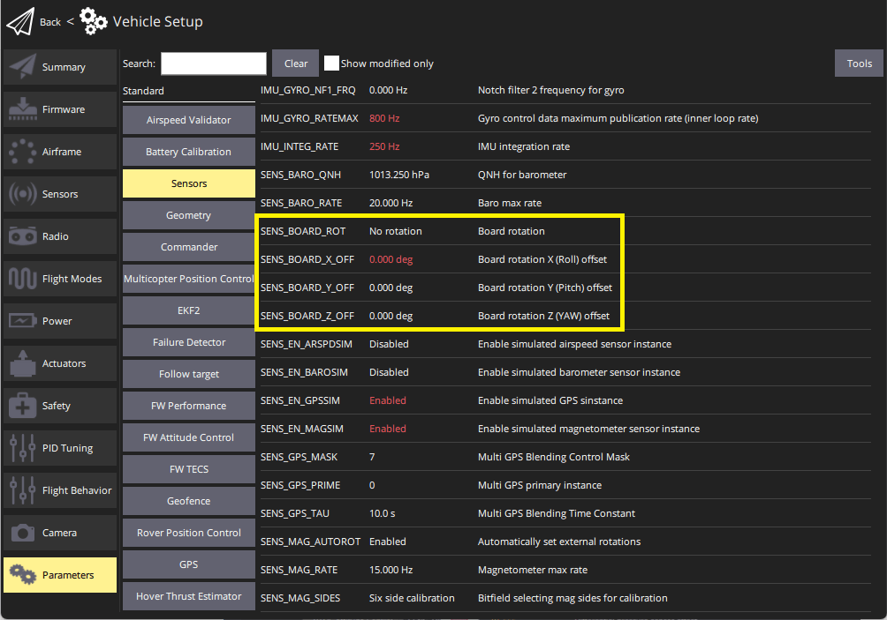

# 고급 비행 콘트롤러 방향 설정

방향과 수평 평형은 센서 보드의 작은 정렬 불량이나 사소한 교정 오류를 수정하기 위하여 매개변수를 사용하여 수동으로 미세 조정 가능합니다.

If there is a persistent drift bias (often seen in multirotors but not limited to them), it is a good strategy to trim it with the help of these fine-tuning offset angle parameters, instead of using the trimmers of your RC Transmitter.
기본 설정은 아래의 지침을 참고하십시오.

:::info
These instructions are "advanced", and not recommended for regular users (the broad tuning is generally sufficient).
:::

## 방향 매개변수 설정

The [SENS_BOARD_ROT](../advanced_config/parameter_reference.md#SENS_BOARD_ROT) parameter defines the rotation of the flight controller board relative to the vehicle frame, while the fine tuning offsets ([SENS_BOARD_X_OFF](../advanced_config/parameter_reference.md#SENS_BOARD_X_OFF), [SENS_BOARD_Y_OFF](../advanced_config/parameter_reference.md#SENS_BOARD_Y_OFF), [SENS_BOARD_Z_OFF](../advanced_config/parameter_reference.md#SENS_BOARD_Z_OFF)) set the rotation of the sensors relative to the board itself.
The fine tuning offsets are added to the `SENS_BOARD_ROT` angle in order to determine the total offset angles for the Yaw, Pitch and Roll orientation of the flight controller.

First perform the normal calibration for [Flight Controller Orientation](../config/flight_controller_orientation.md) and [Level Horizon Calibration](../config/level_horizon_calibration.md) to set the [SENS_BOARD_ROT](../advanced_config/parameter_reference.md#SENS_BOARD_ROT) parameter.

The other parameters can then be set in order to fine-tune the orientation of the IMU sensors relative to the board itself.

You can locate the parameters in QGroundControl as shown below:

1. Open QGroundControl menu: **Settings > Parameters > Sensor Calibration**.
2. The parameters as located in the section as shown below (or you can search for them):

  

## Parameter Summary

- [SENS_BOARD_ROT](../advanced_config/parameter_reference.md#SENS_BOARD_ROT): Rotation of the FMU board relative to the vehicle frame.
- [SENS_BOARD_X_OFF](../advanced_config/parameter_reference.md#SENS_BOARD_X_OFF): Rotation, in degrees, around PX4FMU's X axis or Roll axis.
  Positive angles increase in CCW direction, negative angles increase in CW direction.
- [SENS_BOARD_Y_OFF](../advanced_config/parameter_reference.md#SENS_BOARD_Y_OFF): Rotation, in degrees, around PX4FMU's Y axis or Pitch axis.
  Positive angles increase in CCW direction, negative angles increase in CW direction.
- [SENS_BOARD_Z_OFF](../advanced_config/parameter_reference.md#SENS_BOARD_Z_OFF): Rotation, in degrees, around PX4FMU's Z axis Yaw axis.
  Positive angles increase in CCW direction, negative angles increase in CW direction.
