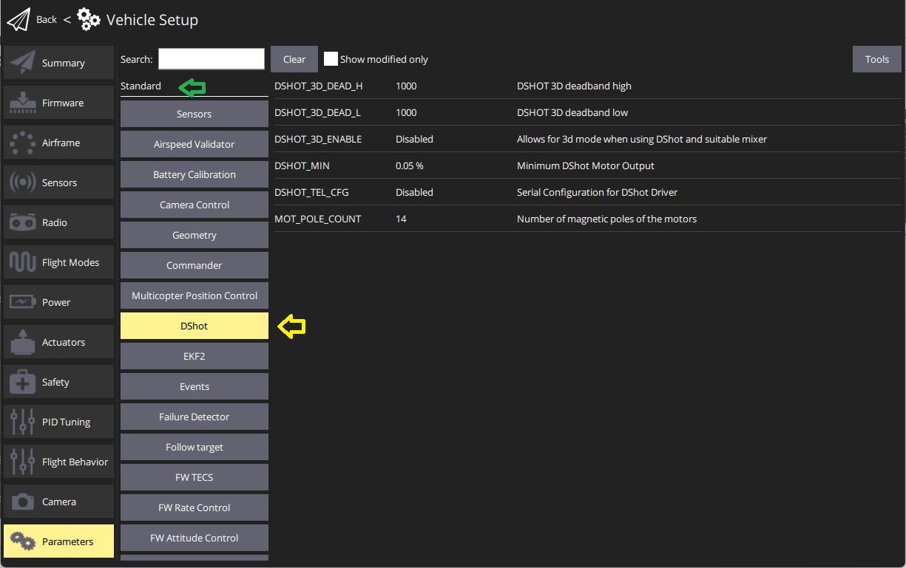
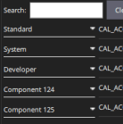

# 매개변수 검색 및 수정

PX4 behaviour can be configured/tuned using [parameters](../advanced_config/parameter_reference.md) (e.g. [Multicopter PID gains](../config_mc/pid_tuning_guide_multicopter.md), calibration information, etc.).

The _QGroundControl Parameters_ screen allows you to find and modify **any** of the parameters associated with the vehicle.
The screen is accessed by clicking the **Q** application icon > **Vehicle Setup**, and then _Parameters_ in the sidebar.

:::info
Most of the more commonly used parameters are more conveniently set using the dedicated setup screens, as described in the [Standard Configuration](../config/index.md) section.
The _Parameters_ screen is needed when modifying less commonly modified parameters - for example while tuning a new vehicle.
:::

:::warning
While some parameters can be changed in flight, this is not recommended (except where explicitly stated in the guide).
:::

## 매개변수 검색

You can search for a parameter by entering a term in the _Search_ field.
This will show you a list of all parameter names and descriptions that contain the entered substring (press **Clear** to reset the search, and use the **Show modified only** checkbox to filter out unchanged parameters).

You can also browse the parameters by type and group by clicking on the buttons to the left (in the image below the _DShot_ group in the _Standard_ parameters is selected).

You can expand/collapse the "type" groupings as shown.
Note that the groups at the bottom named _Component X_ are attached [DroneCAN peripherals](../dronecan/index.md#qgc-cannode-parameter-configuration) ("X" is the node id).
[QGC can set the parameters](../dronecan/index.md#qgc-cannode-parameter-configuration) of these peripherals if they are attached to the Flight Controller when QGC is started.

:::tip
If you can't find an expected parameter, see the [next section](#missing).
:::

## 누락된 매개변수

매개변수는 일반적으로 다른 매개변수에 조건부이거나 펌웨어에 없기 때문에 표시되지 않습니다 (아래 참조).

### 조건부 매개변수

비활성화된 매개변수에 조건부인 경우 표시되지 않을 수 있습니다.

You can usually find out what parameters are conditional by searching the [full parameter reference](../advanced_config/parameter_reference.md) and other documentation.
In particular [serial port configuration parameters](../peripherals/serial_configuration.md) depend on what service is assigned to a serial port.

### 펌웨어에 없는 매개변수

다른 버전의 PX4를 사용 중이거나 관련 모듈이 포함되지 않은 빌드인 경우에는 매개 변수가 펌웨어에 없을 수도 있습니다.

각 PX4 버전에 새로운 매개변수가 추가되고 기존 매개변수가 제거되거나 이름이 변경될 수 있습니다.
You can check whether a parameter _should_ be present by reviewing the [full parameter reference](../advanced_config/parameter_reference.md) for the version you're targeting.
소스 트리 및 릴리스 정보에서 매개 변수를 검색할 수 있습니다.

매개 변수가 펌웨어에 존재하지 않는 경우는 관련 모듈이 포함되지 않은 경우입니다.
This is a problem (in particular) for _FMUv2 firmware_, which omits many modules so that PX4 can fit into the 1MB of available flash.
이 문제를 해결 방법으로 두 가지 옵션이 있습니다.

- Check if you can update your board to run FMUv3 firmware, which includes all modules: [Firmware > FMUv2 Bootloader Update](../config/firmware.md#bootloader)
- If your board can only run FMUv2 firmware you will need to [rebuild PX4](../dev_setup/building_px4.md) with the missing modules enabled.
  You need reconfigure the PX4 firmware itself through make px4_fmuv2_default boardconfig where you can enabled/disable modules.

  ::: info
  You may also need to disable other modules in order to fit the rebuilt firmware into 1MB flash.
  제거할 모듈을 찾으려면 시행 착오가 수반되며, 기체의 요구 사항에 따라 달라집니다.

:::

## 매개변수 변경

매개변수를 변경하려면 그룹 또는 검색 목록에서 매개변수를 클릭하십시오.
그러면 값을 수정하는 사이드 대화 상자가 열립니다 (이 대화 상자는 매개변수에 대한 추가 세부 정보- 변경 사항을 적용하기 위해서는 재부팅하여야 하는 지를 알려줍니다.)

:::info
When you click **Save** the parameter is automatically and silently uploaded to the connected vehicle.
매개변수에 따라 변경된 내용을 적용하기 위해서 비행 컨트롤러 재부팅이 필요합니다.
:::

## 도구

You can select additional options from the **Tools** menu on the top right hand side of the screen.

**Refresh**  Refresh the parameter values by re-requesting all of them from the vehicle.

**Reset all to firmware defaults**  Reset all parameters to their original default values in the firmware.

**Reset to vehicle's configuration defaults**  Reset all parameters to their original default values for the particular selected airfame configuration.

**Load from file / Save to file**  Load parameters from an existing file or save your current parameter settings to a file.

**Clear all RC to Param**  This clears all associations between RC transmitter controls and parameters.
For more information see: [Radio Setup > Param Tuning Channels](../config/radio.md#param-tuning-channels).

**Reboot Vehicle**  Reboot the vehicle (required after changing some parameters).
