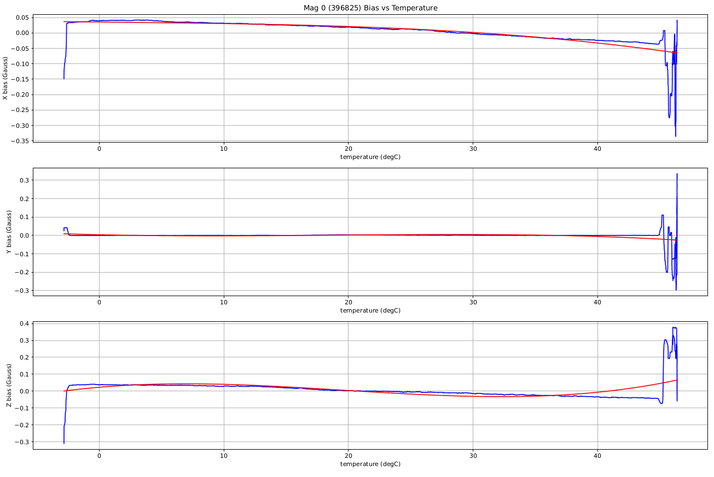
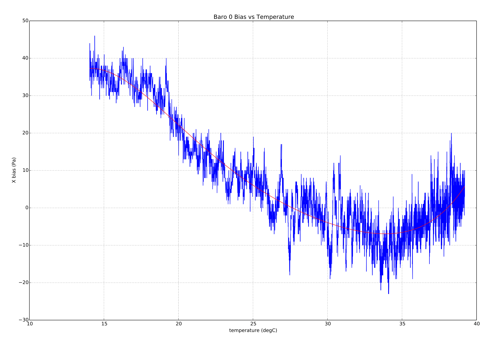

# 온도 교정과 보상

PX4 contains functionality to calibrate and compensate accelerometer, gyro, magnetometer, and barometric pressure sensors for the effect of changing sensor temperature on sensor bias.

This topic details the [test environment](#test_setup) and [calibration procedures](#calibration_procedures).
At the end there is a description of the [implementation](#implementation).

:::info
After thermal calibration, the thermal calibration parameters (`TC_*`) are used for _all_ calibration/compensation of the respective sensors.
Any subsequent standard calibration will therefore update `TC_*` parameters and not the "normal" `SYS_CAL_*` calibration parameters (and in some cases these parameters may be reset).
:::

:::info
Releases up to PX4 v1.14, do not support thermal calibration of the magnetometer.
:::

<a id="test_setup"></a>

## 테스트 설정 / 모범 사례

The [calibration procedures](#calibration_procedures) described in the following sections are ideally run in an _environmental chamber_ (a temperature and humidity controlled environment) as the board is heated from the lowest to the highest operating/calibration temperature.
Before starting the calibration, the board is first _cold soaked_ (cooled to the minimum temperature and allowed to reach equilibrium).

:::info
Active electric heating elements will affect the magnetometer calibration values.
Ensure that heating elements are either inactive or sufficiently far from the sensor to avoid injecting noise into the magnetometer calibration.
:::

냉기의 경우 일반 가정용 냉동고를 사용하여 -20C를 달성할 수 있으며, 상업용 냉동고는 -40C 정도를 달성할 수 있습니다.
The board should be placed in a ziplock/anti-static bag containing a silica packet, with a power lead coming out through a sealed hole.
냉기 후 백을 테스트 환경으로 옮길 수 있으며 동일한 백에서 테스트를 계속할 수 있습니다.

:::info
The bag/silica is to prevent condensation from forming on the board.
:::

상업용 환경 챔버없이 교정을 수행할 수 있습니다.
내부 공기량이 매우 적은 스티로폼 상자를 사용하여 간단한 환경 용기를 만들 수 있습니다.
이렇게하면 자동조종장치가 비교적 빠르게 공기를 자체 가열할 수 있습니다 (상자에 주변 실내 압력과 동일하게 만들 수 있는 작은 구멍이 있지만 여전히 내부를 가열할 수 있어야 합니다).

이러한 종류의 설정을 사용하여 보드를 약 70C까지 가열할 수 있습니다.
일화적인 증거는 많은 일반적인 보드가 부작용 없이 이 온도로 가열될 수 있음을 시사합니다.
확실하지 않은 경우에는, 제조업체에 안전 작동 범위를 확인하십시오.

:::tip
To check the status of the onboard thermal calibration use the MAVlink console (or NuttX console) to check the reported internal temp from the sensor.
:::

<a id="calibration_procedures"></a>

## 교정 절차

PX4는 두 가지 보정 절차를 지원합니다.

- [onboard](#onboard_calibration) - calibration is run on the board itself. 이 방법을 사용하려면 테스트 설정으로 달성할 수있는 온도 상승 양에 대한 지식이 필요합니다.
- [offboard](#offboard_calibration) - compensation parameters are calculated on a development computer based on log information collected during the calibration procedure. 이 방법으로 사용자는 데이터의 품질과 곡선 맞춤을 시각적으로 확인할 수 있습니다.

오프 보드 접근 방식은 더 복잡하고 느리지만, 테스트 설정에 대한 지식이 덜 필요하고 검증하기가 용이합니다.

<a id="onboard_calibration"></a>

### 온보드 교정 절차

온보드 보정은 전적으로 장치에서 실행됩니다. 테스트 설정으로 달성할 수있는 온도 상승 양에 대한 지식이 필요합니다.

온보드 보정을 수행하려면 :

1. 보정전에 프레임 유형이 설정되어 있는 지 확인하십시오. 그렇지 않으면, 보드가 설정시 보정 매개변수가 손실될 수 있습니다.
2. Power the board and set the `SYS_CAL_*` parameters to 1 to enable calibration of the required sensors at the next startup. [^1]
3. Set the [SYS_CAL_TDEL](../advanced_config/parameter_reference.md#SYS_CAL_TDEL) parameter to the number of degrees of temperature rise required for the onboard calibrator to complete. 이 매개변수가 너무 작으면 보정이 일찍 완료되고, 보정 온도 범위가 보드가 완전히 예열될 때 보정하기에 충분하지 않습니다. 매개변수 값이 너무 크면, 온보드 캘리브레이터가 완료되지 않습니다. 이 매개 변수를 설정시 보드 자체 발열로 인한 온도 상승 부분을 허용하여야 합니다. 센서의 온도 상승량을 알 수 없는 경우에는 오프 보드 방식을 사용하는 것이 좋습니다.
4. Set the [SYS_CAL_TMIN](../advanced_config/parameter_reference.md#SYS_CAL_TMIN) parameter to the lowest temperature data that you want the calibrator to use. 이를 통해 교정 최소 온도에 대한 제어를 유지하면서 저온 흡수 시간을 줄이기 위하여 더 낮은 저온 흡수 주변 온도를 사용할 수 있습니다. 센서의 데이터가 이 매개변수로 설정된 값보다 낮으면, 캘리브레이터에서 사용되지 않습니다.
5. Set the [SYS_CAL_TMAX](../advanced_config/parameter_reference.md#SYS_CAL_TMAX) parameter to the highest starting sensor temperature that should be accepted by the calibrator. 시작 온도가 이 매개변수로 설정된 값보다 높으면 오류가 발생하면서 보정이 종료됩니다. Note that if the variation in measured temperature between different sensors exceeds the gap between `SYS_CAL_TMAX` and `SYS_CAL_TMIN`, then it will be impossible for the calibration to start.
6. Remove power and cold soak the board to below the starting temperature specified by the `SYS_CAL_TMIN` parameter. 센서가 안정화 될 수 있도록 보정이 시작되기 전에 시작시 10 초의 지연이 있으며 센서는이 기간 동안 내부적으로 예열됩니다.
7. Keeping the board stationary[^2], apply power and warm to a temperature high enough to achieve the temperature rise specified by the `SYS_CAL_TDEL` parameter. 완료율은 보정중 시스템 콘솔에 표시됩니다. [^3]
8. 보정이 완료되면 전원을 제거하고, 다음 단계를 수행하기 전에 보정 범위 내의 온도로 보드를 냉각합니다.
9. Perform a 6-point accel calibration via the system console using `commander calibrate accel` or via _QGroundControl_. 보드를 처음 설정하는 경우에는 자이로와 자력계 보정도 수행하여야 합니다.
10. 보정중 갑작스러운 오프셋 변경으로 인하여 내비게이션 추정기가 혼란스럽고 일부 매개변수는 다음 시작까지 이를 사용하는 알고리즘에 의해 로드되지 않기 때문에 센서 보정 후 비행하기 전에 항상 보드에 전원을 다시 공급해야합니다.

<a id="offboard_calibration"></a>

### 오프보드 교정 절차

오프보드 보정은 보정 테스트 중에 수집된 데이터를 사용하여 개발 컴퓨터에서 실행됩니다. 이 방법은 데이터 품질과 곡선 맞춤을 시각적으로 제공합니다.

오프보드 보정을 수행하려면 :

1. 보정전에 프레임 유형이 설정되어 있는 지 확인하십시오. 그렇지 않으면, 보드가 설정시 보정 매개변수가 손실될 수 있습니다.

2. Power up the board and set the [TC_A_ENABLE](../advanced_config/parameter_reference.md#TC_A_ENABLE), [TC_B_ENABLE](../advanced_config/parameter_reference.md#TC_B_ENABLE), [TC_G_ENABLE](../advanced_config/parameter_reference.md#TC_G_ENABLE), and [TC_M_ENABLE](../advanced_config/parameter_reference.md#TC_M_ENABLE) parameters to `1`.

3. Set all [CAL_ACC\*](../advanced_config/parameter_reference.md#CAL_ACC0_ID), [CAL_GYRO\*](../advanced_config/parameter_reference.md#CAL_GYRO0_ID), [CAL_MAG\*](../advanced_config/parameter_reference.md#CAL_MAG0_ID), and [CAL_BARO\*](../advanced_config/parameter_reference.md#CAL_BARO0_ID) parameters to defaults.

4. Set the [SDLOG_MODE](../advanced_config/parameter_reference.md#SDLOG_MODE) parameter to 2 to enable logging of data from boot.

5. Set the [SDLOG_PROFILE](../advanced_config/parameter_reference.md#SDLOG_PROFILE) checkbox for _thermal calibration_ (bit 2) to log the raw sensor data required for calibration.

6. 보드를 작동에 필요한 최소 온도로 냉각합니다.

7. Apply power and keeping the board still [^2], warm it slowly to the maximum required operating temperature. [^3]

8. 전원을 제거하고 .ulog 파일을 추출하십시오.

9. Open a terminal window in the **Firmware/Tools** directory and run the python calibration script:

  ```sh
  python process_sensor_caldata.py <full path name to .ulog file>
  ```

  This will generate a **.pdf** file showing the measured data and curve fits for each sensor, and a **.params** file containing the calibration parameters.

10. Power the board, connect _QGroundControl_ and load the parameter from the generated **.params** file onto the board using _QGroundControl_. 매개변수의 갯수가 많이지므로, 로드 시간이 길어질 수 있습니다.

11. After parameters have finished loading, set `SDLOG_MODE` to 1 to re-enable normal logging and remove power.

12. Power the board and perform a normal accelerometer sensor calibration using _QGroundControl_. 보드의 교정 온도 범위 내에서, 이 단계를 수행하여야 합니다. 갑작스러운 오프셋 변경으로 인하여 내비게이션 추정기가 혼란할 수 있고, 일부 매개변수는 다음 시작까지 이를 사용하는 알고리즘에 의해 로드되지 않기 때문에 이 단계 후에는 보드에 전원을 공급하여야 합니다.

<a id="implementation"></a>

## 구현 상세

교정은 내부 온도 범위에서 센서 값의 변화를 측정하고 데이터에 대해 다항식 맞춤을 수행하여 센서 데이터를 수정에 사용하는 계수 세트 (매개변수로 저장됨)를 계산하는 프로세스를 의미합니다. 보상은 온도에 따른 오프셋 변경을 수정하기 위하여 센서 판독 값에서 차감되는 오프셋을 계산하기 위해 내부 온도를 사용하는 프로세스를 의미합니다.

The accelerometer, gyro, and magnetometer sensor offsets are calculated using a 3rd order polynomial, whereas the barometric pressure sensor offset is calculated using a 5th order polynomial. 맞춤 예시는 아래와 같습니다.






### 교정 매개변수 저장

기존 매개변수 시스템 구현에서는 구조체의 각 값을 별도의 항목으로 저장하는 것으로 제한됩니다. To work around this limitation the following logical naming convention is used for the [thermal compensation parameters](../advanced_config/parameter_reference.md#thermal-compensation):

```sh
TC_[type][instance]_[cal_name]_[axis]
```

여기서:

- `type`: is a single character indicating the type of sensor where `A` = accelerometer, `G` = rate gyroscope, `M` = magnetometer, and `B` = barometer.

- `instance`: is an integer 0,1 or 2 allowing for calibration of up to three sensors of the same `type`.

- `cal_name`: is a string identifying the calibration value. 다음의 값을 가질 수 있습니다.

  - `Xn`: Polynomial coefficient where n is the order of the coefficient, e.g. `X3 * (temperature - reference temperature)**3`.
  - `SCL`: scale factor.
  - `TREF`: reference temperature (deg C).
  - `TMIN`: minimum valid temperature (deg C).
  - `TMAX`: maximum valid temperature (deg C).

- `axis`: is an integer 0,1 or 2 indicating that the calibration data is for X,Y or Z axis in the board frame of reference. For the barometric pressure sensor, the `axis` suffix is omitted.

예제:

- [TC_A1_TREF](../advanced_config/parameter_reference.md#TC_A1_TREF) is the reference temperature for the second accelerometer.
- [TC_G0_X3_0](../advanced_config/parameter_reference.md#TC_G0_X3_0) is the `^3` coefficient for the first gyro x-axis.

### 교정 매개 변수 사용법

The correction for thermal offsets (using the calibration parameters) is performed in the [sensors module](../modules/modules_system.md#sensors).
측정 온도에서 기준 온도를 차감하여 다음과 같은 델타 온도를 얻습니다.

```
delta = measured_temperature - reference_temperature
```

그런 다음 델타 온도를 사용하여 오프셋을 계산합니다.

```
offset = X0 + X1*delta + X2*delta**2 + ... + Xn*delta**n
```

오프셋 및 온도 스케일 계수는 아래의 경우의 센서 측정을 수정하는 데 사용됩니다.

```
corrected_measurement = (raw_measurement - offset) * scale_factor
```

If the temperature is above the test range set by the `*_TMIN` and `*_TMAX` parameters, then the measured temperature will be clipped to remain within the limits.

Correction of the accelerometer, gyroscope, magnetometer, or barometer data is enabled by setting [TC_A_ENABLE](../advanced_config/parameter_reference.md#TC_A_ENABLE), [TC_G_ENABLE](../advanced_config/parameter_reference.md#TC_G_ENABLE), [TC_M_ENABLE](../advanced_config/parameter_reference.md#TC_M_ENABLE), or [TC_B_ENABLE](../advanced_config/parameter_reference.md#TC_B_ENABLE) parameters to 1 respectively.

### Compatibility with legacy `CAL_*` parameters and commander controlled calibration

레거시 온도에 구애받지 않는 PX4 속도 자이로 및 가속도계 센서 교정은 커맨더 모듈에 의해 수행되며 오프셋 조정이 포함되며 가속도계 교정의 경우 스케일 팩터 교정 매개변수가 포함됩니다. 오프셋 및 배율 매개변수는 각 센서의 드라이버 내에 적용됩니다. These parameters are found in the [CAL parameter group](../advanced_config/parameter_reference.md#sensor-calibration).

온보드 온도 보정은 이벤트 모듈에 의해 제어되며 센서 결합 uORB 주제가 게시되기 전에 센서 모듈 내에서 보정이 적용됩니다. 즉, 열 보정을 사용하는 경우 열 보정을 수행하기 전에 모든 해당 레거시 오프셋과 배율 매개변수를 기본값 0 및 단일로 설정하여야 합니다. If an on-board temperature calibration is performed, this will be done automatically, however if an offboard calibration is being performed it is important that the legacy `CAL*OFF` and `CAL*SCALE` parameters be reset before calibration data is logged.

If accel thermal compensation has been enabled by setting the `TC_A_ENABLE` parameter to 1, then the commander controlled 6-point accel calibration can still be performed.
However, instead of adjusting the `*OFF` and `*SCALE` parameters in the `CAL` parameter group, these parameters are set to defaults and the thermal compensation `X0` and `SCL` parameters are adjusted instead.

If gyro thermal compensation has been enabled by setting the `TC_G_ENABLE` parameter to 1, then the commander controlled gyro calibration can still be performed, however it will be used to shift the compensation curve up or down by the amount required to zero the angular rate offset. X0 계수를 조정하여 이를 달성합니다.

If magnetometer thermal compensation has been enabled by setting the `TC_M_ENABLE` parameter to 1, then the commander controlled 6-point accel calibration can still be performed.
However, instead of adjusting the `*OFF` and `*SCALE` parameters in the `CAL` parameter group, these parameters are set to defaults and the thermal compensation `X0` and `SCL` parameters are adjusted instead.

### 제한 사항

스케일 팩터는 서로 다른 온도에서 측정이 어려움으로 인하여 온도가 변하지 않는 것으로 간주됩니다. 이는 가속도계 교정의 유용성을 안정적인 스케일 팩터를 가진 센서 모델로 제한합니다. 이론적으로 IMU 내부 온도를 어느 정도 제어 가능한 열 챔버 또는 IMU 히터를 사용하면 일련의 6면 가속도계 교정을 수행하고 오프셋과 배율 계수 모두에 대해 가속도계를 수정할 수 있습니다. 필요한 보드 이동을 교정 알고리즘과 통합하는 것이 복잡하기 때문에 이 기능은 포함되지 않았습니다.

---

[^1]: The [SYS_CAL_ACCEL](../advanced_config/parameter_reference.md#SYS_CAL_ACCEL), [SYS_CAL_BARO](../advanced_config/parameter_reference.md#SYS_CAL_BARO) and [SYS_CAL_GYRO](../advanced_config/parameter_reference.md#SYS_CAL_GYRO) parameters are reset to 0 when the calibration is started.

[^2]: 기압 센서 오프셋을 보정하려면 안정적인 기압 환경이 필요합니다. The air pressure will change slowly due to weather and inside buildings can change rapidly due to external wind fluctuations and HVAC system operation.

[^3]: Care must be taken when warming a cold soaked board to avoid formation of condensation on the board that can cause board damage under some circumstances.
