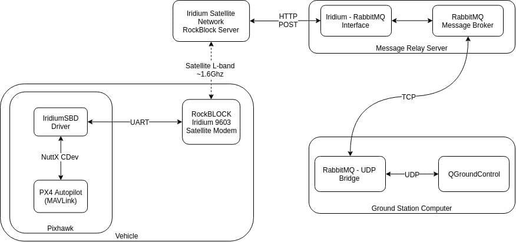
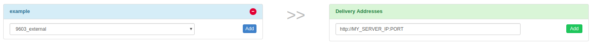
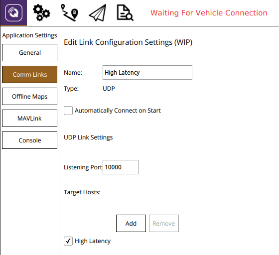
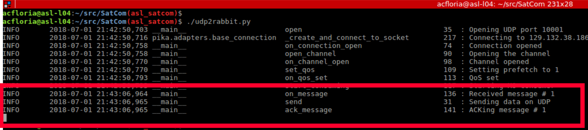
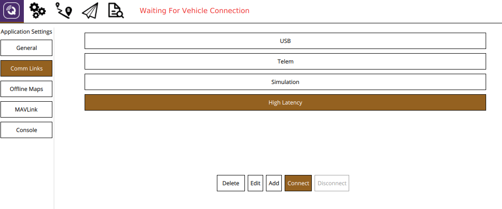
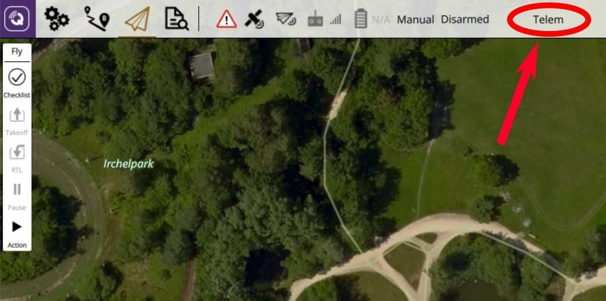
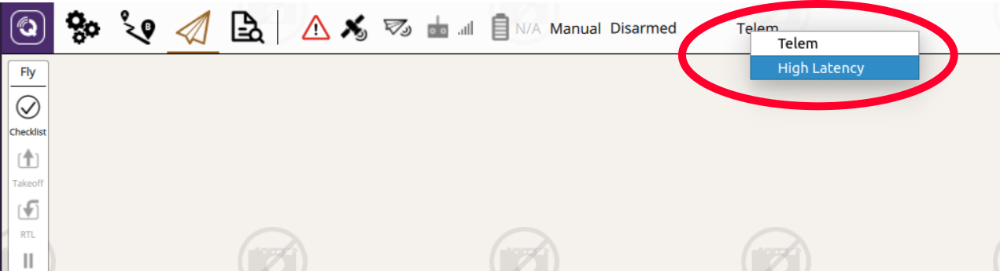

# 이리듐/락블록 위성 통신 시스템

위성통신 시스템은 기체와 지상국간의 광역 통신을 제공합니다.

이리듐 SBD 위성 통신 시스템의 서비스 공급자 RockBlock을 이용한 시스템 설정 방법을 설명합니다.
신호 품질이 우수한 경우에도 10~15초 정도의 시간 지연이 있을 수 있습니다.

## 개요

위성 통신에는 다음의 요소들이 필요합니다.

- A [RockBlock 9603 Iridium Satellite Modem](https://www.iridium.com/products/rock-seven-rockblock-9603/) module connected to a Pixhawk flashed with the PX4 Autopilot.
- Ubuntu Linux를 실행하는 메시지 릴레이 서버
- A ground station computer running _QGroundControl_ on Ubuntu Linux

전체 시스템 아키텍처는 다음과 같습니다.



:::info
The setup was tested with the current release of _QGroundControl_ running on Ubuntu 14.04 and 16.04.

- 다른 지상국 및 운영체제를 사용할 수 있지만, 아직 테스트되지 않았습니다.
- The [RockBlock MK2](https://www.groundcontrol.com/us/product/rockblock-9602-satellite-modem/) module can also be used.
  RockBlock 9603 모듈은 크기가 작고 가볍우면서도 동일한 기능을 제공하기 때문에 권장됩니다.

:::

## 비용

영국 링크 실행 비용은 회선 대여 및 메시지 당 비용으로 구성됩니다.

- 각 모듈을 활성화해야 하며, 가격은 월 10파운드입니다
- Each message transmitted over the system costs one _credit_ per 50 bytes.
  번들 크기에 따라 RockBlock에서 신용당 0.04파운드 0.11파운드에 신용대출을 구입할 수 있습니다.

Refer to the [RockBlock Documentation](https://docs.rockblock.rock7.com/docs) for a detailed explanation of the modules, running costs and _RockBlock_ in general.

## 기체 설정

### 배선

RockBlock 모듈을 Pixhawk의 직렬 포트에 연결합니다.
모듈의 전원 요구 사항으로 인하여 5V에서 최대 0.5A가 필요하므로 고출력 직렬 포트를 통해서만 전원을 공급할 수 있습니다.
사용 가능한 별도의 전원을 사용시에는 Pixhawk와 동일한 접지이어야 합니다.
The details of the [connectors](https://docs.rockblock.rock7.com/docs/connectors) and the [power requirements](https://docs.rockblock.rock7.com/docs/power-supply) can be found in the RockBlock documentation.

### 모듈

모듈은 내부 안테나 또는 SMA 커넥터에 연결된 외부 안테나를 사용할 수 있습니다.
To [switch between the two antennas modes](https://docs.rockblock.rock7.com/docs/switching-rockblock-9603-antenna-mode) the position of a small RF link cable needs to changed.
외부 안테나를 사용하는 경우 모듈 손상을 방지하기 위해 안테나의 전원을 켜기 전에 항상 안테나가 모듈에 연결되어 있는 지 확인하십시오.

모듈의 기본 보드 속도는 19200입니다. However, the PX4 _iridiumsbd_ driver requires a baud rate of 115200 so it needs to be changed using the [AT commands](https://www.groundcontrol.com/en/wp-content/uploads/2022/02/IRDM_ISU_ATCommandReferenceMAN0009_Rev2.0_ATCOMM_Oct2012.pdf).

1. Connect to the module with using a 19200/8-N-1 setting and check if the communication is working using the command: `AT`.
  The response should be: `OK`.

2. baudrate 속도를 변경합니다.

  ```
  AT+IPR=9
  ```

3. 이제 115200/8-N-1 설정을 사용하여 모델에 다시 연결하고 다음을 사용하여 설정을 저장합니다.

  ```
  AT&W0
  ```

이제 이 모듈을 PX4에서 사용할 수 있습니다.

### 소프트웨어

[Configure the serial port](../peripherals/serial_configuration.md) on which the RockBlock module will run using [ISBD_CONFIG](../advanced_config/parameter_reference.md#ISBD_CONFIG).
포트 전송속도는 드라이버에 의해 설정되므로, 추가로 설정하지 않아도 됩니다.

:::info
If the configuration parameter is not available in _QGroundControl_ then you may need to [add the driver to the firmware](../peripherals/serial_configuration.md#parameter_not_in_firmware):

```
drivers/telemetry/iridiumsbd
```

:::

## RockBlock 설정

RockBlock의 첫 번째 모듈을 구입시의 첫 번째 단계는 사용자 계정을 생성하는 것입니다.

Log in to the [account](https://rockblock.rock7.com/Operations) and register the RockBlock module under the `My RockBLOCKs`.
모듈에 대한 라인 렌탈을 활성화하고 계정에서 예상 비행 시간에 충분한 크레딧을 사용할 수 있는 지 확인합니다.
기본 설정을 사용할 경우 분당 1개의 메시지가 차량에서 지상국으로 전송됩니다.

메시지 릴레이 서버에 대한 배달 그룹을 설정하고 모듈을 해당 배달 그룹에 추가합니다.



## 릴레이 서버 설정

릴레이 서버는 Ubuntu 16.04 또는 14.04 버전에서 실행하여야 합니다.

1. 메시지 릴레이로 작동하는 서버에는 고정 IP 주소와  열린 TCP 포트 2개가 있어야 합니다.

  - `5672` for the _RabbitMQ_ message broker (can be changed in the _rabbitmq_ settings)
  - `45679` for the HTTP POST interface (can be changed in the **relay.cfg** file)

2. 필요한 Python 모듈을 설치합니다.

  ```sh
  sudo pip install pika tornado future
  ```

3. Install the `rabbitmq` message broker:

  ```sh
  sudo apt install rabbitmq-server
  ```

4. 브로커 자격 증명을 구성합니다(암호를 PWD로 변경).

  ```sh
  sudo rabbitmqctl add_user iridiumsbd PWD
  sudo rabbitmqctl set_permissions iridiumsbd ".*" ".*" ".*"
  ```

5. Clone the [SatComInfrastructure](https://github.com/acfloria/SatComInfrastructure.git) repository:

  ```sh
  git clone https://github.com/acfloria/SatComInfrastructure.git
  ```

6. Go to the location of the _SatComInfrastructure_ repo and configure the broker's queues:

  ```sh
  ./setup_rabbit.py localhost iridiumsbd PWD
  ```

7. 설정을 확인합니다.

  ```sh
  sudo rabbitmqctl list_queues
  ```

  This should give you a list of 4 queues: `MO`, `MO_LOG`, `MT`, `MT_LOG`

8. Edit the `relay.cfg` configuration file to reflect your settings.

9. 분리 모드에서 릴레이 스크립트를 실행합니다.

  ```sh
  screen -dm bash -c 'cd SatcomInfrastructure/; ./relay.py
  ```

기타 지침은 다음과 같습니다.

- 화면에서 분리:

  ```sh
  ctrl+a d
  ```

- 스크립트 실행 중지:

  ```sh
  ctrl+a :quit
  ```

- Reattach to the screen:

  ```sh
  screen -dr
  ```

## 지상국 컴퓨터

지상국을 설정 방법:

1. 필요한 Python 모듈을 설치합니다.

  ```sh
  sudo pip install pika tornado future
  ```

2. SatComInfrarastructure 저장소 복제:

  ```sh
  git clone https://github.com/acfloria/SatComInfrastructure.git
  ```

3. Edit the **udp2rabbit.cfg** configuration file to reflect your settings.

4. [Install _QGroundControl_](https://docs.qgroundcontrol.com/master/en/qgc-user-guide/getting_started/download_and_install.html) (daily build).

5. 다음 매개 변수를 사용하여 QGC에서 UDP 연결을 추가합니다.

  - 접속 포트: 10000
  - 대상 호스트: 127.0.0.1:10001
  - 높은 지연 시간: 확인됨

  

### 검증

1. Open a terminal on the ground station computer and change to the location of the _SatComInfrastructure_ repository.
  Then start the **udp2rabbit.py** script:

  ```sh
  ./udp2rabbit.py
  ```

2. Send a test message from [RockBlock Account](https://rockblock.rock7.com/Operations) to the created delivery group in the `Test Delivery Groups` tab.

If in the terminal where the `udp2rabbit.py` script is running within a couple of seconds the acknowledge for a message can be observed, then the RockBlock delivery group, the relay server and the udp2rabbit script are set up correctly:



## 시스템 실행

1. Start _QGroundControl_.
  먼저 높은 지연 시간 링크를 수동으로 연결한 다음, 일반 텔레메트리 링크를 연결합니다.

  

2. Open a terminal on the ground station computer and change to the location of the _SatComInfrastructure_ repository.
  Then start the **udp2rabbit.py** script:

  ```sh
  ./udp2rabbit.py
  ```

3. 기체의 전원을 켭니다.

4. Wait until the first `HIGH_LATENCY2` message is received on QGC.
  This can be checked either using the _MAVLink Inspector_ widget or on the toolbar with the _LinkIndicator_.
  If more than one link is connected to the active vehicle the _LinkIndicator_ shows all of them by clicking on the name of the shown link:

  

  링크 표시기는 항상 우선 순위 링크의 이름을 표시합니다.

5. 이제 위성 통신 시스템을 사용할 준비가 되었습니다.우선 순위 링크(명령 전송 링크)는 다음 방법으로 결정됩니다.

  - 사용자가 링크를 명령하지 않으면, 지연 시간이 큰 링크보다 일반적인 텔레메트리 링크가 선호됩니다.
  - 기체가 시동을 켜고 텔레메트리 링크가 끊어지면(특정 시간 동안 MAVLink 메시지가 수신되지 않을 경우), 오토파일럿과 QGC는 일반 텔레메트리에서 긴 대기 시간 링크로 되돌아갑니다.
    텔레메트리 링크가 복구되는 즉시 QGC와 자동 조종기가 다시 이 링크로 전환됩니다.
  - The user can select a priority link over the `LinkIndicator` on the toolbar.
    이 링크가 활성화되어 있거나 사용자가 다른 우선 순위 링크를 선택하면 이 링크는 우선 순위 링크로 유지됩니다.

    

## 문제 해결

- 비행기에서 위성 통신 메시지를 수신하지만 명령을 전송할 수 없습니다(차량이 반응하지 않음).
  - 릴레이 서버의 설정을 확인하고 해당 설정이 올바른지 확인합니다(특히 IMEI).

- 비행기의 위성 통신 메시지는 지상국에 도착하지 않습니다.

  - Check using the system console if the _iridiumsbd_ driver started and if it did that a signal from any satellite is received by the module:

    ```sh
    iridiumsbd status
    ```

  - Make sure using the verification steps from above that the relay server, the delivery group and the `udp2rabbit.py` script are set up correctly.

  - 링크가 연결되어 있고 설정이 정확한 지  확인하십시오.

- IridiumSBD 드라이버가 시작되지 않음:

  - 기체를 재부팅합니다.
    If that helps increase the sleep time in the `extras.txt` before the driver is started.
    그래도 Pixhawk와 모듈이 동일한 접지 레벨을 유지하는지 확인할 수 있습니다. 모듈의 보레이트가 115200으로 설정되어 있는 지 확인하십시오.

- 지상에서 첫 번째 메시지가 수신되지만, 기체가 비행하는 즉시 메시지를 전송할 수 없거나 대기 시간이 훨씬 더 길어집니다(분 단위).
  - 비행 후 신호 품질을 확인합니다.
    비행 중에 감소하는 경우 내부 안테나 보다 외부 안테나를 사용하는 것이 좋습니다.
    이미 외부 안테나를 전자 장치 또는 신호를 방해 할 수있는 모든 것에서 최대한 멀리 이동하십시오.
    또한 안테나가 손상되지 않았는 지 확인합니다.
