# Vision Target Estimator Deep Dive

<Badge type="tip" text="PX4 v1.18" /> <Badge type="warning" text="Experimental" />

This guide expands on the [Vision Target Estimator module overview](../advanced_features/vision_target_estimator.md) and targets advanced users who want to tune, extend, and debug the estimator in detail.
It documents the system architecture of the Vision Target Estimator, and outlines workflows for log analysis and sensor integration.

## Table of Contents

[[toc]]

## System Architecture

The module has three layers: a scheduler, a task layer, and two independent estimators.

- `VisionTargetEst` (`src/modules/vision_target_estimator/VisionTargetEst.cpp`) owns the work-queue task.
  Its main loop subscribes to vehicle inputs (`vehicle_attitude`, `vehicle_acceleration`, `vehicle_local_position`, `vehicle_gps_position`, and angular rates).
  It downsamples acceleration, publishes [`vte_input`](../msg_docs/VteInput.md), and forwards the samples to the position and orientation filters every 20 ms (50 Hz).
  It also holds the task registry and the generic logic for task dispatch, estimator start/stop, idle scheduling, and timeout handling.
- `tasks/VteTask.h` defines the task interface and the `VTE_TASK_MASK` bit constants.
  A task owns all state that only exists for one VTE use-case, such as subscriptions to external status topics, cached mission setpoints, and end-of-task conditions.
  `VisionTargetEst` polls each enabled task, then activates the first task in the registry whose readiness conditions are satisfied.
  - `tasks/PrecLandTask.cpp` implements the precision-landing task.
    It monitors [`prec_land_status`](../msg_docs/PrecLandStatus.md), caches the land waypoint from `navigator_mission_item` (with `position_setpoint_triplet` as a fallback), and completes when precland stops or touchdown is detected.
- `VTEPosition` (`Position/VTEPosition.cpp`) owns the three per-axis position filters.
  It maintains observation buffers, enforces timeouts, and publishes `landing_target_pose`, [`vte_position`](../msg_docs/VtePosition.md), and every `vte_aid_*` innovation topic.
  The state vector is $[r, v^{uav}, b]$ (relative position, vehicle velocity, GNSS-vs-vision bias); see [Dynamic models](../advanced_features/vision_target_estimator.md#dynamic-models).
  - It also runs the bias-initialization state machine described in [Bias Initialization Design](#bias-initialization-design).
  - The math is delegated to `Position/KF_position.cpp`, which calls the SymForce-generated functions documented in [SymForce-generated derivations](#symforce-generated-derivations).
  - Helper unions `SensorFusionMaskU` and `ObsValidMaskU` mirror the bit layout of [`VTE_AID_MASK`](../advanced_features/vision_target_estimator.md#sensor-fusion-selection), making it straightforward to add new observation types ([Adding new measurement sources](#adding-new-measurement-sources)).
- `VTEOrientation` (`Orientation/VTEOrientation.cpp`) handles yaw fusion with the same measurement staging helpers as the position filter, on a smaller $[\psi, \dot\psi]$ state.
  The math lives in `Orientation/KF_orientation.cpp`.
  Prediction and the transition matrix are SymForce-generated, while innovation and correction stay hand-written so yaw can be wrapped to $[-\pi, \pi]$.
- Shared utilities live in `common.h` and `VTEOosm.h` (templated OOSM manager, see [OOSM Implementation](#oosm-implementation)).

```text
VisionTargetEst (work item, 50 Hz)
├── tasks/                       priority-ordered registry, scheduler picks the first ready task
│   ├── VteTask                  task interface + VTE_TASK_MASK bits
│   └── PrecLandTask             precision-landing activation/exit logic
├── VTEPosition                  per-axis filters, observation buffers, vte_* topic publication
│   ├── KF_position              1D Kalman math (SymForce-generated predict/correct)
│   └── bias init state machine  reconciles GNSS-vs-vision bias before fusion
├── VTEOrientation               yaw fusion
│   └── KF_orientation           SymForce-generated predict, hand-written correct with yaw wrap
└── shared utilities             common.h, VTEOosm.h (templated OOSM history buffer)
```

## Filter Observability

Some states are observed directly by a sensor; others are inferred through the prediction model.
The indirectly observed states are the weak spots of the filter: when their driving sensor drops out, errors integrate into the rest of the state.

In the position state $[r, v^{uav}, b]$, vision measures $r$ directly but never touches $v^{uav}$.
Vehicle velocity is only constrained through the position prediction.
While vision keeps arriving, that indirect coupling keeps $v^{uav}$ close to truth.
The moment vision drops out, any residual in $v^{uav}$ integrates straight into `vte_position.rel_pos` and the filter drifts.

The same applies to the moving-target velocity $v^{t}$.
Without a direct observation, the filter infers it from successive position fixes, which is noisier and breaks down during dropouts.

**Recommendation:** enable a direct velocity observation when available.

- Vehicle: vehicle GNSS velocity ([VTE_AID_MASK](../advanced_features/vision_target_estimator.md#sensor-fusion-selection) bit 1).
- Moving target: target GNSS velocity ([VTE_AID_MASK](../advanced_features/vision_target_estimator.md#sensor-fusion-selection) bit 4).

See [Vision dropout behaviour](#vision-dropout-behaviour) for a worked plot of both cases.

## Bias Initialization Design

The bias state exists because the absolute target reference and the relative vision reference do not necessarily agree:

- If [`VTE_AID_MASK`](../advanced_features/vision_target_estimator.md#sensor-fusion-selection) uses the mission landing point, that waypoint can be offset from the real pad.
- If [`VTE_AID_MASK`](../advanced_features/vision_target_estimator.md#sensor-fusion-selection) uses target GNSS, the target receiver can still be off by metres when it is not RTK-grade.
- Vision measures the target relative to the vehicle, so it can be locally accurate even when the absolute GNSS reference is biased.

VTE therefore models GNSS-like position observations as `z = r + b` once the bias becomes observable.
This lets corrected GNSS continue to point to the target when vision drops out.

Naive bias initialization is not robust:

- **Zero bias** assumes GNSS and vision already agree.
  If the real offset is large, the first vision updates can look like outliers and get rejected.
- **Instantaneous bias from the first sample** trusts a single early vision frame.
  If that frame is noisy and vision is lost soon after, the estimator can continue descending with the wrong corrected GNSS offset.

The implementation therefore uses two different bias-initialization paths depending on which position source is trusted first.

Open the box below if you are debugging a bias that fails to converge, jumps unexpectedly, or stays at zero in cases where you expected averaging to kick in.

:::details
Click to view the bias initialization state machine

#### Prerequisites and Startup Conditions

- **Before the filter starts.** A recent UAV velocity estimate (local or GNSS) must be available.
  It seeds the $v^{uav}$ state and lets the bias logic align GNSS and vision in time.
- **Sampling the raw bias.** The raw bias is always evaluated at the vision timestamp `t_vision`.
  If the most recent GNSS-relative sample is older than vision, it is propagated forward using the UAV velocity.
  The bias logic therefore uses `pos_rel_gnss(t_vision)`, not the stale stored value.

#### Initialization Paths: GNSS-First vs Vision-First

- **Why the behaviour is asymmetric.**
  - If GNSS is already driving the position state, feeding in raw vision before the bias is ready would mix two frames that can differ by metres.That is why VTE delays vision in the GNSS-first case.
  - If vision is already driving the position state, the safer choice is the opposite: keep the trusted vision-based $r$ and solve for the bias immediately when GNSS and vision overlap for the first time.
- **Immediate activation (vision-first).** When the estimator is already vision-referenced, VTE computes `b = pos_rel_gnss(t_vision) - pos_rel_vision` and keeps `r = pos_rel_vision`.
  The same immediate-activation path is also used when [VTE_BIA_AVG_TOUT](../advanced_config/parameter_reference.md#VTE_BIA_AVG_TOUT) is 0, even if GNSS was active first.
- **Averaging (GNSS-first).** When GNSS is active first and averaging is enabled, vision updates the LPF at the vision rate while GNSS remains the active position source.
  The raw sample is still `pos_rel_gnss(t_vision) - pos_rel_vision`, so the rate mismatch between GNSS and vision does not force the estimator to discard intermediate vision frames.

#### Filter Convergence and Exit Criteria

- **Exit condition.** The LPF is accepted after 5 consecutive raw-bias delta norms stay below [VTE_BIA_AVG_THR](../advanced_config/parameter_reference.md#VTE_BIA_AVG_THR) and at least `2 * tau` has elapsed (`tau = 0.3 s`).
  If neither condition fires, the LPF is also accepted when [VTE_BIA_AVG_TOUT](../advanced_config/parameter_reference.md#VTE_BIA_AVG_TOUT) expires.
- **Activation after averaging.** Once the LPF is accepted, the state resets via `activateBiasEstimate()`.
  This sets `r = pos_rel_gnss(t_vision) - b_filtered` and `b = b_filtered`.

#### Fallbacks and Recovery

- **Stale-GNSS fallback.** If GNSS goes stale during averaging, `selectBiasGnssSample()` fails and VTE intentionally switches to the current vision position while keeping the current filtered bias.
  This is the only bias-initialization branch that does not use `pos_rel_gnss(t_vision)`, because no valid GNSS sample exists anymore.
- **No re-initialization after recovery.** Once the bias is set for the current estimator run, a temporary vision dropout does not restart the averaging phase.
  When vision returns, the existing bias stays active.

:::

For the runtime tuning of the bias state (how aggressively it follows new observations once activated), see [Tuning the bias state](#tuning-the-bias-state) in the next section.

## Balancing Process and Observation Noise

Two distinct noise tunings shape the filter's behaviour, and the right trade-off has to be found on both:

- The **observation noise** of each sensor sets how much that sensor is trusted relative to others within a single fusion step.
  Larger reported variance means a smaller Kalman gain and less influence on the state.
- The **process noise** of the prediction model sets how much the prediction is trusted between updates.
  A stiffer prediction (smaller process noise) shrinks the Kalman gain because the predicted covariance $P$ is smaller, so each observation moves the state less.

The two interact through the Kalman gain $K \approx P / (P + R)$, where $P$ is the predicted state variance (grown by the process noise between updates) and $R$ is the observation variance the sensor reports for this sample.
It is therefore important to have a realistic $R$ from each sensor.
For vision this is the responsibility of the vision pipeline running on the onboard companion: it must publish a `cov_rel_pos` that reflects the marker accuracy at the current range and lighting.
For GNSS it is up to the receiver to publish a realistic `eph`/`epv` and velocity accuracy.
The `VTE_*_NOISE` parameters do not improve $R$: they only act as a safety floor when a sensor under-reports its variance.

Pushing either knob to an extreme produces the same failure mode:

- $P$ much larger than $R$ (loose prediction, or a sensor under-reporting its noise without a floor to catch it) $\rightarrow K \approx 1 \rightarrow$ the state chases every sample.
- $P$ much smaller than $R$ (stiff prediction, or a noise floor set so high it overrides good sensor variance) $\rightarrow K \approx 0 \rightarrow$ the filter under-reacts to legitimate corrections.

Tune them together so the resulting gain produces the response speed and noise rejection you actually want.
Each step toward a smoother state is also a step toward slower response to legitimate motion.
After every change, watch `vte_aid_*.innovation`: a healthy filter has zero-mean white-noise innovations, while a growing mean or persistent offset means the response has been damped too much.

### Between Observation Sources

How much the filter trusts vision relative to GNSS at any given moment is decided by the per-sample **observation variance** each sensor reports ([`fiducial_marker_pos_report.cov_rel_pos`](../msg_docs/FiducialMarkerPosReport.md), `sensor_gps.eph`, `sensor_gps.epv`, [`target_gnss.s_acc_m_s`](../msg_docs/TargetGnss.md)).
The bias-initialization section above explained how the two _frames_ are reconciled.
This part covers how trust is split between sources within a single fusion step.

To inspect this in flight, overlay `vte_aid_fiducial_marker.observation_variance` and `vte_aid_gps_pos_target.observation_variance` (or `vte_aid_gps_pos_mission`) on a typical descent and compare each curve to the accuracy you actually expect from the sensor at that operating distance.
A healthy plot shows that the two sources are roughly equal, with `vte_position.cov_rel_pos` staying below both, as shown in the [Nominal Behaviour dashboard](#nominal-behaviour).

### Observation Noise Floors

When a sensor under-reports its own noise, the filter ends up trusting it more than it should.
Each fused source has a noise-floor parameter that imposes a lower bound on its standard deviation, so the effective observation variance used for fusion is:

$$
R_{\text{eff}} = \max\bigl(R_{\text{reported}},\ \text{VTE\_*\_NOISE}^2\bigr).
$$

| 매개변수                                                                                                                                        | 단위  | 기본값                  | Applies to                                            |
| ------------------------------------------------------------------------------------------------------------------------------------------- | --- | -------------------- | ----------------------------------------------------- |
| [VTE_EVP_NOISE](../advanced_config/parameter_reference.md#VTE_EVP_NOISE)                          | m   | 0.10 | Vision relative position                              |
| [VTE_EVA_NOISE](../advanced_config/parameter_reference.md#VTE_EVA_NOISE)                          | rad | 0.07 | Vision yaw                                            |
| [VTE_GPS_P_NOISE](../advanced_config/parameter_reference.md#VTE_GPS_P_NOISE) | m   | 0.50 | GNSS position (target and mission) |
| [VTE_GPS_V_NOISE](../advanced_config/parameter_reference.md#VTE_GPS_V_NOISE) | m/s | 0.30 | UAV and target GNSS velocity                          |

These are **standard deviations**, not variances.
The estimator squares them internally before clamping.
The floor only matters when the sensor under-reports its own noise: if the reported variance already sits above the floor, the parameter has no effect.

Two common mis-tunes:

1. **Floor too tight** (for example `VTE_EVP_NOISE = 0.01` for a marker pipeline that is really 10 cm accurate): the filter is told to trust every sample to within 1 cm, so legitimate per-sample noise looks like outliers, the [VTE_POS_NIS_THRE](../advanced_config/parameter_reference.md#VTE_POS_NIS_THRE) gate fires often, and the few samples that pass cause state overshoots.
2. **Floor too loose** (for example `VTE_GPS_P_NOISE = 5.0` with an RTK receiver reporting 3 cm `eph`): the floor wins and the filter throws away the receiver's confidence.
   `vte_position.cov_rel_pos` stays close to the prediction variance and the bias is never refined during descent.

### Process Noise: Variance Rates

All process-noise parameters are continuous-time **power spectral densities** (PSDs).
A PSD describes the strength of a continuous white-noise process: it is the variance the noise injects per second into the state it directly drives, with units chosen so that `PSD × time` is the variance of that state.
See [Spectral density (Wikipedia)](https://en.wikipedia.org/wiki/Spectral_density) for background.

| 매개변수                                                                                                                                        | Drives directly                        | Unit                                 | What it represents                                                                                            |
| ------------------------------------------------------------------------------------------------------------------------------------------- | -------------------------------------- | ------------------------------------ | ------------------------------------------------------------------------------------------------------------- |
| [VTE_BIAS_UNC](../advanced_config/parameter_reference.md#VTE_BIAS_UNC)                            | `bias` (m)          | m²/s                                 | PSD of the bias random walk                                                                                   |
| [VTE_ACC_D_UNC](../advanced_config/parameter_reference.md#VTE_ACC_D_UNC)     | `vel_uav` (m/s)     | m²/s³                                | PSD of white acceleration noise on the UAV acceleration input                                                 |
| [VTE_YAW_ACC_UNC](../advanced_config/parameter_reference.md#VTE_YAW_ACC_UNC) | `yaw_rate` (rad/s)  | rad²/s³                              | PSD of white yaw-acceleration noise                                                                           |
| [VTE_ACC_T_UNC](../advanced_config/parameter_reference.md#VTE_ACC_T_UNC)     | `acc_target` (m/s²) | (m/s²)²/s = m²/s⁵ | PSD of white jerk noise driving the target-acceleration random walk (moving-target builds) |

The unit always follows the same rule: it is `[unit of the directly driven state]² / s`.
The bias is in metres, so its PSD is `m²/s`.
The UAV velocity is in m/s, so the acceleration PSD that drives it is `(m/s)²/s = m²/s³`, and so on.
The YAML may list the same unit in two equivalent forms (for example `m²/s³` and `(m/s²)²/Hz`, since `Hz = 1/s`), but both refer to the same physical quantity.

:::info
**Variance-rate rule (key formula).**
A spectral density is _not_ a velocity.
Each predict step adds `spectral_density * dt` to the variance of the directly driven state.
The 1-sigma allowance therefore grows with the _square root_ of elapsed time:

$$
\sigma(t) = \sqrt{\text{spectral density} \cdot t}
$$

The tuning sections below reference this rule directly.
Set the PSD so the resulting $\sigma(t)$ over a representative interval matches the realistic physical uncertainty.
:::

Because the noise is scaled by `dt` at every predict step, the value is independent of the filter update rate.
Running the filter at 25 Hz, 50 Hz, or 100 Hz produces the same long-term allowance, so no retuning is required if the rate changes.

<a id="dynamic-model-process-noise"></a>

:::details
Click to view the dynamic-model for the process noise

This section covers the math behind the process-noise parameters.
You only need it if you want to understand how the spectral densities propagate through the prediction model.

#### Process Noise Computation {#process-noise-computation}

The deterministic prediction uses the measured inputs to advance the mean state.
Process noise describes how wrong that prediction might be.
For the static-target position filter, the per-axis continuous-time model can be read as:

$$
\begin{aligned}
\dot r &= -v^{uav} \\
\dot v^{uav} &= a^{uav}_{meas} + w_a \\
\dot b &= w_b
\end{aligned}
$$

여기서:

- $r$ is target position relative to the vehicle.
- $v^{uav}$ is the vehicle velocity.
- $a^{uav}_{meas}$ is the NED acceleration sample from `vte_input.acc_xyz`.
- $w_a$ is unknown acceleration error on top of the measured acceleration.
- $w_b$ is unknown GNSS/vision bias drift.

The key intuition: [VTE_ACC_D_UNC](../advanced_config/parameter_reference.md#VTE_ACC_D_UNC) is an acceleration-error spectral density, but that error is applied to the **derivative of velocity**.
Position is affected one integration later because relative position depends on vehicle velocity.

Over one prediction interval $dt$, a white acceleration-error spectral density $q_a = $ `VTE_ACC_D_UNC` contributes:

$$
\Delta\,\text{var}(v^{uav}) = q_a\,dt, \qquad \Delta\,\text{var}(r) = q_a\,\frac{dt^3}{3}, \qquad \Delta\,\text{cov}(r, v^{uav}) = -q_a\,\frac{dt^2}{2},
$$

The negative covariance term is expected: in the static-target model, a positive vehicle-velocity error makes the predicted relative position decrease.

Bias noise is simpler.
Bias does not feed any other state in the prediction model, so [VTE_BIAS_UNC](../advanced_config/parameter_reference.md#VTE_BIAS_UNC) contributes only:

$$
\Delta\,\text{var}(b) = q_b\,dt.
$$

In moving-target builds, [VTE_ACC_T_UNC](../advanced_config/parameter_reference.md#VTE_ACC_T_UNC) is target jerk noise.
It drives the derivative of target acceleration:

$$
\dot a^t = w_j.
$$

The target acceleration noise then reaches target velocity after one integration and relative position after two integrations.

The implementation integrates the full continuous-time noise response, including cross-covariances, and SymForce writes the closed-form result into `Position/vtest_derivation/generated/predictCov.h`.
The standard continuous-to-discrete expression is

$$
Q = \int_{0}^{dt} G(\tau)\, Q_c\, G^T(\tau)\, d\tau,
$$

but users normally do not need to manipulate this formula.
Practically, tune the spectral densities using the [variance-rate rule](#process-noise-variance-rates).
The yaw filter uses the same idea for [VTE_YAW_ACC_UNC](../advanced_config/parameter_reference.md#VTE_YAW_ACC_UNC): yaw-acceleration error drives yaw rate first, and yaw angle after one integration.

#### Assumptions

- **Gaussian white noise.** Unknown physical disturbances are modelled as zero-mean continuous-time Gaussian white noise.
  For the UAV, that means unmeasured forces (gusts, motor jitter not captured by the accelerometer) enter as white acceleration noise on top of the measured input.
  For a moving target, target jerk is modelled as a white-noise driver, so target acceleration evolves as a Brownian-motion random walk.
- **Random-walk bias.** The GNSS-to-vision bias is modelled as a pure random walk.
  The offset between the absolute GNSS frame and the relative vision frame drifts slowly and has no deterministic high-frequency dynamics.
- **Axis decoupling.** The three NED axes are integrated independently.
  Cross-axis aerodynamic coupling exists in reality, but ignoring it keeps each filter one-dimensional with negligible loss in precision-landing accuracy.

:::

### When the State Follows Per-Sample Jitter

If the state in your logs follows the per-sample jitter rather than the underlying trend (the [Smoothing Through Bounded Noise](#smoothing-through-bounded-noise) plot shows the healthy case), two knobs make the output smoother:

1. **Raise the observation-noise floors** [VTE_EVP_NOISE](../advanced_config/parameter_reference.md#VTE_EVP_NOISE) (vision), [VTE_EVA_NOISE](../advanced_config/parameter_reference.md#VTE_EVA_NOISE) (vision yaw), or [VTE_GPS_P_NOISE](../advanced_config/parameter_reference.md#VTE_GPS_P_NOISE) (GNSS) so the effective per-sample variance matches the actual sensor noise.
   This is the right fix whenever the sensor under-reports its own accuracy.
   See [Observation Noise Floors](#observation-noise-floors) for the clamping mechanism and typical mis-tunes.
2. **Reduce the prediction process noise** [VTE_ACC_D_UNC](../advanced_config/parameter_reference.md#VTE_ACC_D_UNC), and for moving targets [VTE_ACC_T_UNC](../advanced_config/parameter_reference.md#VTE_ACC_T_UNC), only when the predicted state is already unbiased and the problem is excessive responsiveness to zero-mean jitter.
   If GNSS bias drift is contributing to the jitter, the same applies to [VTE_BIAS_UNC](../advanced_config/parameter_reference.md#VTE_BIAS_UNC); see [Tuning the bias state](#tuning-the-bias-state) for worked examples.
   Set the prediction noise too low and the filter lags real motion or rejects legitimate dynamics.

:::info
**The chi-squared gate does not fix jitter.**
Tightening [VTE_POS_NIS_THRE](../advanced_config/parameter_reference.md#VTE_POS_NIS_THRE) or [VTE_YAW_NIS_THRE](../advanced_config/parameter_reference.md#VTE_YAW_NIS_THRE) only helps when the noise mixes in-distribution jitter with occasional outliers.
Against uniformly bounded noise every sample stays inside the gate, so lowering the threshold just throws good data away.
See [Outlier Detection](#outlier-detection).
:::

### Outlier Detection

The chi-squared gate rejects measurements that disagree strongly with the filter prediction.
It uses `test_ratio = innov² / S` with $S = H P H^T + R$, where $R$ is the observation variance.
A sample is rejected when `test_ratio` exceeds [VTE_POS_NIS_THRE](../advanced_config/parameter_reference.md#VTE_POS_NIS_THRE) (or [VTE_YAW_NIS_THRE](../advanced_config/parameter_reference.md#VTE_YAW_NIS_THRE) for yaw), and the rejection appears as `STATUS_REJECT_NIS` on the corresponding `vte_aid_*` topic.

How the gate reacts depends on $R$:

- If $R$ is under-reported, even small innovations exceed the gate and healthy data is rejected.
- If $R$ is over-reported, even corrupted samples pass the gate and pollute the state.

When `STATUS_REJECT_NIS` fires repeatedly, the first fix is the noise floor, not the threshold.
Raise the floor on the rejecting sensor ([VTE_EVP_NOISE](../advanced_config/parameter_reference.md#VTE_EVP_NOISE) / [VTE_EVA_NOISE](../advanced_config/parameter_reference.md#VTE_EVA_NOISE) for vision, [VTE_GPS_P_NOISE](../advanced_config/parameter_reference.md#VTE_GPS_P_NOISE) / [VTE_GPS_V_NOISE](../advanced_config/parameter_reference.md#VTE_GPS_V_NOISE) for GNSS) so it matches the actual sensor accuracy, and compare against `observation_variance` on the corresponding `vte_aid_*` topic.
Adjust [VTE_POS_NIS_THRE](../advanced_config/parameter_reference.md#VTE_POS_NIS_THRE) and [VTE_YAW_NIS_THRE](../advanced_config/parameter_reference.md#VTE_YAW_NIS_THRE) only once the floors are realistic, and only when a mix of legitimate samples and occasional outliers remains.
The default 3.84 corresponds to a 5 % false-rejection rate: larger values are more permissive, smaller ones reject more aggressively.

### Noise parameter tuning

Open the worked examples below for per-parameter 1-sigma drift tables, starter values derived from log signals, and symptom/fix tables for the UAV-acceleration, bias, and yaw-rate process-noise parameters.

:::details
Click to view parameter tuning examples

#### Tuning the UAV Acceleration Process Noise

[VTE_ACC_D_UNC](../advanced_config/parameter_reference.md#VTE_ACC_D_UNC) (unit: m²/s³, default 0.02) is the PSD of un-modelled UAV acceleration that drives the `vel_uav` state.
Larger values let measurements pull the state harder between updates.
Smaller values lock the state to the IMU-driven prediction.

Applying the [variance-rate rule](#process-noise-variance-rates) to `VTE_ACC_D_UNC` gives the 1-sigma velocity allowance the filter accumulates between updates:

| Elapsed time          | `VTE_ACC_D_UNC = 0.02` (default)             | `VTE_ACC_D_UNC = 0.2`                                         | `VTE_ACC_D_UNC = 1.0`                                        |
| --------------------- | --------------------------------------------------------------- | ------------------------------------------------------------- | ------------------------------------------------------------ |
| 0.1 s | $\sqrt{0.002}\approx 0.045$ m/s | $\sqrt{0.02}\approx 0.14$ m/s | $\sqrt{0.1}\approx 0.32$ m/s |
| 1 s                   | $\sqrt{0.02}\approx 0.14$ m/s   | $\sqrt{0.2}\approx 0.45$ m/s  | $\sqrt{1.0} = 1.00$ m/s      |
| 10 s                  | $\sqrt{0.2}\approx 0.45$ m/s    | $\sqrt{2.0}\approx 1.41$ m/s  | $\sqrt{10}\approx 3.16$ m/s                  |

A useful first estimate comes from `vte_input.acc_xyz`: on a representative segment, read off the peak swing $\sigma_a$ and the time scale $\tau$ over which a given deviation persists, then use $\sigma_a^2 \cdot \tau$.
For example, a trace wandering between -0.05 and +0.10 m/s² in periods of order 1 s (so $\sigma_a \approx 0.075$ m/s² and $\tau \approx 1$ s) gives a starting value of about 0.006 m²/s³.

Symptoms and fixes (visible on `vte_position.rel_pos` overlaid with the matching `vte_aid_*.observation`):

| Symptom                                                                                                                                           | Likely cause                              | Fix                                                                                                                                                                                                                                                                                                                                                                                                       |
| ------------------------------------------------------------------------------------------------------------------------------------------------- | ----------------------------------------- | --------------------------------------------------------------------------------------------------------------------------------------------------------------------------------------------------------------------------------------------------------------------------------------------------------------------------------------------------------------------------------------------------------- |
| **Staircase between fusions**: state drifts away from the observation between samples, snaps back at each fusion. | `VTE_ACC_D_UNC` too low.  | Raise `VTE_ACC_D_UNC`. First check `vte_input.acc_xyz` for a persistent bias (attitude/gravity leakage, lever-arm error, real vehicle acceleration); raising process noise does not remove the bias itself.                                                                                                                                            |
| **State copies the per-sample jitter** of the measurement, vehicle oscillates near the ground.                                    | `VTE_ACC_D_UNC` too high. | Lower `VTE_ACC_D_UNC`, or raise the measurement-noise floor of the chased sensor ([VTE_EVP_NOISE](../advanced_config/parameter_reference.md#VTE_EVP_NOISE) for vision, [VTE_GPS_P_NOISE](../advanced_config/parameter_reference.md#VTE_GPS_P_NOISE) for GPS). |

After every change, `vte_aid_*.innovation` should look like zero-mean white noise rather than ramping with one sign or carrying a persistent offset.

#### Tuning the Bias State {#tuning-the-bias-state}

Once the bias is activated, two parameters govern how aggressively the filter lets `vte_position.bias` follow new observations:

- [VTE_BIAS_UNC](../advanced_config/parameter_reference.md#VTE_BIAS_UNC) (unit: m²/s, default 0.001) is the random-walk PSD of the bias state.
  It controls how much the bias can change between observations once the filter is settled.
  See the [variance-rate rule](#process-noise-variance-rates).
- [VTE_BIA_UNC_IN](../advanced_config/parameter_reference.md#VTE_BIA_UNC_IN) (unit: m², default 1.0) is the **initial** bias variance applied at filter initialization and at bias activation.
  Once fusion has run for a few seconds the runtime covariance is dominated by `VTE_BIAS_UNC`, so this parameter does **not** influence steady-state behaviour.
  Keep it large so initialization can absorb initial misalignments.

The 1-sigma bias change is non-linear in time: `VTE_BIAS_UNC = 0.01` m²/s does _not_ mean the bias can move 10 cm per second.

| Elapsed time | $\sigma_{bias}$ with `VTE_BIAS_UNC = 0.01` m²/s | $\sigma_{bias}$ with `VTE_BIAS_UNC = 0.001` m²/s (default) | $\sigma_{bias}$ with `VTE_BIAS_UNC = 0.0001` m²/s (min) |
| ------------ | -------------------------------------------------------------------- | -------------------------------------------------------------------------------------------------- | ----------------------------------------------------------------------------------------------- |
| 1 s          | $\sqrt{0.01}\approx 0.10$ m          | $\sqrt{0.001}\approx 0.032$ m                                      | $\sqrt{0.0001} = 0.01$ m                                        |
| 10 s         | $\sqrt{0.10}\approx 0.32$ m          | $\sqrt{0.01}\approx 0.10$ m                                        | $\sqrt{0.001}\approx 0.032$ m                                   |
| 36 s         | $\sqrt{0.36}= 0.60$ m                | $\sqrt{0.036}\approx 0.19$ m                                       | $\sqrt{0.0036}= 0.06$ m                                         |
| 100 s        | $\sqrt{1.0}= 1.00$ m                 | $\sqrt{0.1}\approx 0.32$ m                                         | $\sqrt{0.01}= 0.10$ m                                           |

Pick `VTE_BIAS_UNC` so that the 1-sigma drift over a representative interval matches the realistic physical drift of the absolute reference (target GNSS or mission waypoint, relative to the vision frame).
For consumer GNSS this is typically a few centimetres over tens of seconds.
RTK is even slower.

Symptoms and fixes:

| Symptom                                                                                                                                                                                                                                                    | Likely cause                                                                                              | Fix                                                                                                                                                                                                                                                                                                                                                                                                                       |
| ---------------------------------------------------------------------------------------------------------------------------------------------------------------------------------------------------------------------------------------------------------- | --------------------------------------------------------------------------------------------------------- | ------------------------------------------------------------------------------------------------------------------------------------------------------------------------------------------------------------------------------------------------------------------------------------------------------------------------------------------------------------------------------------------------------------------------- |
| **`vte_position.bias` jumps to chase a single bad vision sample** that just passed the [VTE_POS_NIS_THRE](../advanced_config/parameter_reference.md#VTE_POS_NIS_THRE) gate. | `VTE_BIAS_UNC` too high; bias variance dominates the response to vision innovations.      | Lower `VTE_BIAS_UNC`.                                                                                                                                                                                                                                                                                                                                                                                     |
| **`vte_position.bias` never settles** after activation and keeps drifting on a stationary target.                                                                                                                                          | `VTE_BIAS_UNC` too low; bias variance is too tight to absorb legitimate slow corrections. | Raise `VTE_BIAS_UNC`.                                                                                                                                                                                                                                                                                                                                                                                     |
| Bias activates correctly but corrected GNSS drifts visibly during a vision dropout.                                                                                                                                                        | `VTE_BIAS_UNC` allows more drift than the real receiver; bias overfit to recent vision.   | Lower `VTE_BIAS_UNC`. Combine with a stricter [VTE_POS_NIS_THRE](../advanced_config/parameter_reference.md#VTE_POS_NIS_THRE) or a higher [VTE_EVP_NOISE](../advanced_config/parameter_reference.md#VTE_EVP_NOISE) floor to keep borderline vision samples out of the bias state. |

`VTE_BIAS_UNC` complements the outlier-rejection gate ([VTE_POS_NIS_THRE](../advanced_config/parameter_reference.md#VTE_POS_NIS_THRE)) and the vision-noise floor ([VTE_EVP_NOISE](../advanced_config/parameter_reference.md#VTE_EVP_NOISE)).
A well-tuned filter combines all three: a realistic bias variance rate, a sensible NIS threshold, and a vision-noise floor that matches the actual quality of the relative-position sensor.

#### Tuning the Yaw Rate

The yaw filter uses [VTE_YAW_ACC_UNC](../advanced_config/parameter_reference.md#VTE_YAW_ACC_UNC) as the spectral density of white yaw-acceleration noise that drives the yaw-rate state.
The same [variance-rate rule](#process-noise-variance-rates) applies to yaw-rate growth.

**Worked example.** With the default 0.004 rad²/s³, the 1-sigma yaw-rate change the filter allows is about 3.6 deg/s after 1 s and 11.5 deg/s after 10 s, which is plenty of slack for a static target.
A value of 0.04 allows an order of magnitude more (about 11.5 deg/s already after one second), which makes the filter chase every yaw observation rather than hold the predicted heading.

Lower [VTE_YAW_ACC_UNC](../advanced_config/parameter_reference.md#VTE_YAW_ACC_UNC) only if your camera is more accurate than the default values.
If the yaw state ends up oscillating, the [Orientation Filter case study](#orientation-filter-case-study-yaw-oscillation) walks through how overly aggressive yaw tuning amplifies vision noise into a feedback loop, and how trusting the process model more breaks that loop.

:::

## Time Alignment

Vision and GNSS observations can arrive delayed due to transport and processing latency.
The position and orientation filters therefore support an **Out-of-Sequence Measurements (OOSM)** approximation which uses a **history-consistent projected correction** strategy.

Open the algorithm below if you need the exact six-step recipe (retrieve, predict, innovate, correct, project, apply) used to fuse a delayed sample against the historical state.

<a id="oosm-implementation"></a>

:::details
Click to view OOSM algorithm steps

Each filter maintains a fixed-size ring buffer of recent state snapshots spanning roughly the last half second of operation (25 samples ≈ 0.5 s at 50 Hz).
For the position filter the snapshot stores $(t, x, P, a^{uav})$; for the orientation filter it stores $(t, x, P)$.
When a delayed scalar measurement arrives with timestamp $t_{meas}$:

1. **Retrieve**: fetch the closest:
   $(x_{old}, P_{old}, a^{uav}_{old})$ before $t_{meas}$.

   $$
   t_{old} ≤ t_{meas}
   $$

2. **Predict**: use the KF model to predict the state $(x_{meas}, P_{meas})$ using $\Delta t = t_{meas} - t_{old}$ (for the orientation filter the control-input term is omitted).

   $$
   \begin{aligned}
     x_{meas} &= \Phi(\Delta t)\,x_{old} + G\,a^{uav}_{old} \\
     P_{meas} &= \Phi(\Delta t)\,P_{old}\,\Phi^T(\Delta t) + Q_d(\Delta t)
   \end{aligned}
   $$

3. **Innovate**: compute the innovation $y$ and innovation variance $S$:

   $$
   \begin{aligned}
   y &= z - H\,x_{meas} \\
   S &= H\,P_{meas}\,H^T + R
   \end{aligned}
   $$

4. **Correct**: compute the optimal correction vector:

   $$
   \begin{aligned}
     \delta x_{meas} &= K\,y \\
     K &= P_{meas}\,H^T\,S^{-1}
   \end{aligned}
   $$

5. **Project**: project this correction forward with the state transition matrix $\Phi(\Delta t)$:

   $$
   \delta x(t) = \Phi(t - t_{meas})\thinspace \delta x_{meas} = \Phi(t - t_{meas})\thinspace Ky
   $$

6. **Apply**: apply the projected correction to the current live state _and_ to every stored history sample $i$ that occurred after $t_{meas}$, i.e. $t_{i} > t_{meas}$.
   The corrected posterior at $t_{meas}$ is also written back into the history (replacing or inserting a sample at that timestamp), so a second delayed measurement in the same interval replays from the already-corrected state instead of from the stale pre-measurement floor.

   $$
   \begin{aligned}
   K_{i} &= \Phi(t_{i} - t_{meas})\,K \\
   x_{i} &= x_{i} + K_{i}\,y \\
   P_{i} &= P_{i} - K_{i}\,S\,K_{i}^T
   \end{aligned}
   $$

Updating the history buffer keeps it self-consistent for subsequent delayed measurements.
This gives the practical benefits of a lag-smoother while staying deterministic (fixed buffer, bounded runtime), without running a full backward smoother over the timeline.

The state prediction includes the control input, $x_{k+1} = \Phi x_k + G u_k$.
When projecting the correction forward, the $Gu_{k}$ term does not need to be used explicitly because it cancels out:

$$
\begin{aligned}
(x'_{k+1} - x_{k+1}) &= (\Phi\,x'_k + G\,u_k) - (\Phi\,x_k + G\,u_k) \\
\Delta x_{k+1} &= \Phi\,(x'_k - x_k) = \Phi\,\Delta x_k
\end{aligned}
$$

:::

### OOSM Approximation Assumptions

Two approximations make the algorithm above tractable on an autopilot.

- First, the OOSM gain is treated as the standard Kalman gain at the measurement time, propagated forward by the state transition matrix.
- Second, the past-state estimate is taken from the stored snapshot rather than from a full backward smoother over all intermediate measurements.

:::details
Click to view OOSM mathematical proofs

The notation follows _Zhang et al., Optimal Update with Out-of-Sequence Measurements_.

In Algorithm I of the paper, the optimal gain for an Out-of-Sequence Measurement depends on $U_{k,d}$, the cross-covariance between the current state $x_k$ and the past-state error $\tilde{x}_{d|k}$:

$$
\begin{aligned}
\hat{x}_{k|k,d} &= \hat{x}_{k|k} + K_d\,(z_d - H_d\,\hat{x}_{d|k}) \\
K_d &= U_{k,d}\,H_d^T\,S_d^{-1}
\end{aligned}
$$

With the optimal recursion (Eq. 5):

$$
U_{n+1,d} = (I - K_{n+1} H_{n+1})\,F_{n+1,n}\,U_{n,d}
$$

$F_{n+1,n}$ propagates the correlation forward in time based on system dynamics.
$(I - K_{n+1}H_{n+1})$ reduces the correlation based on the information gained from intermediate measurements processed between $t_d$ and $t_k$.

#### First approximation: projected gain

To avoid the computational complexity and storage required to track every intermediate gain $K_n$ and measurement matrix $H_n$, the implementation approximates the cross-covariance term.
The reduction in correlation due to intermediate updates is assumed negligible for the purpose of the OOSM projection.
Mathematically:

$$
(I - K_{n}H_{n}) \approx I
$$

Under this assumption, the recursion in Eq. (5) simplifies to pure dynamic propagation:

$$U_{n+1,d} \approx F_{n+1,n}\,U_{n,d}$$

Iterating this from the measurement time $d$ to the current time $k$, and recognising that the initial cross-covariance $U_{d,d}$ corresponds to the prediction covariance $P_{d|d-1}$ (or $P_{d|k-l}$ in the paper's notation, Eq. 6):

$$U_{k,d} \approx F_{k,d}\,U_{d,d} \approx \Phi_{k,d}\,P_{d|d-1}$$

Substituting back into the gain formula:

$$K_d \approx (\Phi_{k,d}\,P_{d|d-1})\,H_d^T\,S_d^{-1}$$

Since the standard Kalman gain at time $d$ is $K = P_{d|d-1}\,H_d^T\,S_d^{-1}$, the OOSM gain simplifies to:

$$K_d \approx \Phi_{k,d}\,K$$

This justifies the "Project" step in the implementation: the correction vector is computed from the snapshot at $t_{meas}$ and propagated forward by the state transition matrix $\Phi(\Delta t)$ ($F_{k,d}$), ignoring the coupling from intermediate measurements that the optimal recursion accounts for.
The storage cost drops from $O(N)$ matrices to a fixed-size circular buffer of snapshots, and the correction stays consistent with the system's motion model.

#### Second approximation: stored prediction instead of full smoothing

The paper's globally optimal update uses the smoothed past-state estimate and covariance.

- **Optimal innovation.** The innovation in Eq. (3) is

  $$\tilde{z}_{d|k} = z_d - H_d\,\hat{x}_{d|k}$$

  where $\hat{x}_{d|k}$ is the estimate of the state at time $d$ conditioned on all measurements up to time $k$.

- **Optimal covariance.** The innovation covariance $S_d$ in Eq. (4) uses $P_{d|k}$, the error covariance at time $d$ given all data up to $k$.

The current implementation calculates the innovation using a snapshot retrieved from history ($x_{old}$) and predicted to the measurement time ($x_{meas}$).
Since this snapshot was saved before the subsequent measurements $z_{d+1}, \dots, z_k$ were processed, it only contains information available up to time $d$.

- **State approximation.** The predicted state $\hat{x}_{d|d^-}$ (or filtered state $\hat{x}_{d|d}$) is substituted for the smoothed state:

  $$\hat{x}_{d|k} \approx \hat{x}_{d|d^-}$$

- **Covariance approximation.** Similarly, $S$ is calculated using $P_{meas}$ (which is $P_{d|d^-}$), substituting the prediction covariance for the smoothed covariance:

  $$P_{d|k} \approx P_{d|d^-}$$

Calculating the exact $\hat{x}_{d|k}$ and $P_{d|k}$ would require the backward-smoothing machinery described in Section 4.1 of the paper, which means storing every intermediate measurement and transition matrix.
The stored snapshot avoids that overhead.
The approximation assumes that the measurements received between $t_{meas}$ and $t_{now}$ would not have significantly altered the estimate at $t_{meas}$ had they been available.

:::

## Moving-target Mode (experimental)

:::warning
The moving-target mode is marked experimental.
Initial flight tests have been performed (see [Moving target precision landing](#moving-target) further down), but coverage is limited compared to the static mode.
Use it only for controlled experiments.
:::

When the firmware is built with `CONFIG_VTEST_MOVING=y`, the position filter is extended with two additional states per axis to track target dynamics: $x = [r, v^{uav}, b, a^{t}, v^{t}]^T$, where $v^{t}$ and $a^{t}$ are the target velocity and acceleration along the axis.
The discrete prediction model becomes

$$
\begin{aligned}
r_{k+1} &= r_k - dt\thinspace (v^{uav}_k - v^{t}_k) - \tfrac{1}{2}\thinspace dt^2\thinspace (a^{uav} - a^{t}_k) \\
v^{uav}_{k+1} &= v^{uav}_k + dt\thinspace a^{uav} \\
v^{t}_{k+1} &= v^{t}_k + dt\thinspace a^{t}_k \\
a^{t}_{k+1} &= a^{t}_k \\
b_{k+1} &= b_k
\end{aligned}
$$

Target jerk is modelled as continuous-time white noise with PSD [VTE_ACC_T_UNC](../advanced_config/parameter_reference.md#VTE_ACC_T_UNC); see [Process noise computation](#process-noise-computation).
The initial target-acceleration variance is set by [VTE_ACC_UNC_IN](../advanced_config/parameter_reference.md#VTE_ACC_UNC_IN).

### Build Setup

The moving-target firmware is selected by `CONFIG_VTEST_MOVING=y` in the [KConfig board configuration](../hardware/porting_guide_config.md).
Two prebuilt targets are available:

- `make px4_fmu-v6c_visionTargetEstMoving`: experimental moving-target hardware build.
- `make px4_sitl_vtest-moving`: SITL experimental moving-target build.

### Target GNSS Velocity Fusion

With moving-target builds, bit 4 of [`VTE_AID_MASK`](../advanced_features/vision_target_estimator.md#sensor-fusion-selection) enables fusion of the target GNSS velocity from the `target_gnss` topic with observation model $z = v^{t}$.
This is the only measurement that directly informs the target-velocity state; see [Filter Observability](#filter-observability) for why this matters.

### Precision-Landing Projection

The estimator publishes the current target pose and velocity only.
The precision-landing controller applies a lookahead using [PLD_MOVING_T_MIN](../advanced_config/parameter_reference.md#PLD_MOVING_T_MIN) and [PLD_MOVING_T_MAX](../advanced_config/parameter_reference.md#PLD_MOVING_T_MAX).
It computes an intersection time $\Delta t$ by constraining $|z_{rel}| / |v_{descent}|$ between the two parameters, then shifts the horizontal landing setpoint by $\Delta t$ along the estimated target velocity.
The goal is to command the vehicle toward where the moving target will be at touchdown, not where it was at the last measurement.

The two bounds play different roles:

- **[PLD_MOVING_T_MAX](../advanced_config/parameter_reference.md#PLD_MOVING_T_MAX)** caps how far ahead the setpoint can lead the target.
  Without a cap, at high altitude the projected setpoint can sit so far ahead that the camera no longer sees the target (target lost on vision), or so far that the horizontal error stays larger than [PLD_HACC_RAD](../advanced_config/parameter_reference.md#PLD_HACC_RAD) forever (vehicle never enters the descent phase).
- **[PLD_MOVING_T_MIN](../advanced_config/parameter_reference.md#PLD_MOVING_T_MIN)** sets a floor on the lookahead so the vehicle is still leading the target at touchdown.
  This matters because the horizontal velocity at contact should match the target's, not drop to zero.

Tuning rule of thumb.
For an expected maximum target speed $|v^t|$ and an acceptance radius $r_{acc}$ ([PLD_HACC_RAD](../advanced_config/parameter_reference.md#PLD_HACC_RAD)), pick [PLD_MOVING_T_MAX](../advanced_config/parameter_reference.md#PLD_MOVING_T_MAX) so the maximum lookahead offset stays inside the acceptance radius:

$$
t_{max} \lesssim \frac{r_{acc}}{|v^t|}.
$$

Worked example.
With a target at 0.5 m/s and [PLD_HACC_RAD](../advanced_config/parameter_reference.md#PLD_HACC_RAD) at the 0.2 m default, the bound is $t_{max} \lesssim 0.4$ s, which is short enough that the lookahead barely leads the target.
Raising [PLD_HACC_RAD](../advanced_config/parameter_reference.md#PLD_HACC_RAD) to 1 m allows $t_{max} \lesssim 2$ s, which is a much more useful lead.
As a rule, moving-target setups need [PLD_HACC_RAD](../advanced_config/parameter_reference.md#PLD_HACC_RAD) and [PLD_MOVING_T_MAX](../advanced_config/parameter_reference.md#PLD_MOVING_T_MAX) raised together.

For [PLD_MOVING_T_MIN](../advanced_config/parameter_reference.md#PLD_MOVING_T_MIN), pick a value at least as large as the touchdown altitude window divided by the descent speed:

$$
t_{min} \gtrsim \frac{h_{touchdown}}{|v_{descent}|}.
$$

For a vehicle that descends at 0.5 m/s with the last 0.1 m being the touchdown window, $t_{min} \gtrsim 0.2$ s.
This keeps the lookahead positive at touchdown so the vehicle keeps tracking the moving pad through contact.

### Gazebo Simulation

The moving-target SITL setup reuses the same `land_pad.sdf` model as the static configuration, so the upstream pipeline (camera, marker plugin, GPS plugin, mavlink bridge) is identical: see [SITL Simulation Pipeline](#sitl-simulation-pipeline) for the static-target walkthrough.
Build with `CONFIG_VTEST_MOVING=y` so the estimator tracks the target velocity, then edit `Tools/simulation/gazebo-classic/sitl_gazebo-classic/models/land_pad/land_pad.sdf` to enable pad motion through the `libgazebo_random_velocity_plugin.so` plugin.

:::details
Click here for details on how to configure pad motion

- `<initial_velocity>0.5 0 0</initial_velocity>` applies a constant velocity along the pad's X axis at simulation start.
- `<velocity_factor>0.5</velocity_factor>` scales the magnitude of newly drawn random velocities.
  Set to `0` for purely constant motion (matches the plot below).
- `<update_period>500</update_period>` is the period in seconds between new random velocities.
- `<min_x>`, `<max_x>`, `<min_y>`, `<max_y>` clamp the velocity range per axis.
  Keep `<min_z>0</min_z><max_z>0</max_z>` so the pad stays on the ground.

:::

Tips for a stable touchdown on a moving target in SITL:

- **Enable target GNSS position and target GNSS velocity aiding** ([VTE_AID_MASK](../advanced_config/parameter_reference.md#VTE_AID_MASK) bits 0 and 4).
  The target GNSS velocity is the only direct observation of $v^t$.
  Without it the target-velocity state is poorly observed, the lookahead is noisy, and touchdown accuracy suffers.
- **Raise [PLD_HACC_RAD](../advanced_config/parameter_reference.md#PLD_HACC_RAD)** (try 2 to 3 m to start).
  With the 0.2 m default, the lookahead-projected setpoint will sit outside the acceptance radius at altitude even for slow targets, blocking the transition to descent.
- **Make the pad visually larger** so vision detects it from a higher altitude (raise the visual box in `land_pad.sdf` to `1.5 1.5 0.01`).
- **Validate on a static pad first**: build with `CONFIG_VTEST_MOVING=y` but keep `<initial_velocity>0 0 0</initial_velocity>` for the first runs.
  Confirm that the moving-mode filter is well behaved on a static target, then introduce motion.
  This separates filter problems from precision-landing-projection problems.

<a id="log-analysis-and-expected-plots"></a>

## Log Analysis & Troubleshooting

This section covers the topics and fields that matter during log review: the published [estimator outputs](#estimator-outputs), the upstream [input feeds](#main-input-feeds), and what to look for in [What to look for in logs](#what-to-look-for-in-logs).
The [troubleshooting checklist](#troubleshooting-checklist) maps common symptoms to their typical causes.
For example plots of what a healthy and a degraded filter look like, see [Expected Plot Dashboards](#expected-plot-dashboards).

### Estimator Outputs

- Full state estimations with variance and validity flags for position and orientation filters:
  - `vte_position`
  - `vte_orientation`
- `vte_bias_init_status`: raw GNSS/vision bias sample, low-pass filtered bias, and the norm of the consecutive raw-bias delta while the initial bias averaging phase is running.
- `landing_target_pose`: controller-facing pose plus `rel_pos_valid`, `rel_vel_valid`, and `rel_vel_ekf2_valid` booleans.
- `vte_input`: downsampled acceleration in NED and the quaternion fed to each prediction step.
  Can be used to correlate estimator behaviour with vehicle attitude changes.
- `vte_aid_*`: one topic per fused source (`vte_aid_gps_pos_target`, `vte_aid_gps_pos_mission`, `vte_aid_gps_vel_uav`, `vte_aid_gps_vel_target`, `vte_aid_fiducial_marker`, `vte_aid_ev_yaw`).
  Each publishes the observation, observation variance, innovation, innovation variance, chi-squared `test_ratio`, the `fusion_status` outcome code (per-axis on the 3D variant), and OOSM diagnostics (`time_since_meas_ms`, `history_steps`, `time_last_predict`).
  See [Aid-source diagnostics](#aid-source-diagnostics) for the meaning of each `fusion_status` value.

### Aid-Source Diagnostics

Every fusion attempt is logged on the corresponding `vte_aid_*` topic.
The `fusion_status` field records which fusion branch the filter.

:::details
Click to view details on how to interpret the fusion status

| Value | Status                  | 설명                                                                                                                                                 | Typical action                                                                                                                                    |
| ----- | ----------------------- | -------------------------------------------------------------------------------------------------------------------------------------------------- | ------------------------------------------------------------------------------------------------------------------------------------------------- |
| 0     | `STATUS_IDLE`           | No fusion attempted on this axis (e.g. measurement not provided for that axis). | None.                                                                                                                             |
| 1     | `STATUS_FUSED_CURRENT`  | Measurement fused immediately against the live state.                                                                              | Healthy.                                                                                                                          |
| 2     | `STATUS_FUSED_OOSM`     | Measurement was delayed and fused via the OOSM history buffer; check `history_steps`, and `time_since_meas_ms`.                    | Healthy as long as `history_steps` stays below the buffer depth `kOosmHistorySize = 25`.                                          |
| 3     | `STATUS_REJECT_NIS`     | Innovation failed the chi-squared gate.                                                                                            | Check sensor variance, frame rotations, time skew. Compare with `test_ratio` and the matching `vte_input` sample. |
| 4     | `STATUS_REJECT_COV`     | Innovation covariance was non-finite or non-positive.                                                                              | Numerical issue: check process-noise parameters and that the state has not diverged.                              |
| 5     | `STATUS_REJECT_TOO_OLD` | Sample older than the OOSM buffer (`kOosmMaxTimeUs = 500 ms`) or older than the oldest stored snapshot.         | Reduce sensor latency, raise the publication rate, or check transport timestamps.                                                 |
| 6     | `STATUS_REJECT_TOO_NEW` | Sample timestamped in the future relative to the latest filter prediction.                                                         | Time-sync problem: verify `mavlink_timesync` or the sensor clock.                                                 |
| 7     | `STATUS_REJECT_STALE`   | Filter history was reset because no prediction had run for longer than the buffer span.                                            | Expected after long pauses; otherwise investigate scheduler stalls.                                                               |
| 8     | `STATUS_REJECT_EMPTY`   | History buffer not yet populated when the measurement arrived.                                                                     | Expected on the first cycles after the estimator starts; persistent occurrences indicate a startup race.                          |

:::

Two additional fields make latency tractable without manual timestamp arithmetic:

- `time_since_meas_ms = (time_last_predict - timestamp_sample) * 1e-3`.
  Negative values mean the measurement is timestamped after the latest prediction (i.e. the filter has not caught up yet).
- `history_steps` is non-zero only for `STATUS_FUSED_OOSM` and tells you how many 20 ms snapshots were replayed when projecting the correction forward.

### Main Input Feeds

- Vision: `fiducial_marker_pos_report` / `fiducial_marker_yaw_report`
- GNSS on the target: `target_gnss`
- Vehicle GNSS: `sensor_gps` (used to convert absolute GNSS measurements to relative vehicle-carried NED measurements)
- Mission position: cached from `navigator_mission_item`, with `position_setpoint_triplet` as a fallback when a valid LAND setpoint is available there first
- `vehicle_local_position` and `vehicle_attitude` (used for frame transforms and timeout checks)

When analysing a log, the walkthrough below lists the seven cross-checks to run from estimator output back to inputs (observations, innovations, fusion status, time alignment, coordinate transforms, prediction inputs).

<a id="what-to-look-for-in-logs"></a>

:::details
Click to view the log analysis list

1. **Estimator output vs. observations**: In all axis directions, overlay the estimator outputs position `vte_position.rel_pos[0]`, `vte_orientation.yaw` with measurement observations `vte_aid_*.observation[0]` (e.g. `vte_aid_fiducial_marker.observation[0]` or the relevant GNSS observation).
   The traces should converge after a short transient.
   Large steady offsets point to calibration errors or incorrect measurement-frame-to-NED transforms.
2. **Initial bias averaging**: When GNSS is active before vision, inspect `vte_bias_init_status.raw_bias`, `vte_bias_init_status.filtered_bias`, and `vte_bias_init_status.delta_norm`.
   Here `delta_norm` is the norm between consecutive raw bias samples, so it directly reflects the stability criterion used by the low-pass filter exit.
   The filtered bias should settle before `vte_position.bias` is initialized.
   Large swings in the raw bias or a persistently large `delta_norm` point to unstable early vision data or GNSS/vision time-alignment problems.
   If vision is active first, you should normally see immediate bias activation instead of an averaging phase.
3. **Innovation behaviour**: `vte_aid_*.innovation` (e.g. `vte_aid_fiducial_marker.innovation`) should be centred at zero and resemble white noise.
   The innovation is the gap between the measurement and the value the filter predicted for it, so a drifting innovation points to one of two failure modes:
   - **State prediction errors.** Check that:
     - the estimator's state outputs follow the expected trajectory when no measurements are fused
     - `vte_input` (accelerations, attitude) matches the upstream feeds
     - the prediction interval `dt` is consistent with the configured rate
   - **State update errors.** Check that:
     - the measurement handler is correct (compare the raw sensor input, e.g. `fiducial_marker_pos_report`, with the processed observation, e.g. `vte_aid_fiducial_marker`)
     - there are no time delays between vehicle attitude and the observation (these cause biases in the frame transform from sensor to NED)
     - the noise assumptions on the sensor are realistic
4. **Measurement acceptance**: Inspect `fusion_status` alongside `test_ratio`.
   `STATUS_FUSED_CURRENT` and `STATUS_FUSED_OOSM` are healthy.
   The various `STATUS_REJECT_*` codes each point to a different root cause (NIS gate, covariance, latency, time sync, scheduler stall).
   See [Aid-source diagnostics](#aid-source-diagnostics) for the action mapped to each code.
   Remember that gaps longer than [VTE_TGT_TOUT](../advanced_config/parameter_reference.md#VTE_TGT_TOUT) clear the validity flags, and exceeding [VTE_BTOUT](../advanced_config/parameter_reference.md#VTE_BTOUT) resets the affected estimator.
   It restarts as soon as the task remains active and enabled fusion input is available.
5. **Time alignment**: Use `time_since_meas_ms` on the `vte_aid_*` topic.
   It encodes the latency between the latest filter prediction and the measurement timestamp, in milliseconds.
   For an immediately fused source it should stay within a few times the 20 ms estimator loop period.
   Larger steady-state offsets, or a growing `history_steps` on `STATUS_FUSED_OOSM`, indicate delayed delivery or a missing time synchronisation step.
6. **Coordinate transforms**: Plot the raw measurement (e.g. `fiducial_marker_pos_report.rel_pos[0]`) together with its processed observation `vte_aid_fiducial_marker.observation`.
   Ensure that there is no mistake in the rotation (`fiducial_marker_pos_report.q`), covariance handling, or offsets applied in the handler.
7. **Prediction inputs**: Use `vte_input` to track the downsampled acceleration and quaternion.
   Compare them to `vehicle_attitude.q` and `vehicle_acceleration` to ensure the estimator sees the expected attitude, especially when diagnosing timestamp mismatches.

:::

### Troubleshooting Checklist

Start by confirming that the estimator is running (`vision_target_estimator status`) and that the relevant `vte_aid_*` topic is present in the log.
If a topic is missing, verify that the upstream sensor message is publishing and that the fusion mask bit is enabled.

:::tip
**Task activation**: Enable the debug bit in [VTE_TASK_MASK](../advanced_config/parameter_reference.md#VTE_TASK_MASK).
When the debug bit is set the estimator always runs, making it ideal for bench testing.
Enable **debug prints** (`PX4_DEBUG`).
:::

| Symptom                                      | Likely cause                                                                                                    | Remedy                                                                                                                                                                                                                                                                                                                                                                                                                                                                                                                        |
| -------------------------------------------- | --------------------------------------------------------------------------------------------------------------- | ----------------------------------------------------------------------------------------------------------------------------------------------------------------------------------------------------------------------------------------------------------------------------------------------------------------------------------------------------------------------------------------------------------------------------------------------------------------------------------------------------------------------------- |
| Vehicle misses the pad or ignores target yaw | Mission land waypoint not set to precision mode or yaw alignment disabled                                       | Configure the landing waypoint for [precision landing](../advanced_features/precland.md#mission) and enable [PLD_YAW_EN](../advanced_config/parameter_reference.md#PLD_YAW_EN). In logs, verify that `trajectory_setpoint.x/y` converges to `landing_target_pose.x_abs/y_abs` and `trajectory_setpoint.yaw` follows `vte_orientation.yaw`.                                                                                                          |
| Frequent innovation rejections               | Incorrect noise floors, miscalibrated measurement variance, or timestamp skew                                   | Read `fusion_status` to find which branch fires. `STATUS_REJECT_NIS` points at the noise floors and the NIS thresholds; see [Outlier Detection](#outlier-detection) for the recipe. `STATUS_REJECT_TOO_OLD` / `STATUS_REJECT_TOO_NEW` point at latency or time-sync. Read `time_since_meas_ms` on the same `vte_aid_*` topic to confirm.                                                                                                                      |
| Bias does not converge                       | No secondary position source, or the GNSS/vision agreement check is too strict for the available vision quality | Enable vision fusion so the filter can observe GNSS bias. In the GNSS-first case, tune [VTE_BIA_AVG_THR](../advanced_config/parameter_reference.md#VTE_BIA_AVG_THR) / [VTE_BIA_AVG_TOUT](../advanced_config/parameter_reference.md#VTE_BIA_AVG_TOUT). See [Bias initialization design](#bias-initialization-design) for the full state machine. |
| Orientation estimate drifts                  | Missing yaw measurements or low NIS gate                                                                        | Enable [VTE_YAW_EN](../advanced_config/parameter_reference.md#VTE_YAW_EN) and ensure vision yaw data is present. Increase [VTE_YAW_NIS_THRE](../advanced_config/parameter_reference.md#VTE_YAW_NIS_THRE) if legitimate data is being rejected.                                                                                                                                       |
| `rel_pos_valid` toggles during descent       | Position measurements arriving too slowly                                                                       | Increase [VTE_TGT_TOUT](../advanced_config/parameter_reference.md#VTE_TGT_TOUT) or improve the measurement rate so updates remain inside [VTE_M_REC_TOUT](../advanced_config/parameter_reference.md#VTE_M_REC_TOUT).                                                                                                                                                                                 |
| No `vte_aid_*` topics in the log             | Sensor not publishing or fusion mask disabled                                                                   | Use `listener` on the raw sensor topic, confirm [VTE_AID_MASK](../advanced_config/parameter_reference.md#VTE_AID_MASK) includes the relevant bit, and rerun the test with the debug task active.                                                                                                                                                                                                                                                                    |
| Estimator never starts                       | Task mask disabled or mission not requesting precision landing                                                  | Set [VTE_TASK_MASK](../advanced_config/parameter_reference.md#VTE_TASK_MASK)=1 (or 3 for continuous debugging) and verify that new measurements arrive with valid timestamps.                                                                                                                                                                                                                                                                    |

<a id="plot-examples"></a>

## Expected Plot Dashboards

The dashboards below show what a healthy filter looks like, and what to watch when things degrade:

1. **Nominal behaviour**: how the position filter behaves, how the bias is initialised, what the innovations should look like, and how the orientation filter behaves.
2. **Out-of-sequence measurements (OOSM)**: how the filter handles delayed samples.
3. **Filter robustness**: what happens when vision drops out, when observations are noisy, and when an outlier slips through.
4. **Precision landing on a static target**: the controller actually lands on the pad.
5. **Moving target**: precision landing on a target in motion.

:::tip
PlotJuggler (or the PX4 DevTools log viewer) is the easiest way to inspect the estimator as it allows you to group related signals into subplots that share the time axis.
:::

:::details
Click to see colour convention to add new plots

**Adding new plots**: the screenshots in this section use a fixed colour convention so the same family of signals is easy to recognise across dashboards.
Re-use it when adding or updating plots:

- Blue (`#1f77b4`): vision aid source (`vte_aid_fiducial_marker.*`)
- Red (`#d62728`): GNSS aid sources (`vte_aid_gps_pos_target.*`, `vte_aid_gps_pos_mission.*`, `vte_aid_gps_vel_uav.*`, `vte_aid_gps_vel_target.*`)
- Green (`#1ac938`): filter state output (`vte_position.*`)
- Purple (`#bd22a0`): controller-facing pose (`landing_target_pose.*`)
- Orange (`#ec8414`): EKF reference (`vehicle_local_position.*`)

:::

<a id="nominal-behaviour"></a>

:::details
Click to view Nominal Behaviour Plots

**Estimator output and observation consistency**: Quick health check that the fused sensors agree with the estimated state during a real precision-landing approach using vision and the mission landing waypoint as the absolute reference.

- **Top row (observations and state output)**: `vte_aid_fiducial_marker.observation[0]`, `vte_aid_gps_pos_mission.observation[0]`, `vte_position.rel_pos[0]`, and a derived trace `gps_pos_mission_bias_compensated = vte_aid_gps_pos_mission.observation[0] - vte_position.bias[0]`.
  The filter follows vision most of the time because vision is the most precise source.
- **Second row (observation variances and posterior)**: `vte_aid_fiducial_marker.observation_variance[0]`, `vte_aid_gps_pos_mission.observation_variance[0]`, and `vte_position.cov_rel_pos[0]`.
  At the vertical line, mission GNSS reports about 0.65 m², vision about 0.060 m², and the posterior `vte_position.cov_rel_pos` about 0.010 m², below either input.
  This is the Kalman filter doing its job: combining independent measurements produces a posterior variance smaller than any of its inputs.
- **Third row (vehicle velocity)**: `vte_aid_gps_vel_uav.observation[0]` against the filter output `vte_position.vel_uav[0]`.
  The filter trace stays smooth instead of copying the per-sample GNSS jitter, which confirms the velocity prediction and the GNSS velocity floor ([VTE_GPS_V_NOISE](../advanced_config/parameter_reference.md#VTE_GPS_V_NOISE)) are tuned consistently.

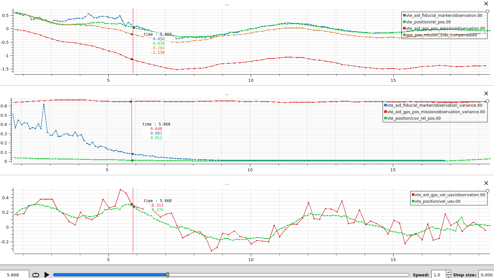

What this plot tells you:

1. **Vision is the dominant source throughout the descent.**
   The two observation variances never cross: vision is more precise than the mission GNSS at every altitude in this flight.
   This is intentional because the GPS module on the vehicle is not RTK-grade and the reported variance reflects that.
   If your receiver is more precise, retune [VTE_GPS_P_NOISE](../advanced_config/parameter_reference.md#VTE_GPS_P_NOISE) so the floor does not throw away its confidence.
2. **Higher altitudes have noisier vision.**
   At the start of the descent vision is noisier and `vte_position.rel_pos[0]` deviates from individual vision samples.
   The vertical red line marks the moment vision becomes very precise.
   From there the filter locks onto vision.
3. **A steady offset between the filter and the compensated GNSS is a tuning signal.**
   During the last phase of the landing, a roughly 15 cm gap between `vte_position.rel_pos[0]` and `gps_pos_mission_bias_compensated` remains.
   If a comparable gap is persistent in your logs, the bias state can be too tight to absorb the slow drift.
   Loosen [VTE_BIAS_UNC](../advanced_config/parameter_reference.md#VTE_BIAS_UNC) so the bias has more process noise, or lower [VTE_GPS_P_NOISE](../advanced_config/parameter_reference.md#VTE_GPS_P_NOISE) so GNSS pushes the bias harder.
   Do not push either knob too far: a bias that moves too freely will drift when vision is lost, see [Vision occlusion during descent](#vision-occlusion-during-descent).
4. **End-of-flight vision loss.**
   Vision stops detecting the target at the end of the trace and `vte_position.cov_rel_pos` starts to climb.
   The corrected GNSS still points to the pad thanks to the latest bias value, so the vehicle keeps tracking it.

**Initial bias averaging**: Shows the GNSS/vision bias low-pass filter while the estimator is in the GNSS-first averaging phase.
The plot was generated with [VTE_BIA_AVG_TOUT](../advanced_config/parameter_reference.md#VTE_BIA_AVG_TOUT)=10s and [VTE_BIA_AVG_THR](../advanced_config/parameter_reference.md#VTE_BIA_AVG_THR)=0.01 so the convergence threshold is never met and the full 10 s averaging window is exercised.

- **Top row (raw vs filtered bias)**: `vte_bias_init_status.raw_bias` (per-axis raw GNSS minus vision delta) overlaid with `vte_bias_init_status.filtered_bias`.
  The filtered bias is the LPF output (`tau = 0.3 s`).
  It should track the average of the raw samples and settle to a steady value as more vision observations arrive.
- **Second row (delta norm)**: `vte_bias_init_status.delta_norm` is the norm of consecutive raw-bias deltas which is the stability metric used by the convergence test.
  With [VTE_BIA_AVG_THR](../advanced_config/parameter_reference.md#VTE_BIA_AVG_THR)=0.01 the filter would exit as soon as five consecutive deltas stay below 0.01 m and at least `2 * tau` has passed.
  This threshold can be tuned based on the precision of the vision sensor.
- **Third row (state activation)**: `vte_position.bias` jumps from zero to the activated bias once averaging completes.
  The reset uses `r = pos_rel_gnss(t_vision) - b_filtered`, `b = b_filtered`, so after activation `vte_position.rel_pos` aligns with the vision observation while `vte_position.bias` stores the GNSS offset.

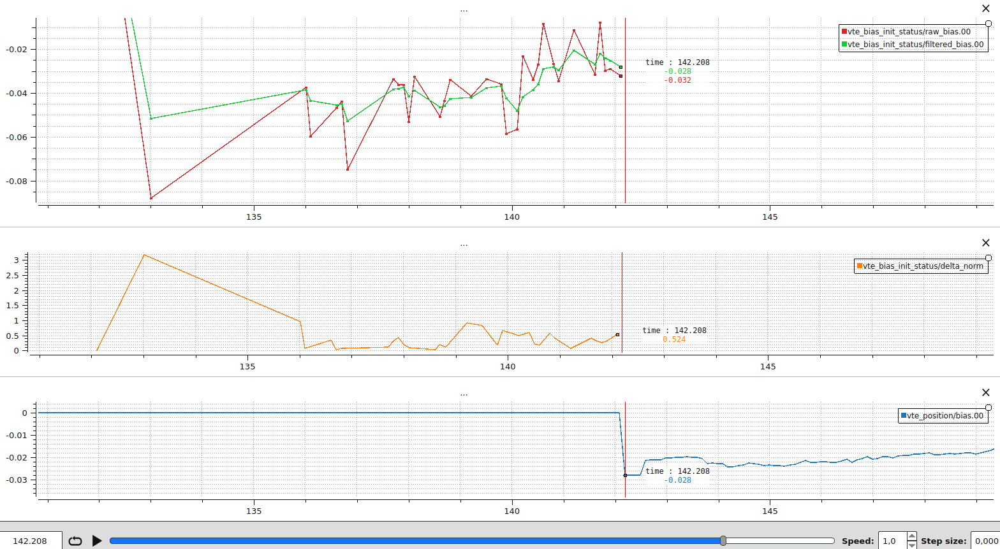

**Innovation consistency**: Confirms that every fused sensor produces zero-mean white-noise innovations.
Generated from the same real precision-landing flight as the dashboard above, with vision and the mission landing waypoint as the absolute reference.
The dashboard intentionally pairs a healthy aid source (vision) with a less well-tuned one (mission GNSS) so the two patterns can be compared side by side.

- **Top row (vision innovations)**: `vte_aid_fiducial_marker.innovation[0..2]` on all three NED axes.
  The innovations look like white noise centred on zero, which is the healthy signature.
  They are slightly larger at higher altitudes where vision is noisier.
- **Second row (vision fusion status)**: `vte_aid_fiducial_marker.fusion_status[0..2]` stays at 2 (`STATUS_FUSED_OOSM`), so every sample is fused via the OOSM history replay.
  The exact status code matters less than the fact that the sample is fused: `STATUS_FUSED_CURRENT` and `STATUS_FUSED_OOSM` are both healthy.
- **Third row (mission GNSS innovations)**: `vte_aid_gps_pos_mission.innovation[0..2]`.
  The innovations are _not_ zero-mean white noise.
  A persistent bias is visible at the vertical red line (about -0.18 m in North, +0.22 m in East, and +0.38 m in Down).
  The bias state is too tight to absorb the slow drift between the GNSS frame and the vision frame, so the residual ends up in the innovation.
  Loosen [VTE_BIAS_UNC](../advanced_config/parameter_reference.md#VTE_BIAS_UNC) to let the bias track more of that drift, but only enough that the bias still stays stable when vision is lost (see [Vision occlusion during descent](#vision-occlusion-during-descent)).
- **Bottom row (mission GNSS fusion status)**: `vte_aid_gps_pos_mission.fusion_status[0..2]` is mostly `STATUS_FUSED_OOSM`, so the GNSS variance is wide enough to absorb the biased innovation through the NIS gate.
  A short burst of `STATUS_REJECT_TOO_OLD` (status code 5) is also visible, meaning a GNSS sample arrived older than the OOSM buffer span (500 ms).
  To investigate, plot `vte_aid_gps_pos_mission.time_since_meas_ms` next (the [OOSM under measurement delay](#oosm-under-measurement-delay) dashboard is the right template).

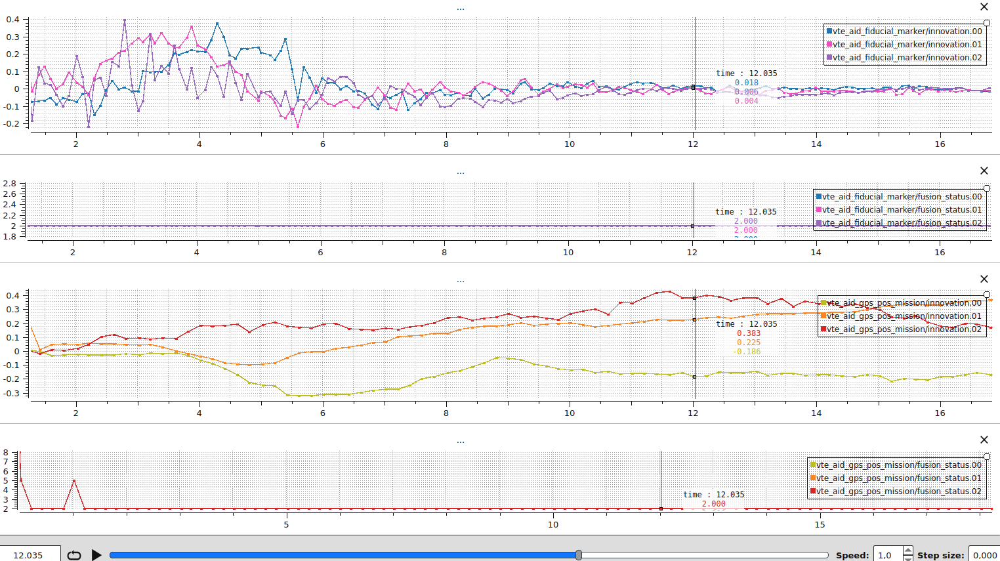

**Orientation filter**: Validates that yaw aiding stays smooth yet responsive without making the drone oscillate.
Generated from a real precision-landing flight.
Enable the orientation filter with [VTE_YAW_EN](../advanced_config/parameter_reference.md#VTE_YAW_EN) to log the same signals.

- **Top row (yaw observation vs. state)**: `vte_aid_ev_yaw.observation` overlaid with `vte_orientation.yaw`.
  The state should track the slow trend of the observation without copying its high-frequency jitter.
- **Second row (innovation, rad)**: `vte_aid_ev_yaw.innovation` should resemble white noise centred on zero.
- **Third row (innovation, deg)**: same signal converted to degrees, which is the unit most users intuitively reason about when setting [VTE_EVA_NOISE](../advanced_config/parameter_reference.md#VTE_EVA_NOISE).
- **Bottom row (test ratio)**: `vte_aid_ev_yaw.test_ratio` should stay below [VTE_YAW_NIS_THRE](../advanced_config/parameter_reference.md#VTE_YAW_NIS_THRE).

If the yaw state follows the observation noise, the solution is the same as for position: raise the observation floor or stiffen the prediction.
See [When the state follows per-sample jitter](#when-the-state-follows-per-sample-jitter).

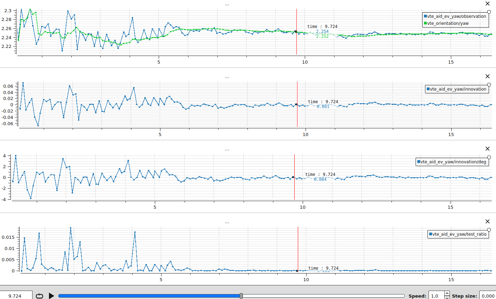

<a id="orientation-filter-case-study-yaw-oscillation"></a>

**Case study: yaw oscillation.** The plot above was generated with [VTE_EVA_NOISE](../advanced_config/parameter_reference.md#VTE_EVA_NOISE) at 4 deg (about 0.07 rad) and [VTE_YAW_ACC_UNC](../advanced_config/parameter_reference.md#VTE_YAW_ACC_UNC) at 0.004, both current defaults.
With more aggressive values (0.05 rad / 0.04) the filter jumped to follow every yaw observation, the controller chased the resulting setpoint changes, and the drone visibly oscillated.
The oscillation itself then degraded the next vision samples (motion blur and larger lever-arm effects make yaw harder to estimate), feeding the loop.
Trusting the process model more (smaller `VTE_YAW_ACC_UNC`) and the observations less (larger `VTE_EVA_NOISE`) breaks that loop: the state stays close to the underlying yaw trend, the drone holds steady, and the observations themselves become cleaner.

:::

:::details
Click to view Out-of-Sequence Measurements (OOSM) plots

<a id="oosm-under-measurement-delay"></a>

**OOSM under measurement delay**: Shows that delayed measurements are still consumed correctly thanks to the OOSM history replay.
The plot was generated by delaying each simulated measurement by a uniform random value in [0, 500] ms before reaching the autopilot.

- **Top two rows (measurement latency)**: `vte_aid_fiducial_marker.time_since_meas_ms` and `vte_position.history_steps`.
  With a 0-500 ms delay we observe `time_since_meas_ms` ranging up to ~450 ms and `history_steps` proportional to it (`history_steps ≈ time_since_meas_ms / 20`, capped at the 25-sample buffer).
- **Third row (raw vs processed observation)**: `vte_position.rel_pos` overlaid with `vte_aid_fiducial_marker.observation`.
  The processed observation lags the live state by roughly the measurement delay.
  The OOSM allows fusing old data without forcing the live state to wait for it.
- **Fourth row (innovation)**: `vte_aid_fiducial_marker.innovation[0]` stays close to zero.
  The innovation is computed against the predicted state at `t_meas`, not against the current live state, so the latency cancels out.

A concrete sample from this run: at $t = 68.712$ s (vertical red line) the live state is `vte_position.rel_pos[0] = 0.026 m` and the measurement that just arrived is `vte_aid_fiducial_marker.observation[0] = 0.041 m`, with `time_since_meas_ms = 368 ms` and `history_steps = 21`.
Looking 368 ms back into the history at $t = 68.344$ s (blue vertical line), `vte_position.rel_pos[0] = 0.034 m`.
The OOSM innovation is computed against that historic prediction, giving $0.041 - 0.034 = 0.007$ m, which matches `vte_aid_fiducial_marker.innovation[0] = 0.007 m`.
Without OOSM the filter would compare the delayed measurement against the live state and produce $|0.026 - 0.041| = 0.015$ m instead which is roughly twice as large.
Under fast dynamics this kind of latency-induced error grows quickly and can repeatedly fail the chi-squared gate or pull the state in the wrong direction causing overshoots.

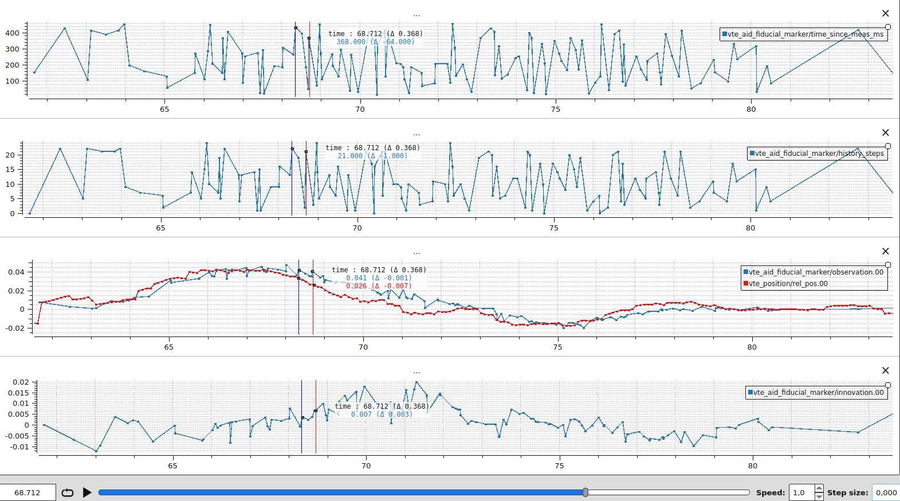

:::

:::details
Click to view filter robustness plots

<a id="smoothing-through-bounded-noise"></a>

**Smoothing through bounded noise**: When the filter is well tuned, the state stays smooth even when individual observations are noisy.
The plot was generated by adding uniform random noise in the range $[-0.20, +0.20]$ m to both the vision (`vte_aid_fiducial_marker.observation`) and target-GNSS (`vte_aid_gps_pos_target.observation`) position observations on the x, y, z axes.
The injected noise stays within the NIS gate, so every sample is fused.

- **Top row (x axis)**: `vte_aid_fiducial_marker.observation[0]` and `vte_aid_gps_pos_target.observation[0]` are visibly noisy, but `vte_position.rel_pos[0]` follows the underlying trend smoothly.
- **Bottom row (y axis)**: same behaviour on the lateral axis.

The smoothness is the Kalman filter doing its job: each sample only contributes a fraction of its innovation to the state, weighted by the ratio of the predicted state variance to the observation variance.
As long as the noise stays inside the NIS gate, no rejection happens and the per-sample jitter averages out across many fusions.
If the state in your own logs follows the jitter instead of the trend, see [When the state follows per-sample jitter](#when-the-state-follows-per-sample-jitter) for the tuning recipe.

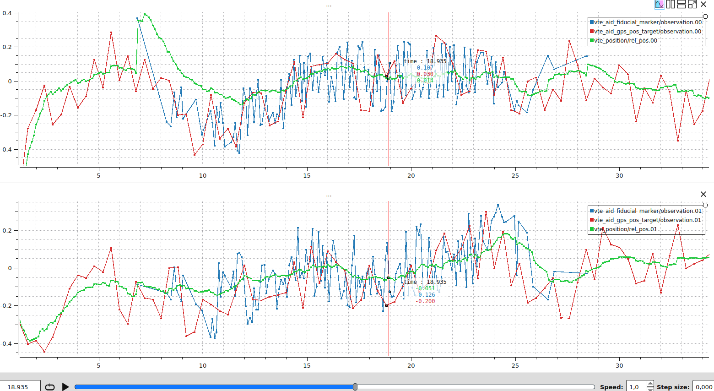

**Rejecting a corrupted measurement**: Demonstrates how the estimator rejects a faulty measurement.
The plot was obtained by injecting during 6 seconds an additive bias uniformly sampled between -1 and 1 metre on the x-axis vision observation, while leaving the other axis untouched.
The healthy axes keep fusing as expected, while the corrupted axis repeatedly fails the NIS gate, which keeps the state from chasing the outliers.

- **Top row (x observation)**: `vte_position.rel_pos[0]` follows `vte_aid_fiducial_marker.observation[0]` until the measurements are altered, at which point it does not follow the biased measurements.
- **Second row (x fusion status)**: `vte_aid_fiducial_marker.fusion_status[0]` flips to `STATUS_REJECT_NIS` whenever the observation disagrees with the filter prediction, confirming that the chi-squared gate is doing its job.
- **Third row (x test ratio)**: `vte_aid_fiducial_marker.test_ratio[1]` spikes and breaches [VTE_POS_NIS_THRE](../advanced_config/parameter_reference.md#VTE_POS_NIS_THRE) for the biased measurements.
- **Bottom row (y, z fusion status)**: `vte_aid_fiducial_marker.fusion_status` stays at 1: `STATUS_FUSED_CURRENT` or 2: `STATUS_FUSED_OOSM` in the y and z direction.

What to do when you see this pattern in your own logs:

1. Confirm that the rejection actually corresponds to a corrupted measurement and not a healthy sample being thrown out by an overly tight gate.
   Compare the raw sensor topic (e.g. `fiducial_marker_pos_report`) with `vte_aid_fiducial_marker.observation` to be sure the input itself is bad rather than a frame transform or timestamp issue.
2. If the rejections are legitimate (the data really is corrupted), no parameter change is needed: the NIS gate is doing its job.
   Investigate the upstream sensor instead (camera exposure, marker visibility, attitude alignment).
3. If healthy samples are being rejected, the observation variance is the first thing to revisit.
   As detailed in the [troubleshooting checklist](#troubleshooting-checklist) row on _Frequent innovation rejections_, an under-reported variance causes the NIS gate to fire on small innovations. Raise [VTE_EVP_NOISE](../advanced_config/parameter_reference.md#VTE_EVP_NOISE) (or [VTE_GPS_P_NOISE](../advanced_config/parameter_reference.md#VTE_GPS_P_NOISE) for GNSS) so the floor matches the actual sensor accuracy.
4. If both the upstream sensor and the variance look correct but legitimate outliers are still slipping through, loosen the gate slightly with [VTE_POS_NIS_THRE](../advanced_config/parameter_reference.md#VTE_POS_NIS_THRE) (defaults to 3.84, i.e. a 5% false-rejection rate).
   Larger values are more permissive, smaller values reject more aggressively.

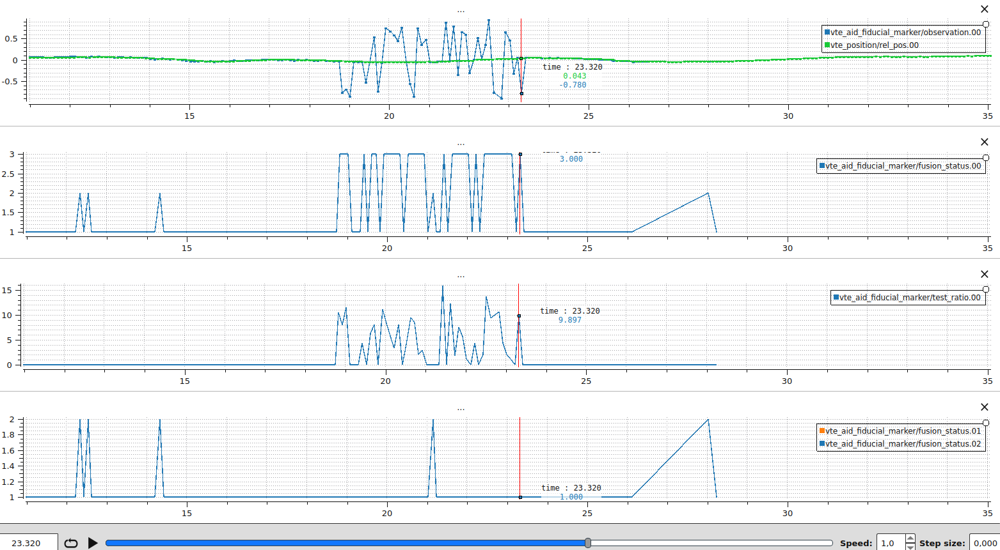

<a id="vision-dropout-behaviour"></a>

**Vision dropout behaviour**: Illustrates what happens when vision is the only relative-position source and the marker is temporarily lost, and why fusing the vehicle GNSS velocity matters in practice.

Both plots come from the same SITL scenario with a static target: the filter is well converged on vision, vision drops out for several seconds, then comes back.
The only difference between the two runs is whether [VTE_AID_MASK](../advanced_config/parameter_reference.md#VTE_AID_MASK) bit 1 (vehicle GNSS velocity) is enabled.

To make the full dropout visible, [VTE_BTOUT](../advanced_config/parameter_reference.md#VTE_BTOUT) was raised to 10 s for these runs (default 3 s) so the filter keeps predicting the state instead of resetting early.
On both plots the **vertical blue line** marks the moment vision is lost, and the **vertical red line** marks the estimator timeout 10 s later, when [VTE_BTOUT](../advanced_config/parameter_reference.md#VTE_BTOUT) expires and the filter is reset.

This is a structural property of the filter, not a tuning issue.
See [Filter observability](#filter-observability) for the underlying reason: vision never touches the $v^{uav}$ state directly, so any residual in $v^{uav}$ integrates straight into `vte_position.rel_pos` once vision is gone.

**Plot 1, vision only**: [VTE_AID_MASK](../advanced_config/parameter_reference.md#VTE_AID_MASK) = vision only (bit 2).

- **Top row (relative position)**: `vte_position.rel_pos[0]` overlaid with `vte_aid_fiducial_marker.observation[0]`.
  The state stays close to the last vision sample for roughly 3 seconds after the dropout (the time it takes the residual $v^{uav}$ to integrate to a visible offset), then drifts by about 60 cm over the next 7 seconds.
  When vision returns, the state snaps back by ~60 cm in a single innovation, which is the accumulated drift.
- **Bottom row (UAV velocity)**: `vte_position.vel_uav[0]`, `vehicle_local_position.vx`, and `sensor_gps.vel_n_m_s`.
  The three traces agree while vision is fused.
  As soon as vision drops, the filter estimate diverges by about 0.1 m/s from the EKF2 and GNSS references.
  That ~0.1 m/s gap over 7 seconds is the position drift observed in the top row.

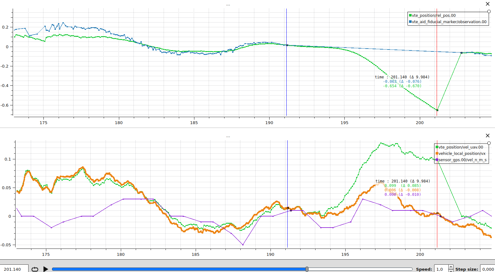

**Plot 2, vision and vehicle GNSS velocity**: Same scenario, with [VTE_AID_MASK](../advanced_config/parameter_reference.md#VTE_AID_MASK) bit 1 enabled.
Vehicle GNSS velocity is now fused as $z = v^{uav}$, which gives the velocity state a direct observation independent of vision.

- **Top row (relative position)**: `vte_position.rel_pos[0]` properly follows the expected trend through the dropout.
  The correction on vision recovery is small (in this run, from 0.26 m to 0.24 m, i.e. 2 cm), which is within the vision noise level rather than a real drift.
- **Bottom row (UAV velocity)**: `vte_position.vel_uav[0]` now tracks `vehicle_local_position.vx` and `sensor_gps.vel_n_m_s` for the full dropout, because GNSS velocity continues to constrain the state when no vision sample is available.

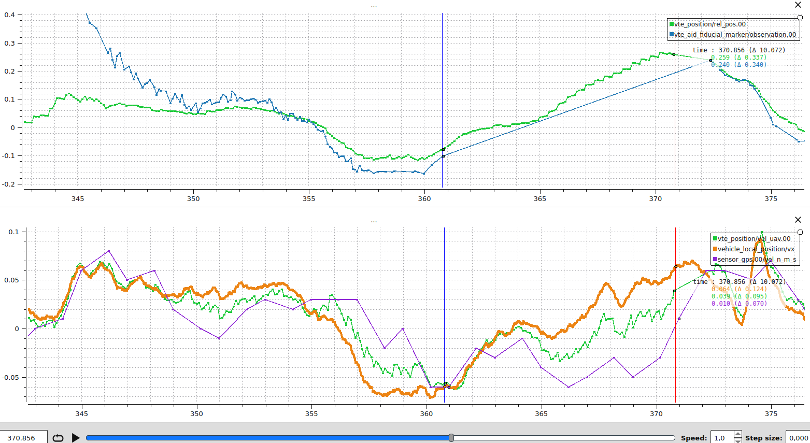

What to take away from this comparison:

1. With vision alone, the vehicle velocity state is only weakly observable, so the filter cannot estimate cleanly through gaps in vision.
   Any additional source that touches the velocity state directly substantially extends how long the filter remains accurate without a vision sample.
2. The size of the relative-position jump on vision recovery is a useful diagnostic on its own: a large jump means the velocity state had drifted during the gap, not that the recovered vision sample is wrong.

<a id="vision-occlusion-during-descent"></a>

**Vision occlusion during descent (real flight)**: Demonstrates the central motivation behind multi-sensor fusion.
Once the bias between the absolute frame (here the mission landing waypoint) and the vision frame is estimated, the corrected GNSS observation still points at the pad after vision drops out, so the vehicle still lands precisely.
Generated by removing the vision fusion 5 m above the target during a real precision-landing flight.
The drone landed at the center of the target despite the vision loss.

The vertical blue line marks the moment vision is stopped, and the vertical red line marks touchdown.

- **Top row (relative position and bias-compensated GNSS)**: `vte_aid_fiducial_marker.observation[0]`, `vte_aid_gps_pos_mission.observation[0]`, `vte_position.rel_pos[0]`, and the custom trace `gps_pos_mission_bias_compensated = vte_aid_gps_pos_mission.observation[0] - vte_position.bias[0]`.
- **Middle row (bias estimates)**: `vte_position.bias[0]` and `vte_position.bias[1]`.
  The bias converges in roughly 6 seconds as the drone descends and vision becomes more precise.
  Between the blue and red lines (8 seconds without vision), the deltas are about $-0.023$ m on x and $-0.008$ m on y, so the bias stays effectively stable.
  By touchdown, the bias settles at about $-0.46$ m on x (north) and $+1.18$ m on y (east).
  Without bias compensation the drone would have touched down 1.18 m east of the pad.
- **Bottom row (relative position covariance)**: `vte_position.cov_rel_pos[0]`.
  The variance climbs by about 0.053 m² once vision is lost, corresponding to a 1-sigma growth of $\sqrt{0.053} \approx 0.23$ m.
  This is the filter reporting that the relative position is now less certain because no vision sample is constraining it.

This is the case multi-sensor fusion was designed for.
The mission landing waypoint reports the pad position with a metre-scale offset (the bias) that vision corrects.
Once the bias is observed, the corrected GNSS effectively becomes a second relative-position sensor for the remaining descent, including any segment where the marker temporarily disappears (motion blur, partial occlusion, or the marker leaving the camera field of view because it is too large at low altitude).
This is particularly important for large targets where the marker is expected to leave the camera frame in the final metres of descent.

What to watch in your own logs:

- The bias must already be settled before vision drops out.
  If your dropout test shows the bias still moving when vision is lost, lower [VTE_BIAS_UNC](../advanced_config/parameter_reference.md#VTE_BIAS_UNC).
- The post-dropout bias drift gives a direct read on how aggressively the bias is tuned.
  The deltas above (a few centimetres over 8 seconds) match a well-tuned filter.
  Larger drift means [VTE_BIAS_UNC](../advanced_config/parameter_reference.md#VTE_BIAS_UNC) is too loose.
  The filter overfit the bias to recent vision and now lets it walk away when vision is gone.

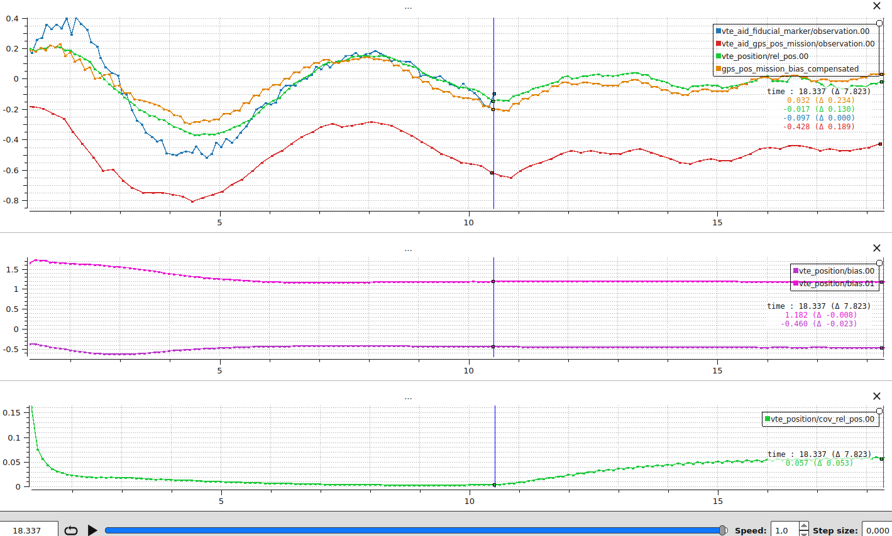

:::

:::details
Click to view Precision Landing on a static target plot

**Precision landing alignment**: Compares the precision-landing target with the vehicle position to confirm that the vehicle is actually navigating toward the target.
Generated from a real precision-landing flight.

`landing_target_pose.x_abs` and `landing_target_pose.y_abs` are expressed in the local NED frame, which is fixed relative to the EKF2 origin.
For a static target both values should stay roughly constant for the duration of the approach.
The estimator can refine the target position as new observations arrive, but big jumps or steady drift in this signal indicate noisy observations or an estimator that is following them too aggressively.
If you see this, [When the state follows per-sample jitter](#when-the-state-follows-per-sample-jitter) lists the right knobs.

The plot is also useful for catching misconfigurations, for example [PLD_YAW_EN](../advanced_config/parameter_reference.md#PLD_YAW_EN) disabled when yaw alignment is expected.
If the controller struggles to follow even when the target signal is clean, review the [multicopter position tuning guide](../config_mc/pid_tuning_guide_multicopter.md).

- **Top row (north alignment)**: `landing_target_pose.x_abs` against `vehicle_local_position.x`.
  The curves should overlay once precision landing is triggered.
- **Second row (east alignment)**: `landing_target_pose.y_abs` against `vehicle_local_position.y`, same as north.
- **Third row (yaw alignment)**: `vte_orientation.yaw` should remain steady while `trajectory_setpoint.yaw` tracks it when [PLD_YAW_EN](../advanced_config/parameter_reference.md#PLD_YAW_EN) is enabled.
- **Bottom row (descent context)**: `vehicle_local_position.dist_bottom` shows when the final approach begins and how high above the pad the precision-landing alignment converged.
  A higher convergence altitude is better.

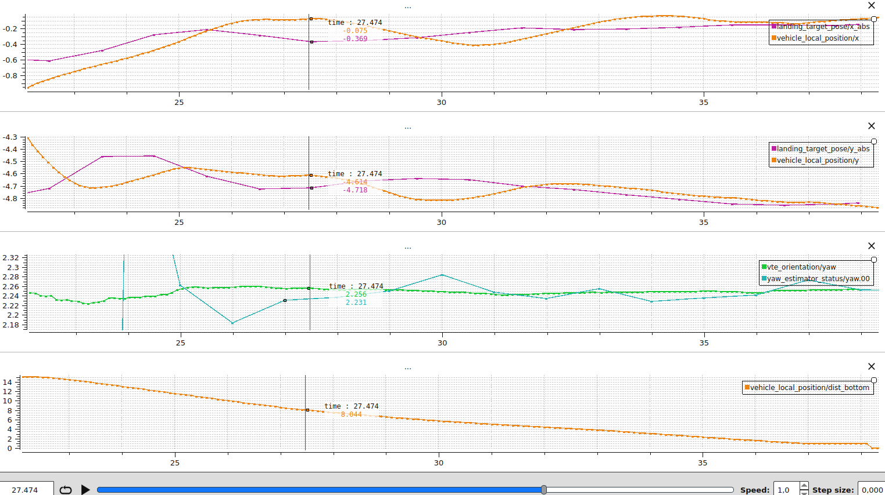

:::

<a id="moving-target"></a>

:::details
Click to view Moving Target plot

**Moving target precision landing**: Shows how the precision-landing controller projects the setpoint ahead of a moving target, how the lead converges onto the target as altitude drops, and how the moving-target states behave during the descent.
Generated from a real flight with a camera publishing target estimates at 10 Hz at 640×480 resolution.
The firmware was built with `CONFIG_VTEST_MOVING=y`.

- **Top row (axis along which the target moves)**: `vehicle_local_position.x`, `landing_target_pose.x_abs`, and `trajectory_setpoint.position[0]`.
  The trajectory setpoint sits ahead of the estimated target position for most of the descent: that is the [PLD_MOVING_T_MAX](../advanced_config/parameter_reference.md#PLD_MOVING_T_MAX) lookahead leading the vehicle toward where the target will be at touchdown.
  As altitude drops, the lookahead converges toward [PLD_MOVING_T_MIN](../advanced_config/parameter_reference.md#PLD_MOVING_T_MIN), the gap between setpoint and target closes, and the vehicle lands on the moving target rather than where it was at the start of the approach.
- **Second row (vision innovations)**: `vte_aid_fiducial_marker.innovation[0..2]` on all three NED axes.
  They look like white noise centred on zero, which means the filter dynamics match the marker observations even as the target moves.
- **Third row (moving-target states)**: `vte_position.vel_target` and `vte_position.acc_target`.
  These states only exist in the moving-target build and can be compared to the expected target velocity and acceleration.
- **Bottom row (descent context)**: `vehicle_local_position.dist_bottom` shows the distance to the ground and indicates the phase of the landing.

What to take away:

- **Add more sensors when you can.**
  With vision only, the mission must end up somewhere the target is visible because the filter has no other observation of the target position.
  Adding a target GNSS receiver gives the filter an absolute reference even before vision detects the marker: the filter converges faster, the vehicle can fly to a moving target before it is in view, and the risk of missing the target is reduced.
  Any offset between the receiver and the marker is estimated by the bias state.
- **Add a direct target-velocity observation when you can.**
  Target GNSS velocity ([VTE_AID_MASK](../advanced_config/parameter_reference.md#VTE_AID_MASK) bit 4) is the only measurement that constrains $v^{t}$ directly, and without it the precision-landing lookahead becomes noisier.
  See [Filter observability](#filter-observability) for why a direct velocity observation matters.
- **Publish target estimates at a high rate.**
  With a 10 Hz camera the prediction has up to 100 ms of unconstrained motion between samples.
  Raising the rate shrinks the predicted variance growth between fusions, makes the precision-landing setpoint smoother, and keeps `vte_aid_fiducial_marker.innovation` closer to zero through the descent.

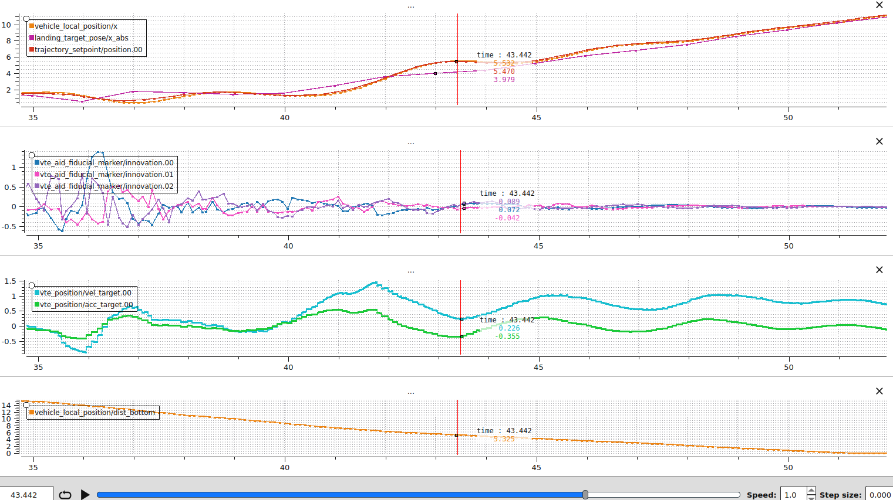

:::

## Development and Debugging Tips

A few tips to make iteration on real hardware and SITL easier.

- To print `PX4_DEBUG` statements from the module, launch SITL with `PX4_LOG_LEVEL=debug` (for example, `PX4_LOG_LEVEL=debug make px4_sitl_visionTargetEst`).
  On hardware builds, compile with the debug configuration or enable the console log level before running tests so the additional diagnostics appear on the shell.
- Keep the estimator alive on the bench by setting [VTE_TASK_MASK](../advanced_config/parameter_reference.md#VTE_TASK_MASK)=3.
  The debug bit enables the continuous update of the position and orientation estimators (if enabled via [VTE_YAW_EN](../advanced_config/parameter_reference.md#VTE_YAW_EN) and [VTE_POS_EN](../advanced_config/parameter_reference.md#VTE_POS_EN)).
- Use shell helpers while iterating: `listener landing_target_pose`, `listener vte_bias_init_status`, `listener vte_aid_fiducial_marker` (or the relevant `vte_aid_*`) to inspect bias averaging and innovations, `listener vte_input 5` for prediction inputs, and `vision_target_estimator status` to ensure both filters are running.

<a id="sitl-simulation-pipeline"></a>

:::details
Click to view the guide on SITL Simulation Pipeline

The Gazebo Classic SITL setup produces both VTE inputs (`fiducial_marker_pos_report` and `target_gnss`) end-to-end, so the filter can be tested without real hardware.
This is also where you should inject extra noise or latency to stress-test the filter.

The pipeline has four stages:

1. **Aruco marker detection**: `arucoMarkerPlugin` (`Tools/simulation/gazebo-classic/sitl_gazebo-classic/src/gazebo_aruco_plugin.cpp`) runs on the simulated camera, detects the marker, and publishes a `TargetRelative` Gazebo message.
   The reported standard deviations are hard-coded in `OnNewFrame()` (`set_std_x`, `set_std_y`, `set_std_z`, `set_yaw_std`).
   Change them there to make the simulated vision report noisier or cleaner.
   Marker visibility is controlled by `Tools/simulation/gazebo-classic/sitl_gazebo-classic/models/land_pad/land_pad.sdf`: the `<visual><box><size>` element sets the rendered Aruco square (the `<collision>` size is independent and just controls the physical pad).
   The `<pose>` element on the `<model name="land_pad">` block places the pad in the world.
   Its last value is the pad yaw in radians (for example `<pose>0.0 0.0 0.06 0 0 0.7</pose>` rotates the pad by 0.7 rad, about 40 deg), which is the easiest way to exercise the orientation filter in SITL.
2. **Target GPS**: the `gps_target` model included from `land_pad.sdf` runs the standard Gazebo GPS plugin.
   Tune the noise floors directly in `Tools/simulation/gazebo-classic/sitl_gazebo-classic/models/gps/gps.sdf` (the `<noise>` blocks for horizontal/vertical position and velocity).
3. **Mavlink bridge**: `gazebo_mavlink_interface.cpp` connects the two plugins to the autopilot.
   `targetRelativeCallback()` packs the marker into a `TARGET_RELATIVE` mavlink message, and `TargetGpsCallback()` packs the GPS sample into `TARGET_ABSOLUTE`.
4. **PX4 side**: `SimulatorMavlink::handle_message_target_relative()` and `handle_message_target_absolute()` decode the mavlink messages back into `fiducial_marker_pos_report` and `target_gnss` (or directly into `landing_target_pose` when `VTE_EN=0`).
   From there the filter sees exactly the same topics it would on real hardware, so anything you tune at the sensor level reproduces faithfully end to end.

:::

<a id="adding-new-measurement-sources"></a>

::::details Click to view the guide on adding new measurement sources

To integrate a new sensor:

1. **Define a uORB message** that carries the measurement in either the vehicle body frame or NED, complete with variance estimates and timestamps.
2. **Extend the fusion mask**: add a bit to `SensorFusionMaskU` (`src/modules/vision_target_estimator/common.h`) and update the parameter definition for [VTE_AID_MASK](../advanced_config/parameter_reference.md#VTE_AID_MASK) (see also [sensor fusion selection](../advanced_features/vision_target_estimator.md#sensor-fusion-selection)) in `vision_target_estimator_params.yaml`.
3. **Augment observation enums**: append the new entry to the relevant `ObsType` enum (`VTEPosition.h` or `VTEOrientation.h`), update `ObsValidMaskU`, and update helper functions such as `hasNewNonGpsPositionSensorData()` and `selectInitialPosition()` if the measurement can provide a relative position.
4. **Subscribe and validate**: add a `uORB::Subscription` to the filter, check for finite values, and reject samples that are too old `isMeasUpdated` or timestamped in the future before marking the observation valid.
5. **Implement the handler** in `processObservations()`.
   Convert the measurement into NED coordinates, populate `TargetObs::meas_xyz`, `meas_unc_xyz`, and the observation Jacobian (`meas_h_xyz` or `meas_h_theta`), and set the fusion-mask flag only after the data passes validation.
6. **Provide tunable noise**: declare a parameter (e.g. `VTE_<SENSOR>_NOISE`) and clamp it with `kMinObservationNoise` so the estimator never believes a measurement is perfect.
7. **Log the innovations**: add a publication member and ORB topic (see `vte_aid_fiducial_marker` for reference) so that logs include the innovation, variance, and `fusion_status` outcome for the new sensor.
   Use the `FusionResult` returned by the filter to populate `fusion_status` so successes and rejections share the same status enum as the existing sources.
8. **Exercise SITL**: update the Gazebo (or other) simulation so that replay tests produce the new measurement.
   This keeps CI coverage intact and provides a reference data set for tuning.
9. **Document the workflow**: update this deep dive and any setup how-tos so users know how to enable the new bit, calibrate the sensor, and interpret its logs.

:::warning
**Timeout policy**: Every measurement must be time-aligned and checked so that stale data never reaches the update step.
Reject samples older than [VTE_M_REC_TOUT](../advanced_config/parameter_reference.md#VTE_M_REC_TOUT) (`isMeasRecent(hrt_abstime ts)`) and check `time_since_meas_ms` (and `fusion_status` for `STATUS_REJECT_TOO_OLD` / `STATUS_REJECT_TOO_NEW`) on the new `vte_aid_*` topic to confirm the sensor fits inside the estimator deadlines.
If observations are stored in cache, invalidate it inside `checkMeasurementInputs` when older than [VTE_M_UPD_TOUT](../advanced_config/parameter_reference.md#VTE_M_UPD_TOUT) (`isMeasUpdated(hrt_abstime ts)`).
:::

::::

:::details
Click to view the guide on adding new tasks

Add a new `VteTask` when the estimator should only run during a particular mission phase or flight-mode behaviour, or when that behaviour needs its own subscriptions, cached state, or completion logic.
Do not put that state back into `VisionTargetEst`.
The whole point of the task layer is to keep the scheduler generic.

Use this checklist:

1. **Reserve a task-mask bit**: add the bit in `task_bits` (`tasks/VteTask.h`).
   Those constants are the code-level source of truth for `VTE_TASK_MASK`.
   Then update `vision_target_estimator_params.yaml` and the `VTE_TASK_MASK`
   documentation so users can enable the new task.
2. **Create a task class**: add a new file under `src/modules/vision_target_estimator/tasks/` and derive it from `VteTask`.
   Put all task-specific subscriptions and status flags in that class.
3. **Implement the interface deliberately**: `maskBit()` and `name()` identify the task, `pollStatus()` refreshes external state, `isReady()` exposes level-triggered readiness, and `isComplete()` reports self-termination.
   Use `onActivate()` for one-shot state resets on task entry, and `onPosEstStart()` only when the position filter needs task-specific seeding such as a cached mission waypoint.
4. **Keep side effects out of readiness checks**: `pollStatus()` and `isReady()` are called every scheduler cycle while the task bit is enabled.
   They should be cheap.
   Transition-only work belongs in `onActivate()`.
5. **Register the task by priority**: add the task instance to `VisionTargetEst` and place it in `_task_registry` in descending priority order.
   If multiple bits are enabled at the same time, the first ready task wins.
6. **Test lifecycle and cache behaviour**: extend `TEST_VTE_VisionTargetEst.cpp` with coverage for task activation completion, repeated starts, and any cached mission/context data that must survive estimator restarts within the same task.
7. **Document the operational meaning**: update the overview page, this deep dive, and any feature-specific docs so users understand when the new task is active and which `VTE_TASK_MASK` bit selects it.

:::

<a id="symforce-generated-derivations"></a>

:::details
Click to view the guide on SymForce-generated derivations

The Kalman-filter math is not written by hand.
The symbolic state, prediction model, and covariance update are defined in Python and expanded into C++ by [SymForce](https://symforce.org/), so the C++ that runs on the autopilot always matches the model defined in `derivation.py`.

**Source files (Python):**

- `src/modules/vision_target_estimator/Position/vtest_derivation/derivation.py` for the position filter.
- `src/modules/vision_target_estimator/Orientation/vtest_derivation/derivation.py` for the yaw filter.

**Generated outputs (C++ headers) used at runtime:**

| Filter   | Generated headers                                                                                                                                                                                                                                                            |
| -------- | ---------------------------------------------------------------------------------------------------------------------------------------------------------------------------------------------------------------------------------------------------------------------------- |
| Position | `state.h`, `predictState.h`, `predictCov.h`, `computeInnovCov.h`, `getTransitionMatrix.h`, `applyCorrection.h`                                                                                                                                                               |
| 방향       | `predictState.h`, `predictCov.h`, `getTransitionMatrix.h` (innovation computation and correction stay hand-written in `Orientation/KF_orientation.cpp` so yaw angles can be wrapped to $[-\pi, \pi]$) |

**Build-time behaviour:**

- By default, CMake copies the committed pre-generated headers from `Position/vtest_derivation/generated/` into the build tree under `build/<target>/src/modules/vision_target_estimator/vtest_derivation/generated/`, and likewise for orientation. No SymForce install is required for the static build.
- `CONFIG_VTEST_MOVING=y` automatically sets `VTEST_SYMFORCE_GEN=ON` and requires SymForce in the Python environment so the 5-state moving-target headers are produced.
- Setting `-DVTEST_SYMFORCE_GEN=ON` manually regenerates both filters at configure time.

The generated files are included from the build directory and must never be edited by hand.
To change the model, edit `derivation.py` and regenerate.

#### Regenerating the symbolic model

1. Configure CMake with `-DVTEST_SYMFORCE_GEN=ON` (automatic when `CONFIG_VTEST_MOVING=y`) and ensure SymForce is available in the Python environment.
2. Reconfigure with `cmake --fresh ...` so the custom command in `src/modules/vision_target_estimator/CMakeLists.txt` runs.
   The outputs land in `build/<target>/src/modules/vision_target_estimator/vtest_derivation/generated/` (position) and `.../vte_orientation_derivation/generated/` (orientation).
3. To refresh the committed reference files, add `-DVTEST_UPDATE_COMMITTED_DERIVATION=ON` and commit the regenerated files in `Position/vtest_derivation/generated*/` once vetted.

If the build fails during regeneration, inspect the CMake output for the SymForce invocation and rerun it manually inside `Position/vtest_derivation/` to catch Python errors.
After regenerating, rebuild the module to ensure the Jacobians and code stay in sync.

:::

## Runtime Performance on Hardware

Even with ~500 ms induced latency on every measurement the estimator stays inside its 20 ms loop budget on a Pixhawk 6c.
Expand below for the full per-counter breakdown (baseline vs. delayed runs).

:::details
Click to view Pixhawk 6c performance expectations

The estimator publishes per-section perf counters that can be read at any time on the shell:

```sh
perf | grep "vision_target_estimator"
```

Each line reports event count, total elapsed time, average, min, max, and standard deviation in microseconds.
Six counters cover the vision target estimator:

| Counter          | What it covers                                                                                                                                                                                          |
| ---------------- | ------------------------------------------------------------------------------------------------------------------------------------------------------------------------------------------------------- |
| `VTE cycle `     | One full work-queue of `VisionTargetEst::Run()`. Includes input subscription polls, task scheduling, and the dispatch into the position/orientation update steps.       |
| `VTE cycle pos`  | The position-filter part of the cycle (every prediction or measurement update for `VTEPosition`).                                                                    |
| `VTE cycle yaw`  | The orientation-filter part (same scope, for `VTEOrientation`).                                                                                                      |
| `VTE prediction` | Just the Kalman prediction inside the position filter: `Predictstate` + `Predictcov` plus OOSM history.                                                                 |
| `VTE update`     | The full update step in the position filter, including measurement validation, frame transforms, fusion calls for every active aid source, and OOSM history maintenance.                |
| `VTE fusion`     | Just the per-axis fusion inside an update: innovation, gating, gain projection, and history correction. This is where OOSM scales with `history_steps`. |

The numbers below come from a Pixhawk 6c running the static-target filter (`vte_aid_fiducial_marker` + `vte_aid_gps_pos_target` + `vte_aid_gps_vel_uav`) at the default 50 Hz cadence.

**Baseline (no injected delay):**

```text
VTE fusion:     20568 events,  297061us elapsed,  14.44us avg, min  1us max  88us 14.138us rms
VTE update:      6856 events,  318536us elapsed,  46.46us avg, min  3us max 163us 41.827us rms
VTE prediction: 18567 events,  105034us elapsed,   5.66us avg, min  5us max  52us  1.575us rms
VTE cycle :     92576 events, 1614647us elapsed,  17.44us avg, min  6us max 281us 27.204us rms
VTE cycle yaw:  18563 events,  125422us elapsed,   6.76us avg, min  4us max  60us  3.985us rms
VTE cycle pos:  18569 events,  803841us elapsed,  43.29us avg, min 22us max 253us 38.464us rms
```

**With bounded delay (≈ 480–500 ms latency, ~20 OOSM steps on average):**

```text
VTE fusion:     31932 events, 1860362us elapsed,  58.26us avg, min 63us max 135us 23.520us rms
VTE update:     10644 events, 1894804us elapsed, 178.02us avg, min  4us max 301us 69.331us rms
VTE prediction: 29156 events,  166179us elapsed,   5.70us avg, min  5us max  52us  1.614us rms
VTE cycle :    163952 events, 4215369us elapsed,  25.71us avg, min  6us max 511us 57.621us rms
VTE cycle yaw:  32850 events,  274433us elapsed,   8.35us avg, min  1us max  86us  7.852us rms
VTE cycle pos:  32861 events, 2703185us elapsed,  82.26us avg, min 10us max 479us 96.704us rms
```

How to read these:

- **`VTE prediction` stays constant** (~5.7 us).
  Predictions do a fixed amount of math regardless of measurement latency.
- **`VTE fusion` jumps from ~14 us to ~58 us** (≈ 4× increase).
  This is the OOSM cost: the projection step touches every history sample after `t_meas`, so the runtime grows roughly linearly in `history_steps`.
  With ~20 history steps the per-fusion cost is still well under 100 us on average.
- **`VTE update` follows the same trend** (~46 us → ~178 us) since it wraps multiple fusion calls.
  The worst-case (~300 us) corresponds to a cycle where every aid source hits the OOSM path.
- **`VTE cycle pos` (~43 us → ~82 us)** confirms the same behaviour at the cycle level.
  A full position cycle still completes in well under 0.5 ms even in the worst case, which is small relative to the 20 ms (50 Hz) loop budget.
- **`VTE cycle ` and `VTE cycle yaw` see only minor changes**: these counters are dominated by lightweight scheduling and yaw-only fusion that does not involve OOSM history projection.

A few things to keep in mind when interpreting your own numbers:

- The total `VTE cycle ` event count is roughly five times the `VTE cycle pos` count because `Run()` is woken on every input topic update, but the position estimator only ticks at 50 Hz.
- `history_steps` saturates at the buffer depth (`kOosmHistorySize = 25`).
  If you see it pinned at 25 in the logs, the measurement is older than 500 ms and is being rejected as `STATUS_REJECT_TOO_OLD` rather than fused.

:::

## Unit Test Suites

The module contains unit tests that cover the Kalman math, the per-filter module logic, and the OOSM history buffer.

- `TEST_VTE_KF_position`: Kalman filter math for the position state (prediction, NIS gating, bias-aware H, OOSM gold standard).
  Static model (state size 3) by default, moving-target tests (state size 5) build only when `CONFIG_VTEST_MOVING` is enabled.
- `TEST_VTE_KF_orientation`: Kalman filter math for yaw/yaw-rate (wrap logic, process noise, dt edge cases, covariance symmetry).
- `TEST_VTE_VTEPosition`: Module logic for vision/GNSS fusion, offsets, interpolation, ordering, and uORB innovation topics (static + moving gated by `CONFIG_VTEST_MOVING`).
- `TEST_VTE_VTEOrientation`: Module logic for yaw fusion, noise models, resets, and OOSM handling.
- `TEST_VTE_VTEOosm`: Generic OOSM manager behaviour.

Run locally:

```sh
make tests TESTFILTER=TEST_VTE*
```
