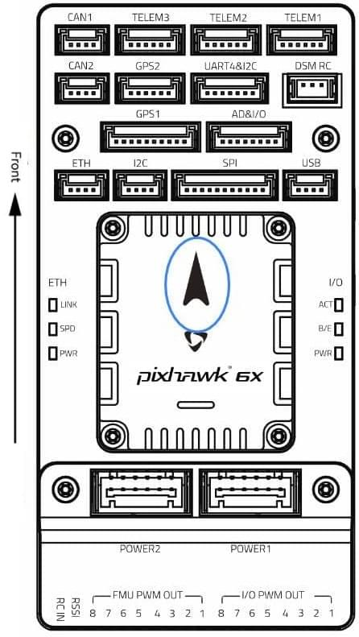
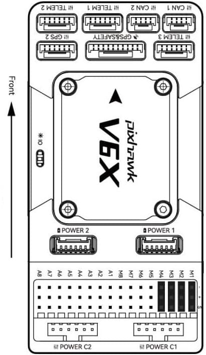
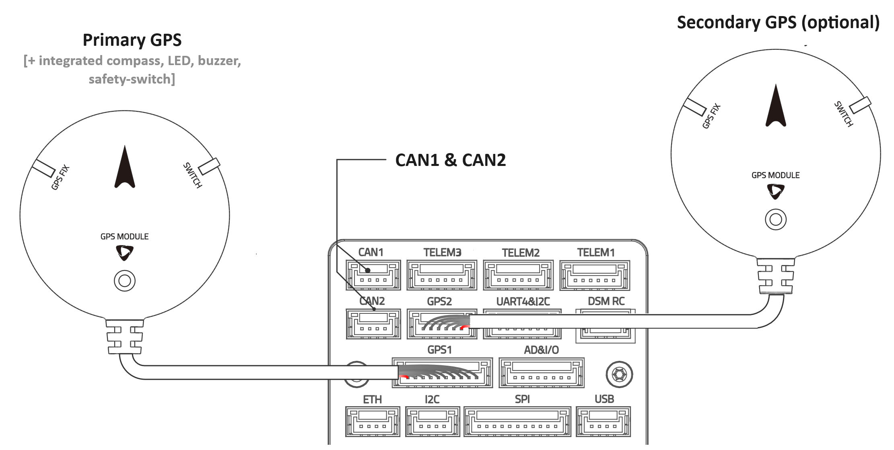
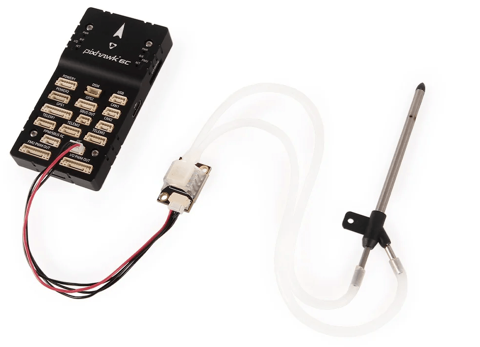
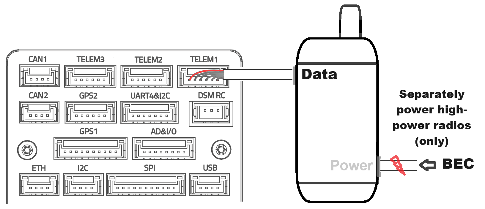
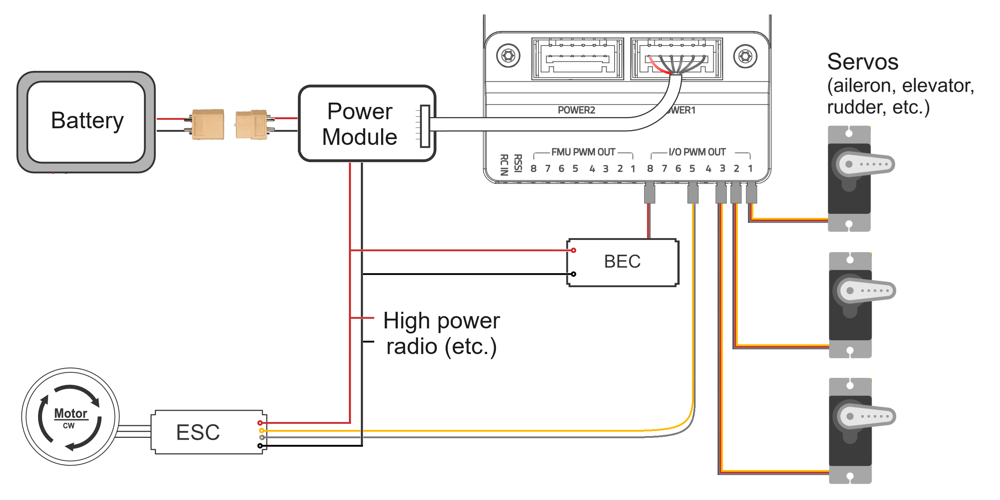
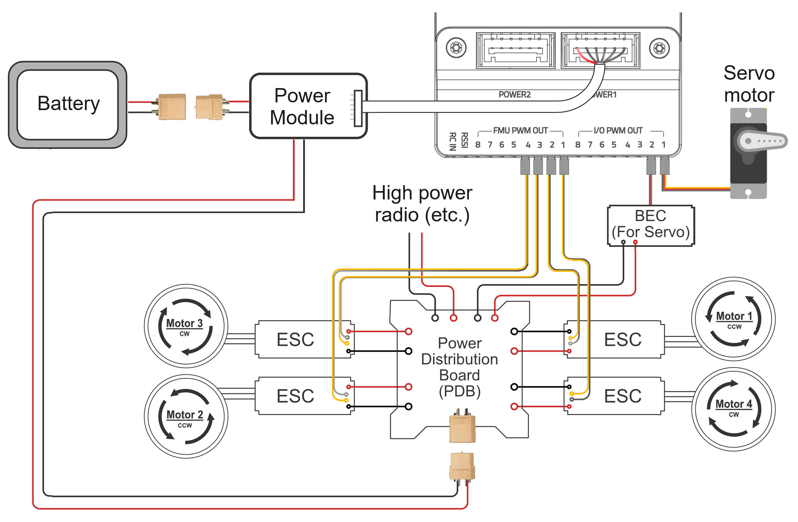
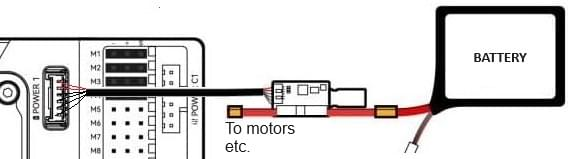
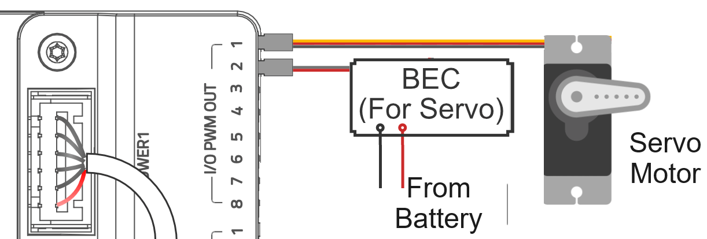

# Assembling a Multicopter

This topic provides basic instructions and links showing how to connect and assemble the core components of a typical multicoper (UAV) running PX4.

These consist of a flight controller, GPS, external compass, manual controller and/or telemetry radio system, motors and/or other control actuators, payloads, and a power system.

# Assembling a Fixed-Wing

This topic provides basic instructions and links showing how to connect and assemble the core components of a typical fixed wing vehicle (Plane) running PX4.

These consist of a flight controller, GPS, external compass, airspeed sensor, manual controller and/or telemetry radio system, motors and/or other control actuators, payloads, and a power system.

# Assembling a VTOL

This topic provides basic instructions and links showing how to connect and assemble the core components of a typical VTOL UAV running PX4.

These consist of a flight controller, GPS, external compass, airspeed sensor, manual controller and/or telemetry radio system, motors and/or other control actuators, payloads, and a power system.

# Assembling a UAS

<!-- This is the introduction for the non-specific vehicle -->

This topic provides basic instructions and links showing how to connect and assemble the core components of a typical unmanned system (UAS) running PX4.

:::tip
If you're interested in a specific vehicle, see the more targeted topics in each vehicle section:

- [Multicopter](../assembly/assembly_mc.md)
- [VTOL](../assembly/assembly_vtol.md)
- [Fixed-wing](../assembly/assembly_vtol.md)

:::

The core components consist of a flight controller, GPS, external compass, manual controller and/or telemetry radio system, motors and/or other control actuators, payloads, and a power system.
A forward flying vehicle, such as a VTOL or Fixed-wing, will generally also have an airspeed sensor.

The instructions are focussed on systems that use [Pixhawk-series](../flight_controller/pixhawk_series.md) flight controllers (FCs), and in particular those that have adopted the [Pixhawk connector standard](https://github.com/pixhawk/Pixhawk-Standards/blob/master/DS-009%20Pixhawk%20Connector%20Standard.pdf).
For these FCs, much of the "wiring up" is as simple as connecting the components into the appropriately labelled ports using supplied cables.

:::info If your FC does not use the connector standard ...
Pixhawk series flight controllers that don't follow the connector standard will often provide cables for interconnecting with Pixhawk standard components.
For other controllers you may need to manually create cables and connectors.

The [flight controller-specific guides](#fc-specific-assembly-guides) contain FC-specific wiring and configuration information, as do guides on the manufacturer sites.
:::

## Flight Controller Overview

The images below show Pixhawk v6x flight controllers from CUAV and Holybro.
Their available ports are very similar because they are both [Pixhawk standard autopilots](../flight_controller/autopilot_pixhawk_standard.md) that have adopted the [Pixhawk connector standard](https://github.com/pixhawk/Pixhawk-Standards/blob/master/DS-009%20Pixhawk%20Connector%20Standard.pdf).

The connector standard ports are listed below, along with their labels on each of the FCs, and what they are used for.
The FCs have much the same ports with similar names, and core peripherals are connected in the same way.

| Pixhawk Connector Standard  | Holybro                          | CUAV                             | Connect to ...                      |
| --------------------------- | -------------------------------- | -------------------------------- | ----------------------------------------------------------------------------------- |
| Full GPS plus Safety Switch | GPS1                             | GPS&SAFETY   | Primary GNSS module (GPS, compass, safety switch, buzzer, LED)   |
| Basic GPS                   | GPS2                             | GPS2                             | Secondary GNSS module (GNSS/compass)                             |
| CAN                         | CAN1/CAN2                        | CAN1/CAN2                        | DroneCAN devices, such as GNSS modules, motors, etc                                 |
| 텔레메트리                       | TELEM (1,2,3) | TELEM (1,2,3) | Telemetry radios, companion computers, MAVLink cameras, etc.        |
| Analog Power                | POWER (1,2)   | POWER (1,2)   | SMbus (I2C) power modules                                        |
| I2C                         | I2C                              | None                             | Other I2C peripherals                                                               |
| SPI                         | SPI                              | SPI6                             | SPI devices (note: 11 pin, not 6 as in standard) |
| PX4 Debug Full              | FMU DEBUG                        | FMU DEBUG, IO DEBUG              | Debugging on Pixhawk "x" FCs                                                        |
| Pixhawk Debug Mini          | None                             | None                             | Debugging on other Pixhawk variants                                                 |

There are some other similarities that are not part of the standard: they both have the same ethernet port (`ETH`), `SBUS OUT`, `AD&IO`, `USB`, USB-C.

There are also some important differences, most particularly in the way that the various RC Control protocols and PWM output are connected.
We'll go into those in the relevant sections.

:::tip
Remove power from the flight controller before connecting peripherals!
This is "best practice", even if it is not strictly necessary in all cases.
:::

## 콘트롤러 장착 및 장착 방향

The flight controller should ideally be [mounted on the frame](../assembly/mount_and_orient_controller.md) as close to your vehicle’s center of gravity as possible, oriented top-side up with the arrow pointing towards the front of the vehicle.

To reduce the impact of vibration on the flight controllers internal IMU(s) and gyroscope(s) you should mount the controller using mounting foam if provided, and otherwise follow manufacturer guidance.

:::info
If the controller cannot be mounted in the recommended/default orientation (e.g. due to space constraints) you will need to configure the autopilot software with the orientation that you actually used: [Flight Controller Orientation](../config/flight_controller_orientation.md).
:::

## GNSS/Compass (+ Buzzer + Safety Switch + LED)

Pixhawk Autopilot systems usually include a primary [GNSS/Compass module](../gps_compass/#supported-gnss) that incorporates a [buzzer](../getting_started/px4_basic_concepts.md#buzzer), [safety switch](../getting_started/px4_basic_concepts.md#safety-switch), and [UI LED](../getting_started/led_meanings.md#ui-led), and may also have a secondary GPS/compass module.
[RTK GNSS](../gps_compass/rtk_gps.md) modules with centimetre accuracy are also supported.

GNSS/Compass modules should be mounted on the frame as far away from other electronics as possible — separating the compass from other electronics will reduce electromagnetic interference.
Provided the direction marker is oriented upright and facing towards the front of the vehicle, or at some 45 degrees multiple offset in any axis, the orientation will be auto-detected during calibration.
If needed you can orient at other offsets, but then you'll need to manually set the orientation.
For more information see [Mounting a Compass (or GNSS/Compass)](../assembly/mount_gps_compass.md).

The modules connect to either serial ports or to the CAN bus.

### Serial Port GNSS Modules

The primary GNSS/compass module is connected to the flight controller ort labeled `GPS1` or `GPS&SAFETY`, which should be a 10-Pin JST GH connector.
A second GNSS/compass module, if present, is attached to the 6-pin port labeled `GPS2`.

:::details
The Pixhawk connector standard 10-pin _Full GPS plus Safety Switch Port_ is intended for connecting the primary GNSS.
It includes a UART port for the GNSS, and I2C port for the Compass, and pins for the [buzzer](../getting_started/px4_basic_concepts.md#buzzer), [safety switch](../getting_started/px4_basic_concepts.md#safety-switch), and [UI LED](../getting_started/led_meanings.md#ui-led).
PX4 configures this UART for use as the primary GPS by default.

The 6-pin _Basic GPS Port_, if present, includes only a UART and I2C port.
PX4 may not configure this as the secondary GPS port.
You can check/configure it yourself by following the instructions in [Serial Port Configuration.](../peripherals/serial_configuration.md).

You can use other UART ports for connecting to this kind of GPS module, but you may need to wire an appropriate cable, and port must be configured using the linked instructions.
You can also use another I2C port for connecting a magnetometer that is either standalone or part of a GNSS/compass module.
:::

### DroneCAN GNSS Modules

DroneCAN GNSS/Compass modules are connected to CAN bus ports, which are usually labeled `CAN1` and `CAN2` (as shown in the diagram above).
The [DroneCAN](../dronecan/index.md) topic has connection and configuration instructions.

### RTK GNSS Modules

[RTK GNSS](../gps_compass/rtk_gps.md) modules are connected to the dedicated FC serial ports or CAN ports in the same way as "normal" GNSS modules.
Note however that a separate base module is required for the ground station (see [RTK GNSS](../gps_compass/rtk_gps.md) for details).

<!-- https://discord.com/channels/1022170275984457759/1022185721450213396/threads/1245295551784681512 -->

## 풍속 센서

[Airspeed sensors](../sensor/airspeed.md) are highly recommended for fixed-wing and VTOL frames.
They are so important because the autopilot does not have other means to detect stall.

Almost all airspeeds sensors are connected support connection via the [I2C bus](../sensor_bus/i2c_general.md) and can be plugged into the Pixhawk standard I2C port as shown below (for a Holybro Airspeed sensor and Pixhawk 6C).
There is no need to separately power the sensor.

Note that if there are not enough free I2C ports for your peripherals, you can use an I2C Bus splitter to split the port into multiple ports.

:::warning
Some I2C devices use 5V SCL/SDA lines, while the Pixhawk standard I2C port expects 3.3V.
You can use an I2C level converter to connect these devices to a Pixhawk flight controller.
:::

## 거리 센서

[Distance sensors](../sensor/rangefinders.md) can significantly improve vehicle robustness and performance, and are required for some use cases:

- Landing can be much improved with a distance sensor:
  - Land detection is more robust.
  - Smoother landings because the sensor can help detect the right point to slow down vehicle before touchdown.
  - Reduced risk of very hard touchdown due to bad altitude estimate or incorrectly set touch point altitude.
- Enables terrain following.
- Required for robust state estimation when flying with GNSS-denied navigation (along with an [optical flow sensor](#optical-flow-sensor)).

- Allows disabling of "pusher assist" when close to the ground.

[Distance sensors](../sensor/rangefinders.md) are highly recommended as they allow for proper flaring during landing, without which smooth automated fixed-wing landings are near-impossible.

Unlike for some other components, there is no particular bus or port that is commonly used for distance sensors.
Different rangefinders will connect via I2C, CAN, serial ports, and even PWM inputs!

See [Distance sensors](../sensor/rangefinders.md) and manufacturer documentation for instructions on how to integrate a specific sensor with PX4.

## Optical Flow Sensor

[Optical Flow](../sensor/optical_flow.md) is a computer vision technique that uses a downward facing camera and a downward facing distance sensor to estimate velocity over ground.
It can be used to accurately estimate speed when navigating without GNSS — in buildings, underground, or in any other GNSS-denied environment.

Optical flow sensors may integrate both a camera and distance sensor, or just a camera (in which case a separate distance sensor is needed).
There is no standardisation on flow sensor connectivity options, and sensors may connect via I2C, CAN, MAVLink over serial ports, and so on.

See [Optical Flow sensors](../sensor/optical_flow.md) and manufacturer documentation for instructions on how to integrate a specific sensor with PX4.

## Radio Control (Optional)

A [Remote Control (RC) system](../getting_started/rc_transmitter_receiver.md) can be used to manually control a UAS.
RC systems have two parts: of a vehicle-based radio receiver connected to the flight controller, and a ground-based radio transmitter that is integrated into a handheld controller.

:::tip
PX4 does not _require_ a manual controller for autonomous flight modes.
However RC systems are essential when bringing up a new airframe, and highly recommended for other low-latency manual flight use cases.
:::

There are a number of different RC standards, such as Spektrum/DSM, S.BUS, PPM, and so on.
[Remote Control Transmitters & Receivers](../getting_started/rc_transmitter_receiver.md) explains how to select and bind a compatible transmitter/receiver.

RC Ports are not part of the Pixhawk connector standard.
The [Connecting Receivers](../getting_started/rc_transmitter_receiver.md#connecting-receivers) section explains how to identify the port to connect your particular receiver.

Generally the correct port is easy to infer from the labels on the flight controller:

- Spektrum/DSM receivers usually connect to an input that includes `DSM` in the label, such as: `DSM`, `DSM/SBUS RC`, `DSM RC`, `DSM/SBUS/RSSI`.
- PPM or SBUS receivers connect to the RC input, which is most commonly labeled `RC IN`, but may be a port with `SBUS` or `PPM` in the label.
- Pixhawk flight controllers usually come with cables for connecting to the common RC receiver types.

## 무선 텔레메트리(선택 사항)

[Telemetry radios](../telemetry/index.md) can be used by [ground control stations](../getting_started/px4_basic_concepts.md#ground-control-stations) (GCS) to communicate with vehicles in flight.
A GCS allows you to monitor and control the UAS via a graphical interface, edit, upload, and run missions, view video from a connected camera, capture video and images, and so on.

Connect the vehicle-based radio to the `TELEM1` port as shown below.
다른 텔레메트리는 일반적으로 지상국 컴퓨터나 모바일 장치에 USB를 통하여 연결됩니다.

Low-power telemetry radios (<1.5 A) are powered from the port, and generally no further configuration should be required.

If using higher power/range radios or another port you will need to separately power the radio from a BEC and modify the telemetry port data rates.
You may also need to configure the radio itself, and for IP radios you may need to connect to it via Ethernet — check radio-specific documentation for setup and configuration information.

::: details

- `TELEM1` is configured for the typical data rates of low power radios such as [SIK Radios](../telemetry/sik_radio.md).
- If you're using a radio that supports higher data rates, then you may want to modify the [serial port configuration](../peripherals/serial_configuration.md) as covered in PX4 and manufacturer documentation.
- Low power radios such as most [SIK Radios](../telemetry/sik_radio.md) and [Wifi telemetry radios](../telemetry/telemetry_wifi.md) with around 300m range are powered from the flight controller.
- High powered radios like the [Microhard Serial radio](../telemetry/microhard_serial.md) will need to be separately powered and may need to be configured (see the PX4 and manufacturer documentation).
- You can also attach telemetry radios to the `TELEM2` and `TELEM3` telemetry ports (if present).
  Note however that `TELEM2` is configured by default for connecting to a companion computer, and might need to be [reconfigured](../peripherals/mavlink_peripherals.md) to connect to a ground station.

:::

## SD 카드

SD cards are highly recommended.
Among other things they are required for [recording and analyzing flight details](../getting_started/flight_reporting.md) and using DroneCan/UAVCAN bus hardware.
A SD card is factory-installed on many flight controllers, but you should check the documentation for your FC.

:::tip
For more information see [Basic Concepts > SD Cards (Removable Memory)](../getting_started/px4_basic_concepts.md#sd-cards-removable-memory).
:::

## Power & Actuators

The diagram below shows how flight controller, motors, control surface actuators, other actuators and other systems might be wired, showing both power and PWM control signal connections.
A particular vehicle might have more/fewer motors and actuators, but the wiring _approach_ when using PWM outputs is likely to be similar!

The following sections explain each part in more detail.

:::tip
If you're using [DroneCAN ESC](../peripherals/esc_motors.md#dronecan) the control signals will be connected to the CAN BUS instead of the PWM outputs as shown.
:::

### Flight Controller Power

Pixhawk FCs require a regulated power supply that can supply at around 5V/3A continuous (check your specific FC)!
This is sufficient to power the controller itself and a few low-power peripherals, such as a GNSS module, RC transmitter, and low power telemetry radio, but not for motors, actuators, and other peripherals.

[Power modules](../power_module/index.md) are commonly used to "split off" this regulated power supply for the FC and also to provide measurements of the battery voltage and total current to the whole system — which PX4 can use to estimate power levels.
The power module is connected to the FC power port, which is normally labeled `POWER` (or `POWER 1` or `POWER 2` for FCs that have redundant power supply).
The diagram below shows what this might look like.

The other output of the power module supplies battery power for other components, including motors and actuators, high power radios, and some payloads, such as cameras, and grippers.

:::tip
Flight controller manufacturers usually recommend suitable power modules for use with their FCs (and sometimes also _Power Distribution Boards_ (PDB) that contain suitable power modules).
You don't have to use manufacturer-recommended power module (or PDB), but this is often the easiest way to ensure that the power supply matches both the FC power requirements and the communication protocol expected by its power port.
:::

:::info
FCs may have power ports that provide power information via the CAN bus.
For example, the CUAV Pixhawk 6x has I2C power ports `POWER 1` and `POWER 2`, and the CAN ports `POWER C1` and `POWER C2`.
Even though power ports are part of the Pixhawk connector standard, you should check FC specific documentation for power setup.
:::

### Power Distribution Board (PDB)

In this example the power output from the battery is first connected to a power distribution board (PDB), which breaks out the power from the input into multiple parallel outputs.
You don't have to use a PDB, but it can simplify wiring, in particular for vehicles that have several motors.

A more capable PDB may incorporate a power module (in which case they replace a stand alone module), ESCs for controlling a number of motors, and may also integrate a BEC (battery elimination circuit) for supplying power to servos and other peripherals.

### 모터

Brushless motors are powered and controlled via ESCs (electronic speed controllers).
PWM ESCs are connected with two input wires from the battery for power, two input wires from the flight controller that provide control signals (via three pin connector), and three output wires that are connected to the motor.

The power wires should be twisted in order to reduce electromagnetic interference, and kept as short and "tidy" on the frame as possible.

Any outputs on either PWM output bus can be connected to any actuators, motor, or other PWM controlled hardware, and later mapped to a particular actuator that is controlled by PX4 when configuring the [Actuator Outputs](../config/actuators.md#actuator-outputs).

참고:

- By preference you should connect ESC to FMU PWM bus outputs because they are lower-latency than IO PWM outputs.
  Note that the PWM outputs are often labeled `AUX` or `MAIN`.
  Use the `AUX` bus if both are present, and `MAIN` otherwise.
- [DShot ESC](../peripherals/dshot.md) (recommended) can only be used on the FMU PWM outputs.
- Motor outputs should be grouped together as much as possible rather than spread randomly across both the FMU and IO busses.
  This is because if you assign some function to an output, such as DShot ESC, you can't then assign adjacent unused pins for anything other than a DShot ESC.

### Servos

Servos are used to move flight control surfaces and payload actuators.
Typical wiring for power and control is shown below.

PWM servos have a three wire connector that provides both power and PWM control signals (the middle pin is the power/voltage high).
You can connect the servo outputs to any pins or bus you like, and later on configure what the output actually does in PX4.

The power rail cannot be powered by the FC itself!
A battery elimination circuit may be used to provide a regulated voltage from the battery to the middle "Power" rail on the PWM output bus, which in turn powers all connected servos.

:::warning
The power rail can only have the one voltage provided by your BEC.
If you don't use servos that all accept the same voltage, you'll need to separately power those that use a different voltage.
:::

## 기타 주변 장치

Other peripherals, such as high-power radios, cameras, and so on have their own power requirements.
These will usually be supplied off a separate BEC.

The wiring and configuration of optional/less common components is covered within the [Hardware Hardware Selection & Setup](../hardware/drone_parts.md) topics for individual peripherals.

## Build Tutorials

Assembly of the autopilot system on a specific vehicle frame depends on the actual hardware you are using, including size, geometry, materials, attachment points, and the components that are used.
This cannot be captured in a single generic set of instructions.

Instead we've provided links to specific examples of how this might be done in the build tutorials linked below.
These show end-to-end setup and configuration of a number of vehicles.

- [Kits](../frames_multicopter/kits.md)
- [DIY Builds](../frames_multicopter/diy_builds.md)

- [DIY Builds](../frames_plane/diy_builds.md)

- [Standard VTOL](../frames_vtol/standardvtol.md)
- [Tailsitter VTOL](../frames_vtol/tailsitter.md)
- [Tiltrotor VTOL](../frames_vtol/tiltrotor.md)

- Check your build: [Airframe Builds](../airframes/index.md) for complete assembly examples on different vehicle frames.

## FC-Specific Assembly Guides

:::tip
The manufacturer documentation for your [flight controller](../flight_controller/index.md) may include guides for controllers that are not listed below, or that are more up-to-date than the following guides.
:::

These guides explain how to connect the core components of the autopilot system "off the frame" for a number of popular [flight controllers](../flight_controller/index.md).
They recommend sensors, power systems, and other components from the same manufacturer.

- [CUAV Pixhawk V6X Wiring QuickStart](../assembly/quick_start_cuav_pixhawk_v6x.md)
- [CUAV V5+ Wiring Quickstart](../assembly/quick_start_cuav_v5_plus.md)
- [CUAV V5 nano Wiring Quickstart](../assembly/quick_start_cuav_v5_nano.md)
- [Holybro Pixhawk 6C Wiring Quickstart](../assembly/quick_start_pixhawk6c.md)
- [Holybro Pixhawk 6X Wiring Quickstart](../assembly/quick_start_pixhawk6x.md)
- [Holybro Pixhawk 5X Wiring Quickstart](../assembly/quick_start_pixhawk5x.md)
- [Holybro Pixhawk 4 Wiring Quickstart](../assembly/quick_start_pixhawk4.md)
- [Holybro Pixhawk 4 Mini (Discontinued) Wiring Quickstart](../assembly/quick_start_pixhawk4_mini.md)
- [Holybro Durandal Wiring Quickstart](../assembly/quick_start_durandal.md)
- [Holybro Pix32 v5 Wiring Quickstart](../assembly/quick_start_holybro_pix32_v5.md)
- [Cube Wiring Quickstart](../assembly/quick_start_cube.md) (All cube variants)
- [Pixracer Wiring Quickstart](../assembly/quick_start_pixracer.md)
- [mRo (3DR) Pixhawk Wiring Quickstart](../assembly/quick_start_pixhawk.md)

## See Also

- [Drone Components & Parts](../getting_started/px4_basic_concepts.md#drone-components-parts) (Basic Concepts)
- [Payloads](../getting_started/px4_basic_concepts.md#payloads) (Basic Concepts)
- [Hardware Selection & Setup](../hardware/drone_parts.md) — information about connecting and configuring specific flight controllers, sensors and other peripherals (e.g. airspeed sensor for planes).

  - [Mounting the Flight Controller](../assembly/mount_and_orient_controller.md)
  - [Vibration Isolation](../assembly/vibration_isolation.md)
  - [Mounting a Compass](../assembly/mount_gps_compass.md)

- [Multicopter Racer Setup](../config_mc/racer_setup.md) — racer-specific assembly and configuration information (racers don't usually have a GNSS module)

