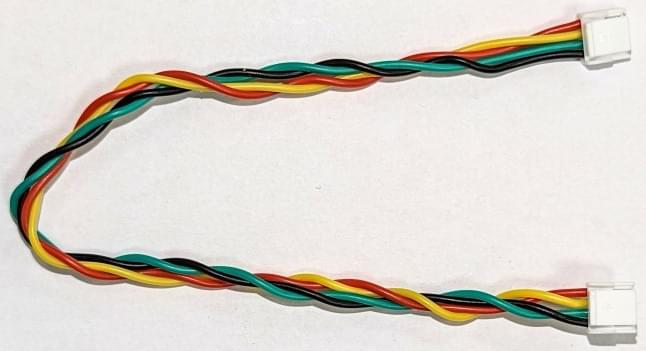
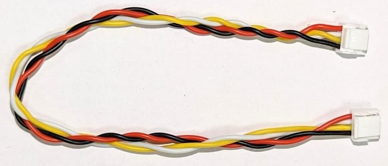

# 배선 개요

Cables are a common source of [electromagnetic interference (EMI)](https://en.wikipedia.org/wiki/Electromagnetic_interference), which can cause problems including flyways, "toilet bowling" and generally poor flight.
이러한 문제는 UAV에서 적절한 케이블을 사용하여 피할 수 있습니다.

드론 케이블링을 설계할 때 다음 기본 개념을 염두에 두어야 합니다.

- High-Power and signal cables should be separated as much as is practical.
- 케이블 길이는 유선 구성 요소를 쉽게 처리할 수 있도록 최대한 짧게 합니다.
  The wire tension should be adequate to survive possible airframe deformations even in a crash landing
  (wires must not be the first thing to break).
- 초과 길이를 줄이기 위한 케이블을 말지 않는 것이 좋습니다. 가능 하면 길이를 짧게 하십시오!
- 디지털 신호는 전송 속도를 줄여 소모 에너지를 줄이고, 데이터 전송의 견고성을 높일 수 있습니다.
  이는 높은 데이터 전송률이 필요하지 않는 경우에는 더 긴 케이블을 사용할 수 있음을 의미합니다.

## 신호 배선

신호 전송 프로토콜들은 특성이 각기 다르므로 목적에 따라 사용되는 케이블의 사양이 달라집니다.

This topic provides specific guidance of cabling for different signalling protocols, along with the [colour coding](#cable-colour-coding) used by a number different drone hardware vendors.

### I2C cables

The [I2C bus](https://en.wikipedia.org/wiki/I%C2%B2C) is widely used for connecting sensors.
여러 공급업체의 케이블 색상이 다음 표에 지정되어 있습니다.

| 신호  | Pixhawk 색상                | ThunderFly 색상             | CUAV 색상 (I2C/CAN) |
| --- | ------------------------- | ------------------------- | ------------------------------------ |
| +5V | ![red][rcircle] Red       | ![red][rcircle] Red       | ![red][rcircle] Red                  |
| SCL | ![black][blkcircle] Black | ![yellow][ycircle] Yellow | ![white][wcircle] White              |
| SDA | ![black][blkcircle] Black | ![green][gcircle] Green   | ![yellow][ycircle] Yellow            |
| GND | ![black][blkcircle] Black | ![black][blkcircle] Black | ![black][blkcircle] Black            |

The [Dronecode standard](https://github.com/pixhawk/Pixhawk-Standards/blob/master/DS-009%20Pixhawk%20Connector%20Standard.pdf) assumes a 1.5k ohm pull-up resistor on SDA and SCL signals in autopilot.

#### 케이블 꼬기

I2C 버스 신호 혼선 및 전자기 호환성은 케이블 와이어를 적절하게 비틀면 크게 향상될 수 있습니다.
[Twisted pairs](https://en.wikipedia.org/wiki/Twisted_pair) is especially important for sensor wiring.

- 10 turns for each pair SCL/+5V and SDA/GND per 30cm cable length.
  
- 케이블 길이 30cm당 두 쌍을 함께 4회 감습니다.
  

적절한 트위스트 페어 케이블을 사용할 때 I²C 버스는 일반적으로 서브미터 규모 기체에 적합합니다.
대형 항공기의 경우 CAN 또는 기타 차동 신호 기반 인터페이스를 사용하는 것이 일반적으로 더 안정적입니다.

:::info
This turns/cable-length recommendation has been successfully used with I2C sensors including the [ThunderFly TFSLOT airspeed sensor](../sensor/airspeed_tfslot.md) and [TFRPM01 Revolution Counter](../sensor/thunderfly_tachometer.md).
:::

#### 풀업 저항

풀업 저항은 I2C 버스의 모든 끝 부분에 필요합니다.
This acts both as [signal termination](https://en.wikipedia.org/wiki/Electrical_termination) and as bus idle signal generator.

풀업 저항의 정확한 값을 확인하기 위해 오실로스코프 측정이 필요한 경우가 있습니다.
I2C 버스의 신호는 명확하고 예리한 직사각형과 같은 가장자리와 몇 볼트의 진폭을 가져야 합니다.
신호의 진폭이 낮은 경우 풀업 저항 값이 너무 낮으므로 줄여야 합니다.
반올림된 신호의 경우 풀업 저항 값이 너무 높습니다.

### UAVCAN 케이블

| 신호                         | Pixhawk                   | ThunderFly                | Zubax                     | CUAV (I2C/CAN) |
| -------------------------- | ------------------------- | ------------------------- | ------------------------- | --------------------------------- |
| +5V                        | ![red][rcircle] Red       | ![red][rcircle] Red       | ![red][rcircle] Red       | ![red][rcircle] Red               |
| CAN_H | ![black][blkcircle] Black | ![white][wcircle] White   | ![white][wcircle] White   | ![white][wcircle] White           |
| CAN_L | ![black][blkcircle] Black | ![yellow][ycircle] Yellow | ![yellow][ycircle] Yellow | ![yellow][ycircle] Yellow         |
| GND                        | ![black][blkcircle] Black | ![black][blkcircle] Black | ![black][blkcircle] Black | ![black][blkcircle] Black         |

#### Cable Twisting

I2C 케이블과 같은 이유로 CAN 케이블도 꼬는 것이 좋습니다.
CAN의 경우 권장되는 비틀림은 다음과 같습니다.

- 10 turns for each pair GND/+5V and CAN_L/CAN_H per 30cm cable length.
  
- 케이블 길이 30cm당 두 쌍을 함께 4회 감습니다.

### SPI

[SPI](https://en.wikipedia.org/wiki/Serial_Peripheral_Interface) is synchronous serial communication interface used for connecting faster sensors and devices.
This protocol is commonly use is for connecting [optical flow](../sensor/optical_flow.md) sensors or special telemetry modems.

| 신호   | Pixhawk 색상                | ThunderFly 색상             |
| ---- | ------------------------- | ------------------------- |
| +5V  | ![red][rcircle] Red       | ![red][rcircle] Red       |
| SCK  | ![black][blkcircle] Black | ![yellow][ycircle] Yellow |
| MISO | ![black][blkcircle] Black | ![blue][bluecircle] Blue  |
| MOSI | ![black][blkcircle] Black | ![green][gcircle] Green   |
| CS1  | ![black][blkcircle] Black | ![white][wcircle] White   |
| CS2  | ![black][blkcircle] Black | ![blue][bluecircle] Blue  |
| GND  | ![black][blkcircle] Black | ![black][blkcircle] Black |

### UART

UART는 주변 장치를 자동 조종 장치에 연결하는 데 사용됩니다.
기본적으로 UART는 네트웤을 지원하지 않으므로 두 장치를 직접 연결합니다.
It is often used to connect an autopilot and a [radio modem](../telemetry/index.md).

CTS 및 RTS는 데이터가 TX/RX 핀에서 전송되고 있음을 나타내는 데 사용되는 신호입니다.
이 핸드셰이크 메커니즘은 데이터 전송의 신뢰성을 높입니다.
CTS 및 RTS는 장치에서 사용하지 않을 때 느슨한 상태로 남아 있을 수 있습니다.

연결 케이블은 교차되지 않습니다.
따라서, 이 직선 케이블로 자동 조종 장치와 주변 장치만 연결하면 됩니다.
장치는 RX/TX 및 RTS/CTS 핀을 교환하여 내부적으로 배선을 교차하여야 합니다.

| 신호  | Pixhawk 색상                | ThunderFly 색상             |
| --- | ------------------------- | ------------------------- |
| +5V | ![red][rcircle] Red       | ![red][rcircle] Red       |
| TX  | ![black][blkcircle] Black | ![white][wcircle] White   |
| RX  | ![black][blkcircle] Black | ![green][gcircle] Green   |
| CTS | ![black][blkcircle] Black | ![blue][bluecircle] Blue  |
| RTS | ![black][blkcircle] Black | ![yellow][ycircle] Yellow |
| GND | ![black][blkcircle] Black | ![black][blkcircle] Black |

UART 신호는 저주파 EMI의 일반적인 소스이므로 케이블 길이를 최대한 최소화해야 합니다. UART 케이블은 꼬임이 필요하지 않습니다.

### GPS(UART) & SAFETY

[GPS receivers and magnetometers](../gps_compass/index.md) are generally very sensitive to EMI.
따라서, RF 소스(고출력 케이블, ESC, 무선 모뎀 및 안테나)에서 멀리 떨어진 곳에 장착하여야 합니다.
케이블링이 잘못 설계된 경우 오동작할 수 있습니다.

| 신호                                                      | Pixhawk 색상                | ThunderFly 색상             |
| ------------------------------------------------------- | ------------------------- | ------------------------- |
| +5V                                                     | ![red][rcircle] Red       | ![red][rcircle] Red       |
| TX                                                      | ![black][blkcircle] Black | ![white][wcircle] White   |
| RX                                                      | ![black][blkcircle] Black | ![green][gcircle] Green   |
| SCL                                                     | ![black][blkcircle] Black | ![yellow][ycircle] Yellow |
| SDA                                                     | ![black][blkcircle] Black | ![green][gcircle] Green   |
| SAFETY_SW                          | ![black][blkcircle] Black | ![white][wcircle] White   |
| SAFETY_SW_LED | ![black][blkcircle] Black | ![blue][bluecircle] Blue  |
| +3V3                                                    | ![black][blkcircle] Black | ![red][rcircle] Red       |
| BUZZER                                                  | ![black][blkcircle] Black | ![blue][bluecircle] Blue  |
| GND                                                     | ![black][blkcircle] Black | ![black][blkcircle] Black |

### GPS

| 신호  | Pixhawk 색상                | ThunderFly 색상             |
| --- | ------------------------- | ------------------------- |
| +5V | ![red][rcircle] Red       | ![red][rcircle] Red       |
| TX  | ![black][blkcircle] Black | ![white][wcircle] White   |
| RX  | ![black][blkcircle] Black | ![green][gcircle] Green   |
| SCL | ![black][blkcircle] Black | ![yellow][ycircle] Yellow |
| SDA | ![black][blkcircle] Black | ![green][gcircle] Green   |
| GND | ![black][blkcircle] Black | ![black][blkcircle] Black |

GPS 케이블은 UART 및 I2C 버스에 모두 연결됩니다.
UART 배선은 꼬울 필요가 없으므로, 케이블의 길이는 짧을 수록 좋습니다.

### 아날로그 신호(전원 모듈)

| 신호      | Pixhawk 색상                | ThunderFly 색상             | CUAV 색상                   |
| ------- | ------------------------- | ------------------------- | ------------------------- |
| VCC     | ![red][rcircle] Red       | ![red][rcircle] Red       | ![red][rcircle] Red       |
| VCC     | ![black][blkcircle] Black | ![red][rcircle] Red       | ![red][rcircle] Red       |
| CURRENT | ![black][blkcircle] Black | ![white][wcircle] White   | ![white][wcircle] White   |
| VOLTAGE | ![black][blkcircle] Black | ![yellow][ycircle] Yellow | ![yellow][ycircle] Yellow |
| GND     | ![black][blkcircle] Black | ![black][blkcircle] Black | ![black][blkcircle] Black |
| GND     | ![black][blkcircle] Black | ![black][blkcircle] Black | ![black][blkcircle] Black |

이 커넥터는 상대적으로 고전력 및 저전압 신호를 혼합한 예입니다.
아쉽게도 꼬임은 고전력 GND 및 VCC 전선에만 적용할 수 있습니다.
자동 조종 장치로 잡음이 많은 아날로그 신호를 송수신에는 별로 도움이 되지 않습니다.

### SAFETY

| 신호                                                      | Pixhawk 색상                | ThunderFly 색상             |
| ------------------------------------------------------- | ------------------------- | ------------------------- |
| SAFE_VCC                           | ![red][rcircle] Red       | ![red][rcircle] Red       |
| SAFETY_SW_LED | ![black][blkcircle] Black | ![blue][bluecircle] Blue  |
| SAFETY_SW                          | ![black][blkcircle] Black | ![white][wcircle] White   |
| BUZZER                                                  | ![black][blkcircle] Black | ![blue][bluecircle] Blue  |
| +5V                                                     | ![black][blkcircle] Black | ![red][rcircle] Red       |
| GND                                                     | ![black][blkcircle] Black | ![black][blkcircle] Black |

## 고전력 배선

고전력 배선의 경우 가장 중요한 설계 기준은 충분한 전류가 흐를 수 있는 전선 굵기입니다.
일반적인 단면적 요구 사항은 와이어 전류 8A당 1mm²의 면적입니다.

실용적이지 않지만, 양극과 음극 전선을 함께 꼬는 것이 좋습니다.

고전력 케이블의 EMI는 자력계에 상당한 영향을 미칩니다.
이러한 이유로 고전력 케이블과 항법 자력계 사이에는 거리를 두는 것이 좋습니다.

### 케이블 색상 코딩

대부분의 제조업체는 고압선에 빨간색을 사용하고 접지에 검정색을 사용합니다.
기타 색상은 제조사 재량입니다.
The [Pixhawk connector standard](https://github.com/pixhawk/Pixhawk-Standards/blob/master/DS-009%20Pixhawk%20Connector%20Standard.pdf) requires only that the Voltage Common Collector (VCC) pin/cable be red.

신호 와이어의 색상은 특정 케이블을 식별하는 데 도움이 되어 드론을 더 쉽게 조립할 수 있습니다.

쉬운 케이블 식별을 위해 설계된 색상 코딩 체계는 다음 규칙을 따를 수 있습니다.

- 빨간색과 검은색은 전원용으로 예약되어 있습니다.
- 동일한 신호 유형은 동일한 색상을 가져야 합니다.
- 신호의 색상은 서로 인접한 와이어의 커넥터에서 반복되지 않습니다.
- 핀 수가 동일한 배선 하니스는 고유한 색상 순서를 가져야 합니다.
  이것은 케이블 유형을 결정합니다.
  (매뉴얼에 사용된 사진에 특히 유용합니다.)

이러한 규칙에 따라 설계된 케이블 색상의 예는 다음과 같습니다.

| 색상                  | 명칭 | 선호하는 사용법            |
| ------------------- | -- | ------------------- |
| ![red][rcircle]     | 빨강 | 전원 전압               |
| ![green][gcircle]   | 녹색 | 범용 신호               |
| ![white][wcircle]   | 흰색 | 범용 신호               |
| ![yellow][ycircle]  | 노랑 | 범용 신호               |
| ![blue][bluecircle] | 청색 | 전원 복귀, 오픈 컬렉터 제어 신호 |
| ![black][blkcircle] | 검정 | GND, 전원 반환 접지       |

<!-- references for the image source.
This approach just allows more compact markdown -->

[ycircle]: ../../assets/hardware/cables/yellow.png
[rcircle]: ../../assets/hardware/cables/red.png
[gcircle]: ../../assets/hardware/cables/green.png
[wcircle]: ../../assets/hardware/cables/white.png
[bluecircle]: ../../assets/hardware/cables/blue.png
[blkcircle]: ../../assets/hardware/cables/black.png

:::info
The above rules were provided by Thunderfly and are used in their cable design.

Thunderfly 및 일부 다른 공급업체의 케이블 색상 코딩은 아래 섹션에 나와 있습니다.
핀 레이블은 자동 조종 장치 쪽의 핀 배치에 해당합니다.
모든 케이블은 직선(1:1)입니다.
크로스오버(예: UART)가 필요한 경우 장치의 내부 연결을 통해 해결하여야 합니다.
:::
