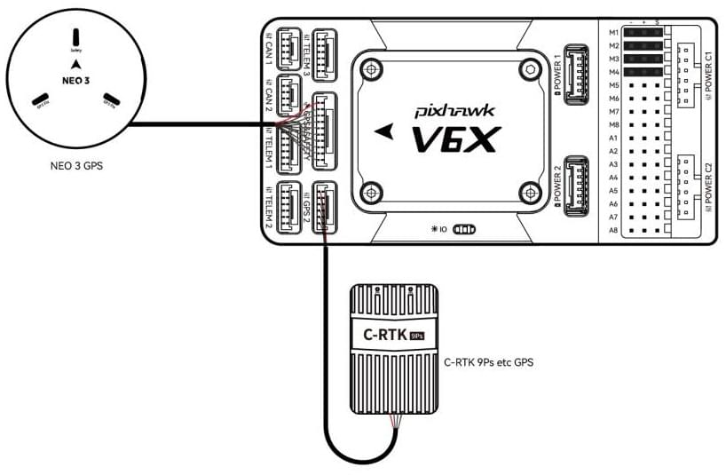
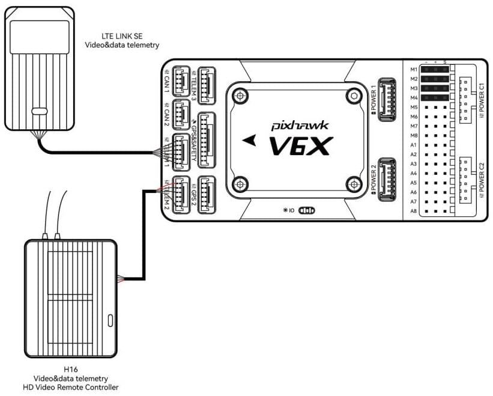
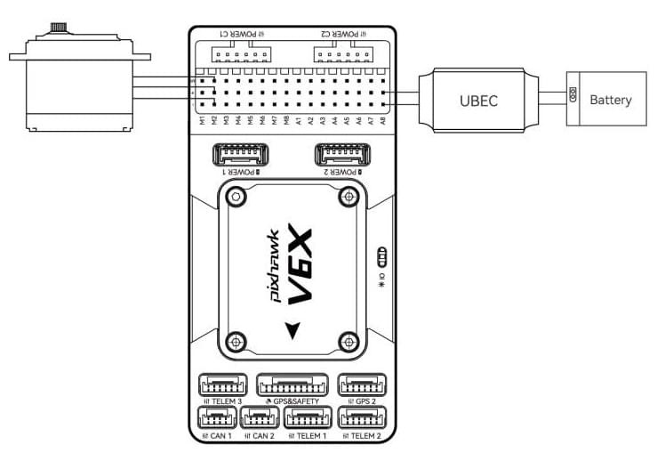

# CUAV Pixhawk V6X Wiring Quick Start

This quick start guide shows how to power the [Pixhawk V6X&reg;](../flight_controller/cuav_pixhawk_v6x.md) flight controller and connect its most important peripherals.

## 배선 개요

아래의 이미지는 주요 센서와 주변 장치(모터 및 서보 출력 제외)들의 연결 방법을 설명합니다.
다음 섹션에서 각 장치에 대하여 자세히 설명합니다.

| 인터페이스                            | **Function**                                                                                                                                                                                      |
| :------------------------------- | :------------------------------------------------------------------------------------------------------------------------------------------------------------------------------------------------ |
| POWER C1                         | Connect CAN PMU SE to this interface; this interface is connected to UAVCAN power module                                                                                                          |
| POWER C2                         | Connect CAN PMU SE to this interface; this interface is connected to UAVCAN power module                                                                                                          |
| POWER 1                          | Connect SMbus (I2C) power module                                                                                                                                               |
| POWER 2                          | Connect SMbus (I2C) power module                                                                                                                                               |
| GPS&SAFETY   | Connect Neo series GPS/C-RTK 9PS, including GPS, safety switch, buzzer interface.                                                                                                 |
| GPS2                             | Connect GPS/RTK module                                                                                                                                                                            |
| UART 4                           | User customizable                                                                                                                                                                                 |
| TELEM (1,2,3) | Connect telemetry or MAVLink devices                                                                                                                                                              |
| TF CARD                          | 로그 저장용 SD 카드 (카드는 공장에서 미리 삽입됨).                                                                                                                                |
| M1~M8            | IO PWM output (for connecting to ESC and Servo)                                                                                                                                |
| A1~A8            | FMU PWM output. Can be defined as PWM/GPIO; supports dshot; used to connect camera shutter/hot shoe, servo, etc.                                                  |
| USB                              | 펌웨어로드 등의 작업을 위하여 비행 콘트롤러와 컴퓨터간의 통신을 위하여 컴퓨터에 연결합니다.                                                                                                                               |
| CAN1/CAN2                        | Connect Dronecan/UAVCAN devices such as NEO3 Pro.                                                                                                                                 |
| DSM/SUB/RSSI                     | Includes DSM, SBUS, RSSI signal input interface, DSM interface can be connected to DSM satellite receiver, SBUS interface to SBUS remote control receiver, RSSI for signal strength return module |
| PPM                              | Connecting the PPM RC Receiver                                                                                                                                                                    |
| ETH                              | Ethernet interface. Connect Ethernet devices such as task computers                                                                                                               |
| AD&IO        | There are two analog inputs (ADC3.3/ADC6.6); generally not used                                                                                |

## Vehicle Front

:::info
If the controller cannot be mounted in the recommended/default orientation (e.g. due to space constraints) you will need to configure the autopilot software with the orientation that you actually used: [Flight Controller Orientation](../config/flight_controller_orientation.md).
:::

## GPS + 나침반 + 부저 + 안전 스위치 + LED

The Pixhawk&reg; V6X can be purchased with a [NEO3 GPS](https://store.cuav.net/shop/neo-3/) (10-pin connector) and should be connected to the **GPS1** port.
These GNSS modules feature an integrated compass, safety switch, buzzer and LEDs.

If you need to use assisted GPS, connect to the **GPS2** port.

The GPS/compass should be [mounted on the frame](../assembly/mount_gps_compass.md) as far away from other electronics as possible, with the direction markings towards the front of the vehicle (separating the compass from other electronics will reduce interference).

:::info
Pixhawk V6X&reg; is not compatible with NEO V2 GPS built-in buzzer: you should use [NEO3/NEO 3Pro](https://store.cuav.net/shop/neo-3/) instead.
The GPS module's integrated safety switch is enabled _by default_ (when enabled, PX4 will not let you arm the vehicle).
비활성화하려면 안전 스위치를 1초간 길게 누르십시오.
안전 스위치를 다시 눌러 안전 장치를 활성화하고 기체 시동을 끌 수 있습니다.
조종기나 지상국 프로그램에서 기체 시동을 끌 수 없는 상황에서 유용합니다.
:::

## 무선 조종

A remote control (RC) radio system is required if you want to _manually_ control your vehicle (PX4 does not require a radio system for autonomous flight modes).

You will need to [select a compatible transmitter/receiver](../getting_started/rc_transmitter_receiver.md) and then _bind_ them so that they communicate (read the instructions that come with your specific transmitter/receiver).

- Spektrum/DSM receivers connect to the **DSM/SBUS** input.
- PPM receivers connect to the **PPM** input port.

For more information about selecting a radio system, receiver compatibility, and binding your transmitter/receiver pair, see: [Remote Control Transmitters & Receivers](../getting_started/rc_transmitter_receiver.md).

## 전원

Pixhawk V6X&reg; is equipped with a CAN PMU lite module that supports 3~14s lithium battery.
Connect the 6pin connector of the module to the flight control **Power C1** or **Power C2** interface.

_Pixhawk V6X_ power port receives Dronecan digital signal from CAN PMU lite power module for voltage, current and remaining battery data, the VCC line must provide at least 3A continuous current and should default to 5.2V.
A lower voltage of 5V is still acceptable but discouraged.

## Telemetry (Radio) System

[Telemetry radios](../telemetry/index.md) may be used to communicate and control a vehicle in flight from a ground station (for example, you can direct the UAV to a particular position, or upload a new mission).

The vehicle-based radio should be connected to the **TELEM1**/**TELEM2**/**TELEM3** port as shown below (if connected to **TELEM1**, no further configuration is required).
다른 텔레메트리는 일반적으로 지상국 컴퓨터나 모바일 장치에 USB를 통하여 연결됩니다.

You can also purchase telemetry radios from the [CUAV store](https://store.cuav.net/uav-telemetry-module/).

## SD 카드

SD cards are highly recommended as they are required for [recording and analyzing flight details](../getting_started/flight_reporting.md), running tasks and using UAVCAN bus hardware.
An SD card is already installed on Pixhawk V6X&reg; when it leaves the factory.

:::tip
For more information see [Basic Concepts > SD Cards (Removable Memory)](../getting_started/px4_basic_concepts.md#sd-cards-removable-memory).
:::

## Motors/Servo

Motors/servos are connected to the **M1~M8** (**MAIN**) and **A1~A8** (**AUX**) ports in the order specified for your vehicle in the [Airframe Reference](../airframes/airframe_reference.md).

:::info
The **MAIN** outputs in the PX4 firmware are mapped to the Pixhawk V6X's M1~M8 ports (from IO), while the **AUX outputs** are mapped to the A1~A8 ports (from the FMU).
For example, **MAIN1** maps to M1 pin and **AUX1** maps to A1 pin.
이 참고사항은 모든 지원되는 기체 프레임의 출력 포트의 모터/서보 연결 리스트입니다. 프레임이 참고사항에 기재되어 있지 않다면, 올바른 유형의 "일반" 프레임을 사용하십시오.
:::

:::warning
The mapping is not consistent across frames (e.g. you can't rely on the throttle being on the same output for all plane frames).
가지고 있는 기체의 프레임에 대해 올바르게 모터를 제대로 연결하였는지 다시 한 번 확인하십시오.
:::

## Servo Power Supply

Pixhawk V6X&reg; does not supply power to the servos.
If using a plane or rover, an external BEC (e.g., BEC-equipped ESC or separate 5V BEC or 2S LiPo battery) needs to be connected to any of the power (+) pins in M1~M8/A1~A8 to drive the servos .

:::info
The power rail voltage must be appropriate for the servo being used!
:::

## 기타 주변 장치

The wiring and configuration of optional/less common components is covered within the topics for individual [peripherals](../peripherals/index.md).

## 핀배열

## 설정

General configuration information is covered in: [Autopilot Configuration](../config/index.md).

QuadPlane specific configuration is covered here: [QuadPlane VTOL Configuration](../config_vtol/vtol_quad_configuration.md)

## 추가 정보

- [CUAV Docs](https://doc.cuav.net/) (CUAV)
- [Pixhawk V6X](../flight_controller/cuav_pixhawk_v6x.md) (PX4 Doc Overview page)
- [Pixhawk Autopilot FMUv6X Standard](https://github.com/pixhawk/Pixhawk-Standards/blob/master/DS-012%20Pixhawk%20Autopilot%20v6X%20Standard.pdf)
- [Pixhawk Autopilot Bus Standard](https://github.com/pixhawk/Pixhawk-Standards/blob/master/DS-010%20Pixhawk%20Autopilot%20Bus%20Standard.pdf)
- [Pixhawk Connector Standard](https://github.com/pixhawk/Pixhawk-Standards/blob/master/DS-009%20Pixhawk%20Connector%20Standard.pdf)
