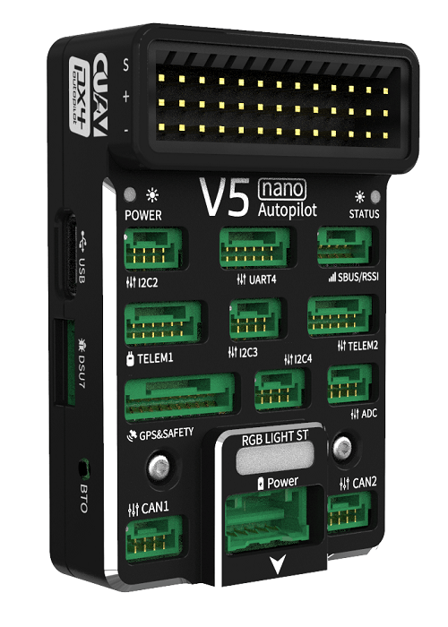
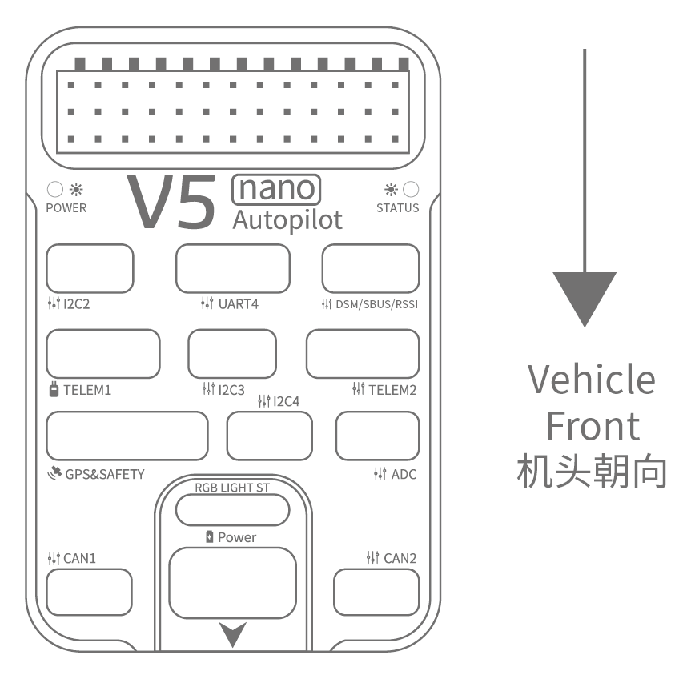
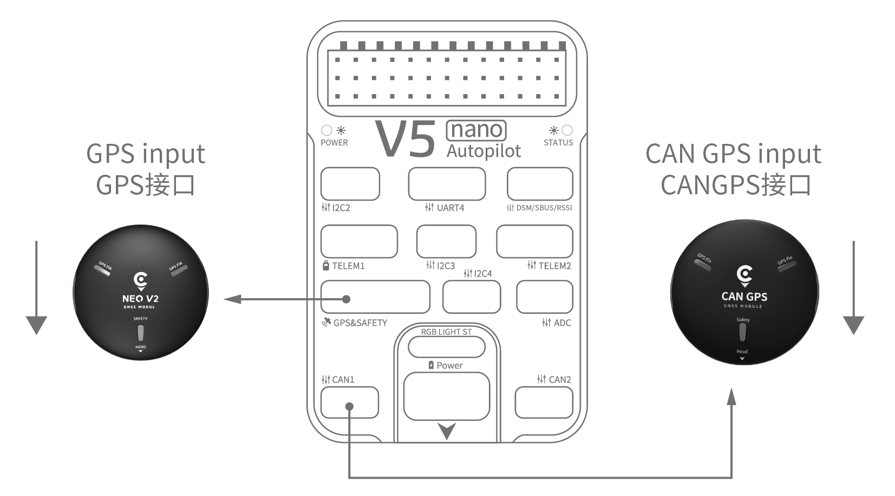
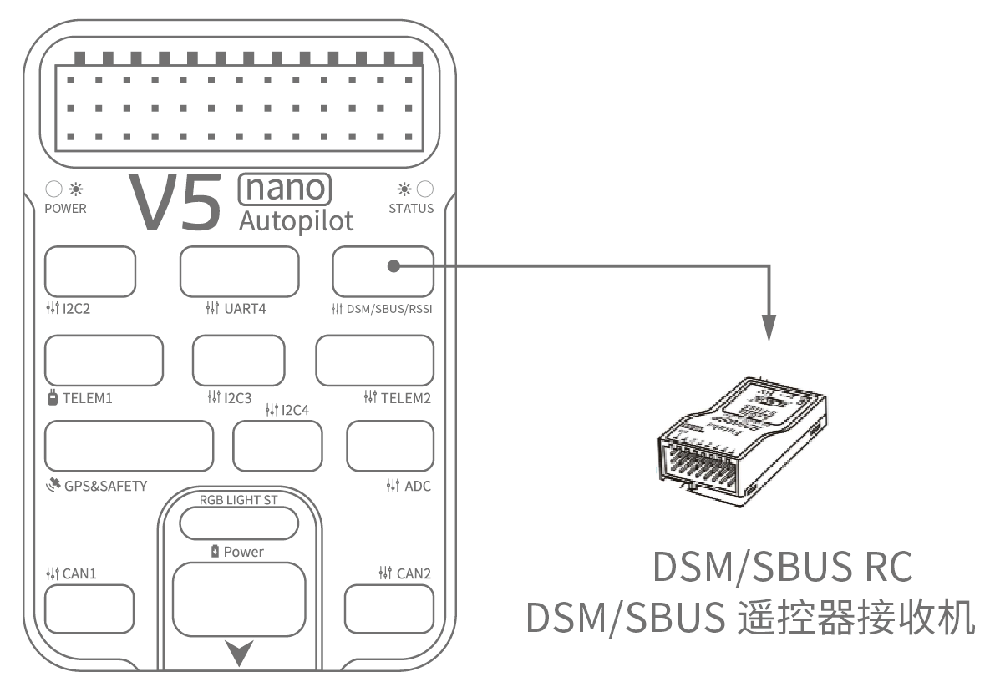
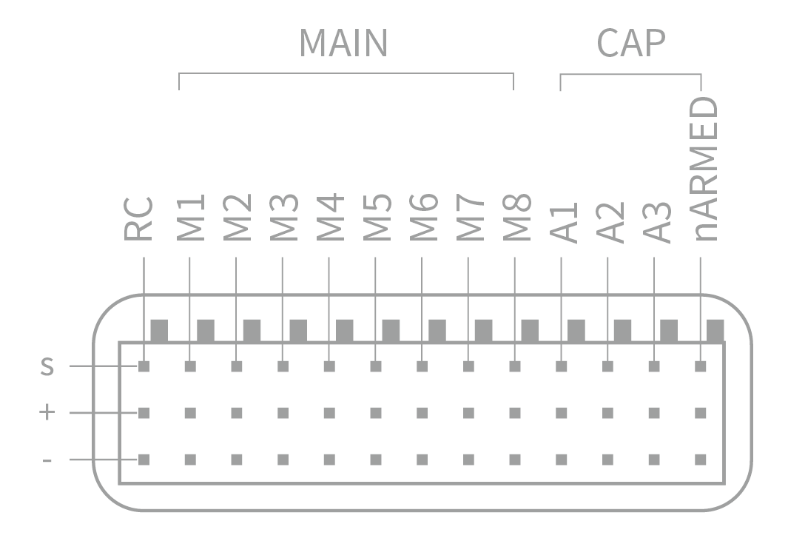
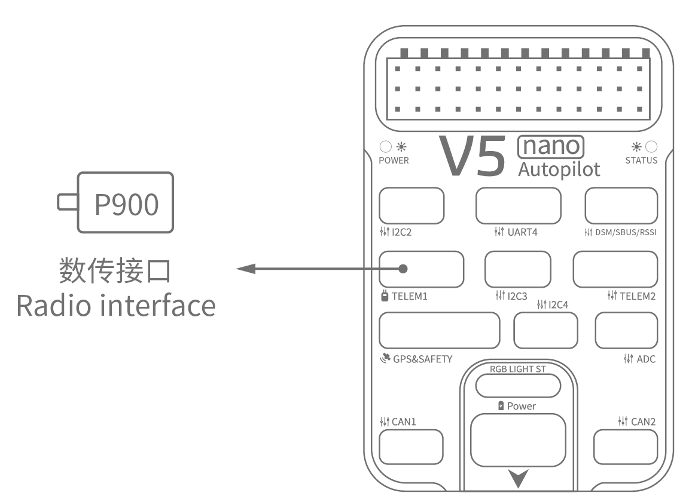
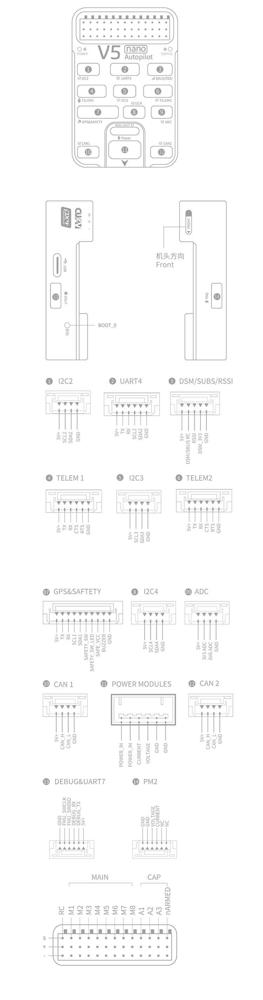

# CUAV V5 nano 배선 빠른 시작

:::warning
PX4 does not manufacture this (or any) autopilot.
Contact the [manufacturer](https://store.cuav.net/) for hardware support or compliance issues.
:::

This quick start guide shows how to power the [CUAV V5 nano](../flight_controller/cuav_v5_nano.md) flight controller and connect its most important peripherals.

## 배선 개요

아래의 이미지는 주요 센서와 주변 장치(모터 및 서보 출력 제외)들의 연결 방법을 설명합니다.
다음 섹션에서 각 장치에 대하여 자세히 설명합니다.

| 인터페이스                              | 기능                                                                                                                                  |
| :--------------------------------- | :---------------------------------------------------------------------------------------------------------------------------------- |
| 전원                                 | 전원 모듈을 연결하십시오. 전력 및 ANALOG 전압 및 전류 측정을 제공합니다.                                                       |
| PM2                                | [Do not use with PX4](../flight_controller/cuav_v5_nano.md#compatibility_pm2)                                                       |
| TF CARD                            | 로그 저장용 SD 카드 (카드와 함께 제공)                                                                                         |
| M1~M8              | PWM 출력 모터와 서보를 콘트롤 합니다.                                                                                             |
| A1~A3              | Capture pins (not _currently_ supported on PX4).                                                 |
| nARMED                             | FMU 시동 상태를 나타냅니다. 액티브 로우 (시동시 낮음)입니다.                                            |
| DSU7                               | FMU 디버그에 사용되며 디버그 정보를 획득합니다.                                                                                        |
| I2C2/I2C3/I2C4                     | 외부 나침반과 같은 I2C 장치를 연결합니다.                                                                                           |
| CAN1/CAN2                          | CAN GPS와 같은 UAVCAN 장치를 연결합니다.                                                                                       |
| TYPE-C\(USB\) | 펌웨어 업로드 등의 작업시에 비행 콘트롤러와 컴퓨터를 연결합니다.                                                                                |
| GPS&SAFETY     | GPS, 안전 스위치 및 부저가 포함된 Neo GPS에 연결합니다.                                                                               |
| TELEM1/TELEM2                      | 텔레메트리에 연결합니다.                                                                                                       |
| DSM/SBUS/RSSI                      | DSM, SBUS, RSSI 신호 입력 인터페이스, DSM 인터페이스는 DSM 위성 수신기에 연결 가능, SBUS 인터페이스는 SBUS 원격 제어 수신기에 연결 가능, 신호 강도 반환 모듈용 RSSI 포함. |

:::info
For more interface information, please read [V5 nano Manual](http://manual.cuav.net/V5-nano.pdf).
:::

:::info
If the controller cannot be mounted in the recommended/default orientation (e.g. due to space constraints) you will need to configure the autopilot software with the orientation that you actually used: [Flight Controller Orientation](../gps_compass/rtk_gps.md).
:::

## GPS + 나침반 + 안전 스위치 + LED

The recommended GPS module is the _Neo v2 GPS_, which contains GPS, compass, safety switch, buzzer, LED status light.

:::info
Other GPS modules may not work (see [this compatibility issue](../flight_controller/cuav_v5_nano.md#compatibility_gps)).
:::

The GPS/Compass module should be [mounted on the frame](../assembly/mount_gps_compass.md) as far away from other electronics as possible, with the direction marker towards the front of the vehicle (Neo GPS arrow is in the same direction as the flight control arrow).
케이블을 사용하여 비행 제어 GPS에 연결합니다.

:::info
If you use CAN GPS, please use the cable to connect to the flight control CAN interface.
:::

## 안전 스위치

The dedicated safety switch that comes with the V5+ is only required if you are not using the recommended _Neo v2 GPS_ (which has an inbuilt safety switch).

If you are flying without the GPS you must attach the switch directly to the `GPS1` port in order to be able to arm the vehicle and fly (If you use the old 6-pin GPS, please read the definition of the bottom interface to change the line).

## 부저

If you do not use the recommended _Neo v2 GPS_ the buzzer may not work.

## 무선 조종

차량을 수동 제어에는 무선 조종기가 필요합니다.
PX4의 자율 비행은 무선조종기가 필수 사항은 아닙니다.
기체와 조종자가 통신하기 위하여 송신기와 수신기를 바인딩하여야 합니다.
송신기와 수신기의 매뉴얼을 참고하십시오.

아래 그림은 원격 수신기에 액세스하는 방법을 보여줍니다 (키트에서 S.BUS 케이블을 찾으십시오)

## Spektrum Satellite 수신기

V5 nano에는 전용 DSM 케이블이 있습니다.
If using a Spektrum satellite receiver, this should be connected to the flight controller `DSM/SBUS/RSSI` interface.

## 전원

The _v5 nano_ kit includes the _HV_PM_ module, which supports 2~14S LiPo batteries.
Connect the 6pin connector of the _HW_PM_ module to the flight control `Power` interface.

:::warning
The supplied power module is unfused.
Power **must** be turned off while connecting peripherals.
:::

:::info
The power module is not a power source for peripherals connected to the PWM outputs.
서보/액추에이터를 연결하는 경우에는 BEC를 사용하여 별도로 전원을 공급하여야 합니다.
:::

## 텔레메트리(선택 사항)

지상국에서는 텔레메트리를 사용하여 기체를 통신, 모니터링, 제어 합니다.
기체를 특정 위치로 움직이도록 지시하거나, 새로운 임무를 업로드할 수 있습니다.

통신 채널은 텔레메트리를 통하여 이루어집니다.
The vehicle-based radio should be connected to the **TELEM1** or **TELEM2** port (if connected to these ports, no further configuration is required).
다른 라디오는 지상국 컴퓨터 또는 모바일 장치에 USB를 통하여 연결합니다.

## SD 카드(선택 사항)

An [SD card](../getting_started/px4_basic_concepts.md#sd-cards-removable-memory) is inserted in the factory (you do not need to do anything).

## 모터

Motors/servos are connected to the MAIN ports in the order specified for your vehicle in the [Airframes Reference](../airframes/airframe_reference.md).

## 핀배열

## 추가 정보

- [Airframe buildlog using CUAV v5 nano on a DJI FlameWheel450](../frames_multicopter/dji_f450_cuav_5nano.md)
- [CUAV V5 nano](../flight_controller/cuav_v5_nano.md)
- [V5 nano manual](http://manual.cuav.net/V5-nano.pdf) (CUAV)
- [FMUv5 reference design pinout](https://docs.google.com/spreadsheets/d/1-n0__BYDedQrc_2NHqBenG1DNepAgnHpSGglke-QQwY/edit#gid=912976165) (CUAV)
- [CUAV Github](https://github.com/cuav) (CUAV)
