# 큐브 배선 개요

:::warning
PX4 does not manufacture this (or any) autopilot.
Contact the [manufacturer](https://cubepilot.org/#/home) for hardware support or compliance issues.

Note also that while [Cube Black](../flight_controller/pixhawk-2.md) is [fully supported by PX4](../flight_controller/autopilot_pixhawk_standard.md), [Cube Yellow](../flight_controller/cubepilot_cube_yellow.md) and [Cube Orange](../flight_controller/cubepilot_cube_orange.md) are [Manufacturer Supported](../flight_controller/autopilot_manufacturer_supported.md).
:::

This quick start guide shows how to power the _Cube_&reg; flight controllers and connect their most important peripherals.

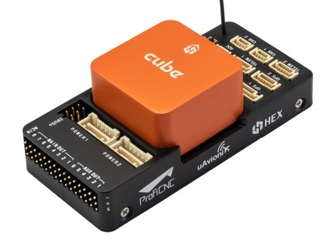 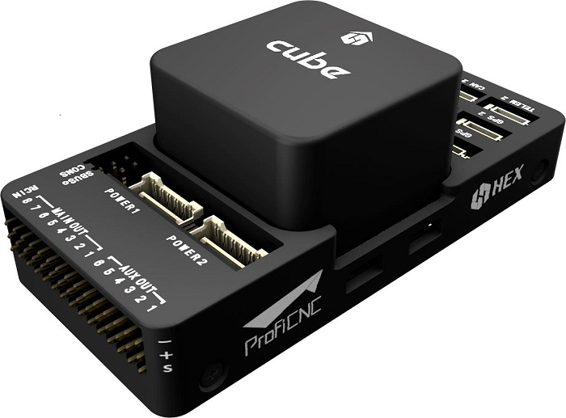 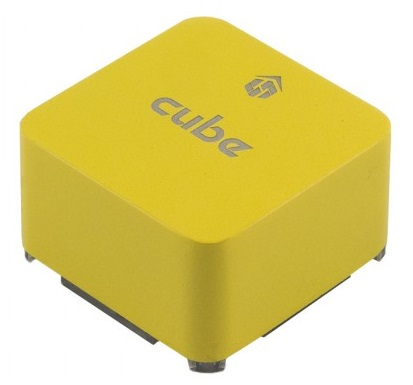

:::tip
The instructions apply to all Cube variants, including [Cube Black](../flight_controller/pixhawk-2.md), [Cube Yellow](../flight_controller/cubepilot_cube_yellow.md) and [Cube Orange](../flight_controller/cubepilot_cube_orange.md).
Further/updated information may be available in the [Cube User Manual](https://docs.cubepilot.org/user-guides/autopilot/the-cube-user-manual) (Cube Docs).
:::

## 소품

Cube comes with most (or all) of the accessories you will need when [purchased](../flight_controller/pixhawk-2.md#stores).

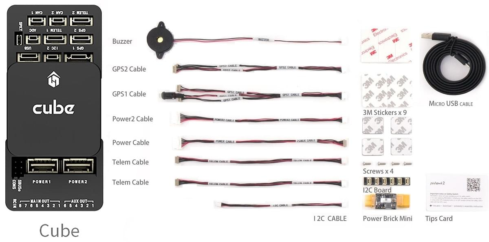

The exception is that some kits do not include a GPS, which will have to be purchased separately ([see below](#gps)).

## 배선 개요

아래 그림은 주요 센서와 주변기기 연결 방법을 설명합니다. 다음 섹션에서 각 장치에 대하여 자세히 설명합니다.

1. [Telemetry System](#telemetry) — Allows you to plan/run missions, and control and monitor the vehicle in real time. 일반적으로 텔레메트리 라디오, 태블릿/PC와 지상국 프로그램이 해당합니다.
2. [Buzzer](#buzzer) — Provides audio signals that indicate what the UAV is doing
3. [Remote Control Receiver System](#rc_control) — Connects to a hand-held transmitter that an operator can use to manually fly the vehicle (shown is a PWM receiver with PWM->PPM converter).
4. (Dedicated) [Safety switch](#safety-switch) — Press and hold to lock and unlock motors. Only required if you are not using the recommended [GPS](#gps) with inbuilt safety switch.
5. [GPS, Compass, LED, Safety Switch](#gps) — The recommended GPS module contains GPS, Compass, LED and Safety Switch.
6. [Power System](#power) — Powers Cube and the motor ESCs. LiPo 배터리,전원 모듈, 그리고 추가 배터리 경고 시스템 (배터리 전원이 설정된 전압보다 낮을 때 경고음)으로 구성됩니다.

:::info
The port labeled `GPS2` maps to `TEL4` in PX4 (i.e. if connecting to the port labeled `GPS2`, assign the [serial port configuration parameter](../peripherals/serial_configuration.md) for the connected hardware to `TEL4`).
:::

:::tip
More information about available ports can be found here: [Cube > Ports](../flight_controller/pixhawk-2.md#ports).
:::

## 콘트롤러 장착 및 장착 방향

Mount the Cube as close as possible to your vehicle’s center of gravity,
ideally oriented top-side up and with the arrow pointing towards the front of the vehicle (note the _subtle_ arrow marker on top of the cube)

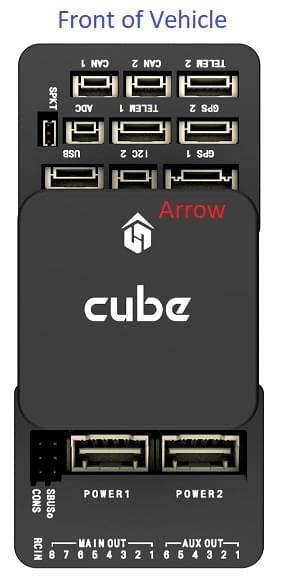

:::info
If the controller cannot be mounted in the recommended/default orientation (e.g. due to space constraints) you will need to configure the autopilot software with the orientation that you actually used: [Flight Controller Orientation](../config/flight_controller_orientation.md).
:::

Cube를 (키트에 포함된) 진동 감쇠 폼 패드 또는 장착 나사를 사용해 장착할 수 있습니다.
Cube 액세서리에 포함된 장착 1.8mm 두께의 프레임보드 전용으로 설계되었습니다.
커스텀 나사는 나사산 길이가 6mm~7.55mm인 M2.5 나사여야 합니다.

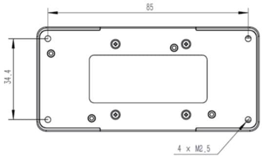

## GPS + 나침반 + 안전 스위치 + LED

The recommended GPS modules are the _Here_ and [Here+](../gps_compass/rtk_gps_hex_hereplus.md), both of which incorporate a GPS module, Compass, Safety Switch and [LEDs](../getting_started/led_meanings.md).
The difference between the modules is that _Here+_ supports centimeter level positioning via [RTK](../gps_compass/rtk_gps.md). RTK 지원을 제외하면, 두 모듈의 연결 방법은 같습니다.

:::warning
The [Here+](../gps_compass/rtk_gps_hex_hereplus.md) has been superseded by the [Here3](https://www.cubepilot.org/#/here/here3) a [DroneCAN](../dronecan/index.md) RTK-GNSS that incorporate a compass and [LEDs](../getting_started/led_meanings.md) (but no safety switch).
See [DroneCAN](../dronecan/index.md) for _Here3_ wiring and PX4 configuration information.
:::

GPS/나침반은 차량 전방 표식를 사용하여 가능하면 전자 장치들에서 멀리 떨어진 프레임에 장착하는 것이 좋습니다. 나침반은 다른 전자 장치와 떨어지면 간섭이 줄어듦니다. It must be connected to the `GPS1` port using the supplied 8-pin cable.

아래의 다이어그램은 모듈 연결의 개요를 나타냅니다.

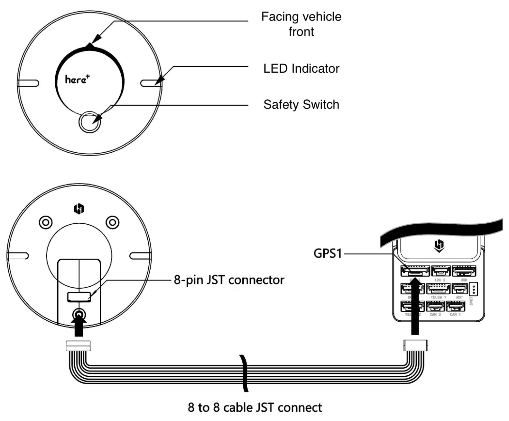

:::info
The GPS module's integrated safety switch is enabled _by default_ (when enabled, PX4 will not let you arm the vehicle).
비활성화하려면 안전 스위치를 1초간 길게 누르십시오. 안전 스위치를 다시 눌러 안전 장치를 활성화하고 기체 시동을 끌 수 있습니다.
조종기나 지상국 프로그램에서 기체 시동을 끌 수 없는 상황에서 유용합니다.
:::

:::tip
If you want to use an old-style 6-pin GPS module, the kit comes with a cable that you can use to connect both the GPS and [Safety Switch](#safety-switch).
:::

## 안전 스위치

The _dedicated_ safety switch that comes with the Cube is only required if you are not using the recommended [GPS](#gps) (which has an inbuilt safety switch).

If you are flying without the GPS you must attach the switch directly to the `GPS1` port in order to be able to arm the vehicle and fly (or via a supplied cable if using an old-style 6-pin GPS).

## 부저

The buzzer plays [tones and tunes](../getting_started/tunes.md) that provide audible notification of vehicle status (including tones that are helpful for debugging startup issues, and that notify of conditions that might affect safe operation of the vehicle).

버저는 아래와 같이 USB포트에 연결합니다. 추가 설정은 필요하지 않습니다.

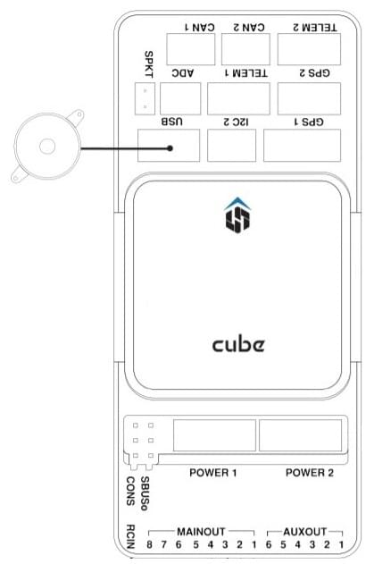

## 무선 조종

A [remote control (RC) radio system](../getting_started/rc_transmitter_receiver.md) is required if you want to _manually_ control your vehicle (PX4 does not require a radio system for autonomous flight modes).

You will need to [select a compatible transmitter/receiver](../getting_started/rc_transmitter_receiver.md) and then _bind_ them so that they communicate (read the instructions that come with your specific transmitter/receiver).

아래의 지침은 다양한 유형의 수신기를 연결하는 방법을 설명합니다.

### PPM-SUM / Futaba S.Bus 수신기

제공된 3선식 서보 케이블을 사용하여 접지(-), 전원(+) 및 신호(S) 선을 RC 핀에 연결합니다.

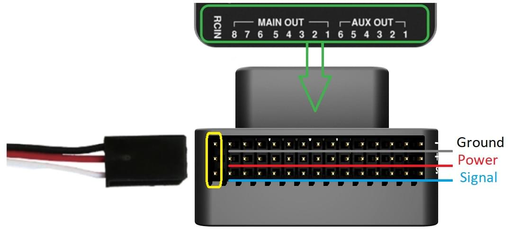

### Spektrum Satellite 수신기

Spektrum DSM, DSM2, and DSM-X Satellite RC receivers connect to the **SPKT/DSM** port.

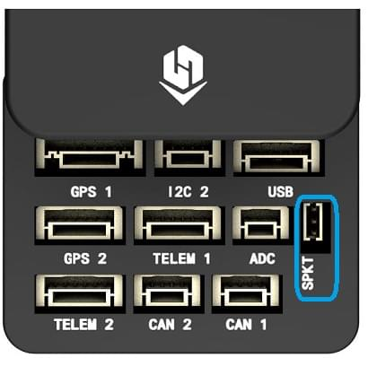

### PWM 수신기

The Cube cannot directly connect to PPM or PWM receivers that have an _individual wire for each channel_.
PWM receivers must therefore connect to the **RCIN** port _via_ a PPM encoder module,
which may be purchased from hex.aero or proficnc.com.

## 전원

Cube is typically powered from a Lithium Ion Polymer (LiPo) Battery via a Power Module (supplied with the kit) that is connected to the **POWER1** port.
The power module provides reliable supply and voltage/current indication to the board, and may _separately_ supply power to ESCs that are used to drive motors on a multicopter vehicle.

멀티콥터의 일반적인 전원 설정은 다음과 같습니다.

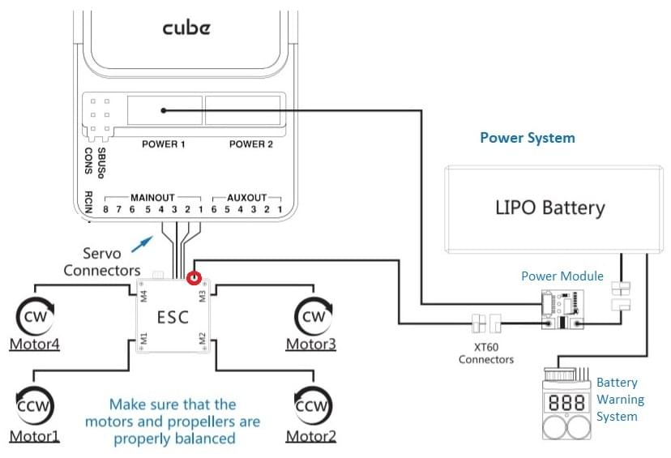

:::info
The power (+) rail of **MAIN/AUX** is _not powered_ by the power module supply to the flight controller.
방향타, 엘레본 등의 서보를 구동하려면 별도로 전원을 공급하여야 합니다.

이것은 BEC가 장착된 ESC, 독립형 5V BEC 또는 2S LiPo 배터리에 전원 레일을 연결하여 수행할 수 있습니다.
사용하는 서보의 전압을 확인하십시오!
:::

## 텔레메트리(선택 사항)

지상국에서는 텔레메트리를 사용하여 기체를 통신, 모니터링, 제어 합니다.
기체를 특정 위치로 움직이도록 지시하거나, 새로운 임무를 업로드할 수 있습니다.

The communication channel is via [Telemetry Radios](../telemetry/index.md). The vehicle-based radio should be connected to the **TELEM1** port (if connected to this port, no further configuration is required). 다른 라디오는 지상국 컴퓨터 또는 모바일 장치에 USB를 통하여 연결합니다.

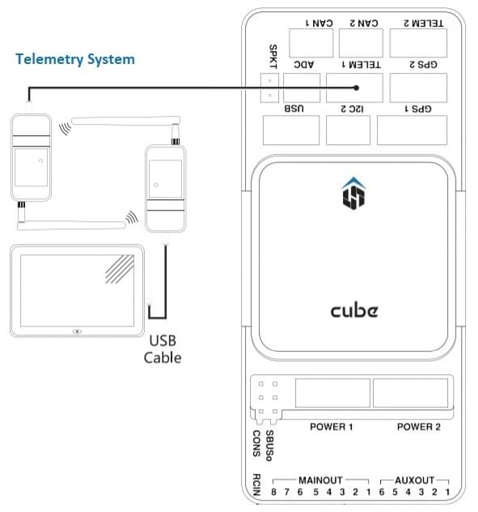

## SD 카드(선택 사항)

SD cards are highly recommended as they are needed to [log and analyse flight details](../getting_started/flight_reporting.md), to run missions, and to use UAVCAN-bus hardware.
Micro-SD 카드를 그림과 같이 Cube에 삽입합니다(아직 없는 경우).

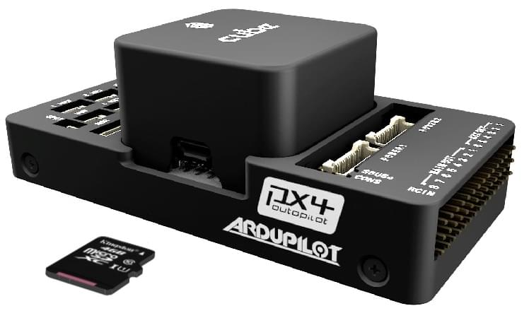

:::tip
For more information see [Basic Concepts > SD Cards (Removable Memory)](../getting_started/px4_basic_concepts.md#sd-cards-removable-memory).
:::

## 모터

Motors/servos are connected to the **MAIN** and **AUX** ports in the order specified for your vehicle in the [Airframe Reference](../airframes/airframe_reference.md).

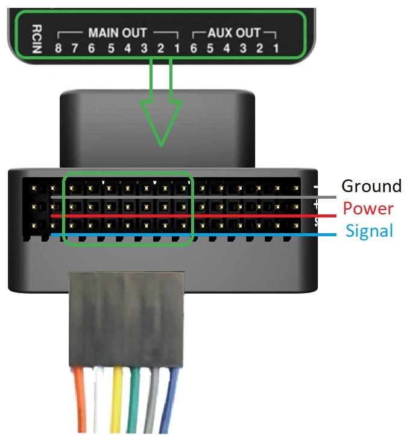

:::info
이 참고사항은 모든 지원되는 기체 프레임의 출력 포트의 모터/서보 연결 리스트입니다. 프레임이 참고사항에 기재되어 있지 않다면, 올바른 유형의 "일반" 프레임을 사용하십시오.
:::

:::warning
The mapping is not consistent across frames (e.g. you can't rely on the throttle being on the same output for all plane frames). 가지고 있는 기체의 프레임에 대해 올바르게 모터를 제대로 연결하였는지 다시 한 번 확인하십시오.
:::

## 기타 주변 장치

The wiring and configuration of optional/less common components is covered within the topics for individual [peripherals](../peripherals/index.md).

:::info
If connecting peripherals to the port labeled `GPS2`, assign the PX4 [serial port configuration parameter](../peripherals/serial_configuration.md) for the hardware to `TEL4` (not GPS2).
:::

## 설정

Configuration is performed using [QGroundContro](http://qgroundcontrol.com/).

After downloading, installing and running _QGroundControl_, connect the board to your computer as shown.

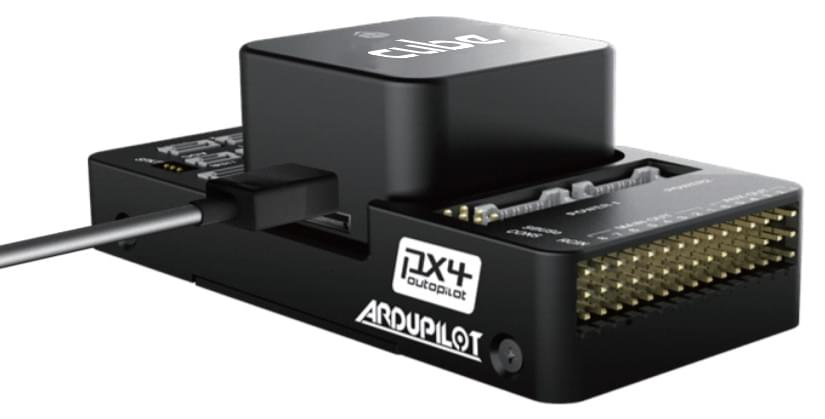

Basic/common configuration information is covered in: [Autopilot Configuration](../config/index.md).

QuadPlane specific configuration is covered here: [QuadPlane VTOL Configuration](../config_vtol/vtol_quad_configuration.md)

<!-- what about config of other vtol types and plane. Do the instructions in these ones above apply for tailsitters etc? -->

### 부트로더 업데이트

PX4 펌웨어를 플래시한 후 [Program PX4IO(../getting_started/tunes.md#program-px4io) 경고음이 발생하면, 부트로더를 업데이트해야 할 수 있습니다.

안전 스위치를 사용하여 강제로 부트로더를 업데이트할 수 있습니다.
이 기능을 사용하려면 Cube의 전원을 차단하려면, 안전 스위치를 누른 상태에서 USB를 통해 Cube에 전원을 공급하십시오.

## 추가 정보

- [Cube Black](../flight_controller/pixhawk-2.md)
- [Cube Yellow](../flight_controller/cubepilot_cube_yellow.md)
- [Cube Orange](../flight_controller/cubepilot_cube_orange.md)
- Cube 문서 (제조사) :
  - [Cube Module Overview](https://docs.cubepilot.org/user-guides/autopilot/the-cube-module-overview)
  - [Cube User Manual](https://docs.cubepilot.org/user-guides/autopilot/the-cube-user-manual)
  - [Mini Carrier Board](https://docs.cubepilot.org/user-guides/carrier-boards/mini-carrier-board)
