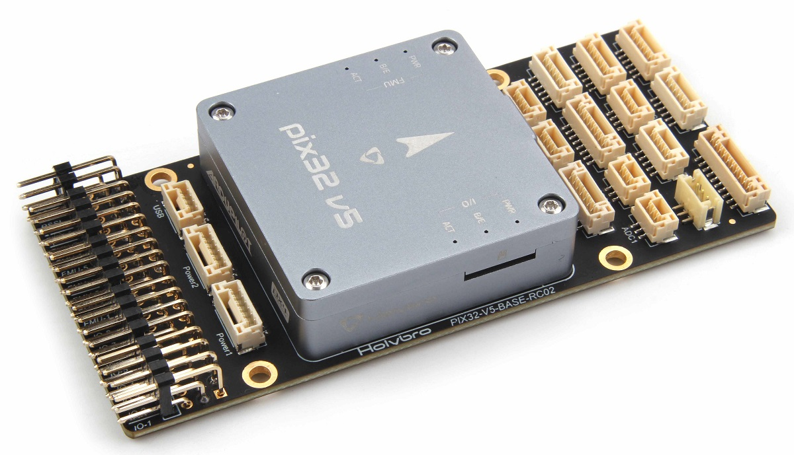
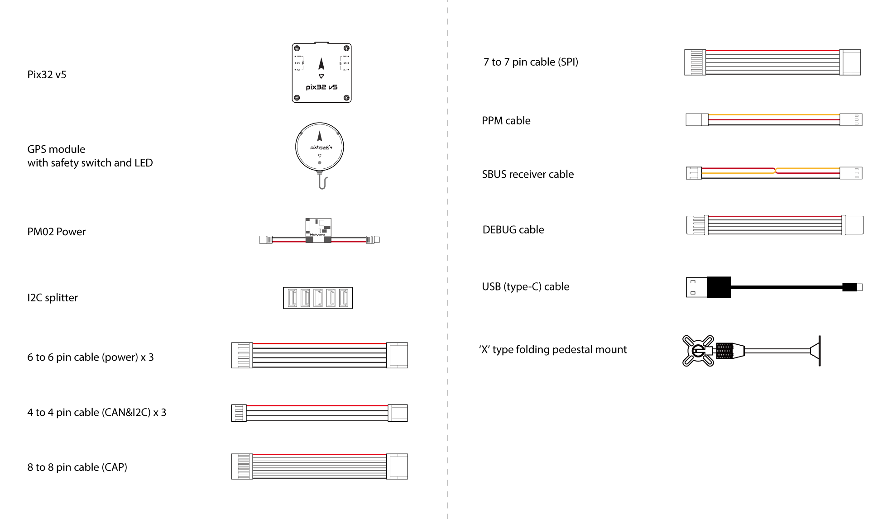
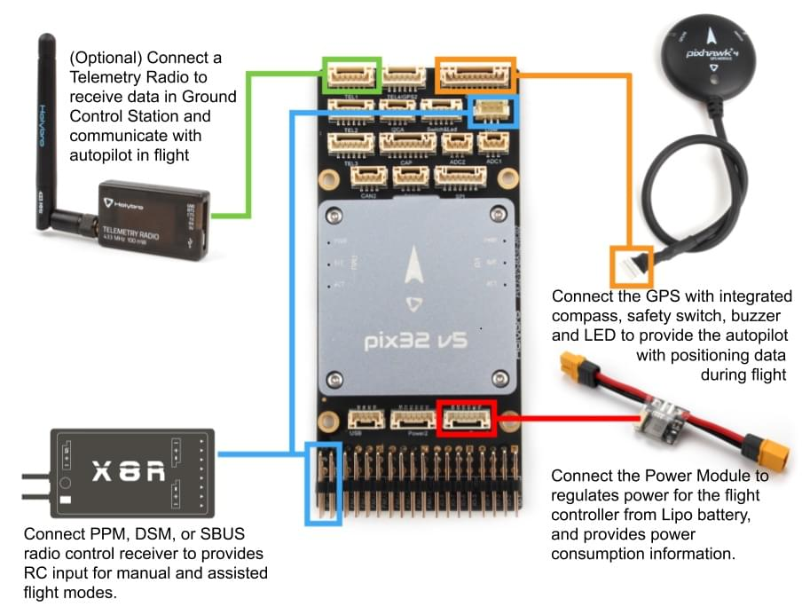
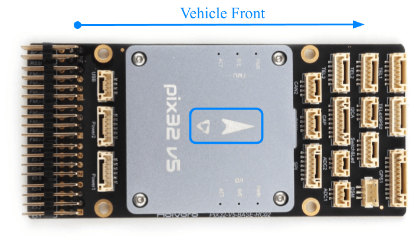
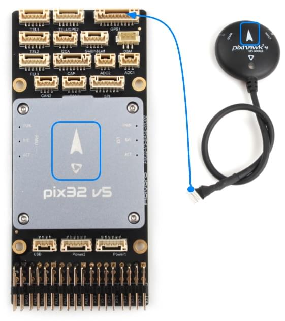
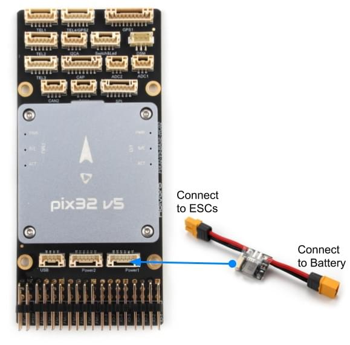
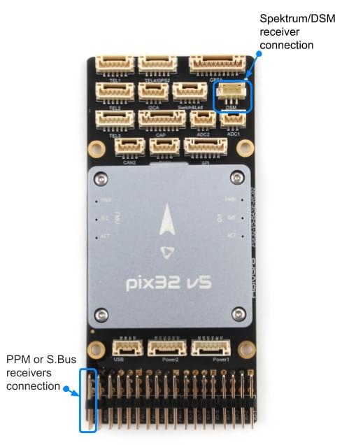
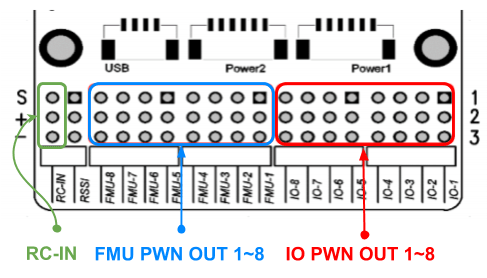
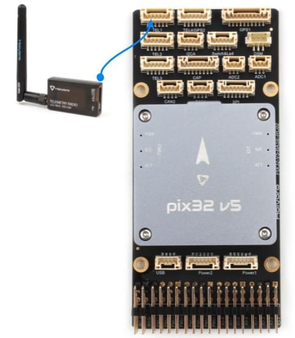
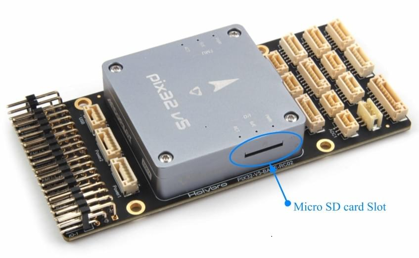

# 픽스32 v5 배선 방법

:::warning
PX4 does not manufacture this (or any) autopilot.
Contact the [manufacturer](https://holybro.com/) for hardware support or compliance issues.
:::

This quick start guide shows how to power the [Holybro Pix32v5](../flight_controller/holybro_pix32_v5.md)&reg; flight controller and connect its most important peripherals.

## 포장 개봉

Pix32 v5 is sold bundled with a number of different combinations of accessories, including the _pix32 v5 Base board_, power module _PM02 V3_, and the [Holybro M8N GPS](https://holybro.com/collections/gps/products/m8n-gps) (UBLOX NEO-M8N).

The content of the box with the _PM02 V3_ power module and _Pixhawk 4 GPS/Compass_ is shown below.
상자에는 핀 배치 가이드 및 전원 모듈 지침과 베이스 보드(아래 회로도에는 표시되지 않음)가 포함되어 있습니다.

## 배선 개요

아래의 이미지는 주요 센서와 주변 장치(모터 및 서보 출력 제외)들의 연결 방법을 설명합니다.
다음 섹션에서 각 장치에 대하여 자세히 설명합니다.

:::tip
More information about available ports can be found [here](https://cdn.shopify.com/s/files/1/0604/5905/7341/files/Holybro_Pix32-V5-Base-Mini-Pinouts.pdf).
:::

## 콘트롤러 장착 및 장착 방향

_Pix32 v5_ should be mounted on the frame positioned as close to your vehicle’s center of gravity as possible, oriented top-side up with the arrow pointing towards the front of the vehicle.

:::info
If the controller cannot be mounted in the recommended/default orientation (e.g. due to space constraints) you will need to configure the autopilot software with the orientation that you actually used: [Flight Controller Orientation](../config/flight_controller_orientation.md).
:::

:::tip
The board has internal vibration-isolation.
10 핀 케이블을 사용하여 <a href="../flight_controller/durandal.md#gps">GPS 포트</a>에 연결합니다.
:::

## GPS + 나침반 + 부저 + 안전 스위치 + LED

Pix32 v5 is designed to work well with the [Holybro M8N GPS](https://holybro.com/collections/gps/products/m8n-gps), which has an integrated compass, safety switch, buzzer and LED.
It connects directly to the **GPS port** using the 10 pin cable.

GPS/나침반은 차량 전방 표식를 사용하여 가능하면 전자 장치들에서 멀리 떨어진 프레임에 장착하는 것이 좋습니다. 나침반은 다른 전자 장치와 떨어지면 간섭이 줄어듦니다.

:::info
The GPS module's integrated safety switch is enabled _by default_ (when enabled, PX4 will not let you arm the vehicle).
비활성화하려면 안전 스위치를 1초간 길게 누르십시오.
안전 스위치를 다시 눌러 안전 장치를 활성화하고 기체 시동을 끌 수 있습니다.
조종기나 지상국 프로그램에서 기체 시동을 끌 수 없는 상황에서 유용합니다.
:::

## 전원

전원 모듈 또는 배전 보드를 사용하여 모터와 서보에 전원을 공급하고 소비 전력을 측정할 수 있습니다.
비행 콘트롤러에 배터리의 전력을 공급합니다.

### PM02 v3 전원 모듈

The [Power Module (PM02 v3)](../power_module/holybro_pm02.md) can be bundled with _pix32 v5_.
It provides regulated power to flight controller and sends battery voltage/current to the flight controller.

Connect the output of the _Power Module_ as shown.

- PM voltage/current port: connect to POWER1 port (or `POWER2`) using the 6-wire GH cable supplied.
- PM 입력 (XT60 수 커넥터) : LiPo 배터리(2 ~ 12S)에 연결합니다.
- PM 전원 출력 (XT60 암 커넥터) : 모든 모터 ESC에 케이블을 연결합니다.

:::info
As this power module does not include power distribution wiring, you would normally just connect all the ESCs in parallel to the power module output (the ESC must be appropriate for the supplied voltage level).
:::

:::info
The 8 pin power (+) rail of **MAIN/AUX** is not powered by the power module supply to the flight controller.
방향타, 엘레본 등의 서보를 구동하기 위해 별도로 전원을 공급해야하는 경우에는 파워 레일을 BEC 장착 ESC 또는 독립형 5V BEC나 2S LiPo 배터리에 연결합니다.
사용하는 서보의 전압을 확인하십시오.
:::

전원 모듈에는 다음과 같은 특성과 제약 사항이 있습니다.

- 최대 입력 전압 : 60V
- 최대 전류 감지 : 120A 전압
- SV ADC 스위칭 레귤레이터 출력에 대해 설정된 전원은 최대 5.2V 및 3A를 출력합니다.
- 무게 : 20g
- 패키지 내용물 :
  - PM02 보드
  - 6 핀 MLX 케이블 (1 개)
  - 6 핀 GH 케이블 (1 개)

### 배터리 설정

The battery/power setup must be configured in [Battery Estimation Tuning](../config/battery.md).
For either Power Module you will need to configure the _Number of Cells_.

You will not need to update the _voltage divider_ unless you are using some other power module (e.g. the one from the Pixracer).

## 무선 조종

A remote control (RC) radio system is required if you want to _manually_ control your vehicle (PX4 does not require a radio system for autonomous flight modes).

You will need to [select a compatible transmitter/receiver](../getting_started/rc_transmitter_receiver.md) and then _bind_ them so that they communicate (read the instructions that come with your specific transmitter/receiver).

The instructions below show how to connect the different types of receivers to _Pix32 v5_ with Baseboard:

- Spektrum/DSM receivers connect to the **DSM RC** input shown below.

  

- PPM and S.Bus receivers connect to the **SBUS_IN/PPM_IN** input port (marked as RC IN):

  

- PPM and PWM receivers that have an _individual wire for each channel_ must connect to the **PPM RC** port _via a PPM encoder_ [like this one](http://www.getfpv.com/radios/radio-accessories/holybro-ppm-encoder-module.html) (PPM-Sum receivers use a single signal wire for all channels).

For more information about selecting a radio system, receiver compatibility, and binding your transmitter/receiver pair, see: [Remote Control Transmitters & Receivers](../getting_started/rc_transmitter_receiver.md).

## 무선 텔레메트리(선택 사항)

무선 텔레메트리는 지상국 프로그램에서 비행 차량의 통신/제어에 사용합니다(예 : UAV를 특정 위치로 지시하거나 새 임무를 업로드 할 수 있음).

The vehicle-based radio should be connected to the **TELEM1** port as shown below (if connected to this port, no further configuration is required).
다른 텔레메트리는 일반적으로 지상국 컴퓨터나 모바일 장치에 USB를 통하여 연결됩니다.

## SD 카드(선택 사항)

SD cards are most commonly used to [log and analyse flight details](../getting_started/flight_reporting.md).
A micro SD card should come preinstalled on the pix32 v5, if you have your own micro SD card, insert the card into _pix32 v5_ as shown below.

:::tip
The SanDisk Extreme U3 32GB is [highly recommended](../dev_log/logging.md#sd-cards).
:::

## 모터

Motors/servos control signals are connected to the **I/O PWM OUT** (**MAIN**) and **FMU PWM OUT** (**AUX**) ports in the order specified for your vehicle in the [Airframe Reference](../airframes/airframe_reference.md).

The motors must be separately [powered](#power).

:::info
If your frame is not listed in the airframe reference then use a "generic" airframe of the correct type.
:::

## 기타 주변 장치

The wiring and configuration of optional/less common components is covered within the topics for individual [peripherals](../peripherals/index.md).

## 핀배열

[Pix32 v5 Pinouts](https://cdn.shopify.com/s/files/1/0604/5905/7341/files/Holybro_Pix32-V5-Base-Mini-Pinouts.pdf) (Holybro)

## 설정

General configuration information is covered in: [Autopilot Configuration](../config/index.md).

QuadPlane specific configuration is covered here: [QuadPlane VTOL Configuration](../config_vtol/vtol_quad_configuration.md)

<!-- Nice to have detailed wiring infographic and instructions for different vehicle types. -->

## 추가 정보

- [Pix32 v5 Overview](../flight_controller/holybro_pix32_v5.md) (Overview page)
- [Pix32 v5 Technical Data Sheet](https://cdn.shopify.com/s/files/1/0604/5905/7341/files/Holybro_PIX32-V5_technical_data_sheet_v1.1.pdf)
- [Pix32 v5 Pinouts](https://cdn.shopify.com/s/files/1/0604/5905/7341/files/Holybro_Pix32-V5-Base-Mini-Pinouts.pdf)
- [Pix32 v5 Base Schematic Diagram](https://cdn.shopify.com/s/files/1/0604/5905/7341/files/Holybro_PIX32-V5-BASE-Schematic_diagram.pdf)
- [Pix32 v5 Base Components Layout](https://holybro.com/manual/Holybro_PIX32-V5-BASE-ComponentsLayout.pdf)
- [FMUv5 reference design pinout](https://docs.google.com/spreadsheets/d/1-n0__BYDedQrc_2NHqBenG1DNepAgnHpSGglke-QQwY/edit#gid=912976165).
