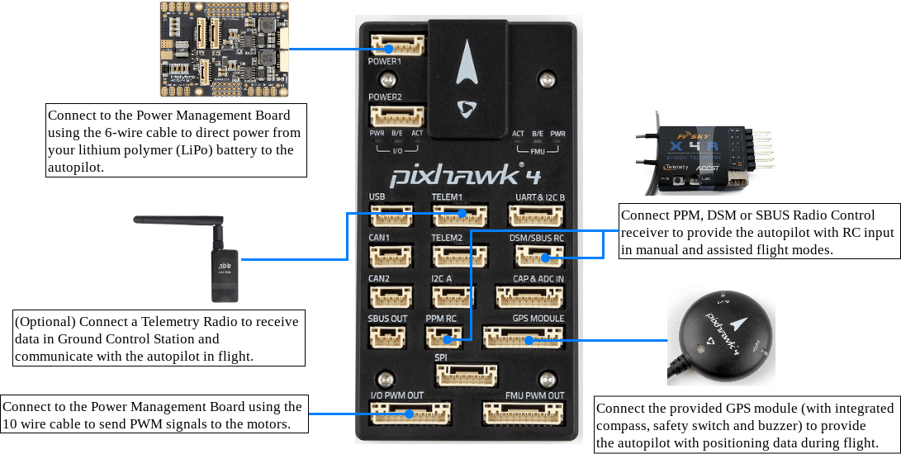
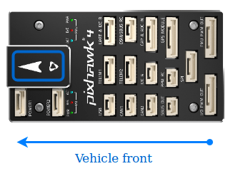
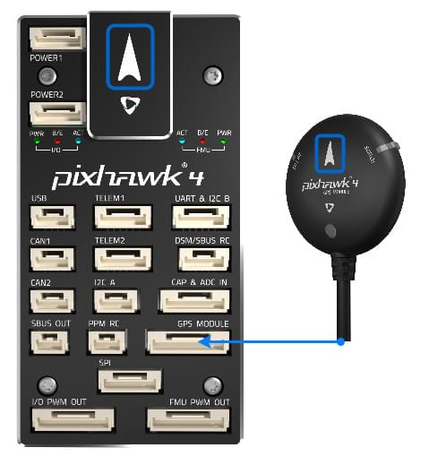
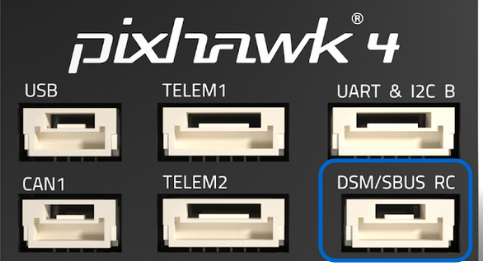
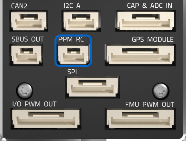
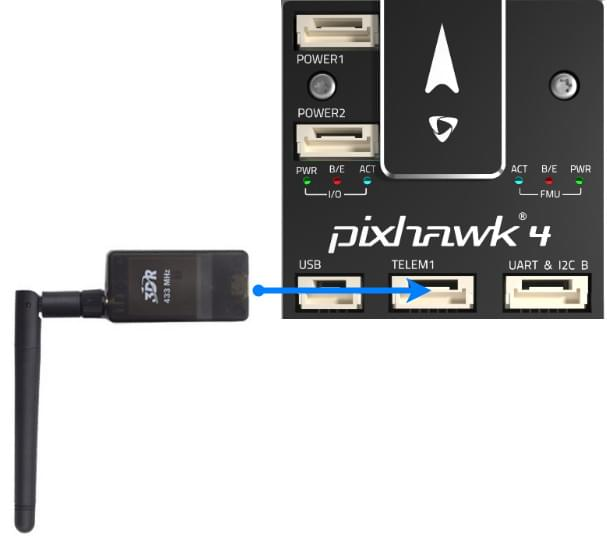
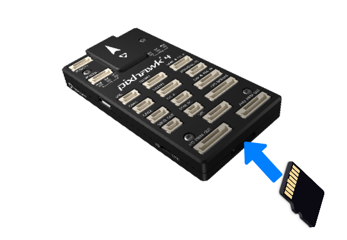

# Pixhawk 4 배선 개요

:::warning
PX4 does not manufacture this (or any) autopilot.
Contact the [manufacturer](https://holybro.com/) for hardware support or compliance issues.
:::

This quick start guide shows how to power the [Pixhawk 4](../flight_controller/pixhawk4.md)&reg; flight controller and connect its most important peripherals.

## 배선 개요

아래의 이미지는 주요 센서와 주변 장치(모터 및 서보 출력 제외)들의 연결 방법을 설명합니다. 다음 섹션에서 각 장치에 대하여 자세히 설명합니다.

:::tip
More information about available ports can be found here: [Pixhawk 4 > Connections](../flight_controller/pixhawk4.md#connectors).
:::

## 콘트롤러 장착 및 장착 방향

_Pixhawk 4_ should be mounted on the frame using vibration-damping foam pads (included in the kit). 차량의 무게 중심에 최대한 가깝운 프레임에 장착하여야 하며, 화살표가 차량의 앞쪽과 위쪽을 향하도록 하여야 합니다.

:::info
If the controller cannot be mounted in the recommended/default orientation (e.g. due to space constraints) you will
need to configure the autopilot software with the orientation that you actually used: [Flight Controller Orientation](../config/flight_controller_orientation.md).
:::

## GPS + 나침반 + 부저 + 안전 스위치 + LED

Attach the provided GPS with integrated compass, safety switch, buzzer and LED to the **GPS MODULE** port.

The GPS/Compass should be [mounted on the frame](../assembly/mount_gps_compass.md) as far away from other electronics as possible, with the direction marker towards the front of the vehicle (separating the compass from other electronics will reduce interference).

:::info
The GPS module's integrated safety switch is enabled _by default_ (when enabled, PX4 will not let you arm the vehicle).
비활성화하려면 안전 스위치를 1초간 길게 누르십시오.
안전 스위치를 다시 눌러 안전 장치를 활성화하고 기체 시동을 끌 수 있습니다.
조종기나 지상국 프로그램에서 기체 시동을 끌 수 없는 상황에서 유용합니다.
:::

## 전원

Connect the output of the _Power Management Board_ (PM board) that comes with the kit to one of the **POWER** bricks of _Pixhawk 4_ using a 6-wire cable.
The PM input **2~12S** will be connected to your LiPo battery.
ESC와 서보에 대한 전원 공급 및 신호 연결을 위한 전원관리보드의 연결 방법은 아래의 표에서 설명합니다.
Note that the PM board does not supply power to the servos via + and - pins of **FMU PWM-OUT**.

The image below shows the power management board provided with _Pixhawk 4_.

:::info
If using a plane or rover, the 8 pin power (+) rail of **FMU PWM-OUT** will need to be separately powered in order to drive servos for rudders, elevons etc.
전원 레일을 BEC가 장착된 ESC 또는 독립형 5V BEC 또는 2S LiPo 배터리에 연결하여야 합니다.
서보에 제공되는 전압이 적절한 지 체크하십시오.
:::

| PIN&Connector | 기능                                                                                                          |
| --------------------------------- | ----------------------------------------------------------------------------------------------------------- |
| I/O PWM-IN                        | See note below for connection to _Pixhawk 4_                                                                |
| M1                                | I/O PWM OUT 1 : 신호선을 모터 1의 ESC에 연결합니다.                                      |
| M2                                | I/O PWM OUT 2 : 신호선을 모터 2의 ESC에 연결합니다.                                      |
| M3                                | I/O PWM OUT 3 : 신호선을 모터 3의 ESC에 연결합니다.                                      |
| M4                                | I/O PWM OUT 4 : 신호선을 모터 4의 ESC에 연결합니다.                                      |
| M5                                | I/O PWM OUT 5 : 신호선을 모터 5의 ESC에 연결합니다.                                      |
| M6                                | I/O PWM OUT 6 : 신호선을 모터 6의 ESC에 연결합니다.                                      |
| M7                                | I/O PWM OUT 7 : 신호선을 모터 7의 ESC에 연결합니다.                                      |
| M8                                | I/O PWM OUT 8 : 신호선을 모터 8의 ESC에 연결합니다.                                      |
| FMU PWM-IN                        | See note below for connection to _Pixhawk 4_                                                                |
| FMU PWM-OUT                       | If FMU PWM-IN is connected to _Pixhawk 4_, connect signal wires to ESC or signal, +, - wires to servos here |
| CAP&ADC-OUT   | connect to CAP & ADC IN port of _Pixhawk 4_                                             |
| CAP&ADC-IN    | CAP&ADC input: Pinouts are printed on the back side of the board        |
| B+                                | ESC에 전원을 공급하기 위해 ESC B +에 연결                                                                                |
| GND                               | ESC 접지에 연결                                                                                                  |
| PWR1                              | 5v output 3A, connect to _Pixhawk 4_ POWER 1                                                                |
| PWR2                              | 5v output 3A, connect to _Pixhawk 4_ POWER 2                                                                |
| 2~12S             | 전원 입력, 12S LiPo 배터리에 연결                                                                                     |

:::info
Depending on your airframe type, refer to [Airframe Reference](../airframes/airframe_reference.md) to connect **I/O PWM OUT** and **FMU PWM OUT** ports of _Pixhawk 4_ to PM board.
**MAIN** outputs in PX4 firmware map to **I/O PWM OUT** port of _Pixhawk 4_ whereas **AUX outputs** map to **FMU PWM OUT** of _Pixhawk 4_.
For example, **MAIN1** maps to IO_CH1 pin of **I/O PWM OUT** and **AUX1** maps to FMU_CH1 pin of **FMU PWM OUT**. **FMU PWM-IN** of PM board is internally connected to **FMU PWM-OUT**. **I/O PWM-IN** of PM board is internally connected to **M1-8**.
:::

The following table summarizes how to connect _Pixhawk 4_'s PWM OUT ports to PM board's PWM-IN ports, depending on the Airframe Reference.

| 기체 정의                           | Connection between _Pixhawk 4_ --> PM board |
| ------------------------------- | ------------------------------------------- |
| **MAIN**: motor | I/O PWM OUT --> I/O PWM IN                  |
| **MAIN**: servo | I/O PWM OUT --> FMU PWM IN                  |
| **AUX**: motor  | FMU PWM OUT --> I/O PWM IN                  |
| **AUX**: servo  | FMU PWM OUT --> FMU PWM IN                  |

<!--In the future, when Pixhawk 4 kit is available, add wiring images/videos for different airframes.-->

The pinout of _Pixhawk 4_’s power ports is shown below.
전류는 기본적으로 0 ~ 120A에 대하여 0 ~ 3.3V의 아날로그 전압을 제공하여야 합니다.
전압는 기본적으로 0~60V에 대하여 0~3.3V의 아날로그 전압을 제공하여야 합니다.
VCC 라인은 최소 3A 연속을 제공하여야하며, 기본적으로 5.1V로 설정되어야 합니다.
5V 보다 낮은 전압은 권장되지 않습니다.

| 핀                           | 신호      | 전압                    |
| --------------------------- | ------- | --------------------- |
| 1(red)   | VCC     | +5V                   |
| 2(black) | VCC     | +5V                   |
| 3(black) | CURRENT | +3.3V |
| 4(black) | VOLTAGE | +3.3V |
| 5(black) | GND     | GND                   |
| 6(black) | GND     | GND                   |

:::info
Using the Power Module that comes with the kit you will need to configure the _Number of Cells_ in the [Power Settings](https://docs.qgroundcontrol.com/master/en/qgc-user-guide/setup_view/power.html) but you won't need to calibrate the _voltage divider_.
You will have to update the _voltage divider_ if you are using any other power module (e.g. the one from the Pixracer).
:::

## 무선 조종

A remote control (RC) radio system is required if you want to _manually_ control your vehicle (PX4 does not require a radio system for autonomous flight modes).

You will need to [select a compatible transmitter/receiver](../getting_started/rc_transmitter_receiver.md) and then _bind_ them so that they communicate (read the instructions that come with your specific transmitter/receiver).

The instructions below show how to connect the different types of receivers to _Pixhawk 4_:

- Spektrum/DSM or S.BUS receivers connect to the **DSM/SBUS RC** input.

  

- PPM receivers connect to the **PPM RC** input port.

  

- PPM and PWM receivers that have an _individual wire for each channel_ must connect to the **PPM RC** port _via a PPM encoder_ [like this one](http://www.getfpv.com/radios/radio-accessories/holybro-ppm-encoder-module.html) (PPM-Sum receivers use a single signal wire for all channels).

For more information about selecting a radio system, receiver compatibility, and binding your transmitter/receiver pair, see: [Remote Control Transmitters & Receivers](../getting_started/rc_transmitter_receiver.md).

## 무선 텔레메트리(선택 사항)

무선 텔레메트리는 지상국 프로그램에서 비행 차량의 통신/제어에 사용합니다(예 : UAV를 특정 위치로 지시하거나 새 임무를 업로드 할 수 있음).

The vehicle-based radio should be connected to the **TELEM1** port as shown below (if connected to this port, no further configuration is required). 다른 텔레메트리는 일반적으로 지상국 컴퓨터나 모바일 장치에 USB를 통하여 연결됩니다.

## SD 카드(선택 사항)

SD cards are highly recommended as they are needed to [log and analyse flight details](../getting_started/flight_reporting.md), to run missions, and to use UAVCAN-bus hardware.
Insert the card (included in Pixhawk 4 kit) into _Pixhawk 4_ as shown below.

:::tip
For more information see [Basic Concepts > SD Cards (Removable Memory)](../getting_started/px4_basic_concepts.md#sd-cards-removable-memory).
:::

## 모터

Motors/servos are connected to the **I/O PWM OUT** (**MAIN**) and **FMU PWM OUT** (**AUX**) ports in the order specified for your vehicle in the [Airframe Reference](../airframes/airframe_reference.md).

:::info
이 참고사항은 모든 지원되는 기체 프레임의 출력 포트의 모터/서보 연결 리스트입니다. 프레임이 참고사항에 기재되어 있지 않다면, 올바른 유형의 "일반" 프레임을 사용하십시오.
:::

:::warning
The mapping is not consistent across frames (e.g. you can't rely on the throttle being on the same output for all plane frames). 가지고 있는 기체의 프레임에 대해 올바르게 모터를 제대로 연결하였는지 다시 한 번 확인하십시오.
:::

## 기타 주변 장치

The wiring and configuration of optional/less common components is covered within the topics for individual [peripherals](../peripherals/index.md).

## 핀배열

[Pixhawk 4 Pinouts](https://holybro.com/manual/Pixhawk4-Pinouts.pdf) (Holybro)

## 설정

General configuration information is covered in: [Autopilot Configuration](../config/index.md).

QuadPlane specific configuration is covered here: [QuadPlane VTOL Configuration](../config_vtol/vtol_quad_configuration.md)

<!-- Nice to have detailed wiring infographic and instructions for different vehicle types. -->

## 추가 정보

- [Pixhawk 4](../flight_controller/pixhawk4.md) (Overview page)
- [Pixhawk 4 Technical Data Sheet](https://github.com/PX4/PX4-user_guide/raw/main/assets/flight_controller/pixhawk4/pixhawk4_technical_data_sheet.pdf)
- [Pixhawk 4 Pinouts](https://holybro.com/manual/Pixhawk4-Pinouts.pdf) (Holybro)
- [Pixhawk 4 Quick Start Guide (Holybro)](https://holybro.com/manual/Pixhawk4-quickstartguide.pdf)
