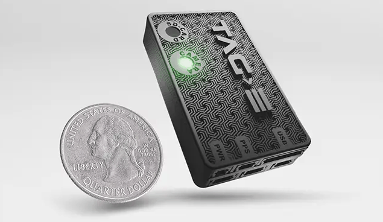
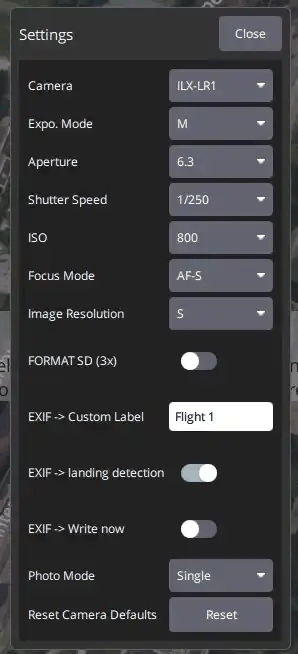

# AirPixel TAG-E (Sony ILX-LR1 Camera Control and Geotagging)

The [AirPixel TAG-E](https://airpixel.cz/) is a camera controller and EXIF/XMP geotagger for the Sony ILX-LR1.
It connects to the camera with a single USB-C cable and to PX4 over MAVLink, and acts as a [MAVLink camera](../camera/mavlink_v2_camera.md) using [Camera Protocol v2](https://mavlink.io/en/services/camera.html).

_QGroundControl_ detects the camera automatically and shows its shutter, video, exposure and configuration controls.
TAG-E writes position, altitude and camera attitude into the EXIF and XMP of every photo on the camera's SD card during the flight, so no log-based geotagging is needed afterwards.

## 주요 특징

- Full MAVLink Camera Protocol v2 control of the Sony ILX-LR1 (ISO, aperture, shutter speed, exposure compensation, exposure mode, AF mode, photo/video).
- Automatic EXIF and XMP geotagging with position, altitude and camera roll/pitch/yaw, at the camera's full trigger rate.
- Clock synchronisation with the flight controller using the MAVLink [TIMESYNC](https://mavlink.io/en/services/timesync.html) protocol.
- Lever-arm correction from antenna-to-camera offsets, optional rangefinder, GPS/IMU accuracy and custom label tags, PPK output, and video geotagging via subtitles.
- Camera clock set automatically from GPS time.

## 배선

Connect TAG-E's IO-B connector to an unused serial port on the flight controller, such as `TELEM2`, and TAG-E's USB-C port to the camera.
TAG-E needs a 5V supply able to deliver at least 2A.

Pinouts are in the [TAG-E pinout manual](https://airpixel.cz/docs/tag-e-pinouts/).

## PX4 설정

TAG-E uses the component ID `MAV_COMP_ID_CAMERA` (100).
Configure an unused MAVLink instance for the port it is connected to.
The table below shows the settings for `TELEM2` using the `MAV_1_*` parameters (if using another port or instance, set the corresponding unused `MAV_n_*` parameters and the baud rate parameter for that port):

| Parameter                                                                                                          | Value     |
| ------------------------------------------------------------------------------------------------------------------ | --------- |
| [MAV_1_CONFIG](../advanced_config/parameter_reference.md#MAV_1_CONFIG)   | `TELEM 2` |
| [SER_TEL2_BAUD](../advanced_config/parameter_reference.md#SER_TEL2_BAUD) | `921600`  |
| [MAV_1_MODE](../advanced_config/parameter_reference.md#MAV_1_MODE)       | `Onboard` |
| [MAV_1_RATE](../advanced_config/parameter_reference.md#MAV_1_RATE)       | `0`       |
| [MAV_1_FORWARD](../advanced_config/parameter_reference.md#MAV_1_FORWARD) | `Enabled` |

Reboot the flight controller.
When the camera is online, the TAG-E LED turns green and the camera panel appears in _QGroundControl_.

TAG-E requests the messages it needs using [MAV_CMD_SET_MESSAGE_INTERVAL](https://mavlink.io/en/messages/common.html#MAV_CMD_SET_MESSAGE_INTERVAL): `SYSTEM_TIME` at 1Hz, `ATTITUDE` at 10Hz, and `GPS_RAW_INT` and `GLOBAL_POSITION_INT` at a rate that depends on its configuration.
It also uses the `TIMESYNC` protocol to synchronise its clock with the flight controller.

:::tip
TAG-E units with firmware older than `0_193` use 230400 baud.
See the manufacturer's [PX4 connection manual](https://airpixel.cz/docs/tag-e-mavlink-connection-px4/) for changing the baud rate, and the [GPS delay calculation](https://airpixel.cz/docs/gps-delay-calculation/) for the best geotag accuracy.
:::

## Camera Control in QGroundControl

When the camera is online, _QGroundControl_ shows the camera panel on the right of the Fly view: the shutter button, a photo/video switch, and the photo count or recording time.
The gear icon under the shutter button opens the camera settings: exposure mode, aperture, shutter speed, ISO, focus mode and image resolution, plus TAG-E functions such as remote SD card format, a custom EXIF label, landing detection and photo mode.

## Triggering

PX4 re-emits the image and video capture commands in missions (`MAV_CMD_IMAGE_START_CAPTURE`, `MAV_CMD_IMAGE_STOP_CAPTURE`, `MAV_CMD_VIDEO_START_CAPTURE`, `MAV_CMD_VIDEO_STOP_CAPTURE`) to `MAV_COMP_ID_CAMERA`, so they reach TAG-E directly.
The camera can also be triggered from the _QGroundControl_ camera panel.

## 추가 정보

- [TAG-E product page](https://airpixel.cz/)
- [PX4 camera control guide for the ILX-LR1](https://airpixel.cz/nw/guides/px4-ilx-lr1-camera-control/) (AirPixel)
- [TAG-E documentation](https://airpixel.cz/docs-tag-e/)
- [MAVLink Cameras (Camera Protocol v2)](../camera/mavlink_v2_camera.md)
