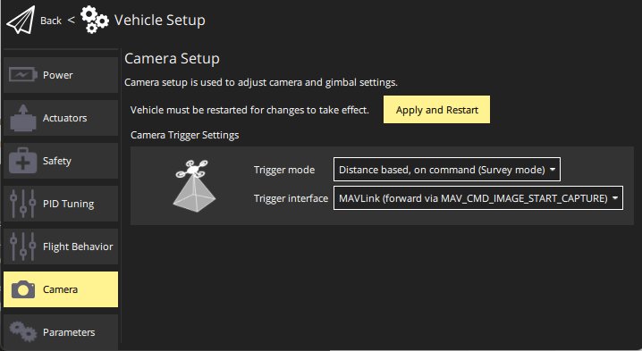

# Simple MAVLink Cameras (Camera Protcol v1)

This topic explains how to use PX4 with a MAVLink [camera](../camera/index.md) that implements the [Camera Protocol v1 (Simple Trigger Protocol)](https://mavlink.io/en/services/camera_v1.html) with PX4 and a Ground Station.

:::warning
[MAVLink cameras](../camera/mavlink_v2_camera.md) that use the [MAVLink Camera Protocol v2](https://mavlink.io/en/services/camera.html) should be used instead when possible!
This approach is retained for use with older MAVLink cameras.
:::

## 개요

[Camera Protocol v1](https://mavlink.io/en/services/camera_v1.html) defines a small set of commands that allow triggering of a camera for:

- still image capture at a frequency based on either time or distance
- video capture
- limited camera configuration

PX4 supports this command set for triggering cameras with native support for the protocol (as described in this topic), and also for [cameras attached to flight controller outputs](../camera/fc_connected_camera.md).

Ground stations and MAVLink SDKs generally address camera commands to the autopilot, which then forwards them to a connected MAVLink channel of type `onboard`.
PX4 also re-emits any camera mission items it encouters in a mission as camera commands: commands that aren't accepted are logged.
In all cases the commands are sent with the system id of the autopilot and the component ID of 0 (i.e. addressed to all components, including cameras).

PX4 will also emit a [CAMERA_TRIGGER](https://mavlink.io/en/messages/common.html#CAMERA_TRIGGER) whenever an image capture is triggered (the camera itself may also emit this message on triggering).

## Controlling the Camera

### MAVLink Commands & Messages

The [Camera Protocol v1 (Simple Trigger Protocol)](https://mavlink.io/en/services/camera_v1.html) defines the following commands:

- [MAV_CMD_DO_TRIGGER_CONTROL](https://mavlink.io/en/messages/common.html#MAV_CMD_DO_TRIGGER_CONTROL)
- [MAV_CMD_NAV_CMD_DO_DIGICAM_CONTROL](https://mavlink.io/en/messages/common.html#MAV_CMD_NAV_CMD_DO_DIGICAM_CONTROL)
- [MAV_CMD_DO_SET_CAM_TRIGG_DIST](https://mavlink.io/en/messages/common.html#MAV_CMD_DO_SET_CAM_TRIGG_DIST)
- [MAV_CMD_DO_SET_CAM_TRIGG_INTERVAL](https://mavlink.io/en/messages/common.html#MAV_CMD_DO_SET_CAM_TRIGG_INTERVAL)
- [MAV_CMD_OBLIQUE_SURVEY](https://mavlink.io/en/messages/common.html#MAV_CMD_OBLIQUE_SURVEY)
- [MAV_CMD_DO_CONTROL_VIDEO](https://mavlink.io/en/messages/common.html#MAV_CMD_DO_CONTROL_VIDEO)

A MAVLink camera will support some subset of these commands.
As the protocol has no feature discovery process, the only way to know is by inspecting the [COMMAND_ACK](https://mavlink.io/en/messages/common.html#COMMAND_ACK) returned in response.

Cameras should also emit [CAMERA_TRIGGER](https://mavlink.io/en/messages/common.html#CAMERA_TRIGGER) each time an image is captured.

[Camera Protocol v1](https://mavlink.io/en/services/camera_v1.html) describes the protocol in more detail.

### Ground Stations

Ground stations can use any commands in the [Camera Protocol v1 (Simple Trigger Protocol)](https://mavlink.io/en/services/camera_v1.html) and should address them to the autopilot component id.
If the commands are not supported by the camera, it will return a [COMMAND_ACK](https://mavlink.io/en/messages/common.html#COMMAND_ACK) with an error result.

Generally the commands are addressed to the autopilot, because this works whether the camera is connected via MAVLink or directly to the flight controller.
If addressed to the autopilot PX4 will emit [CAMERA_TRIGGER](https://mavlink.io/en/messages/common.html#CAMERA_TRIGGER) each time an image is captured, and may log the camera capture event.

<!-- "May" because the camera feedback module is "supposed"  to log just camera capture from a capture pin connected to camera hotshoe, but currently logs all camera trigger events from the camera trigger driver https://github.com/PX4/PX4-Autopilot/pull/23103 -->

In theory you might also address commands to the camera directly.

### Camera Commands in Missions

The following [Camera Protocol v1 (Simple Trigger Protocol)](https://mavlink.io/en/services/camera_v1.html) commands can be used in missions (this is the same list as above).

- [MAV_CMD_DO_TRIGGER_CONTROL](https://mavlink.io/en/messages/common.html#MAV_CMD_DO_TRIGGER_CONTROL)
- [MAV_CMD_NAV_CMD_DO_DIGICAM_CONTROL](https://mavlink.io/en/messages/common.html#MAV_CMD_NAV_CMD_DO_DIGICAM_CONTROL)
- [MAV_CMD_DO_SET_CAM_TRIGG_DIST](https://mavlink.io/en/messages/common.html#MAV_CMD_DO_SET_CAM_TRIGG_DIST)
- [MAV_CMD_DO_SET_CAM_TRIGG_INTERVAL](https://mavlink.io/en/messages/common.html#MAV_CMD_DO_SET_CAM_TRIGG_INTERVAL)
- [MAV_CMD_OBLIQUE_SURVEY](https://mavlink.io/en/messages/common.html#MAV_CMD_OBLIQUE_SURVEY)
- [MAV_CMD_DO_CONTROL_VIDEO](https://mavlink.io/en/messages/common.html#MAV_CMD_DO_CONTROL_VIDEO)

PX4 re-emits them with the same system ID as the autopilot and component ID of [MAV_COMP_ID_ALL](https://mavlink.io/en/messages/common.html#MAV_COMP_ID_ALL):

<!-- See camera_architecture.md topic for detail on how this is implemented -->

### Manual Control

Manual triggering using these cameras is not supported (for either Joystick or RC Controllers).

## PX4 설정

<!-- set up the mode and triggering -->

### MAVLink Port & Forwarding Configuration

Connect PX4 to your MAVLink camera by attaching it to an unused serial port on your flight controller, such as `TELEM2`.
You can then configure the port as a [MAVLink Peripheral](../peripherals/mavlink_peripherals.md).
The document explains how, but in summary:

1. Modify an unused `MAV_n_CONFIG` parameter, such as [MAV_2_CONFIG](../advanced_config/parameter_reference.md#MAV_2_CONFIG), so that it is assigned to port to which your camera is connected.
2. Set the corresponding [MAV_2_MODE](../advanced_config/parameter_reference.md#MAV_2_MODE) to `2` (Onboard).
  This ensures that the right set of MAVLink messages are emitted and forwarded.
3. You may need to set some of the other parameters, depending on your connection - such as the baud rate.

Then connect and configure the camera as recommended in its user guide.

<!-- Removed this because I am pretty sure forwarding happens automatically for this set. Keeping it simple.
1. Set [MAV_2_FORWARD](../advanced_config/parameter_reference.md#MAV_2_FORWARD) if you want to enable forwarding of MAVLink messages to other ports, such as the one that is connected to the ground station.
-->

### Camera Mode & Triggering

Configure the PX4 camera driver to enable the MAVLink camera backend, and set the triggering mode to capture on command in survey missions.

Using _QGroundControl_:

- Open [Vehicle Setup > Camera](https://docs.qgroundcontrol.com/master/en/qgc-user-guide/setup_view/camera.html#px4-camera-setup).
- Set the values as shown:

  

:::info
You can also [set the parameters directly](../advanced_config/parameters.md):

- [TRIG_MODE](../advanced_config/parameter_reference.md#TRIG_MODE) — `4`: Distance based, on command (Survey mode)
- [TRIG_INTERFACE](../advanced_config/parameter_reference.md#TRIG_INTERFACE) — `3`: MAVLink

:::
