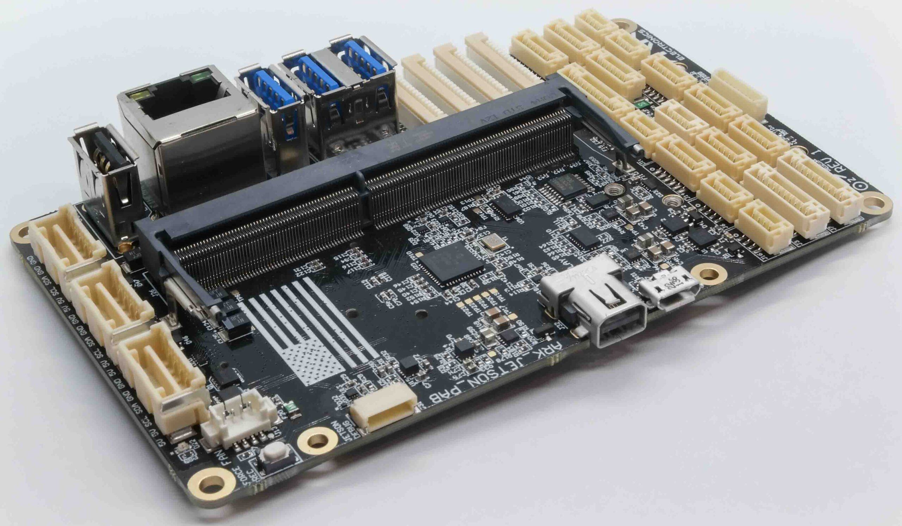
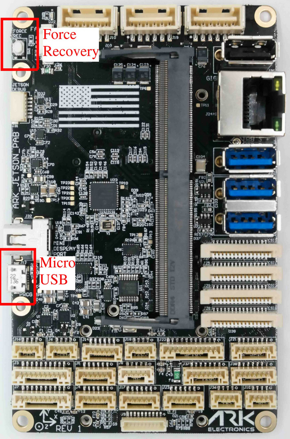

# ARK Jetson PAB Carrier

The [ARK Jetson Pixhawk Autopilot Bus (PAB) Carrier](https://arkelectron.gitbook.io/ark-documentation/flight-controllers/ark-jetson-pab-carrier) serves as a carrier board for NVIDIA Jetson Orin NX/Nano and any [Pixhawk Autopilot Bus (PAB)](https://github.com/pixhawk/Pixhawk-Standards/blob/master/DS-010%20Pixhawk%20Autopilot%20Bus%20Standard.pdf)-compliant flight controller, such as the [ARKV6X](../flight_controller/ark_v6x.md).

## 구매처

- [ARK Jetson PAB Carrier](https://arkelectron.com/product/ark-jetson-pab-carrier/)
- [ARK Jetson Orin NX NDAA Bundle](https://arkelectron.com/product/ark-jetson-orin-nx-ndaa-bundle/)

## 사양

- **Power Requirements**

  - 5V
  - 4A minimum (dependent on usage and peripherals)

- **Additional Features**

  - Pixhawk Autopilot Bus (PAB) Form Factor ([PAB Standard](https://github.com/pixhawk/Pixhawk-Standards/blob/master/DS-010%20Pixhawk%20Autopilot%20Bus%20Standard.pdf))
  - MicroSD Slot
  - USA-built, NDAA compliant
  - Integrated 1W heater for sensor stability in extreme conditions

- **Physical Details**

  - Weight:
    - Without Jetson and Flight Controller – 80g
    - With Jetson, no heatsink or Flight Controller – 108g
    - With Jetson and heatsink, no Flight Controller – 160g
    - With Jetson, heatsink, Flight Controller, M.2 SSD, M.2 WiFi Module – 174g
  - Dimensions (without Jetson and Flight Controller): 116 mm x 72 mm x 23 mm

- **Pinout**
  - For detailed pin mapping, see the [ARK Jetson PAB Carrier Pinout documentation](https://arkelectron.gitbook.io/ark-documentation/flight-controllers/ark-jetson-pab-carrier/pinout).
    

## Autopilot Connections

The Jetson and the flight controller communicate through serial and USB interfaces, both of which support direct board-to-board connections tested up to 3 Mbps.

| 형식  | Jetson Device Path | 비행 콘트롤러 |
| :-- | :----------------- | :------ |
| USB | /dev/ttyACM0       | USB     |
| 직렬  | /dev/ttyTHS1       | TELEM2  |

The USB connection to the autopilot is multiplexed with the external Jetson micro USB port.
When a micro USB cable is connected, the autopilot is disconnected from the Jetson, and the USB port on the Jetson switches from host to device mode.
After the micro USB cable is disconnected, a reboot is required to switch the USB port back to a host and connect to the autopilot.

For the USB port to be enabled on the ARKV6X flight controller, the `VBUS_SENSE` pin must be driven high from the Jetson.
It is connected to pin 206 GPIO07.
For Jetpack 5, there is a helper Python script in ARK-OS to drive the pin high.
For Jetpack 6, a script cannot toggle a GPIO and leave it set.
As a workaround, the `VBUS_SENSE` pin is set high in the Jetson pinmux on boot.

- [Enable VBUS on ARK-OS](https://github.com/ARK-Electronics/ARK-OS/blob/main/platform/jetson/scripts/vbus_enable.py)

### UART

The UART connection between the Jetson and the autopilot is on Jetson UART1, which appears as `/dev/ttyTHS0` in Jetpack 5 and `/dev/ttyTHS1` in Jetpack 6.
This is connected to `TELEM2` on the Pixhawk controller and has been tested up to 3 Mbps (higher baud rates may be possible).

### Flight Controller Reset

The flight controller can be hard reset using the reset signal connected to Jetson pin 228 GPIO13.
The Jetson cannot reset the flight controller while it is armed.
The reset signal is gated by the `nARMED` signal from the flight controller.

Two helper scripts are available for resetting the flight controller:

- **Reset and wait in the bootloader**: Drives the `VBUS_SENSE` pin high before the reset, holding it in the bootloader for 5 seconds.
  Useful for firmware updates when a hard reboot is needed.
  - [reset_fmu_wait_bl.py](https://github.com/ARK-Electronics/ARK-OS/blob/main/platform/jetson/scripts/reset_fmu_wait_bl.py)
- **Quick reset, skip the bootloader**: Drives the `VBUS_SENSE` pin low before reset, avoiding the wait.
  - [reset_fmu_fast.py](https://github.com/ARK-Electronics/ARK-OS/blob/main/platform/jetson/scripts/reset_fmu_fast.py)

## Flashing Guide

If you've purchased the [ARK Jetson Orin NX NDAA Bundle](https://arkelectron.com/product/ark-jetson-orin-nx-ndaa-bundle/), Jetpack 6 (Ubuntu 22.04) and [ARK-OS](https://github.com/ARK-Electronics/ARK-OS) are pre-installed.

### ARK Jetson Kernel GitHub Repository

This [repository](https://github.com/ARK-Electronics/ark_jetson_kernel) includes helper scripts for kernel download and compilation.
Please follow the README to update to the latest Jetpack or to perform an initial flash.

To flash the kernel, connect the Jetson to your Host PC via Micro USB, and boot the Jetson while holding the Force Recovery button.

## See Also

- [ARK Jetson PAB Documentation](https://arkelectron.gitbook.io/ark-documentation/flight-controllers/ark-jetson-pab-carrier) (ARK Docs)
