# Holybro Pixhawk Jetson Baseboard

The [Holybro Pixhawk Jetson Baseboard](https://holybro.com/products/pixhawk-jetson-baseboard) integrates a Pixhawk flight controller and a NVIDIA Orin-series computer into a single package, significantly easing both hardware and software setup for using PX4 with a companion computer.

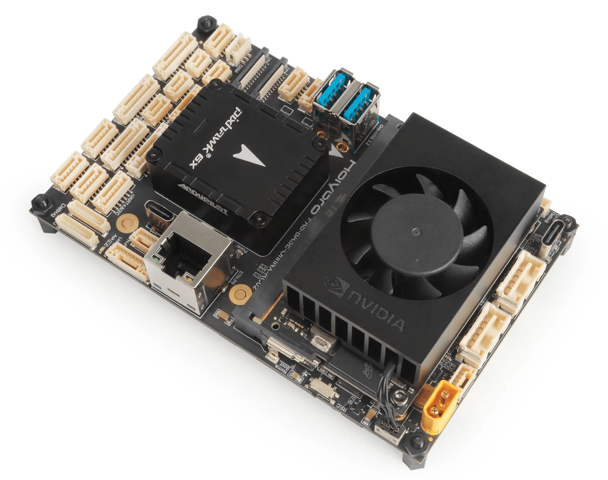

The board comes with either the [Jetson Orin NX (16GB RAM)](https://holybro.com/products/nvidia-jetson-orin-nx-16g) or [Jetson Orin Nano (4GB RAM)](https://holybro.com/products/nvidia-jetson-orin-nx-16g?variant=44391410598077).
It can be used with any Pixhawk Autopilot Bus (PAB) specification-compliant Pixhawk flight controller, such as the Pixhawk 6 or Pixhawk 6X.

This guide walks through the process of setting up the board and connecting to PX4, including:

- Hardware overview and setup
- Flashing the Jetson board and logging in via SSH
- Flashing (and building) PX4 Firmware on the Pixhawk
- Configuring serial and Ethernet connections between Pixhawk and Jetson
- MAVLink setup/test over both serial and Ethernet interfaces
- ROS 2/XRCE-DDS setup/test over both serial and Ethernet interfaces

:::tip
You will temporarily need the following hardware in order to log into your Jetson and get its IP address, after which you will be able to log in via SSH:

- External display.
 If your display doesn't have a mini HDMI connector you will also need a [Mini HDMI to HDMI converter](https://a.co/d/6N815N9) if your external display has HDMI input
- Ethernet cable
- Mouse and keyboard (the baseboard has 4 USB ports exposed from Jetson, two of which are USB 3.0)

:::

## Purchase

- [Holybro Pixhawk Jetson Baseboard](https://holybro.com/products/pixhawk-jetson-baseboard)

There are options to select Pixhawk Autopilot and Jetson computer variants.
All boards come with WiFi module, camera, power module, separate UBEC, power distribution board (PDB).

## 사양

This information comes from the [Holybro Pixhawk-Jetson Baseboard Documentation](https://docs.holybro.com/autopilot/pixhawk-baseboards/pixhawk-jetson-baseboard).

:::: tabs

:::tab 크기

[Dimensions and weight](https://docs.holybro.com/autopilot/pixhawk-baseboards/pixhawk-jetson-baseboard/dimension-and-weight) (Holybro)

- 크기

 - 126 x 80 x 45mm (with Jetson Orin NX + Heatsink/Fan & FC Module)
 - 126 x 80 x 22.9mm (without Jetson and FC Module)

- 중량
 - 190g (with Jetson, Heatsink, Flight Controller, M.2 SSD, M.2 Wi-Fi Module)

:::

:::tab Jetson connectors

- 2x Gigabit Ethernet Port

 - Connected to both Jetson & Autopilot via Ethernet switch (RTL8367S)
 - Ethernet Switch powered by the same circuit as the Pixhawk
 - 8-pin JST-GH
 - RJ45

- 2x MIPI CSI Camera Inputs

 - 4 Lanes each
 - 22-Pin Raspberry Pi Cam FFC

- 2x USB 3.0 Host Port

 - USB A
 - 5A Current Limit

- 2x USB 2.0 Host Port

 - 5-Pin JST-GH
 - 0A Current Limit

- USB 2.0 for Programming/Debugging

 - USB-C

- 2 Key M 2242/2280 for NVMe SSD

 - PCIEx4

- 2 Key E 2230 for WiFi/BT

 - PCIEx2
 - USB
 - UART
 - I2S

- Mini HDMI Out

- 4x GPIO

 - 6-pin JST-GH

- CAN Port

 - Connected to Autopilot's CAN2 (4 Pin JST-GH)

- SPI Port

 - 7-Pin JST-GH

- I2C Port

 - 4-Pin JST-GH

- I2S Port

 - 7-Pin JST-GH

- 2x UART Port

 - 1 for debug
 - 1 connected to Autopilot's telem2

- Fan Power Port

- IIM42652 IMU

:::

:::tab Autopilot connectors

- Pixhawk Autopilot Bus Interface

 - 100 Pin Hirose DF40
 - 50 Pin Hirose DF40

- Redundant Digital Power Module Inputs

 - I2C Power Monitor Support
 - 2x 6-Pin Molex CLIK-Mate

- Power Path Selector

- Overvoltage Protection

- 정격 전압

 - 최대 입력 전압: 6V
 - USB 전원 입력: 4.75~5.25V

- Full GPS Plus Safety Switch Port

 - 10-Pin JST-GH

- Secondary (GPS2) Port

 - 6-Pin JST-GH

- 2x CAN Ports

 - 4-Pin JST-GH

- 3x Telemetry Ports with Flow Control

 - 2x 6-Pin JST-GH
 - 1 is connected to Jetson's `UART1` Port

- 16 PWM Outputs

 - 2x 10-Pin JST-GH

- UART4 & I2C Port

 - 6-Pin JST-GH

- 2x Gigabit Ethernet Port

 - Connected to both Jetson & Autopilot via Ethernet switch (RTL8367S)
 - 8-Pin JST-GH
 - RJ45

- AD & IO

 - 8-Pin JST-GH

- USB 2.0

 - USB-C
 - 4-Pin JST-GH

- DSM Input

 - 3-Pin JST-ZH 1.5mm Pitch

- RC In

 - PPM/SBUS
 - 5-Pin JST-GH

- SPI Port

 - External Sensor Bus (SPI5)
 - 11-Pin JST-GH

- 2x Debug Port

 - 1 for FMU
 - 1 for IO
 - 10-Pin JST-SH

:::

:::tab Power (baseboard)

The Pixhawk is powered through either/both of the `Power 1` or `Power 2` ports next to the Jetson.
The Jetson power connection is the XT30 plug on the same side of the board.

The Jetson has separate input power circuitry from the Pixhawk autopilot:

- 8V/3A Minimum (Depends on Usage and Peripherals)
- Voltage Rating: 7-21V (3S-4S)
- Jetson Baseboard onboard BEC is rated for 7-21V (3S-4S).
 Note that the external UBEC-12A can be used for applications above 4S

During development using the following wired power supply is recommended:

- [Power Adapter for Jetson Orin](https://holybro.com/products/power_adapter_for_jetson_orin)

The complete power supply block diagram is shown below:

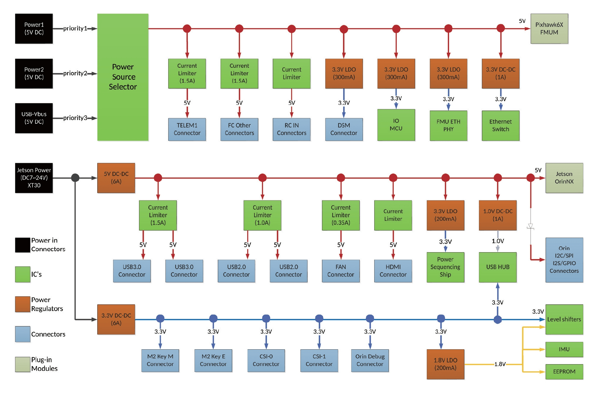

:::

:::tab Power (UBEC-12A)

The separate Holybro UBEC 12A (3-14S) BEC can be used for higher power applications (4S).
This can provide more power than the internal baseboard BEC, and provides redundancy and easier replacement in case of BEC failure.

Power ratings:

- Input voltage: 3~14S (XT30)
- Output voltage: 6.0V/7.2V/8.0V/9.2V (recommend 7.2V if supplying power to Jetson Board)
- Output Current
- Continuous: 12A
- Burst: 24A

크기

- Size: 48x33.6x16.3 mm
- Weight: 47.8g

:::

::::

## 핀배열

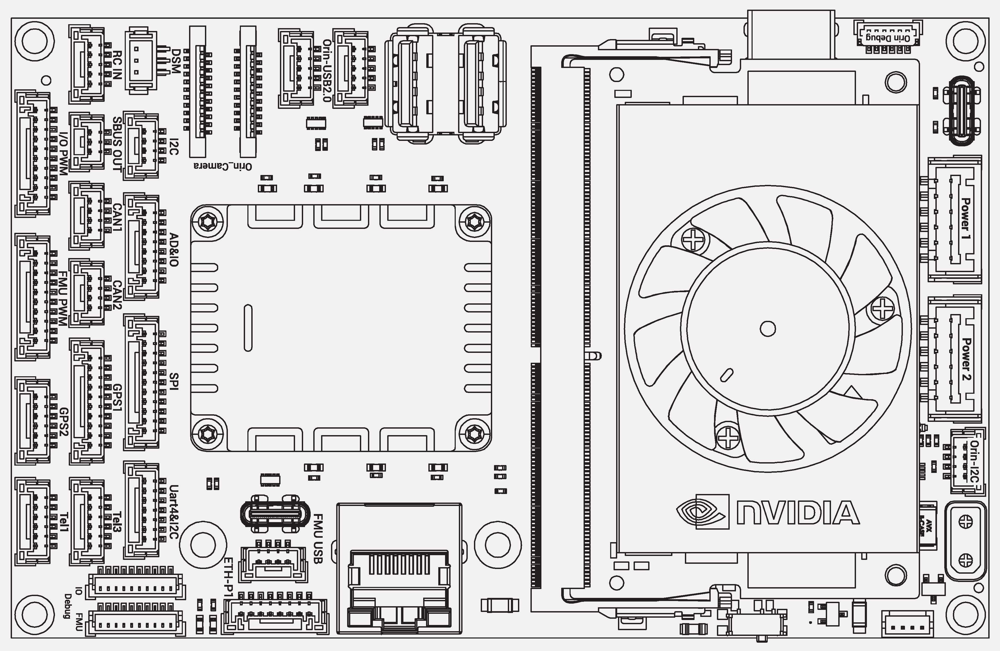

:::details
Pixhawk ports

### Power 1 (Main), Power 2 Ports

(2.00mm Pitch CLIK-Mate)

| 핀                         | 신호                                                          | 전압                    |
| :------------------------ | :---------------------------------------------------------- | :-------------------- |
| 1(red) | VDD5V_BRICK1/2(in)  | +5V                   |
| 2 (흑)  | VDD5V_BRICK1/2 (in) | +5V                   |
| 3 (흑)  | SCL1/2                                                      | +3.3V |
| 4 (흑)  | SDA1/2                                                      | +3.3V |
| 5 (흑)  | GND                                                         | GND                   |
| 6 (흑)  | GND                                                         | GND                   |

### Tel1, Tel3 Ports

| 핀                         | 신호                             | 전압                    |
| :------------------------ | :----------------------------- | :-------------------- |
| 1(red) | VCC (out)   | +5V                   |
| 2 (흑)  | TX7/2(out)  | +3.3V |
| 3 (흑)  | RX7/2(in)   | +3.3V |
| 4 (흑)  | CTS7/2(in)  | +3.3V |
| 5 (흑)  | RTS7/2(out) | +3.3V |
| 6 (흑)  | GND                            | GND                   |

### CAN1, CAN2 Ports

| 핀                         | 신호                           | 전압                    |
| :------------------------ | :--------------------------- | :-------------------- |
| 1(red) | VCC (out) | +5V                   |
| 2 (흑)  | CANH1/2                      | +3.3V |
| 3 (흑)  | CANL1/2                      | +3.3V |
| 4 (흑)  | GND                          | GND                   |

### GPS1 Port

| 핀                         | 신호                                                          | 전압                     |
| :------------------------ | :---------------------------------------------------------- | :--------------------- |
| 1(red) | VCC (out)                                | +5V                    |
| 2 (흑)  | TX1(out)                                 | +3.3V  |
| 3 (흑)  | RX1(in)                                  | +3.3V  |
| 4 (흑)  | SCL1                                                        | +3.3V  |
| 5 (흑)  | SDA1                                                        | +3.3V  |
| 6 (흑)  | SAFETY_SWITCH                          | +3.3V  |
| 7 (흑)  | SAFETY_SWITCH_LED | +3.3V  |
| 8 (흑)  | VDD_3V3                                | +3.3V  |
| 9 (흑)  | BUZZER-                                                     | 0\~5V |
| 10 (흑) | GND                                                         | GND                    |

### GPS2 Port

| 핀                         | 신호                           | 전압                    |
| :------------------------ | :--------------------------- | :-------------------- |
| 1(red) | VCC (out) | +5V                   |
| 2 (흑)  | TX8(out)  | +3.3V |
| 3 (흑)  | RX8(in)   | +3.3V |
| 4 (흑)  | SCL2                         | +3.3V |
| 5 (흑)  | SDA2                         | +3.3V |
| 6 (흑)  | GND                          | GND                   |

### UART4 & I2C Port

(shown as UART\&I2C on some boards)

| 핀                         | 신호                            | 전압                    |
| :------------------------ | :---------------------------- | :-------------------- |
| 1(red) | VCC (out)  | +5V                   |
| 2 (흑)  | TX4(out)   | +3.3V |
| 3 (흑)  | RX4(in)    | +3.3V |
| 4 (흑)  | SCL3                          | +3.3V |
| 5 (흑)  | SDA3                          | +3.3V |
| 6 (흑)  | NFC_GPIO | +3.3V |
| 7 (흑)  | GND                           | GND                   |

### SPI Port

| 핀                             | 신호                               | 전압                    |
| :---------------------------- | :------------------------------- | :-------------------- |
| 1(red)     | VCC (out)     | +5V                   |
| 2 (흑)      | SPI6_SCK    | +3.3V |
| 3 (흑)      | SPI6_MISO   | +3.3V |
| 4 (흑)      | SPI6_MOSI   | +3.3V |
| 5 (흑)      | SPI6_CS1    | +3.3V |
| 6 (흑)      | SPI6_CS2    | +3.3V |
| 7 (흑)      | SPIX_SYNC   | +3.3V |
| 8 (흑)      | SPI6_DRDY1  | +3.3V |
| 9 (흑)      | SPI6_DRDY2  | +3.3V |
| 10 (흑)     | SPI6_nRESET | +3.3V |
| 11 (black) | GND                              | GND                   |

### FMU USB Port

| 핀                         | 신호                           | 전압                    |
| :------------------------ | :--------------------------- | :-------------------- |
| 1(red) | VBUS (in) | +5V                   |
| 2 (흑)  | DM                           | +3.3V |
| 3 (흑)  | DP                           | +3.3V |
| 4 (흑)  | GND                          | GND                   |

### I2C Port

| 핀                         | 신호   | 전압                    |
| :------------------------ | :--- | :-------------------- |
| 1(red) | VCC  | +5V                   |
| 2 (흑)  | SCL3 | +3.3V |
| 3 (흑)  | SDA3 | +3.3V |
| 4 (흑)  | GND  | GND                   |

### ETH-P1 Port

| 핀                         | 신호                          | 전압 |
| :------------------------ | :-------------------------- | :- |
| 1(red) | TX_D1+ | -  |
| 2 (흑)  | TX_D1- | -  |
| 3 (흑)  | RX_D2+ | -  |
| 4 (흑)  | RX_D2- | -  |
| 5 (흑)  | Bi_D3+ | -  |
| 6 (흑)  | Bi_D3- | -  |
| 7 (흑)  | Bi_D4+ | -  |
| 8 (흑)  | Bi_D4- | -  |

### IO Debug Port

(JST-SH 1mm Pitch)

| 핀                             | 신호                                                                           | 전압                    |
| :---------------------------- | :--------------------------------------------------------------------------- | :-------------------- |
| 1(red)     | IO_VDD_3V3(out) | +3.3V |
| 2 (흑)      | IO_USART1_TX                       | +3.3V |
| 3 (흑)      | NC                                                                           | -                     |
| 4 (흑)      | IO_SWD_IO                          | +3.3V |
| 5 (흑)      | IO_SWD_CK                          | +3.3V |
| 6 (흑)      | IO_SWO                                                  | +3.3V |
| 7 (흑)      | IO_SPARE_GPIO1                     | +3.3V |
| 8 (흑)      | IO_SPARE_GPIO2                     | +3.3V |
| 9 (흑)      | IO_nRST                                                 | +3.3V |
| 1 0(black) | GND                                                                          | GND                   |

### FMU Debug port

(JST-SH 1mm Pitch)

| 핀                         | 신호                                                                            | 전압                    |
| :------------------------ | :---------------------------------------------------------------------------- | :-------------------- |
| 1(red) | FMU_VDD_3V3(out) | +3.3V |
| 2 (흑)  | FMU_USART3_TX                       | +3.3V |
| 3 (흑)  | FMU_USART3_RX                       | +3.3V |
| 4 (흑)  | FMU_SWD_IO                          | +3.3V |
| 5 (흑)  | FMU_SWD_CK                          | +3.3V |
| 6 (흑)  | SPI6_SCK_EXTERNAL1                  | +3.3V |
| 7 (흑)  | NFC_GPIO                                                 | +3.3V |
| 8 (흑)  | PH11                                                                          | +3.3V |
| 9 (흑)  | FMU_nRST                                                 | +3.3V |
| 10 (흑) | GND                                                                           | GND                   |

### AD\&IO port

| 핀                         | 신호                                                    | 전압                    |
| :------------------------ | :---------------------------------------------------- | :-------------------- |
| 1(red) | VCC (out)                          | +5V                   |
| 2 (흑)  | FMU_CAP1                         | +3.3V |
| 3 (흑)  | FMU_BOOTLOADER                   | +3.3V |
| 4 (흑)  | FMU_RST_REQ | +3.3V |
| 5 (흑)  | NARMED                                                | +3.3V |
| 6 (흑)  | ADC1_3V3                         | +3.3V |
| 7 (흑)  | ADC1_6V6                         | +6.6V |
| 8 (흑)  | GND                                                   | GND                   |

### DSM RC Port

(JST-ZH 1.5mm Pitch)

| 핀                             | 신호                                                         | 전압                    |
| :---------------------------- | :--------------------------------------------------------- | :-------------------- |
| 1 (yellow) | VDD_3V3_SPEKTRUM | +3.3V |
| 2 (흑)      | GND                                                        | GND                   |
| 3 (grey)   | DSM/Spektrum in                                            | +3.3V |

### RC IN Port

| 핀                         | 신호                                                                              | 전압                    |
| :------------------------ | :------------------------------------------------------------------------------ | :-------------------- |
| 1(red) | VDD_5V \_RC (out) | +5V                   |
| 2 (흑)  | SBUS/PPM in                                                                     | +3.3V |
| 3 (흑)  | RSSI_IN                                                    | +3.3V |
| 4 (흑)  | NC                                                                              | -                     |
| 5 (흑)  | GND                                                                             | GND                   |

### SBUS Out Port

| 핀                         | 신호                            | 전압                    |
| :------------------------ | :---------------------------- | :-------------------- |
| 1(red) | NC                            | -                     |
| 2 (흑)  | SBUS_OUT | +3.3V |
| 3 (흑)  | GND                           | GND                   |

### FMU PWM OUT (AUX OUT)

| 핀                         | 신호                             | 전압                      |
| :------------------------ | :----------------------------- | :---------------------- |
| 1(red) | VDD_SERVO | 0\~16V |
| 2 (흑)  | FMU_CH1   | +3.3V   |
| 3 (흑)  | FMU_CH2   | +3.3V   |
| 4 (흑)  | FMU_CH3   | +3.3V   |
| 5 (흑)  | FMU_CH4   | +3.3V   |
| 6 (흑)  | FMU_CH5   | +3.3V   |
| 7 (흑)  | FMU_CH6   | +3.3V   |
| 8 (흑)  | FMU_CH7   | +3.3V   |
| 9 (흑)  | FMU_CH8   | +3.3V   |
| 10 (흑) | GND                            | GND                     |

### IO PWM OUT (MAIN OUT)

| 핀                         | 신호                             | 전압                      |
| :------------------------ | :----------------------------- | :---------------------- |
| 1(red) | VDD_SERVO | 0\~16V |
| 2 (흑)  | IO_CH1    | +3.3V   |
| 3 (흑)  | IO_CH2    | +3.3V   |
| 4 (흑)  | IO_CH3    | +3.3V   |
| 5 (흑)  | IO_CH4    | +3.3V   |
| 6 (흑)  | IO_CH5    | +3.3V   |
| 7 (흑)  | IO_CH6    | +3.3V   |
| 8 (흑)  | IO_CH7    | +3.3V   |
| 9 (흑)  | IO_CH8    | +3.3V   |
| 10 (흑) | GND                            | GND                     |

:::

:::details
Jetson Orin ports

### Orin USB2.0 Port

| 핀                         | 신호                                                     | 전압                    |
| :------------------------ | :----------------------------------------------------- | :-------------------- |
| 1(red) | USB_VBUS (out) | +5V                   |
| 2 (흑)  | DM                                                     | +3.3V |
| 3 (흑)  | DP                                                     | +3.3V |
| 4 (흑)  | GND                                                    | GND                   |
| 5 (흑)  | Shield                                                 | GND                   |

### Orin Debug

(JST-SH 1mm Pitch)

| 핀                         | 신호                                                       | 전압                    |
| :------------------------ | :------------------------------------------------------- | :-------------------- |
| 1(red) | VCC (out)                             | +5V                   |
| 2 (흑)  | Orin_UART2_TXD | +3.3V |
| 3 (흑)  | Orin_UART2_RXD | +3.3V |
| 4 (흑)  | NC                                                       | -                     |
| 5 (흑)  | NC                                                       | -                     |
| 6 (흑)  | GND                                                      | GND                   |

### Orin I2C Port

| 핀                         | 신호                                                      | 전압                    |
| :------------------------ | :------------------------------------------------------ | :-------------------- |
| 1(red) | VCC (out)                            | +5V                   |
| 2 (흑)  | Orin_I2C1_SCL | +3.3V |
| 3 (흑)  | Orin_I2C1_SDA | +3.3V |
| 4 (흑)  | GND                                                     | GND                   |

### Orin GPIO Port

| 핀                         | 신호                                                     | 전압                    |
| :------------------------ | :----------------------------------------------------- | :-------------------- |
| 1(red) | VCC                                                    | +5V                   |
| 2 (흑)  | Orin_GPIO_07 | +3.3V |
| 3 (흑)  | Orin_GPIO_11 | +3.3V |
| 4 (흑)  | Orin_GPIO_12 | +3.3V |
| 5 (흑)  | Orin_GPIO_13 | +3.3V |
| 6 (흑)  | GND                                                    | GND                   |

### Orin Camera0 Port

Camera Serial Interface (CSI)

| 핀  | 신호                                                                               | 전압                    |
| :- | :------------------------------------------------------------------------------- | :-------------------- |
| 1  | GND                                                                              | GND                   |
| 2  | Orin_CSI1_D0_N    | +3.3V |
| 3  | Orin_CSI1_D0_P    | +3.3V |
| 4  | GND                                                                              | GND                   |
| 5  | Orin_CSI1_D1_N    | +3.3V |
| 6  | Orin_CSI1_D1_P    | +3.3V |
| 7  | GND                                                                              | GND                   |
| 8  | Orin_CSI1_CLK_N   | +3.3V |
| 9  | Orin_CSI1_CLK_P   | +3.3V |
| 10 | GND                                                                              | GND                   |
| 11 | Orin_CSI0_D0_N    | +3.3V |
| 12 | Orin_CSI0_D0_P    | +3.3V |
| 13 | GND                                                                              | GND                   |
| 14 | Orin_CSI0_D1_N    | +3.3V |
| 15 | Orin_CSI0_D1_P    | +3.3V |
| 16 | GND                                                                              | GND                   |
| 17 | Orin_CAM0_PWDN                         | +3.3V |
| 18 | Orin_CAM0_MCLK                         | +3.3V |
| 19 | GND                                                                              | GND                   |
| 20 | Orin_CAM0_I2C_SCL | +3.3V |
| 21 | Orin_CAM0_I2C_SDA | +3.3V |
| 22 | VDD                                                                              | +3.3V |

### Orin Camera1 Port

Camera Serial Interface (CSI)

| 핀  | 신호                                                                               | 전압                    |
| :- | :------------------------------------------------------------------------------- | :-------------------- |
| 1  | GND                                                                              | GND                   |
| 2  | Orin_CSI2_D0_N    | +3.3V |
| 3  | Orin_CSI2_D0_P    | +3.3V |
| 4  | GND                                                                              | GND                   |
| 5  | Orin_CSI2_D1_N    | +3.3V |
| 6  | Orin_CSI2_D1_P    | +3.3V |
| 7  | GND                                                                              | GND                   |
| 8  | Orin_CSI2_CLK_N   | +3.3V |
| 9  | Orin_CSI2_CLK_P   | +3.3V |
| 10 | GND                                                                              | GND                   |
| 11 | Orin_CSI3_D0_N    | +3.3V |
| 12 | Orin_CSI3_D0_P    | +3.3V |
| 13 | GND                                                                              | GND                   |
| 14 | Orin_CSI3_D1_N    | +3.3V |
| 15 | Orin_CSI3_D1_P    | +3.3V |
| 16 | GND                                                                              | GND                   |
| 17 | Orin_CAM1_PWDN                         | +3.3V |
| 18 | Orin_CAM1_MCLK                         | +3.3V |
| 19 | GND                                                                              | GND                   |
| 20 | Orin_CAM1_I2C_SCL | +3.3V |
| 21 | Orin_CAM1_I2C_SDA | +3.3V |
| 22 | VDD                                                                              | +3.3V |

### Orin SPI Port

| 핀                         | 신호                                                       | 전압                    |
| :------------------------ | :------------------------------------------------------- | :-------------------- |
| 1(red) | VCC                                                      | +5V                   |
| 2 (흑)  | Orin_SPI0_SCK  | +3.3V |
| 3 (흑)  | Orin_SPI0_MISO | +3.3V |
| 4 (흑)  | Orin_SPI0_MOSI | +3.3V |
| 5 (흑)  | Orin_SPI0_CS0  | +3.3V |
| 6 (흑)  | Orin_SPI0_CS1  | +3.3V |
| 7 (흑)  | GND                                                      | GND                   |

### Orin I2S Port

| 핀                         | 신호                                                        | 전압                    |
| :------------------------ | :-------------------------------------------------------- | :-------------------- |
| 1(red) | VCC                                                       | +5V                   |
| 2 (흑)  | Orin_I2S0_SDOUT | +3.3V |
| 3 (흑)  | Orin_I2S0_SDIN  | +3.3V |
| 4 (흑)  | Orin_I2S0_LRCK  | +3.3V |
| 5 (흑)  | Orin_I2S0_SCLK  | +3.3V |
| 6 (흑)  | Orin_GPIO_09    | +3.3V |
| 7 (흑)  | GND                                                       | GND                   |

:::

## 하드웨어 설정

The baseboard exposes both Pixhawk and Orin ports, as shown above in the [pinouts](#pinouts).
The Pixhawk ports comply with the Pixhawk connector standard (for ports covered by the standard), which means that the board can be connected to the usual peripherals, such as GPS, following either the generic assembly instructions for [multicopters](../assembly/assembly_mc.md), [fixed-wing](../assembly/assembly_fw.md) and [VTOL](../assembly/assembly_vtol.md) vehicles, or the corresponding Pixhawk guide for your flight controller (e.g. [Pixhawk 6X Quick Start](../assembly/quick_start_pixhawk6x.md)).

The main differences are likely to be power setup (see below), and the setup of additional peripherals connected to the Jetson.

### 주변 장치

The diagram below provides additional guidance as to the ports where peripherals should be connected.

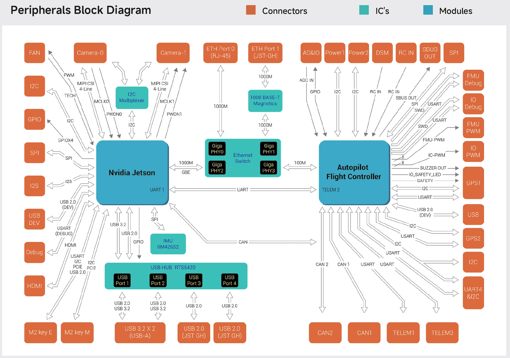

### Power Wiring

The Pixhawk and Jetson parts of the board must be powered separately though their respective power ports.
The power module that comes with the kit supports 2S-12S battery inputs and provides a regulated supply for the Pixhawk part.
Its other output is generally connected to the (supplied) power distribution board, and from there powers motors, servos, and so on, along with the Jetson (either _directly_ or via the UBEC).

The Jetson part can be powered with a 7V-21V input, which corresponds to a 3S or 4S battery.
If using a higher voltage battery than the Jetson allows you can either use the UBEC to provide a lower regulated supply, or power the Jetson with a separate battery.

Some of the more common wiring configurations are shown below.

#### 3S/4S Battery

This configuration demonstrating how to power both the Pixhawk and Jetson parts using a 3S/4S battery (output below 21V).

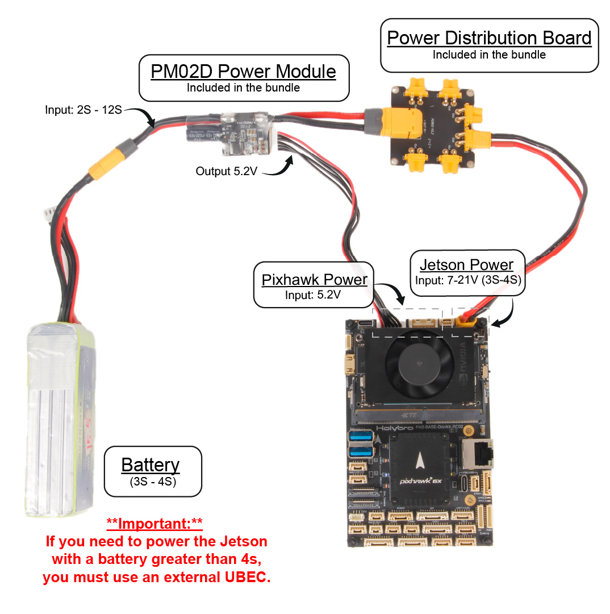

#### 5S battery and greater (with UBEC)

This configuration shows how you can use the external UBEC (supplied) to provide an appropriate voltage for the Jetson when using a high-voltage battery (>21V).
Depending on your power needs, you might also use this (or another UBEC) for providing appropriate supply for control surfaces and other servo-driven hardware.

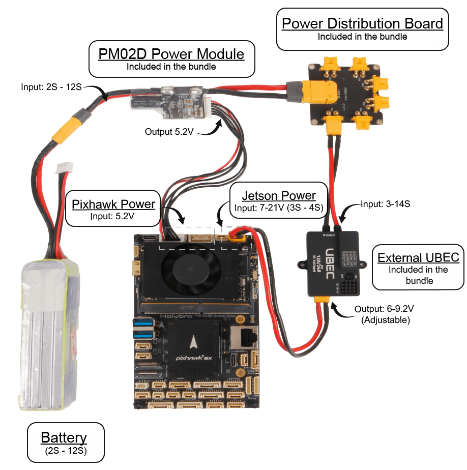

#### Two batteries (no Ubec)

This configuration shows how you can use a separate battery to supply an appropriate voltage to the Jetson instead of regulating the supply from a large battery as shown in above.

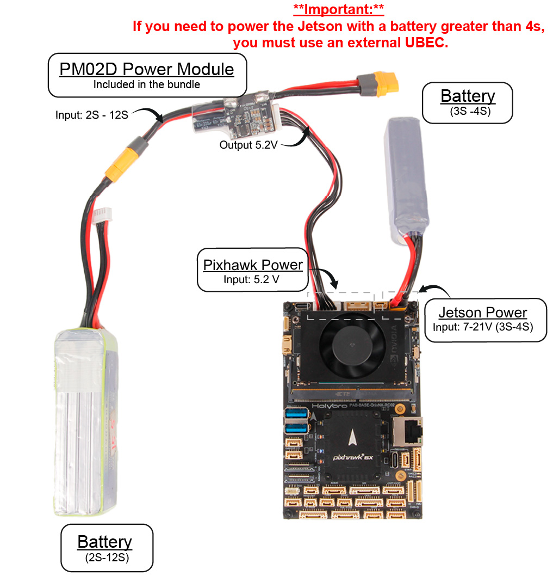

#### Using the Power Adapter

When developing and testing the vehicle on the bench, we recommend you power the Jetson using an external power supply, as shown.
You can power the Pixhawk part using either a USB-C supply or a battery (as shown here).

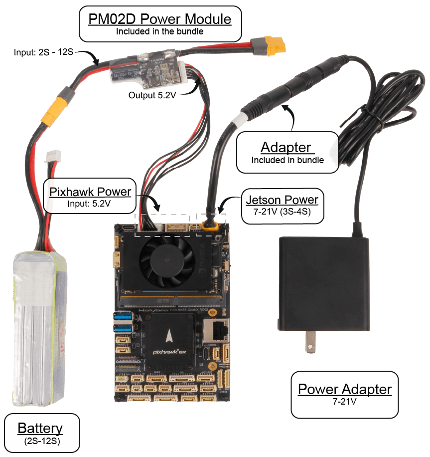

## Flashing the Jetson Board

:::info
This Jetson setup is tested with Nvidia Jetpack 6.0 (Ubuntu 22.04 base) and ROS 2 Humble, which are the versions currently supported by PX4-Autopilot community.
The development computer is also running Ubuntu 22.04.
:::

The Jetson companion computer can be flashed from a development computer using the [Nvidia SDK Manager](https://docs.nvidia.com/sdk-manager/download-run-sdkm/index.html#download-sdk-manager) when the board is in recovery mode.
There are many ways to put Jetson boards into recovery mode, but on this board the best way is to use the small sliding switch provided for this purpose.
You also need to connect the development computer to the baseboard using the specific USB-C port shown in the image below.

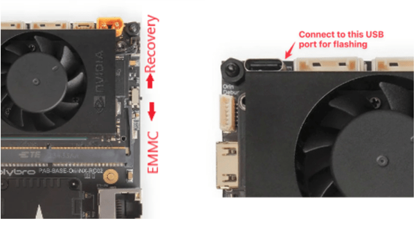

:::tip
The USB port is only for flashing the Jetson, and cannot be used as debug interface.
:::

Download [Nvidia SDK Manager](https://docs.nvidia.com/sdk-manager/download-run-sdkm/index.html#download-sdk-manager) using either the online or offline installer (you need to have an Nvidia account to install and use the SDKManager).

After starting SDKManager you should see a screen similar to the one below (if the board is connected to host computer in recovery mode):

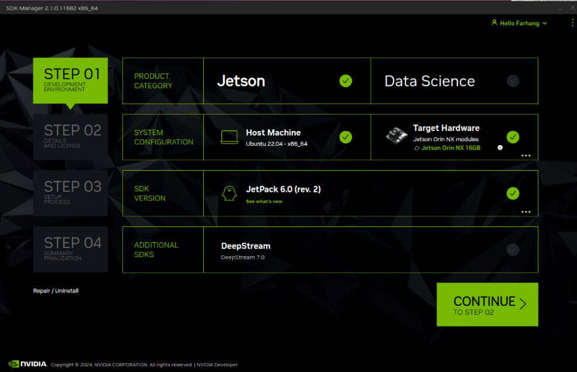

The next screen allows you to choose the components to be installed.
Select the _Jetson Linux_ target components as shown (there is no point selecting other components because after flashing the board will disconnect).

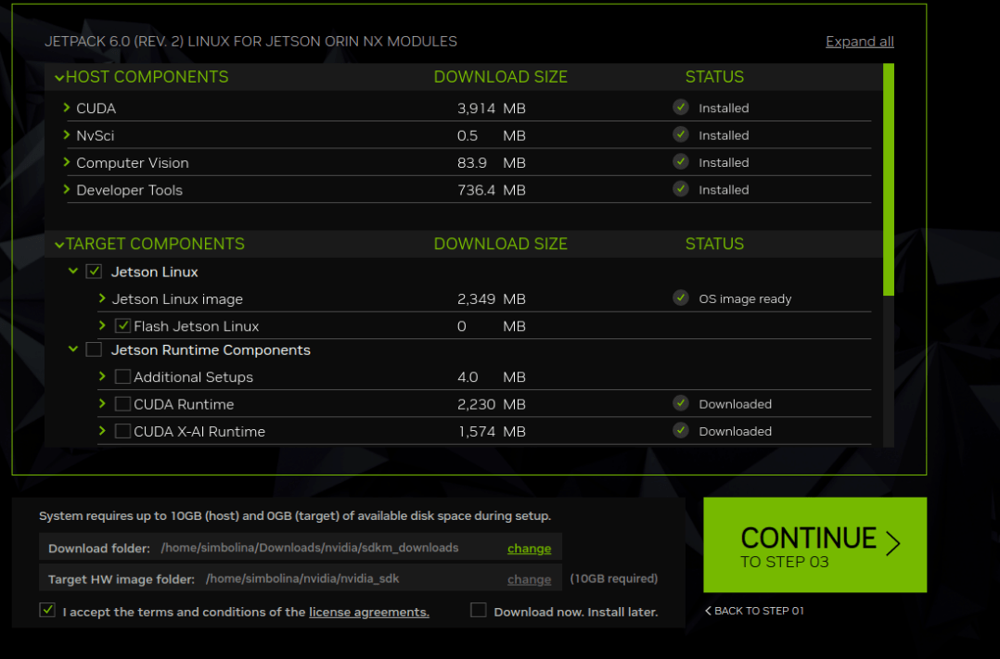

On the following screen, confirm your selected device:

- Choose `Pre-config` for the OEM Configuration (this will skip Ubuntu first time setup screens after reboot).
- Choose your preferred username and password (and write them down).
 These will be used as your login credentials to Jetpack.
- Choose `NVMe` as the storage device because the board has separate SSD for storage.

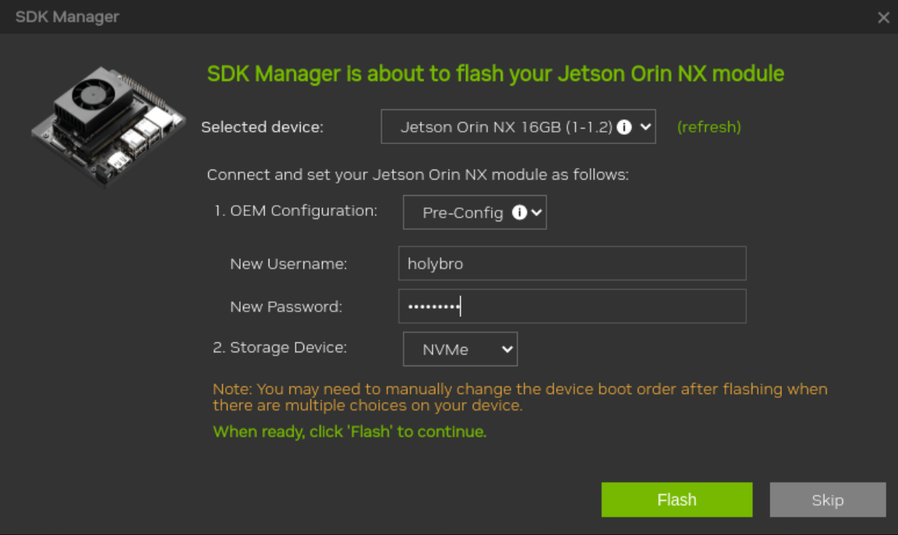

Press **Flash** to start installing the image.
It will take several minutes for the installation to complete.

:::warning
The fan will be running while the installation is going on, so make sure it not blocked.
The Jetson will boot into initial login after flashing.
:::

After flashing the Jetson it will reboot to the login screen (though this won't be obvious unless you already have an external monitor connected).

Note that with the switch in recovery mode position, recovery mode is only skipped the first reboot after flashing!
Disconnect power from the Jetson board and move the small sliding switch from recovery mode back to EMMC.
This ensures that in the future the Jetson will boot into firmware instead of recovery mode.

## Jetson Network & SSH Login

Next we confirm that the Jetson WiFi network is working, find its IP address, and use the IP address to login via SSH.

The diagram below shows how you can connect your Jetson carrier board with external keyboard, display and mouse.
This step is needed so that we can configure the network connection.
Once we have a network connection we can connect to the Jetson via SSH instead of using an external monitor and keyboard (if we want).

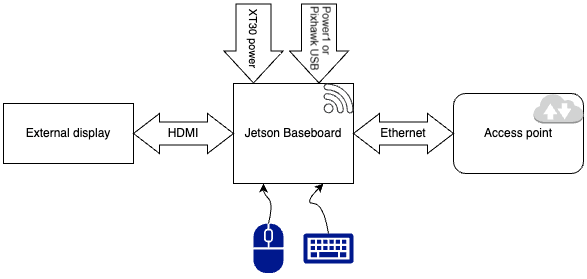

Connect the external monitor to the board's (Jetson) HDMI port, keyboard and mouse via spare USB ports, and the Jetson to power via the XT-30 input.
Separately connect the Pixhawk power supply using either the USB-C (on the side of the FC) or the `Power1`/`Power2` ports next to the Jetson.

:::tip
Pixhawk also has to be powered because the internal Ethernet switch on the board is not powered by XT30 connector.
:::

The external monitor should display the login screen.
Enter the _username_ and _password_ you set when using the SDKManager to flash the Jetson.

Next open a terminal in order to get the IP address of the Jetson.
This can be used later to connect via SSH.
Enter the following command.

```sh
ip addr show
```

The output should look similar to this, indicating (in this case) an IP address of `192.168.1.190` on the `wlan0` (WiFi) connection.
Note that _eth0_ at this step may look different than this output since we have not set it yet and will be defined in the upcoming steps:

```sh
1: lo: <LOOPBACK,UP,LOWER_UP> mtu 65536 qdisc noqueue state UNKNOWN group default qlen 1000
    link/loopback 00:00:00:00:00:00 brd 00:00:00:00:00:00
    inet 127.0.0.1/8 scope host lo
       valid_lft forever preferred_lft forever
    inet6 ::1/128 scope host
       valid_lft forever preferred_lft forever
2: l4tbr0: <BROADCAST,MULTICAST> mtu 1500 qdisc noop state DOWN group default qlen 1000
    link/ether 3e:c7:e7:79:f3:87 brd ff:ff:ff:ff:ff:ff
3: usb0: <NO-CARRIER,BROADCAST,MULTICAST,UP> mtu 1500 qdisc pfifo_fast master l4tbr0 state DOWN group default qlen 1000
    link/ether 4e:fe:60:5f:cd:19 brd ff:ff:ff:ff:ff:ff
4: usb1: <NO-CARRIER,BROADCAST,MULTICAST,UP> mtu 1500 qdisc pfifo_fast master l4tbr0 state DOWN group default qlen 1000
    link/ether 4e:fe:60:5f:cd:1b brd ff:ff:ff:ff:ff:ff
5: can0: <NOARP,ECHO> mtu 16 qdisc noop state DOWN group default qlen 10
    link/can
6: eth0: <BROADCAST,MULTICAST,UP,LOWER_UP> mtu 1500 qdisc pfifo_fast state UP group default qlen 1000
    link/ether 48:b0:2d:d8:d9:6f brd ff:ff:ff:ff:ff:ff
    altname enP8p1s0
    inet 10.41.10.1/24 brd 10.41.10.255 scope global eth0
       valid_lft forever preferred_lft forever
    inet6 fe80::25eb:4f5b:2eab:6468/64 scope link noprefixroute
       valid_lft forever preferred_lft forever
7: wlan0: <BROADCAST,MULTICAST,UP,LOWER_UP> mtu 1500 qdisc noqueue state UP group default qlen 1000
    link/ether 28:d0:ea:89:35:78 brd ff:ff:ff:ff:ff:ff
    altname wlP1p1s0
    inet 192.168.1.190/24 brd 192.168.1.255 scope global dynamic noprefixroute wlan0
       valid_lft 85729sec preferred_lft 85729sec
    inet6 fd71:5f79:6b08:6e4f:9f84:2646:dc24:ce7b/64 scope global temporary dynamic
       valid_lft 1790sec preferred_lft 1790sec
    inet6 fd71:5f79:6b08:6e4f:ec50:8cb1:91be:7dd6/64 scope global dynamic mngtmpaddr noprefixroute
       valid_lft 1790sec preferred_lft 1790sec
    inet6 fe80::8276:b752:2b4b:5977/64 scope link noprefixroute
       valid_lft forever preferred_lft forever
```

:::tip
If the command doesn't work ...
The WiFi card with the board is either an _Intel 8265NGW AC Dual Band_ or _Realtek RTL8B22CE_.
The Intel module may not work out of the box, in which case you should open a terminal and run the following command to install its driver.

```sh
sudo apt-get install -y backport-iwlwifi-dkms
```

Then repeat the process above to try and get the IP address.
:::

Now that we have an IP address, open a terminal in your _development computer_.
Log into the Jetson via SSH specifying the IP address for _your_ Jetson (you will need to enter the same credentials as before):

```sh
ssh holybro@192.168.1.190
```

If that works, you can remove your external monitor, as you can log in from your development computer from now on.

## Initial Development Setup on Jetson

After logging into Jetson install the following dependencies (you will need these for most development tasks):

```sh
sudo apt update
sudo apt install build-essential cmake git genromfs kconfig-frontends libncurses5-dev flex bison libssl-dev
```

## Building/Flashing the Pixhawk

The recommended way to update PX4 is on the Pixhawk part of the board is to use your development computer.
You can either install install prebuilt binaries with QGroundControl, or first build and then upload custom firmware.

Alternatively, you can build and deploy PX4 firmware to the Pixhawk part from the Jetson.

### Build/Deploy PX4 from a Development Computer (Recommended)

First connect your development computer to the Pixhawk FMU USB-C port (highlighted below):

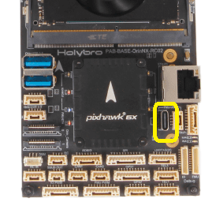

If you want to use prebuilt binaries, then start QGroundControl and follow the instructions in [Loading Firmware](../config/firmware.md) to deploy a recent version of PX4.
Afterwards you will want to select an airframe and do all the other usual configuration for your vehicle type.

If you want to build and upload _custom firmware_ then follow the usual steps:

- [Setting up a Developer Environment (Toolchain)](../dev_setup/dev_env.md)
- [Building PX4 Software](../dev_setup/building_px4.md)
- Upload the firmware using the [command line](../dev_setup/building_px4.md#uploading-firmware-flashing-the-board) or QGroundControl (as above)

### Build PX4 on Jetson

You can also build and develop PX4 code on the Jetson.
Note that there is no need to do this if you have a development computer, but you can do so if you want.

First open a terminal and SSH session into the Jetson, and enter the following command to clone the PX4 source code.

```sh
git clone https://github.com/PX4/PX4-Autopilot.git --recursive
```

:::tip
If you don't need all branches and tags, you can get a smaller part of the repository like this:

```sh
git clone https://github.com/PX4/PX4-Autopilot.git --recursive --depth 1 --single-branch --no-tags
```

:::

Then install the Ubuntu build toolchain by entering the following command

```sh
bash ./PX4-Autopilot/Tools/setup/ubuntu.sh --no-sim-tools
```

If there are warnings, you may need to run the following commands to add the path to your binary directory.

```sh
echo 'export PATH="$HOME/.local/bin:$PATH"' >> ~/.bashrc && source ~/.bashrc
```

:::tip
If there was an error like this when running `ubuntu.sh`:

```sh
E: Unable to locate package g++-multilib
E: Couldn't find any package by regex 'g++-multilib'
```

You will need to install the appropriate gcc toolchain as shown below, and then run `ubuntu.sh` again.

```sh
sudo apt install gcc-arm-none-eabi gdb-arm-none-eabi -y
```

:::

Then give the operating system permission to use the serial ports:

```sh
sudo usermod -a -G dialout $USER
sudo apt-get remove modemmanager -y
```

Sanity check if we can build PX4 Firmware by building PX4 for your Pixhawk hardware on the carrier board.
Assuming you're using a Pixhawk 6x, the command would be:

```sh
make px4_fmu-v6x_default
```

If this builds successfully, you can connect the Pixhawk USB-C port to the Jetson USB port as shown below (the USB cable comes with the kit).

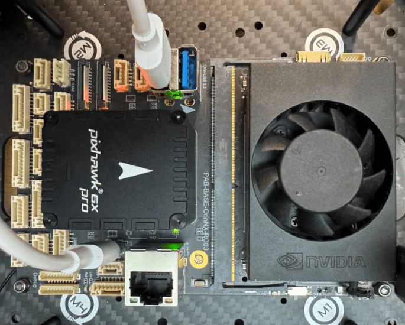

Then upload the firmware to Pixhawk by building with the `upload` argument:

```sh
make px4_fmu-v6x_default upload
```

## Ethernet Setup using Netplan

The Holybro Jetson Pixhawk carrier has an internal network switch between Pixhawk and Jetson that can be used for MAVLink or ROS 2 communication (or any other protocol).
While you don't need to connect any external cables, you will still need to configure the Ethernet connection such that both the Jetson and PX4 are on the same subnet.

PX4 has a default IP address of `10.41.10.2` (PX4 v1.15 and earlier used `192.168.0.3`), while the Jetson is usually configured with a default IP address on a different subnet.
In order for the boards to communicate they need to be on the same subnet.

:::tip
These instructions approximately mirror the [PX4 Ethernet setup](../advanced_config/ethernet_setup.md) (and [Holybro Pixhawk RPi CM4 Baseboard](../companion_computer/holybro_pixhawk_rpi_cm4_baseboard.md)).
:::

Next we modify the Jetson IP address to be on the same network as the Pixhawk:

1. Make sure `netplan` is installed.
 You can check by running the following command:

 ```sh
 netplan -h
 ```

 If not, install it using the commands:

 ```sh
 sudo apt update
 sudo apt install netplan.io
 ```

2. Check `system_networkd` is running:

 ```sh
 sudo systemctl status systemd-networkd
 ```

 You should see output like below if it is active:

 ```sh
 ● systemd-networkd.service - Network Configuration
      Loaded: loaded (/lib/systemd/system/systemd-networkd.service; enabled; vendor preset: enabled)
      Active: active (running) since Wed 2024-09-11 23:32:44 EDT; 23min ago
 TriggeredBy: ● systemd-networkd.socket
        Docs: man:systemd-networkd.service(8)
    Main PID: 2452 (systemd-network)
      Status: "Processing requests..."
       Tasks: 1 (limit: 18457)
      Memory: 2.7M
         CPU: 157ms
      CGroup: /system.slice/systemd-networkd.service
              └─2452 /lib/systemd/systemd-networkd

 Sep 11 23:32:44 ubuntu systemd-networkd[2452]: lo: Gained carrier
 Sep 11 23:32:44 ubuntu systemd-networkd[2452]: wlan0: Gained IPv6LL
 Sep 11 23:32:44 ubuntu systemd-networkd[2452]: eth0: Gained IPv6LL
 Sep 11 23:32:44 ubuntu systemd-networkd[2452]: Enumeration completed
 Sep 11 23:32:44 ubuntu systemd[1]: Started Network Configuration.
 Sep 11 23:32:44 ubuntu systemd-networkd[2452]: wlan0: Connected WiFi access point: Verizon_7YLWWD (78:67:0e:ea:a6:0>
 Sep 11 23:34:16 ubuntu systemd-networkd[2452]: eth0: Re-configuring with /run/systemd/network/10-netplan-eth0.netwo>
 Sep 11 23:34:16 ubuntu systemd-networkd[2452]: eth0: DHCPv6 lease lost
 Sep 11 23:34:16 ubuntu systemd-networkd[2452]: eth0: Re-configuring with /run/systemd/network/10-netplan-eth0.netwo>
 Sep 11 23:34:16 ubuntu systemd-networkd[2452]: eth0: DHCPv6 lease lost
 ```

 If `system_networkd` is not running, it can be enabled using:

 ```sh
 sudo systemctl start systemd-networkd
 sudo systemctl enable systemd-networkd
 ```

3. Open the Netplan configuration file (so we can set up a static IP for the Jetson).

 The Netplan configuration file is usually located in the `/etc/netplan/` directory and named something like `01-netcfg.yaml` (the name can vary).
 Below we use `nano` to open the file, but you can use your preferred text editor:

 ```sh
 sudo nano /etc/netplan/01-netcfg.yaml
 ```

4. Modify the yaml configuration, by overwriting the contents with the following information and then saving:

 ```sh
 network:
   version: 2
   renderer: networkd
   ethernets:
     eth0:
       dhcp4: no
       addresses:
         - 10.41.10.1/24
       routes:
         - to: 0.0.0.0/0
           via: 10.41.10.254
       nameservers:
         addresses:
           - 10.41.10.254
 ```

 This gives the Jetson a static IP address on the Ethernet interface of `10.41.10.1` .

5. Apply the changes using the following command:

 ```sh
 sudo netplan apply
 ```

The Pixhawk Ethernet address is set to `10.41.10.2` by default, which is on the same subnet.
We can test our changes above by pinging the Pixhawk from within the Jetson terminal:

```sh
ping 10.41.10.2
```

If this is successful you will see the output below.

```sh
PING 10.41.10.2 (10.41.10.2) 56(84) bytes of data.
64 bytes from 10.41.10.2: icmp_seq=1 ttl=64 time=0.215 ms
64 bytes from 10.41.10.2: icmp_seq=2 ttl=64 time=0.346 ms
64 bytes from 10.41.10.2: icmp_seq=3 ttl=64 time=0.457 ms
64 bytes from 10.41.10.2: icmp_seq=4 ttl=64 time=0.415 ms
```

The Jetson and Pixhawk can now communicate over Ethernet.

## MAVLink Setup

MAVLink is a protocol that you can use for communicating between the Jetson and PX4 (we'll discuss ROS 2 as an alternative in the next section).
PX4 users typically use the [MAVSDK](../robotics/mavsdk.md) to manage MAVLink communications, as it provides a simple cross-platform and cross-programming language abstraction of the MAVLink protocol.

The internal serial and Ethernet links are both configured to use MAVLink by default.

:::info
See [MAVLink-Bridge](https://docs.holybro.com/autopilot/pixhawk-baseboards/pixhawk-jetson-baseboard/mavlink-bridge) (Holybro docs) for more information.
:::

### Serial Connection

The Jetson and Pixhawk are internally connected using a serial cable from Pixhawk `TELEM2` to Jetson `THS1`.
The Pixhawk `TELEM2` interface is configured to use MAVLink by default ([MAVLink Peripherals (GCS/OSD/Companion) > TELEM2](../peripherals/mavlink_peripherals.md#telem2)), so you don't have to do anything in particular to get it working.

An easy way to test the link is to run [MAVSDK-Python](https://github.com/mavlink/MAVSDK-Python) example code on the Jetson.

First install MAVSDK-Python:

```sh
pip3 install mavsdk
```

Then clone the repository:

```sh
git clone https://github.com/mavlink/MAVSDK-Python --recursive
```

Modify the `MAVSDK-Python/examples/telemetry.py` [connection code](https://github.com/mavlink/MAVSDK-Python/blob/707c48c01866cfddc0082217dba9f7fe27d59b27/examples/telemetry.py#L10) from:

```py
await drone.connect(system_address="udp://:14540")
```

To connect via the serial port:

```sh
await drone.connect(system_address="serial:///dev/ttyTHS1:921600")
```

Then run the example in the Jetson terminal:

```sh
python ~/MAVSDK-Python/examples/telemetry.py
```

The output below is expected:

```sh
In air: False
Battery: -1.0
In air: False
Battery: -1.0
In air: False
Battery: -1.0
```

### Ethernet Connection

The Jetson and Pixhawk are internally connected using an Ethernet switch, and if you have followed the instructions in [Ethernet Setup using Netplan](#ethernet-setup-using-netplan), will also be on the same Ethernet subnet.

As the Pixhawk `Ethernet` interface is configured to use MAVLink by default ([MAVLink Peripherals (GCS/OSD/Companion) > Ethernet](../peripherals/mavlink_peripherals.md#ethernet)) you don't need to do anything else to use MAVLink.

The instructions are the same as in the previous section, except that you should modify the `connect()` line to:

```sh
await drone.connect(system_address="udp://:14550")
```

## ROS 2 Setup

[ROS 2](../ros2/index.md) is powerful robotics API that you can run on the Jetson in order to control PX4 running on the Pixhawk.
It is harder to learn than MAVLink and its interfaces still evolving, but it offers a much deeper integration with PX4, and much lower latency communication.

In order to use ROS 2 we first need to run [XRCE-DDS middleware](../middleware/uxrce_dds.md) client on PX4 and agent on the Jetson.
The instructions depend on the communications channel used (Ethernet or Serial).

This section explains the specific setup, and is heavily based on the [ROS 2 user guide](../ros2/user_guide.md).

### PX4 XRCE-DDS Client Setup

The uXRCE-DDS client is built into PX4 firmware by default, and exposes a predefined set of uORB topics to the DDS network on which ROS 2 runs, via the XRCE-Agent.
The set of exposed topics are defined in a build configuration file.

The channel used by the client for communication with the agent is configured using parameters.
You can use either the internal serial connection or the internal Ethernet switch.

#### XRCE-Client Serial Port Setup

As covered in the MAVLink section, there is an internal serial link from Pixhawk `TELEM2` to Jetson `THS1`, which is configured to communicate via MAVLink by default.
You will need to disable the MAVLink instance and enable the UXRCE_DDS configuration.

You can [modify the parameters](../advanced_config/parameters.md) in QGroundControl parameter editor, or using `param set` in the [MAVLink shell](../debug/mavlink_shell.md).

:::tip
There are a number of ways to access a MAVLink shell.
The easiest way is to connect the Pixhawk to your development computer via the Pixhawk USB-C and use the [QGroundControl MAVLink Console](https://docs.qgroundcontrol.com/master/en/qgc-user-guide/analyze_view/mavlink_console.html).
:::

The instructions below assume you're entering commands in the MAVLink shell:

```sh
param set MAV_1_CONFIG 0  # Disable MAVLINK on TELEM2 (so it can be used for XRCE-DDS)
param set UXRCE_DDS_CFG 102 # Set UXRCE_DDS_CFG to TELEM2
```

:::info
Note that you can also change the following parameters, but this requires a deeper understanding of DDS.

```sh
param set UXRCE_DDS_DOM_ID 0
param set UXRCE_DDS_PTCFG 0
param set UXRCE_DDS_SYNCC 0
param set UXRCE_DDS_SYNCT 1
```

:::

Then reboot the Pixhawk.

#### XRCE-Client Ethernet Setup

As covered in the MAVLink section, there is an internal Ethernet switch linking the Jetson and Pixhawk.
We configured both boards to use the same subnet above.
However we need to disable MAVLink on the PX4 `Ethernet` port and enable `XRCE-DDS`.

You can [modify the parameters](../advanced_config/parameters.md) in QGroundControl parameter editor, or using `param set` in the [MAVLink shell](../debug/mavlink_shell.md).
Enter the following commands to change the values in the MAVLink shell:

```sh
param set MAV_2_CONFIG 0  # Disable MAVLINK on Ethernet (so Ethernet can be used for XRCE-DDS)
param set UXRCE_DDS_CFG 1000 # Ethernet
param set UXRCE_DDS_PRT 8888  # Set port to 8888 (default)
param set UXRCE_DDS_AG_IP 170461697 # The int32 version of 10.41.10.1
```

We're setting the address of the Jetson to 170461697 using the `UXRCE_DDS_AG_IP` parameter.
Note that this is an INT32 formatted version of `10.41.10.1` (see [Starting uXRCE-DDS client](../middleware/uxrce_dds.md#starting-the-client) for information about how to convert between versions).

#### Checking the XRCE-DDS Client is Running

:::tip
The client should automatically start on boot if configured correctly!
:::

We can check that the client is running using the following command in the MAVLink shell:

```sh
uxrce_dds_client status
```

A healthy output should show:

```sh
nsh> uxrce_dds_client status
INFO [uxrce_dds_client] Running, disconnected
INFO [uxrce_dds_client] Using transport: serial
INFO [uxrce_dds_client] timesync converged: false
uxrce_dds_client: cycle: 0 events, 0us elapsed, 0.00us avg, min 0us max 0us 0.000us rms
uxrce_dds_client: cycle interval: 0 events, 0.00us avg, min 0us max 0us 0.000us rms
```

Also another way to check if the client has started running at the boot is to get `dmesg` output from MAVLINK shell.
The below output as a part of `dmesg` log mentions the baudrate and the instance (`/dev/tty/S4` is equal to `TELEM2` for Holybro Pixhawk 6X and 6X Pro) the client is running on.

```sh
Starting UXRCE-DDS Client on /dev/ttyS4
INFO  [uxrce_dds_client] init serial /dev/ttyS4 @ 921600 baud
```

### XRCE-DDS Agent & ROS 2 Setup

Follow the instruction in the ROS2 User guide to [Install ROS 2](../ros2/user_guide.md#install-ros-2) on the Jetson.
You don't have to install PX4 on the Jetson because we're not using the simulator, but you may wish to install the full desktop so you can use additional ROS 2 packages for further development:

```sh
sudo apt install -y ros-humble-desktop-full -y
```

#### Start the XRCE-DDS Agent

Then fetch and build the uXRCE-DDS _agent_ as covered in [Setup the Agent](../ros2/user_guide.md#setup-the-agent) in the ROS 2 User guide.

You will start the agent using different commands, depending on whether the client is configured for a serial or Ethernet connection.
Assuming the client is set up as defined above:

- (Serial connection) Start the agent on `/dev/ttyTHS1`:

 ```sh
 sudo MicroXRCEAgent serial --dev /dev/ttyTHS1 -b 921600
 ```

- (Ethernet) Start the agent on UDP port `8888`:

 ```sh
 MicroXRCEAgent udp4 -p 8888
 ```

If your agent and client are connected and no nodes are running, you should see output similar to this in the Agent terminal:

```sh
[1726117589.065585] info     | UDPv4AgentLinux.cpp | init                     | running...             | port: 8888
[1726117589.066415] info     | Root.cpp           | set_verbose_level        | logger setup           | verbose_level: 4
[1726117589.568522] info     | Root.cpp           | create_client            | create                 | client_key: 0x00000001, session_id: 0x81
[1726117589.569317] info     | SessionManager.hpp | establish_session        | session established    | client_key: 0x00000001, address: 10.41.10.2:49940
[1726117589.580924] info     | ProxyClient.cpp    | create_participant       | participant created    | client_key: 0x00000001, participant_id: 0x001(1)
[1726117589.581598] info     | ProxyClient.cpp    | create_topic             | topic created          | client_key: 0x00000001, topic_id: 0x800(2), participant_id: 0x001(1)
[1726117589.581761] info     | ProxyClient.cpp    | create_subscriber        | subscriber created     | client_key: 0x00000001, subscriber_id: 0x800(4), participant_id: 0x001(1)
[1726117589.584858] info     | ProxyClient.cpp    | create_datareader        | datareader created     | client_key: 0x00000001, datareader_id: 0x800(6), subscriber_id: 0x800(4)
[1726117589.585643] info     | ProxyClient.cpp    | create_topic             | topic created          | client_key: 0x00000001, topic_id: 0x801(2), participant_id: 0x001(1)
[1726117589.585746] info     | ProxyClient.cpp    | create_subscriber        | subscriber created     | client_key: 0x00000001, subscriber_id: 0x801(4), participant_id: 0x001(1)
[1726117589.586284] info     | ProxyClient.cpp    | create_datareader        | datareader created     | client_key: 0x00000001, datareader_id: 0x801(6), subscriber_id: 0x801(4)
[1726117589.587115] info     | ProxyClient.cpp    | create_topic             | topic created          | client_key: 0x00000001, topic_id: 0x802(2), participant_id: 0x001(1)
[1726117589.587187] info     | ProxyClient.cpp    | create_subscriber        | subscriber created     | client_key: 0x00000001, subscriber_id: 0x802(4), participant_id: 0x001(1)
[1726117589.587536] info     | ProxyClient.cpp    | create_datareader        | datareader created     | client_key: 0x00000001, datareader_id: 0x802(6), subscriber_id: 0x802(4)
[1726117589.588124] info     | ProxyClient.cpp    | create_topic             | topic created          | client_key: 0x00000001, topic_id: 0x803(2), participant_id: 0x001(1)
[1726117589.588183] info     | ProxyClient.cpp    | create_subscriber        | subscriber created     | client_key: 0x00000001, subscriber_id: 0x803(4), participant_id: 0x001(1)
[1726117589.588494] info     | ProxyClient.cpp    | create_datareader        | datareader created     | client_key: 0x00000001, datareader_id: 0x803(6), subscriber_id: 0x803(4)
[1726117589.589025] info     | ProxyClient.cpp    | create_topic             | topic created          | client_key: 0x00000001, topic_id: 0x804(2), participant_id: 0x001(1)
...
[1726117589.596755] info     | ProxyClient.cpp    | create_topic             | topic created          | client_key: 0x00000001, topic_id: 0x809(2), participant_id: 0x001(1)
[1726117589.596813] info     | ProxyClient.cpp    | create_subscriber        | subscriber created     | client_key: 0x00000001, subscriber_id: 0x809(4), participant_id: 0x001(1)
[1726117589.597112] info     | ProxyClient.cpp    | create_datareader        | datareader created     | client_key: 0x00000001, datareader_id: 0x809(6), subscriber_id: 0x809(4)
[1726117589.597842] info     | ProxyClient.cpp    | create_topic             | topic created          | client_key: 0x00000001, topic_id: 0x80A(2), participant_id: 0x001(1)
[1726117589.597905] info     | ProxyClient.cpp    | create_subscriber        | subscriber created     | client_key: 0x00000001, subscriber_id: 0x80A(4), participant_id: 0x001(1)
[1726117589.598197] info     | ProxyClient.cpp    | create_datareader        | datareader created     | client_key: 0x00000001, datareader_id: 0x80A(6), subscriber_id: 0x80A(4)
```

#### Starting the Agent on Boot

To run the XRCE-DDS agent each time the Jetson reboots you can make a daemon service to run the agent.

Make a new service file:

```sh
sudo nano /etc/systemd/system/microxrceagent.service
```

Paste the following inside:

```plain
[Unit]
Description=Micro XRCE Agent Service After=network.target
[Service]
14
Holybro carrier board
ExecStart=/usr/local/bin/MicroXRCEAgent udp4 -p 8888 Restart=always
User=root
Group=root
ExecStartPre=/bin/sleep 10
[Install]
WantedBy=multi-user.target
```

Save the file and run the following inside terminal

```sh
sudo systemctl daemon-reload
sudo systemctl enable microxrceagent.service
```

Then you can reboot your Jetson board and check if the agent is running in the background:

```sh
sudo systemctl status microxrceagent.service
```

If the service is running, you should see output like this:

```sh
holybro@ubuntu:~$ sudo systemctl status microxrceagent.service
● microxrceagent.service - Micro XRCE Agent Service
   Loaded: loaded (/etc/systemd/system/microxrceagent.service; enabled; vendor preset: enabled)
   Active: active (running) since Tue 204-07-30 01:37:45 EDT; 1min 30s ago
 Main PID: 1616 (MicroXRCEAgent)
    Tasks: 42 (limit: 18457)
   Memory: 29.6M
   CPU: 1.356s
   CGroup: /system.slice/microxrceagent.service
           └─1616 /usr/local/bin/MicroXRCEAgent udp4 -p 8888

Jul 30 01:37:52 ubuntu MicroXRCEAgent[1616]: [1722317872.094190] info    | ProxyClient.cpp   | create_datawriter       | datawriter created   | client_key: 0x00000001, datawriter_id: 0x0F6(5), publisher_id: 0x0F6(3)
Jul 30 01:37:52 ubuntu MicroXRCEAgent[1616]: [1722317872.095277] info    | ProxyClient.cpp   | create_topic            | topic created        | client_key: 0x00000001, topic_id: 0x100(2), participant_id: 0x001(1)
Jul 30 01:37:52 ubuntu MicroXRCEAgent[1616]: [1722317872.095358] info    | ProxyClient.cpp   | create_publisher        | publisher created    | client_key: 0x00000001, publisher_id: 0x100(3), participant_id: 0x001(1)
Jul 30 01:37:52 ubuntu MicroXRCEAgent[1616]: [1722317872.095537] info    | ProxyClient.cpp   | create_datawriter       | datawriter created   | client_key: 0x00000001, datawriter_id: 0x105(5), publisher_id: 0x100(3)
Jul 30 01:37:52 ubuntu MicroXRCEAgent[1616]: [1722317872.096029] info    | ProxyClient.cpp   | create_topic            | topic created        | client_key: 0x00000001, topic_id: 0x105(2), participant_id: 0x001(1)
Jul 30 01:37:52 ubuntu MicroXRCEAgent[1616]: [1722317872.097022] info    | ProxyClient.cpp   | create_publisher        | publisher created    | client_key: 0x00000001, publisher_id: 0x105(3), participant_id: 0x001(1)
Jul 30 01:37:52 ubuntu MicroXRCEAgent[1616]: [1722317872.097797] info    | ProxyClient.cpp   | create_datawriter       | datawriter created   | client_key: 0x00000001, datawriter_id: 0x10A(5), publisher_id: 0x10A(3)
Jul 30 01:37:52 ubuntu MicroXRCEAgent[1616]: [1722317872.098088] info    | ProxyClient.cpp   | create_topic            | topic created        | client_key: 0x00000001, topic_id: 0x10A(2), participant_id: 0x001(1)
Jul 30 01:37:52 ubuntu MicroXRCEAgent[1616]: [1722317872.098168] info    | ProxyClient.cpp   | create_publisher        | publisher created    | client_key: 0x00000001, publisher_id: 0x10A(3), participant_id: 0x001(1)
Jul 30 01:37:52 ubuntu MicroXRCEAgent[1616]: [1722317872.098486] info    | ProxyClient.cpp   | create_datawriter       | datawriter created   | client_key: 0x00000001, datawriter_id: 0x10A(5), publisher_id: 0x10A(3)
```

You can now start your ROS2 nodes and continue the development.

### ROS 2 Sensor Combined Tests

You can test the Client and agent by using the `sensor_combined` example in [Build ROS 2 Workspace](../ros2/user_guide.md#build-ros-2-workspace) (ROS2 User Guide).

:::tip
[VSCode over SSH](https://code.visualstudio.com/learn/develop-cloud/ssh-lab-machines) enables faster development and application of changes to your ROS 2 code!
:::

After getting to the point of running the example:

```sh
ros2 launch px4_ros_com sensor_combined_listener.launch.py
```

You should see high frequency sensor messages as the output:

```sh
[sensor_combined_listener-1] RECEIVED SENSOR COMBINED DATA
[sensor_combined_listener-1] ====================================
[sensor_combined_listener-1] ts: 1722316316179649
[sensor_combined_listener-1] gyro_rad[0]: 0.0015163
[sensor_combined_listener-1] gyro_rad[1]: 0.00191962
[sensor_combined_listener-1] gyro_rad[2]: 0.00343043
[sensor_combined_listener-1] gyro_integral_dt: 4999
[sensor_combined_listener-1] accelerometer_timestamp_relative: 0
[sensor_combined_listener-1] accelerometer_m_s2[0]: -0.368978
[sensor_combined_listener-1] accelerometer_m_s2[1]: 1.43863
[sensor_combined_listener-1] accelerometer_m_s2[2]: -9.68139
[sensor_combined_listener-1] accelerometer_integral_dt: 4999
```

## See Also

- [Jetson carrier board Holybro Docs](https://docs.holybro.com/autopilot/pixhawk-baseboards/pixhawk-jetson-baseboard)
- [PX4 Middleware docs](../middleware/uxrce_dds.md#starting-the-client)
- [PX4 ROS 2 user guide](../ros2/user_guide.md)
