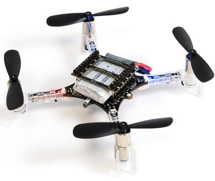
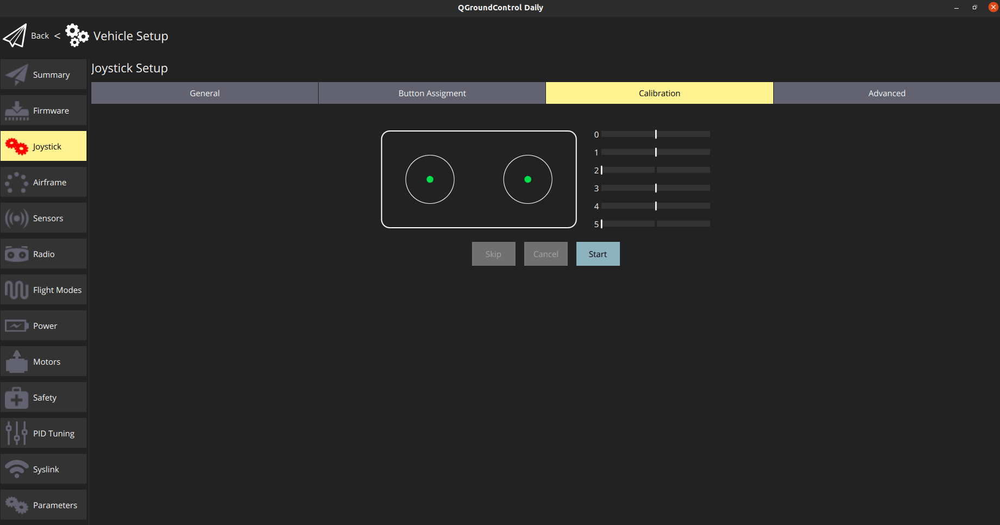
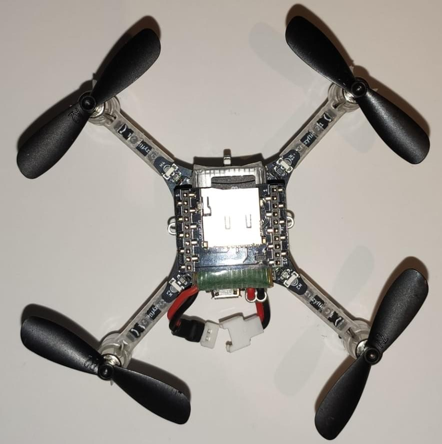

# Crazyflie 2.1

<LinkedBadge type="warning" text="Experimental" url="../flight_controller/autopilot_experimental.html"/>

:::warning
PX4 does not manufacture this (or any) autopilot.
Contact the [manufacturer](https://www.bitcraze.io/) for hardware support or compliance issues.
:::

:::warning
Crazyflie 2.1 is only able to fly in [Stabilized mode](../flight_modes_mc/manual_stabilized.md).
:::

The Crazyflie line of micro quads was created by Bitcraze AB.
An overview of the Crazyflie 2.1 can be [found here](https://www.bitcraze.io/products/crazyflie-2-1/).



## 요약

:::info
The main hardware documentation is [here](https://wiki.bitcraze.io/projects:crazyflie2:index)
:::

- Main System-on-Chip: STM32F405RG
  - CPU : 단정밀도 FPU의 168MHz ARM Cortex M4
  - RAM : 192KB SRAM
- nRF51822 radio and power management MCU
- BMI088 3 axis accelerometer / gyroscope
- BMP388 high precision pressure sensor
- uUSB connector
- On-board LiPo charger with 100mA, 500mA and 980mA modes available
- Full speed USB device interface
- Partial USB OTG capability (USB OTG present but no 5V output)
- 8KB EEPROM

## 구매처

The vehicle can be purchased here: [Crazyflie 2.1](https://store.bitcraze.io/products/crazyflie-2-1) (store.bitcraze.io)

Useful peripheral hardware includes:

- [Crazyradio PA 2.4 GHz USB dongle](https://store.bitcraze.io/collections/kits/products/crazyradio-pa): Wireless communication between _QGroundControl_ and Crazyflie 2.0
- [Breakout deck](https://store.bitcraze.io/collections/decks/products/breakout-deck): Breakout expansion board for connecting new peripherals.
- [Flow deck v2](https://store.bitcraze.io/collections/decks/products/flow-deck-v2): Optical flow sensor and a distance sensor for altitude and position control.
- [Z-ranger deck v2](https://store.bitcraze.io/collections/decks/products/z-ranger-deck-v2): Distance sensor for altitude control (same sensor as the Flow deck).
- [Multi-ranger deck](https://store.bitcraze.io/collections/decks/products/multi-ranger-deck) Multi-direction object detection
- [Buzzer deck](https://store.bitcraze.io/collections/decks/products/buzzer-deck) Audio feedback on system events, like low battery or charging completed.
- [Breakout deck](https://store.bitcraze.io/collections/decks/products/breakout-deck): Expansion board that gives you the ability to test new hardware easily without soldering.
- [SD-card deck](https://store.bitcraze.io/collections/decks/products/sd-card-deck): High speed onboard logging to a micro SD card
- [Logitech Joystick](https://support.logi.com/hc/en-us/articles/360024326793--Getting-Started-Gamepad-F310)

## Assemble Crazyflie 2.1

- [Bitcraze crazyflie 2.1 getting started](https://www.bitcraze.io/documentation/tutorials/getting-started-with-crazyflie-2-x/).

## Flashing PX4

:::info
These instructions have only been tested on Ubuntu.
:::

After setting up the PX4 development environment, follow these steps to install the PX4 Autopilot on the Crazyflie 2.1:

1. Download the source code of the PX4 Bootloader:

  ```sh
  git clone https://github.com/PX4/Bootloader.git --recurse-submodules
  ```

2. Navigate into the top directory of the source code and compile it using:

  ```sh
  make crazyflie21_bl
  ```

3. Put the Crazyflie 2.1 into DFU mode by following these steps:
  - Ensure it is initially unpowered.
  - Ensure battery is disconnected.
  - Hold down the reset button (see figure below...).
    
  - Plug into computer's USB port.
  - After a second, the blue LED should start blinking and after 5 seconds should start blinking faster.
  - Release button.

4. Install _dfu-util_:

  ```sh
  sudo apt-get update
  sudo apt-get install dfu-util
  ```

5. Flash bootloader using _dfu-util_ and unplug Crazyflie 2.1 when done:

  ```sh
  sudo dfu-util -d 0483:df11 -a 0 -s 0x08000000 -D ./build/crazyflie21_bl/crazyflie21_bl.bin
  ```

  When powering on the Crazyflie 2.1 the yellow LED should blink.

6. Download the source code of the PX4 autopilot:

  ```sh
  git clone https://github.com/PX4/PX4-Autopilot.git
  ```

7. Navigate into the top directory of the source code and compile it using:

  ```sh
  cd PX4-Autopilot/
  make bitcraze_crazyflie21_default upload
  ```

8. When prompted to plug in device, plug in Crazyflie 2.1.
  The yellow LED should start blinking indicating bootloader mode.
  Then the red LED should turn on indicating that the flashing process has started.

9. Wait for completion.

10. Done! Calibrate the sensors using [QGroundControl](https://docs.qgroundcontrol.com/master/en/qgc-user-guide/setup_view/sensors.html).

## Flashing Original Bitcraze Firmware

1. Download the latest [Crazyflie 2.1 bootloader](https://github.com/bitcraze/crazyflie2-stm-bootloader/releases)

2. Put the Crazyflie 2.1 into DFU mode by following these steps:
  - Ensure it is initially unpowered.
  - Ensure battery is disconnected.
  - Hold down the reset button.
  - Plug into computer's USB port.
  - After a second, the blue LED should start blinking and after 5 seconds should start blinking faster.
  - Release button.

3. Flash bootloader using _dfu-util_ and unplug Crazyflie 2.1 when done:

  ```sh
  sudo dfu-util -d 0483:df11 -a 0 -s 0x08000000 -D cf2loader-1.0.bin
  ```

  When powering on the Crazyflie 2.1 the yellow LED should blink.

4. Install the latest Bitcraze Crazyflie 2.1 Firmware using [this](https://www.bitcraze.io/documentation/tutorials/getting-started-with-crazyflie-2-x/#update-fw) tutorial.

## Wireless Setup Instructions

The onboard nRF module allows connecting to the board via Bluetooth or through the proprietary 2.4GHz Nordic ESB protocol.

- A [Crazyradio PA](https://www.bitcraze.io/crazyradio-pa/) is recommended.
- To fly the Crazyflie 2.1 right away, the Crazyflie phone app is supported via Bluetooth.

Connecting via **MAVLink**:

- Use a Crazyradio PA alongside a compatible GCS.
- Download the _crazyflie-lib-python_ source code:

  ```sh
  git clone https://github.com/bitcraze/crazyflie-lib-python.git
  ```

:::info
We will use [cfbridge.py](https://github.com/bitcraze/crazyflie-lib-python/blob/master/examples/cfbridge.py) to setup a wireless MAVlink communication link between Crazyflie 2.1 (flashed with PX4) and QGroundControl. _Cfbridge_ enables QGroundControl to communicate with the crazyradio PA.
The [C based cfbridge](https://github.com/dennisss/cfbridge) is currently experiencing data loss issues, which is why we have chosen to use **cfbridge.py**.
:::

- Make sure you have set the udev permissions to use the USB Radio. To do this, follow the steps listed [here](https://www.bitcraze.io/documentation/repository/crazyflie-lib-python/master/installation/usb_permissions/) and **restart** your computer.

- Connect a Crazyradio PA via USB.

- Build a [virtual environment (local python environment)](https://virtualenv.pypa.io/en/latest/) with package dependencies using the following method:

  ```sh
  pip install tox --user
  ```

- Navigate to the crazyflie-lib-python folder and type:

  ```sh
  make venv
  ```

- Activate the virtual environment:

  ```sh
  source venv/bin/activate
  ```

- Install required dependencies:

  ```sh
  pip install cflib
  pip install -r requirements.txt
  ```

To connect Crazyflie 2.1 with crazyradio, **launch cfbridge** by following these steps:

- Power off and power on Crazyflie 2.1 and wait for it to boot up.

- Connect a Crazyflie radio device via USB.

- Navigate to the crazyflie-lib-python folder.

- Activate the environment:

  ```sh
  source venv/bin/activate
  ```

- Navigate to the examples folder:

  ```sh
  cd examples

  ```

- Launch cfbridge:

  ```sh
  python cfbridge.py
  ```

  ::: info
  _Cfbridge_ by default tries to initiate the radio link communication on channel 80 and with crazyflie address 0xE7E7E7E7E7.
  If you are using [multiple crazyflies and/or crazyradios](https://github.com/dennisss/cfbridge/blob/master/index.md#advanced-swarming) in the same room and want to use a different channel and/or address for each, first connect the crazyflie with QGroundControl via a USB cable and change the syslink parameters (channel, address) in QGroundControl.
  Next, launch the cfbridge by giving the same channel and address as the first and second arguments respectively, e.g: `python cfbridge.py 90 0x0202020202`

:::

- Open QGroundControl.

- After using _cfbridge_, you can deactivate the virtualenv if you activated it by pressing `CTRL+z`.
  Most of the time, launching _cfbridge_ again from the same terminal doesn't connect to crazyflie, this can be solved by closing the terminal and relaunching _cfbridge_ in a new terminal.

:::tip
If you change any driver in [crazyflie-lib-python](https://github.com/bitcraze/crazyflie-lib-python) or if launching _cfbridge_ in a new terminal does not find crazyflie, you can try navigating to the crazyflie-lib-python folder and run the script below to rebuild cflib.

```sh
make venv
```

:::

:::info
The Joystick menu in QGC, only appears after you connect the controller to the PC (for example a Playstation 3 controller).


:::

## 하드웨어 설정

Crazyflie 2.1 is only able to fly in [Stabilized mode](../flight_modes_mc/manual_stabilized.md).

In order to log flight details, you can mount SD card deck on top of crazyflie as shown below:



## Using FrSky Taranis RC Transmitter as Joystick

If you already own a Taranis RC transmitter and want to use it as a controller, it can be configured as a USB Joystick:

- Create a new model in Taranis.

  

- In _MODEL SETUP_ menu page, turn off both internal and external TX modules.

  

- In _OUTPUTS_ menu page (also called “SERVOS” page in some Taranis transmitters), invert Throttle (CH1) and Aileron (CH3).

  

To use Taranis switches to arm/disarm and switch to different flight modes:

- In Taranis UI _MIXER_ menu page, you can assign the switches to any channel in the range channel 9-16 which map to the buttons 0-7 in the QGroundControl Joystick setup. For example, Taranis “SD” switch can be set to channel 9 in Taranis UI:

  

- Connect Taranis to PC with a USB cable and Open QGroundControl.

- In QGroundControl Joystick Setup, you can see the buttons turning yellow when you switch them on. For example, channel 9 in Taranis maps to button 0 in QGroundControl Joystick setup. You can assign any mode to this button e.g. _Altitude_ mode. Now when you lower the switch "SD", flight mode will change to _Altitude_.

  

### ROS

To connect to Crazyflie 2.1 via MAVROS:

- Start up _cfbridge_ using the above instructions.

- Change the UDP port QGroundControl listens to:
  - In QGroundControl, navigate to **Application Settings > General** and uncheck all the boxes under _Autoconnect to the following devices_.
  - Add in **Comm Links** a link of type _UDP_, check the _Automatically Connect on Start_ option, change the _Listening Port_ to 14557, add Target Hosts: 127.0.0.1 and then press **OK**.

- Make sure you have [MAVROS](https://github.com/mavlink/mavros/tree/master/mavros#installation) installed.

- Start MAVROS with command:

  ```sh
  roslaunch mavros px4.launch fcu_url:="udp://:14550@127.0.0.1:14551" gcs_url:="udp://@127.0.0.1:14557"
  ```

- Restart QGroundControl if it doesn't connect.

## 비행

<lite-youtube videoid="0qy7O3fVN2c" title="Crazyflie 2.1 - PX4 Firmware (stabilized mode)"/>
