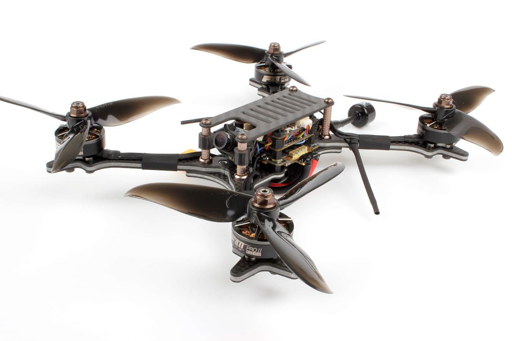

# 홀리브로 코피스 2

The [Holybro Kopis 2](https://holybro.com/products/kopis2-hdv-free-shipping) is a ready-to-fly race quad for flying FPV or line-of-sight.

## 구매처

The _Kopis 2_ can be bought from a number of vendors, including:

- [Holybro](https://holybro.com/products/kopis2-hdv-free-shipping) <!-- item code 30069, 30070 -->
- [GetFPV](https://www.getfpv.com/holybro-kopis-2-6s-fpv-racing-drone-pnp.html)

추가로 다음과 같은 것들이 필요합니다.

- An RC transmitter. The _Kopis 2_ can ship with an FrSky receiver or no receiver at all.
- LiPo battery and charger.
- FPV goggles if you want to fly FPV.
  There are many compatible options, including these ones from [Fatshark](https://www.fatshark.com/product-page/dominator-v3).
  You can also use DJI FPV goggles if you have the HDV version of the Kopis 2.

  ::: info
  FPV support is completely independent of PX4/flight controller.

:::

## Flashing PX4 Bootloader

The _Kopis 2_ comes preinstalled with Betaflight.

Before loading PX4 firmware you must first install the PX4 bootloader.
Instructions for installing the bootloader can be found in the [Kakute F7](../flight_controller/kakutef7.md#bootloader) topic (this is the flight controller board on the _Kopis 2_).

:::tip
You can always [reinstall Betaflight](../advanced_config/bootloader_update_from_betaflight.md#reinstall-betaflight) later if you want!
:::

## Installation/Configuration

Once the bootloader is installed, you should be able to connect the vehicle to _QGroundControl_ via a USB cable.

:::info
At time of writing _Kopis 2_ is supported on the QGroundControl _Daily Build_, and prebuilt firmware is provided for the master branch only (stable releases are not yet available).
:::

To install and configure PX4:

- [Load PX4 Firmware](../config/firmware.md).
- [Set the Airframe](../config/airframe.md) to _Holybro Kopis 2_.
- Continue with [basic configuration](../config/index.md), including sensor calibration and radio setup.
