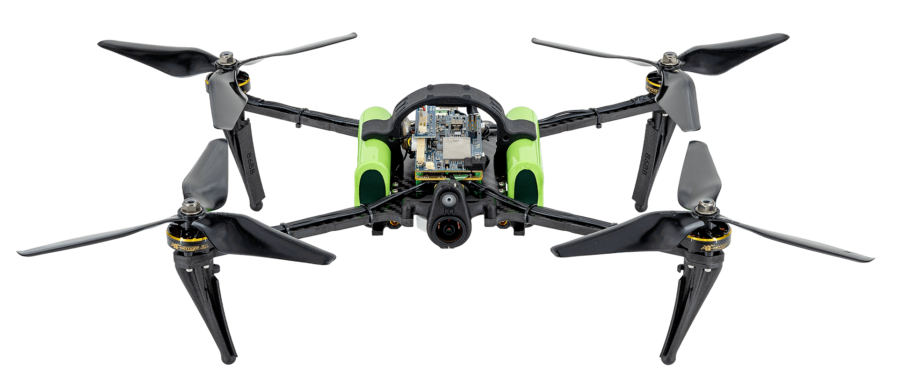

# ModalAI Starling 2

The [Starlings](https://www.modalai.com/pages/starlings) are NDAA-compliant SLAM development drones based on the [VOXL 2](../flight_controller/modalai_voxl_2.md) and PX4 with SWAP-optimized sensors and payloads optimized for indoor and outdoor autonomous navigation.

## 개요

Starling drones house _VOXL 2_, which is a powerful companion computer, a PX4 flight controller, image sensors, GPS, and connectivity modem, in one small package.
The Starlings feature ModalAI's open source [VOXL SDK](https://gitlab.com/voxl-public/voxl-sdk) that has pre-configured autonomy models for computer vision assisted flight.

These development drones are ready-to-fly out-of-the-box.
They are designed to help you get to market faster and accelerate your application development and prototyping.

:::info
If you are new to VOXL, be sure to familiarize yourself with the core features of VOXL hardware and software by reviewing the [VOXL Bootcamp](https://docs.modalai.com/voxl-developer-bootcamp/).
:::

:::info
For complete and regularly updated documentation, please visit <https://docs.modalai.com/starling-2/> and <https://docs.modalai.com/starling-2-max/>.
:::

## Starling 2

The [Starling 2](https://www.modalai.com/products/starling-2) is an NDAA-compliant development drone supercharged by the VOXL SDK and equipped with a new image sensor suite for precise, indoor visual navigation and SLAM. Powered by the Blue UAS Framework autopilot, VOXL 2, the Starling 2 weighs 280g and boasts an impressive 40 minutes of autonomous flight time.

## Starling 2 Max

The [Starling 2 Max](https://www.modalai.com/products/starling-2-max) is VOXL 2-powered, NDAA-compliant development drone supercharged by VOXL SDK specifically designed for computer vision-based, long-range dead reckoning with a 500g payload capacity. Powered by the Blue UAS Framework autopilot, VOXL 2, the Starling 2 Max weighs 500g and boasts an impressive 55 minutes of autonomous flight time.

## 구매처

[ModalAI Starling 2](https://www.modalai.com/products/starling-2)

[ModalAI Starling 2 Max](https://www.modalai.com/products/starling-2-max)

<!--  @katzfey - ModalAI reviewer -->
