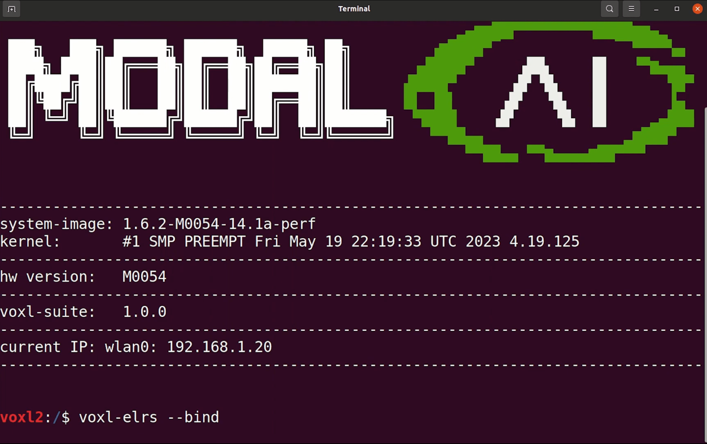

# VOXL 2 Starling PX4 Development Drone

The [Starling](https://modalai.com/starling) is a SLAM development drone supercharged by [VOXL 2](../flight_controller/modalai_voxl_2.md) and PX4 with SWAP-optimized sensors and payloads optimized for indoor and outdoor autonomous navigation.
Powered by Blue UAS Framework autopilot, VOXL 2, the Starling weighs only 275g and boasts an impressive 30 minutes of autonomous indoor flight time.

The VOXL 2 Starling is a PX4 development drone that houses a [VOXL 2](../flight_controller/modalai_voxl_2.md) companion computer and PX4 flight controller, image sensors, GPS, and connectivity modem and is ready-to-fly out-of-the-box.
The Starling features ModalAI’s [open SDK](https://docs.modalai.com/voxl-developer-bootcamp/) that has pre-configured autonomy models for computer vision assisted flight.
This development drone is meant to help you get to market faster and accelerate your application development and prototyping.

This guide explains the minimal additional setup required to get the UAV ready to fly. It also covers a hardware overview, first flight, setting up WiFi, and more.

:::info
For complete and regularly updated documentation, please visit <https://docs.modalai.com/starling-v2>.
:::

:::info
If you are new to VOXL, be sure to familiarize yourself with the core features of VOXL hardware and software by reviewing the [VOXL Bootcamp](https://docs.modalai.com/voxl-developer-bootcamp/).
:::

## 구매처

[modalai.com/starling](https://modalai.com/starling)

## Hardware Overview

| Callout | 설명                                                       | MPN              |
| ------- | -------------------------------------------------------- | ---------------- |
| A       | VOXL 2                                                   | MDK-M0054-1      |
| B       | VOXL 4-in-1 ESC                                          | MDK-M0117-1      |
| C       | Barometer Shield Cap                                     | M10000533        |
| D       | ToF Image Sensor (PMD)                | MDK-M0040        |
| E       | Tracking Image Sensor (OV7251)        | M0014            |
| F       | Hires Image Sensor (IMX214)           | M0025-2          |
| G       | AC600 WiFi Dongle                                        | AWUS036EACS      |
| H       | GNSS GPS Module & Compass            | M10-5883         |
| I       | 915MHz ELRS Receiver                                     | BetaFPV Nano RX  |
| J       | USB C Connector on VOXL 2 (not shown) |                  |
| K       | VOXL Power Module                                        | MCCA-M0041-5-B-T |
| L       | 4726FM Propellor                                         | M10000302        |
| M       | Motor 1504                                               |                  |
| N       | XT30 Power Connector                                     |                  |

## Datasheet

### 사양

| 부품              | 사양                                                                |
| --------------- | ----------------------------------------------------------------- |
| 오토파일럿           | VOXL2                                                             |
| Take-off Weight | 275g (172g without battery)                    |
| Diagonal Size   | 211mm                                                             |
| Flight Time     | > 30 minutes                                                      |
| 모터              | 1504                                                              |
| Propellers      | 120mm                                                             |
| 프레임             | 3mm Carbon Fiber                                                  |
| ESC             | ModalAI VOXL 4-in-1 ESC V2                                        |
| GPS             | UBlox M10                                                         |
| 무선 수신기          | 915mhz ELRS                                                       |
| 전원 모듈           | ModalAI Power Module v3 - 5V/6A                                   |
| Battery         | Sony VTC6 3000mah 2S, or any 2S 18650 battery with XT30 connector |
| 고도              | 83mm                                                              |
| Width           | 187mm (Props folded)                           |
| Length          | 142mm (Props folded)                           |

### Hardware Wiring Diagram

## Tutorials

### ELRS Set Up

Binding your ELRS (ExpressLRS) receiver to a transmitter is a crucial step in preparing your VOXL 2 based PX4 Autonomy Developer Kit by ModalAI for flight.
This process ensures a secure and responsive connection between your drone and its control system.

Follow this guide to bind your ELRS receiver to your transmitter.

#### Setting up the Receiver

1. **Power On the Receiver**: Once your drone is powered on, you'll notice the ELRS receiver's blue LED flashing.
  This is an indication that the receiver is on but has not yet established a connection with a transmitter.

  

2. **Enter Binding Mode**: To initiate binding, open a terminal and execute the `adb shell` and `voxl-elrs -bind` commands.
  You'll observe the receiver's LED switch to a flashing in a heartbeat pattern, signaling that it is now in binding mode.

  

#### Setting up the Transmitter

1. **Access the Menu**: On your Commando 8 radio transmitter included in the kit, press the left mode button to open the menu system.

  

2. **Navigate to ExpressLRS**: Use the right button to select the first menu entry, which should be "ExpressLRS."

3. **Find the Bind Option**: With the "ExpressLRS" option selected, scroll down to the bottom of the menu to locate the "Bind" section. This can be done by pressing the right button downwards until you reach the "Bind" option.

  

4. **Initiate Binding**: Select "Bind" to put the transmitter into binding mode. You will know the process has been successful when the transmitter emits a beep, indicating a successful bind.

#### Completing the Binding Process

Once the transmitter is set to bind mode, the ELRS receiver on the drone will change its LED from flashing to a steady light, signifying a successful connection between the receiver and the transmitter.

- **Power Cycle**: After the binding process is complete, it's essential to power cycle the VOXL 2 before attempting to fly.
  This means turning off the VOXL 2 and then turning it back on.
  This step ensures that all settings are properly applied and that the system recognizes the newly established connection.

You should now have a successfully bound ELRS receiver to your transmitter, ready for use with the PX4 Autonomy Kit by ModalAI.
A secure connection is vital for the reliable operation of your drone, so always confirm the binding status before flight.

### 비디오

- [VOXL 2 Starling Hardware Overview](https://youtu.be/M9OiMpbEYOg)
- [VOXL 2 Starling First Flight Tutorial](https://youtu.be/Cpbbye3Z6co)
- [VOXL 2 Starling ELRS Set Up](https://youtu.be/7OwGS-kcFVg)
