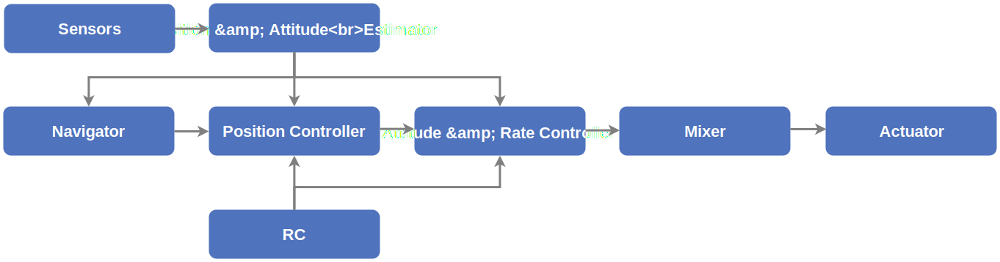

# PX4 아키텍처 개요

PX4 consists of two main layers: the [flight stack](#flight-stack) is an estimation and flight control system,
and the [middleware](#middleware) is a general robotics layer that can support any type of autonomous robot, providing internal/external communications and hardware integration.

All PX4 [airframes](../airframes/index.md) share a single codebase (this includes other robotic systems like boats, rovers, submarines etc.). The complete system design is [reactive](http://www.reactivemanifesto.org), which means that:

- 모든 기능은 대체 가능한 구성 요소와 재사용 가능한 구성 요소로 나누어 집니다.
- 통신은 비동기 메시지 전달에 의해 수행됩니다.
- 시스템은 다양한 작업 부하를 처리할 수 있습니다.

<a id="architecture"></a>

## 고급 소프트웨어 아키텍처

아래 다이어그램은 PX4의 빌딩 블록에 대한 개요를 나타냅니다.
다이어그램의 상단에는 미들웨어 블록이 포함되어 있고, 하단에는 플라이트 스택의 구성 요소가 표시되어 있습니다.


<!-- This diagram can be updated from
[here](https://drive.google.com/file/d/0B1TDW9ajamYkaGx3R0xGb1NaeU0/view?usp=sharing)
and opened with draw.io Diagrams. You might need to request access if you
don't have a px4.io Google account.
Caution: it can happen that after exporting some of the arrows are wrong. In
that case zoom into the graph until the arrows are correct, and then export
again. -->

The source code is split into self-contained modules/programs (shown in `monospace` in the diagram).
일반적으로 빌딩 블록은 하나의 모듈을 나타냅니다.

:::tip
At runtime, you can inspect which modules are executed with the `top` command in shell, and each module can be started/stopped individually via `<module_name> start/stop`.
While `top` command is specific to NuttX shell, the other commands can be used in the SITL shell (pxh>) as well.
For more information about each of these modules see the [Modules & Commands Reference](../modules/modules_main.md).
:::

The arrows show the information flow for the _most important_ connections between the modules.
표시된 것보다 더 많은 연결이 있으며, 일부 데이터(예: 매개변수)는 대부분의 모듈에서 액세스합니다.

Modules communicate with each other through a publish-subscribe message bus named [uORB](../middleware/uorb.md).
발행-구독 체계의 사용은 다음을 의미합니다.

- 시스템은 반응형입니다. 비동기식이며, 새 데이터를 사용할 수 있을 때 즉시 업데이트합니다.
- 모든 작업과 통신은 완전히 병렬화됩니다.
- 시스템 구성 요소는 스레드로부터 안전하며, 어디서나 데이터를 사용할 수 있습니다.

:::info
This architecture allows every single one of these blocks to be rapidly and easily replaced, even at runtime.
:::

### 비행 스택

비행 스택은 자율 드론을 위한 안내, 탐색 및 제어 알고리즘의 모음입니다.
It includes controllers for fixed-wing, multirotor and VTOL airframes as well as estimators for attitude and position.

다음 다이어그램은 비행 스택의 빌딩 블록에 대한 개요를 나타냅니다.
여기에는 센서, RC 입력 및 자율 비행 제어(내비게이터)에서 모터 또는 서보 제어(액추에이터)에 이르는 전체 파이프라인이 포함됩니다.



<!-- This diagram can be updated from
[here](https://drive.google.com/a/px4.io/file/d/15J0eCL77fHbItA249epT3i2iOx4VwJGI/view?usp=sharing)
and opened with draw.io Diagrams. You might need to request access if you
don't have a px4.io Google account.
Caution: it can happen that after exporting some of the arrows are wrong. In
that case zoom into the graph until the arrows are correct, and then export
again. -->

An **estimator** takes one or more sensor inputs, combines them, and computes a vehicle state (for example the attitude from IMU sensor data).

A **controller** is a component that takes a setpoint and a measurement or estimated state (process variable) as input.
Its goal is to adjust the value of the process variable such that it matches the setpoint.
The output is a correction to eventually reach that setpoint.
For example the position controller takes position setpoints as inputs, the process variable is the currently estimated position, and the output is an attitude and thrust setpoint that move the vehicle towards the desired position.

A **mixer** takes force commands (such as "turn right") and translates them into individual motor commands, while ensuring that some limits are not exceeded.
This translation is specific for a vehicle type and depends on various factors, such as the motor arrangements with respect to the center of gravity, or the vehicle's rotational inertia.

<a id="middleware"></a>

### 미들웨어

The [middleware](../middleware/index.md) consists primarily of device drivers for embedded sensors, communication with the external world (companion computer, GCS, etc.) and the uORB publish-subscribe message bus.

In addition, the middleware includes a [simulation layer](../simulation/index.md) that allows PX4 flight code to run on a desktop operating system and control a computer modeled vehicle in a simulated "world".

## 속도 업데이트

Since the modules wait for message updates, typically the drivers define how fast a module updates.
Most of the IMU drivers sample the data at 1kHz, integrate it and publish with 250Hz.
Other parts of the system, such as the `navigator`, don't need such a high update rate, and thus run considerably slower.

The message update rates can be [inspected](../middleware/uorb.md) in real-time on the system by running `uorb top`.

<a id="runtime-environment"></a>

## 실행 환경

PX4 runs on various operating systems that provide a POSIX-API (such as Linux, macOS, NuttX or QuRT).
It should also have some form of real-time scheduling (e.g. FIFO).

The inter-module communication (using [uORB](../middleware/uorb.md)) is based on shared memory.
The whole PX4 middleware runs in a single address space, i.e. memory is shared between all modules.

:::info
The system is designed such that with minimal effort it would be possible to run each module in separate address space (parts that would need to be changed include `uORB`, `parameter interface`, `dataman` and `perf`).
:::

There are 2 different ways that a module can be executed:

- **Tasks**: The module runs in its own task with its own stack and process priority.
- **Work queue tasks**: The module runs on a shared work queue, sharing the same stack and work queue thread priority as other modules on the queue.

  - 모든 작업은 서로 방해할 수 없으므로, 협력적으로 작동해야 합니다.
  - Multiple _work queue tasks_ can run on a queue, and there can be multiple queues.
  - A _work queue task_ is scheduled by specifying a fixed time in the future, or via uORB topic update callback.

  작업 대기열에서 모듈을 실행할 때의 이점은 RAM을 덜 사용하고 잠재적으로 작업 전환이 더 적은 것입니다.
  The disadvantages are that _work queue tasks_ are not allowed to sleep or poll on a message, or do blocking IO (such as reading from a file).
  장기 실행 작업(과중한 계산 수행)은 잠재적으로 별도의 작업 또는 최소한 별도의 작업 대기열에서 실행되어야 합니다.

:::info
Tasks running on a work queue do not show up in [`top`](../modules/modules_command.md#top) (only the work queues themselves can be seen - e.g. as `wq:lp_default`).
Use [`work_queue status`](../modules/modules_system.md#work-queue) to display all active work queue items.
:::

### 백그라운드 작업

`px4_task_spawn_cmd()` is used to launch new tasks (NuttX) or threads (POSIX - Linux/macOS) that run independently from the calling (parent) task:

```cpp
independent_task = px4_task_spawn_cmd(
    "commander",                    // Process name
    SCHED_DEFAULT,                  // Scheduling type (RR or FIFO)
    SCHED_PRIORITY_DEFAULT + 40,    // Scheduling priority
    3600,                           // Stack size of the new task or thread
    commander_thread_main,          // Task (or thread) main function
    (char * const *)&argv[0]        // Void pointer to pass to the new task
                                    // (here the commandline arguments).
    );
```

### 운영체제별 정보

#### NuttX

[NuttX](https://nuttx.apache.org//) is the primary RTOS for running PX4 on a flight-control board.
It is open source (BSD license), light-weight, efficient and very stable.

Modules are executed as tasks: they have their own file descriptor lists, but they share a single address space.
A task can still start one or more threads that share the file descriptor list.

Each task/thread has a fixed-size stack, and there is a periodic task which checks that all stacks have enough free space left (based on stack coloring).

#### Linux/macOS

On Linux or macOS, PX4 runs in a single process, and the modules run in their own threads (there is no distinction between tasks and threads as on NuttX).
