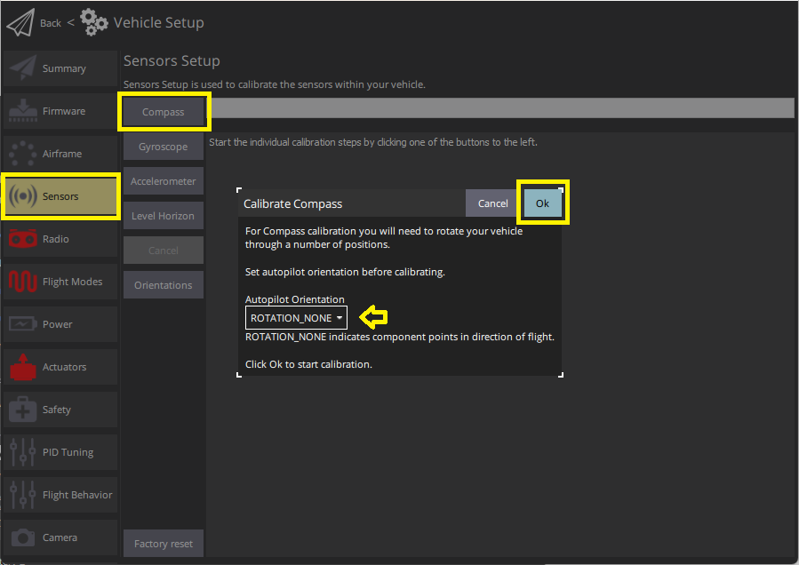
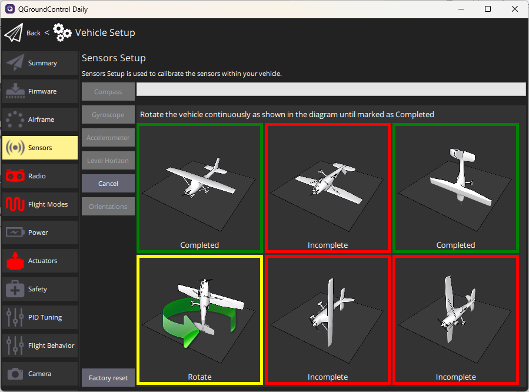

# 나침반 보정

This process calibrates and configures all [magnetometers](../gps_compass/index.md).
_QGroundControl_ will guide you to position the vehicle in a number of set orientations and rotate the vehicle about the specified axis.

:::info
It also auto-detects the compass orientation for external magnetometers ([by default](../advanced_config/parameter_reference.md#SENS_MAG_AUTOROT)).
If you have [mounted the compass](../assembly/mount_gps_compass.md#compass-orientation) at a non-standard angle you will need to [manually set the compass orientation](../config/flight_controller_orientation.md#setting-the-compass-orientation) before calibrating.
:::

## 개요

You will need to calibrate your compass(es) when you first setup your vehicle, and you may need to recalibrate it if the vehicles is ever exposed to a very strong magnetic field, or if it is used in an area with abnormal magnetic characteristics.

:::tip
Indications of a poor compass calibration include multicopter circling during hover, toilet bowling (circling at increasing radius/spiraling-out, usually constant altitude, leading to fly-way), or veering off-path when attempting to fly straight.
_QGroundControl_ should also notify the error `mag sensors inconsistent`.
:::

The process calibrates all compasses and autodetects the orientation of any external compasses.
If any external magnetometers are available, it then disables the internal magnetometers (these are primarily needed for automatic rotation detection of external magnetometers).

Several types of compass calibration are available:

1. [Complete](#complete-calibration): This calibration is required after installing the autopilot on an airframe for the first time or when the configuration of the vehicle has changed significantly.
  It compensates for hard and soft iron effects by estimating an offset and a scale factor for each axis.
2. [Partial](#partial-quick-calibration): This calibration can be performed as a routine when preparing the vehicle for a flight, after changing the payload, or simply when the compass rose seems inaccurate.
  This type of calibration only estimates the offsets to compensate for a hard iron effect.
3. [Large vehicle](#large-vehicle-calibration): This calibration can be performed when the vehicle is too large or heavy to perform a complete calibration. This type of calibration only estimates the offsets to compensate for a hard iron effect.

## 보정 절차

### 전제 조건

Before starting the calibration:

1. 큰 금속 물체등과 같이 자기장이 강한 곳에서 멀리 떨어진 위치를 선택하십시오.
  :::tip
  Metal is not always obvious! 사무실 테이블 위에서나 (종종 금속 막대 포함) 또는 차량 옆에서 보정하지 마십시오.
  철근이 고르지 않게 분포된 콘크리트 슬래브 근처 장소들도 보정에 영향을 미칠 수 있습니다.

:::
2. Connect via telemetry radio rather than USB if at all possible.
  USB can potentially cause significant magnetic interference.
3. If using an external compass (or a combined GPS/compass module), make sure it is [mounted](../assembly/mount_gps_compass.md) as far as possible from other electronics in order to reduce magnetic interference, and in a _supported orientation_.

### Complete Calibration

보정 절차는 다음과 같습니다:

1. Start _QGroundControl_ and connect the vehicle.

2. Select **"Q" icon > Vehicle Setup > Sensors** (sidebar) to open _Sensor Setup_.

3. Click the **Compass** sensor button.

  

  ::: info
  You should already have set the [Autopilot Orientation](../config/flight_controller_orientation.md). 미리 설정하지 않았다면, 여기에서 설정할 수 있습니다.

:::

4. Click **OK** to start the calibration.

5. 기체를 아래에 표시된 자세로 놓고 그대로 유지해주십시오 메시지가 표시되면(방향 이미지가 노란색으로 변함) 기체를 지정축을 기준으로 한 방향으로 회전시킵니다. 현재 방향에 대해 보정이 완료되면 화면의 그림이 녹색으로 바뀝니다.

  

6. 드론의 모든 방향에 대해 보정 과정을 반복합니다.

Once you've calibrated the vehicle in all the positions _QGroundControl_ will display _Calibration complete_ (all orientation images will be displayed in green and the progress bar will fill completely). 그런 다음 다음 센서의 보정 작업을 진행합니다.

### Partial "Quick" Calibration

This calibration is similar to the well-known figure-8 compass calibration done on a smartphone:

1. Hold the vehicle in front of you and randomly perform partial rotations on all its axes.
  2-3 oscillations of ~30 degrees in every direction is usually sufficient.
2. Wait for the heading estimate to stabilize and verify that the compass rose is pointing to the correct direction (this can take a couple of seconds).

참고:

- There is no start/stop for this type of calibration (the algorithm runs continuously when the vehicle is disarmed).
- The calibration is immediately applied to the data (no reboot is required) but is saved to the calibration parameters after disarming the vehicle only (the calibration is lost if no arming/disarming sequence is performed between calibration and shutdown).
- The amplitude and the speed of the partial rotations done in step 1 can affect the calibration quality.
  Following the advice above is usually enough.

### Large Vehicle Calibration

<Badge type="tip" text="PX4 v1.15" />

This calibration process leverages external knowledge of vehicle's orientation and location, and a World Magnetic Model (WMM) to calibrate the hard iron biases.

1. Ensure GNSS Fix. This is required to find the expected Earth magnetic field in WMM tables.
2. Align the vehicle to face True North.
  Be as accurate as possible for best results.
3. Open the [QGroundControl MAVLink Console](https://docs.qgroundcontrol.com/master/en/qgc-user-guide/analyze_view/mavlink_console.html) and send the following command:

  ```sh
  commander calibrate mag quick
  ```

참고:

- This method is specifically designed for vehicles where full rotation is impractical or impossible.
  If full rotation is possible, use the [complete calibration](#complete-calibration) instead.
- The vehicle doesn't need to be exactly levelled as this is automatically compensated using the tilt estimate.
- This calibration can also be triggered using the MAVLink command [MAV_CMD_FIXED_MAG_CAL_YAW](https://mavlink.io/en/messages/common.html#MAV_CMD_FIXED_MAG_CAL_YAW).

## 검증

After the calibration is complete, check that the heading indicator and the heading of the arrow on the map are stable and match the orientation of the vehicle when turning it e.g. to the cardinal directions.

## Additional Calibration/Configuration

The process above will autodetect, [set default rotations](../advanced_config/parameter_reference.md#SENS_MAG_AUTOROT), calibrate, and prioritise, all available magnetometers.
If external magnetometers are available, internal magnetometers are disabled.

Further compass configuration should generally not be required.

### Enable/Disable a Compass

While no further configuration should be _required_, developers who wish to disable/enable compasses for any reason, such as testing, can do so using the compass parameters.
These are prefixed with [CAL_MAGx_](../advanced_config/parameter_reference.md#CAL_MAG0_ID) (where `x=0-3`):

- [CAL_MAGn_ROT](../advanced_config/parameter_reference.md#CAL_MAG0_ROT) can be used to determine which compasses are internal.
  A compass is internal if `CAL_MAGn_ROT==1`.
- [CAL_MAGx_PRIO](../advanced_config/parameter_reference.md#CAL_MAG0_PRIO) sets the relative compass priority and can be used to disable a compass.

## 디버깅

Raw comparison data for magnetometers (in fact, for all sensors) can be logged by setting [SDLOG_MODE=1](../advanced_config/parameter_reference.md#SDLOG_MODE) and [SDLOG_PROFILE=64](../advanced_config/parameter_reference.md#SDLOG_PROFILE).
See [Logging](../dev_log/logging.md) for more information.

## 추가 정보

- [Peripherals > GPS & Compass](../gps_compass/index.md)
- [Basic Assembly](../assembly/index.md) (setup guides for each flight controller)
- [Compass Power Compensation](../advanced_config/compass_power_compensation.md) (Advanced Configuration)
- [QGroundControl User Guide > Sensors](https://docs.qgroundcontrol.com/master/en/qgc-user-guide/setup_view/sensors_px4.html#compass)
- [PX4 Setup Video - @2m38s](https://youtu.be/91VGmdSlbo4?t=2m38s) (Youtube)
