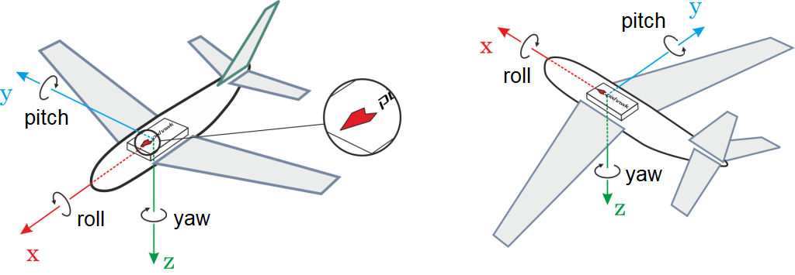
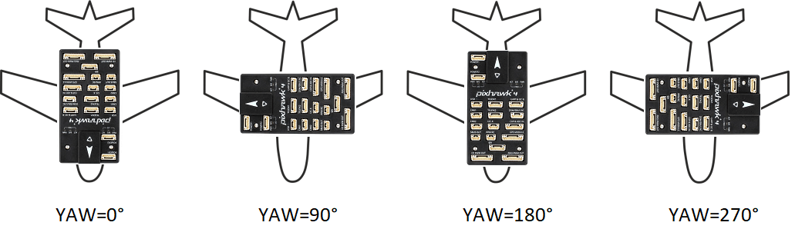
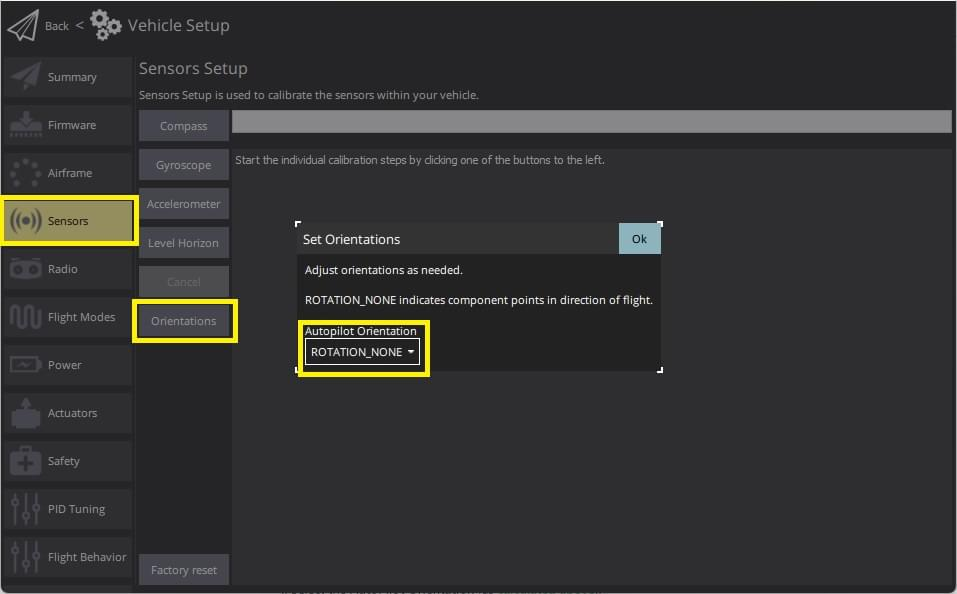
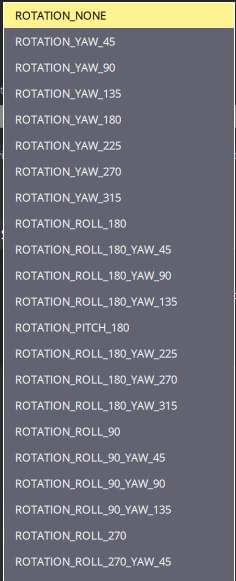

# 비행 콘트롤러와 센서 방향

기본적으로 비행 콘트롤러와 외장 나침반 센서는 윗면이 위를 향하고 화살표가 기체 정면을 향하도록 기체에 장착합니다.
보드나 외장 나침반 센서가 다른 방향으로 설치된 경우에는 펌웨어에서 해당 방향을 설정하여야 합니다.

## 방향 알아내기

비행 컨트롤러의 ROLL, PITCH  및 YAW 오프셋은 기체의 전진(x), 오른쪽(y), 아래(z) 축을 중심을 기준으로 계산됩니다.

회전 축은 한 회전 단계에서 다음 단계까지 동일하게 유지됩니다.
따라서 회전을 수행하는 프레임은 고정되어 있습니다.
This is also known as _extrinsic rotation_.

For example, the vehicles shown below have rotations around the z-axis (i.e. yaw only) corresponding to: `ROTATION_NONE`, `ROTATION_YAW_90`,`ROTATION_YAW_180`,`ROTATION_YAW_270`.

:::info
For a VTOL Tailsitter airframe set the vehicle orientation according to its multirotor configuration (i.e. relative to the vehicle during, takeoff, hovering, landing) for all sensor calibrations.

축은 일반적으로  전진 비행에 대하여는 차량의 방향에 상대적입니다.
For more information see [Basic Concepts](../getting_started/px4_basic_concepts.md#heading-and-directions).
:::

## 방향 설정

방향을 설정하려면:

1. Start _QGroundControl_ and connect the vehicle.

2. Select **"Q" icon > Vehicle Setup > Sensors** (sidebar) to open _Sensor Setup_.

3. Select the **Orientations** button.

   

4. Select the **AutoPilot Orientation** (as [calculated above](#calculating-orientation)).

   

5. Press **OK**.

:::info
You can use [Level Horizon Calibration](../config/level_horizon_calibration.md) to compensate for small miss-alignments in controller orientation and to level the horizon in flight view.
:::

## 미세 보정

PX4 will automatically detect the compass orientation as part of [compass calibration](../config/compass.md) ([by default](../advanced_config/parameter_reference.md#SENS_MAG_AUTOROT)) for any of the [standard MAVLink orientations](https://mavlink.io/en/messages/common.html#MAV_SENSOR_ORIENTATION) (upright and facing forward, or any multiple of 45° offset in any axis) .

:::info
You can confirm that auto detection worked by looking at the [CAL_MAGn_ROT](../advanced_config/parameter_reference.md#CAL_MAG0_ROT) parameters.
:::

If a non-standard orientation has been used you will need to set the [CAL_MAGx_ROLL](../advanced_config/parameter_reference.md#CAL_MAG0_ROLL), [CAL_MAGx_PITCH](../advanced_config/parameter_reference.md#CAL_MAG0_PITCH), and [CAL_MAGx_YAW](../advanced_config/parameter_reference.md#CAL_MAG0_YAW) parameters for each compass to the angles that were used.

This will automatically set [CAL_MAGn_ROT](../advanced_config/parameter_reference.md#CAL_MAG0_ROT) to "custom euler angle" and prevents automatic calibration for the selected compass (even if [SENS_MAG_AUTOROT](../advanced_config/parameter_reference.md#SENS_MAG_AUTOROT) is set).

## 추가 정보

- [Advanced Orientation Tuning](../advanced_config/advanced_flight_controller_orientation_leveling.md) (advanced users only).
- [QGroundControl User Guide > Sensors](https://docs.qgroundcontrol.com/master/en/qgc-user-guide/setup_view/sensors_px4.html#flight_controller_orientation)
