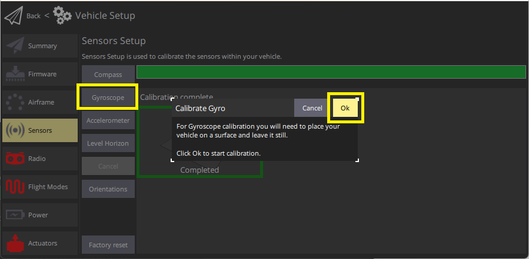
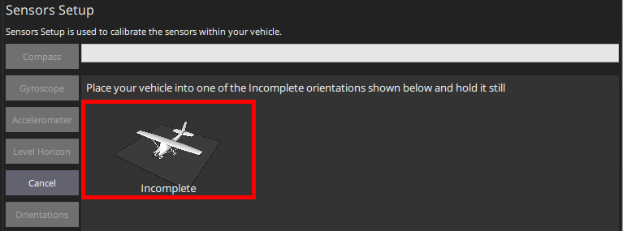
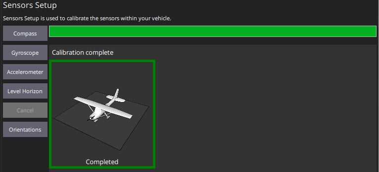

# 자이로스코프 보정

_QGroundControl_ will guide you to place the vehicle on a flat surface and keep it still.

## 보정 절차

보정 절차는 다음과 같습니다:

1. Start _QGroundControl_ and connect the vehicle.

2. Select **"Q" icon > Vehicle Setup > Sensors** (sidebar) to open _Sensor Setup_.

3. Click the **Gyroscope** sensor button.

   

4. 기체을 평탄한 곳에 놓습니다.

5. Click **Ok** to start the calibration.

   상단의 Progressive Bar에서 진행 상황을 나타냅니다.

   

6. When finished, _QGroundControl_ will display a progress bar _Calibration complete_
   

:::info
If you move the vehicle _QGroundControl_ will automatically restart the gyroscope calibration.
:::

## 추가 정보

- [QGroundControl User Guide > Gyroscope](https://docs.qgroundcontrol.com/master/en/qgc-user-guide/setup_view/sensors_px4.html#gyroscope)
