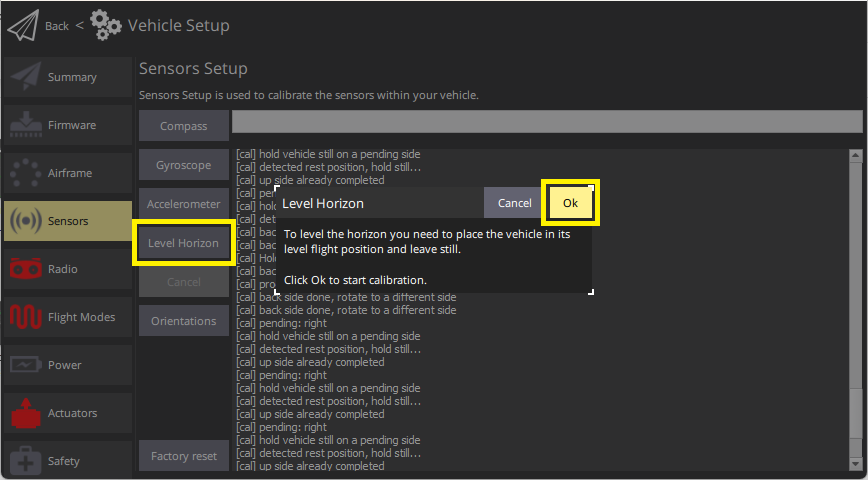

# 수평 보정

You can use _Level Horizon Calibration_ to compensate for small misalignments in controller orientation and to level the horizon in the _QGroundControl_ flight view (blue on top and green on bottom).

:::tip
Performing this calibration step is only recommended if the autopilot's orientation is visibly misaligned with the specified orientation, or if there is a constant drift during flight in not position-controlled flight modes.
:::

## 보정 절차

수평 보정

1. Start _QGroundControl_ and connect the vehicle.

2. Select the **Gear** icon (Vehicle Setup) in the top toolbar and then **Sensors** in the sidebar.

3. Click the **Level Horizon** button.
   
   ::: info
   You should already have set the [Autopilot Orientation](../config/flight_controller_orientation.md). 미리 설정하지 않았다면, 여기에서 설정할 수 있습니다.

:::

4. Place the vehicle in its level flight orientation on a level surface:

   - For planes this is the position during level flight (planes tend to have their wings slightly pitched up!)
   - For copters this is the hover position.

5. Press **OK** to start the calibration process.

6. Wait until the calibration process is finished.

## 검증

Check that the artificial horizon displayed in the flight view has the indicator in the middle when the vehicle is placed on a level surface.

## 추가 정보

- [Advanced Orientation Tuning](../advanced_config/advanced_flight_controller_orientation_leveling.md) (advanced users only).
- [QGroundControl User Guide > Sensors](https://docs.qgroundcontrol.com/master/en/qgc-user-guide/setup_view/sensors_px4.html#level-horizon)
- [PX4 Setup Video "Gyroscope" - @1m14s](https://youtu.be/91VGmdSlbo4?t=1m14s) (Youtube)
