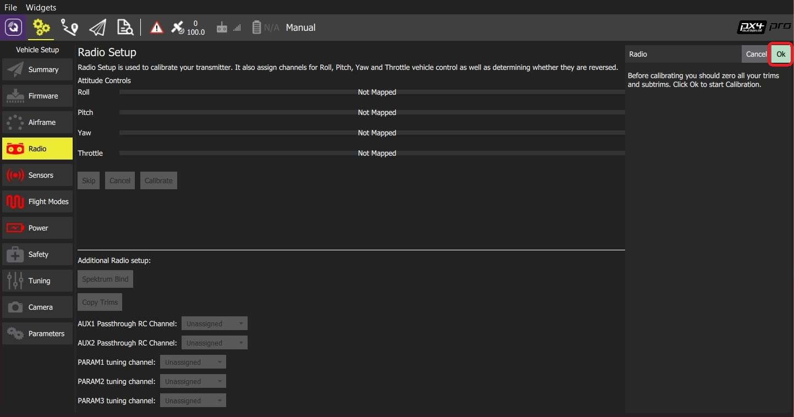
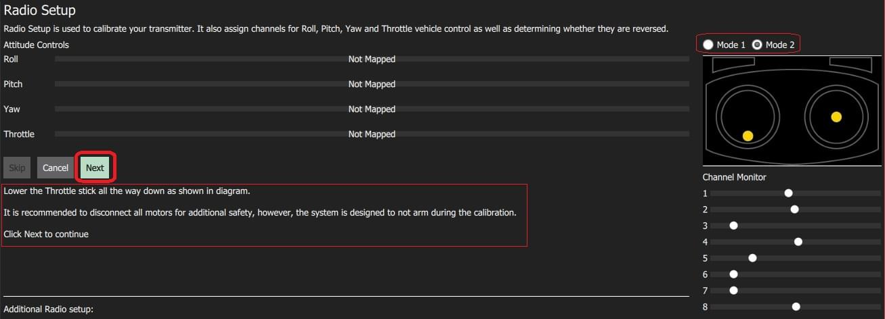
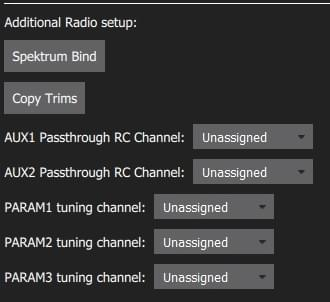
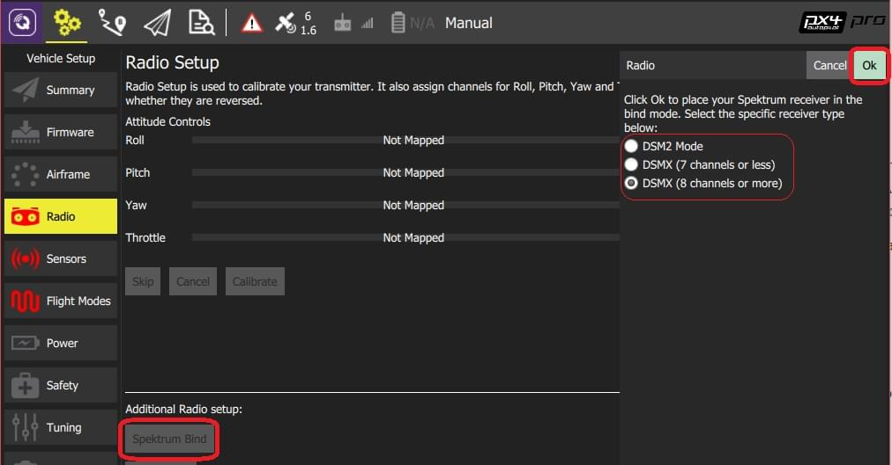
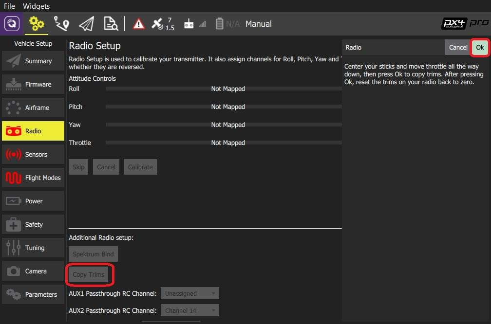
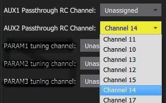
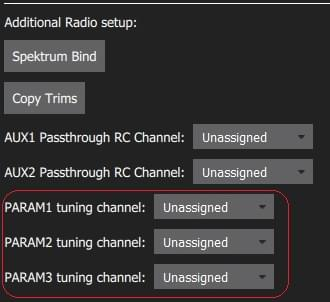
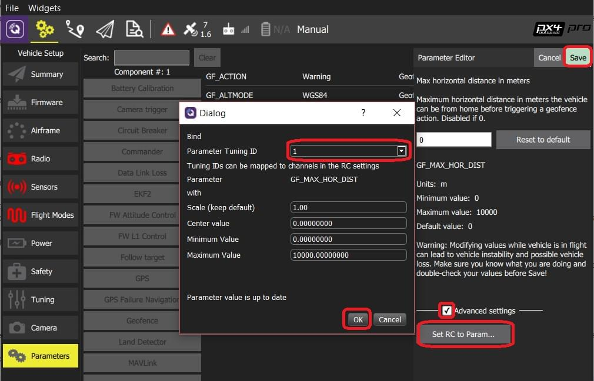

# Radio Control (RC) Setup

The _Radio Setup_ screen is used to configure the mapping of your RC controller's main attitude control sticks (roll, pitch, yaw, throttle) to channels, and to calibrate the minimum, maximum, trim and reverse settings for all other transmitter controls/RC channels.

:::info
A [Joystick](../config/joystick.md) can be used instead of RC for manual control.
The [COM_RC_IN_MODE](../advanced_config/parameter_reference.md#COM_RC_IN_MODE) parameter [can be set](../advanced_config/parameters.md) to define what kind of manual controller(s) are enabled.
:::

## 수신기 바인딩

무선 시스템을 보정을 하기 위하여 우선 수신기와 송신기를 바인딩하여야 합니다.
송신기와 수신기를 바인딩 프로세스는 하드웨어에 따라 조금씩 차이가 날 수 있습니다 (자세한 지침은 설명서 참조).

:::info
If you are using a _Spektrum_ receiver, you can put it into bind mode using _QGroundControl_, as [shown below](#spectrum-bind).
:::

:::info
If you are using a _FrSky_ receiver, you can bind it with its transmitter, by following instructions [here](https://www.youtube.com/watch?v=1IYg5mQdLVI).
:::

## RC 손실 감지

PX4 needs to be able to detect when the signal from the RC controller has been lost in order to be able to take [appropriate safety measures](../config/safety.md#manual-control-loss-failsafe).

RC 수신기에는 신호 손실을 나타내는 여러가지 방법이 있습니다.

- 아무것도 출력하지 않음 (PX4에서 자동으로 감지됨)
- 낮은 스로틀 값을 출력합니다 (이를 감지하도록 PX4를 구성 할 수 있음).
- Output the last received signal (_cannot be detected by PX4_ as it looks like valid input).

If your RC receiver does not support outputting no signal on RC loss, you must configure it to set throttle low instead, and set the corresponding value in [RC_FAILS_THR](../advanced_config/parameter_reference.md#RC_FAILS_THR).

이를 수행하는 방법은 RC 컨트롤러 트림 및 스로틀 스틱을 가능한 낮게 설정하고 결과 출력 PWM 값을 PX4와 수신기 모두에서 사용하는 것입니다 (RC 손실 값을 설정하는 방법을 결정하려면 수신기 설명서를 참조하십시오).
그런 다음 스로틀 스틱을 원래 위치로 가져다 놓으십시오.
이 프로세스는 RC 손실 값이 정상 작동에서 수신기가 출력하는 최소값 미만이되도록 합니다.

:::info
Do not use a receiver that cannot support one of the two supported RC loss detection methods!
:::

## 보정 절차

보정 과정는 간단합니다. 화면 오른쪽 상단의 송신기 다이어그램에 표시된 특정 패턴으로 스틱을 이동하라는 메시지가 표시됩니다.

무선 조종기 보정 절차

1. RC 송신기를 켭니다.

2. Start _QGroundControl_ and connect the vehicle.

3. Select the **Gear** icon (Vehicle Setup) in the top toolbar and then **Radio** in the sidebar.

4. Press **OK** to start the calibration.

   

5. Set the [transmitter mode](../getting_started/rc_transmitter_receiver.md#transmitter_modes) radio button that matches your transmitter (this ensures that _QGroundControl_ displays the correct stick positions for you to follow during calibration).

   

6. 스틱을 텍스트(및 송신기 이미지)에 표시된 위치로 이동합니다. Press **Next** when the sticks are in position. 모든 위치에 대해 반복하십시오.

7. When prompted, move all other switches and dials through their full range (you will be able to observe them moving on the _Channel Monitor_).

8. Press **Next** to save the settings.

Radio calibration is demonstrated in the [autopilot setup video here](https://youtu.be/91VGmdSlbo4?t=4m30s) (youtube).

## 추가 무선 조종기 설정:

조종 스틱 및 기타 송신기 컨트롤을 보정하는 것 외에도이 화면에서 유용 할 수있는 여러 추가 무선 설정 옵션이 있습니다.

### Spektrum 바인드

무선 시스템을 보정을 하기 위하여 우선 수신기와 송신기를 바인딩하여야 합니다. If you have a _Spektrum_ receiver you can put it in _bind mode_ using _QGroundControl_ as shown below (this can be particularly useful if you don't have easy physical access to the receiver on your vehicle).

Spektrum 송신기/수신기 바인딩 절차

1. Select the **Spektrum Bind** button

2. 수신기의 라디오 버튼을 선택하십시오.

3. Press **OK**

   

4. 바인드 버튼을 누른 상태에서 Spektrum 송신기의 전원을 켭니다.

### 트림 복사

이 설정은 자동 조종 장치 내에서 자동으로 적용될 수 있도록 무선 송신기에서 수동 트림 설정을 복사합니다. 이 작업이 끝나면 수동으로 설정한 트림을 제거하여야 합니다.

:::info
Trim settings are used to adjust the roll, pitch, yaw such that when you center the sticks on your remote control, you get stable or level flight (in Stabilized flight mode).
일부 RC 컨트롤러는 각 스틱 위치에 대해 RC 컨트롤러에서 전송 한 값에 오프셋을 제공할 수있는 트림 노브를 제공합니다.
The **Copy Trims** setting here moves the offsets into the autopilot.
:::

트림 복사 절차

1. Select **Copy Trims**.

2. 스틱을 중앙에 놓고 스로틀을 끝까지 내립니다.

3. Press **Ok**.

   

4. 송신기의 트림을 다시 0으로 재설정하십시오.

### AUX 패스 스루 채널

AUX 패스 스루 채널을 사용하면 송신기에서 임의의 옵션 하드웨어 (예 : 그리퍼)를 제어 할 수 있습니다.

AUX 패스 스루 채널 설정 절차

1. 최대 2 개의 송신기 컨트롤을 별도의 채널에 매핑합니다.
2. 아래에 표시된 것처럼 이러한 채널을 지정하여 AUX1 및 AUX2 포트에 각각 매핑합니다.
   값은 설정되는 즉시 차량에 저장됩니다.

   

비행 컨트롤러는 AUX1/AUX2의 지정된 채널에서 수정되지 않은 값을 통해 하드웨어를 구동하는 연결된 서보/릴레이로 전달합니다.

### 매개변수 튜닝 채널

튜닝 채널을 사용하면 송신기 튜닝 노브를 매개변수에 매핑할 수 있습니다 (트랜스미터에서 매개변수를 동적으로 수정할 수 있음).

:::tip
This feature is provided to enable manual in-flight tuning: [Multicopter PID Tuning Guide](../config_mc/pid_tuning_guide_multicopter.md), [Fixed-wing PID Tuning Guide](../config_fw/pid_tuning_guide_fixedwing.md).
:::

The channels used for parameter tuning are assigned in the _Radio_ setup (here!), while the mapping from each tuning channel to its associated parameter is defined in the _Parameter editor_.

채널 튜닝 절차

1. 최대 3 개의 송신기 컨트롤 (다이얼 또는 슬라이더)을 개별 채널에 매핑합니다.
2. Select the mapping of _PARAM Tuning Id_ to radio channels, using the selection lists.
   값은 설정되는 즉시 차량에 저장됩니다.

   

PARAM 튜닝 채널을 매개 변수에 매핑 절차

1. Open the **Parameters** sidebar.

2. Select the parameter to map to your transmitter (this will open the _Parameter Editor_).

3. Check the **Advanced Settings** checkbox.

4. Click the **Set RC to Param...** button (this will pop-up the foreground dialog displayed below)

   

5. Select the tuning channel to map (1, 2 or 3) from the _Parameter Tuning ID_ selection list.

6. Press **OK** to close the dialog.

7. Press **Save** to save all changes and close the _Parameter Editor_.

:::tip
You can clear all parameter/tuning channel mappings by selecting menu **Tools > Clear RC to Param** at the top right of the _Parameters_ screen.
:::

## 추가 정보

- [QGroundControl > Radio Control](https://docs.qgroundcontrol.com/master/en/qgc-user-guide/setup_view/radio.html)
- [PX4 Setup Video - @4m30s](https://youtu.be/91VGmdSlbo4?t=4m30s) (Youtube)
- [RC System Selection](../getting_started/rc_transmitter_receiver.md) - Choose a compatible RC system.
