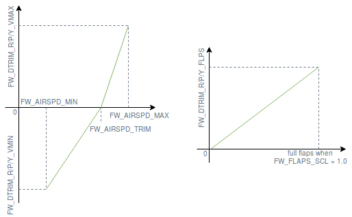

# 고정익 트리밍 가이드

트림은 트림 조건 (상대적 속도, 공기 밀도, 공격 각도, 항공기 구성 등)에서 제어 표면을 보정합니다.
트림 조건에서 적절하게 트림된 항공기는 조종사 또는 안정화 컴퓨터의 제어 입력 없이도 안정된 자세를 유지할 수 있습니다.

General aviation, commercial and large unmanned planes trim their control surfaces using [trim tabs](https://en.wikipedia.org/wiki/Trim_tab) while small UAVs simply add an offset to the actuator of the control surface.

The [Basic trimming](#basic-trimming) section explains the purpose of each trim parameter and how to find the correct value.
The [Advanced Trimming](#advanced-trimming) section introduces parameters that can be set to automatically adjust the trims based on the measured airspeed and flap position.

## 기본 트리밍

고정익을 적절히 트림하기 위해 사용할 수있는 매개변수가 있습니다.
트리밍 매개변수의 사용 사례에 대한 개요는 다음과 같습니다.

- [RCx_TRIM](../advanced_config/parameter_reference.md#RC1_TRIM) applies trim to the signal received from the RC transmitter.
  These parameters are set automatically during [RC calibration](../config/radio.md).
- [CA_SV_CSx_TRIM](../advanced_config/parameter_reference.md#CA_SV_CS0_TRIM) applies trim to a control surfaces channel.
  이들은 비행 전에 제어 표면을 기본 각도로 미세하게 정렬하는 데 사용됩니다.
- [FW_PSP_OFF](../advanced_config/parameter_reference.md#FW_PSP_OFF) applies an offset to the pitch setpoint.
  항공기가 순항 속도로 비행해야하는 공격 각도를 설정하는 데 사용됩니다.
- [FW_AIRSPD_TRIM](../advanced_config/parameter_reference.md#FW_AIRSPD_TRIM) is used by the rate controllers to scale their output depending on the measured airspeed.
  See [Airspeed Scaling](../flight_stack/controller_diagrams.md#airspeed-scaling) for more details.
- [TRIM_ROLL](../advanced_config/parameter_reference.md#TRIM_ROLL), [TRIM_PITCH](../advanced_config/parameter_reference.md#TRIM_PITCH) and [TRIM_YAW](../advanced_config/parameter_reference.md#TRIM_YAW) apply trim to the control signals _before_ mixing.
  For example, if you have two servos for the elevator, `TRIM_PITCH` applies trim to both of them.
  조종면이 정렬되어 있지만 수동 (안정화되지 않은) 비행 중에 기체가 피치/롤/요잉 업/다운/왼쪽/오른쪽 또는 안정된 비행 중에 제어 신호에 일정한 오프셋이 있는 경우에 사용됩니다.

위의 매개 변수를 설정하는 올바른 순서는 다음과 같습니다.

1. Trim the servos by physically adjusting the linkages lengths if possible and fine tune by trimming the PWM channels (use `PWM_MAIN/AUX_TRIMx`) on the bench to properly set the control surfaces to their theoretical position.
2. Fly in stabilized mode at cruise speed and set the pitch setpoint offset (`FW_PSP_OFF`) to desired angle of attack.
  순항 속도에서 필요한 공격 각도는 날개 높이 비행 중에 일정한 고도를 유지하기 위해 비행기가 비행해야 하는 피치 각도에 해당합니다.
  If you are using an airspeed sensor, also set the correct cruise airspeed (`FW_AIRSPD_TRIM`).
3. Look at the actuator controls in the log file (upload it to [Flight Review](https://logs.px4.io) and check the _Actuator Controls_ plot for example) and set the pitch trim (`TRIM_PITCH`).
  이 값을 수평 비행 중의 피치 신호의 평균 오프셋으로 설정합니다.

로그 조회가 필요가 없거나 수동 모드에서 편안하게 비행 할 수있는 경우 2 단계 전에 3 단계를 수행할 수 있습니다.
You can then trim your remote (with the trim switches) and report the values to `TRIM_PITCH` (and remove the trims from your transmitter) or update `TRIM_PITCH` directly during flight via telemetry and QGC.

## 고급 트리밍

비대칭 익형에 의해 유도된 하향 피치 모멘트는 대기 속도에 따라 증가하고 플랩이 전개 될 때 현재 측정된 대기 속도와 플랩 위치에 따라 항공기를 다시 트리밍하여야 합니다.
For this purpose, a bilinear curve function of airspeed and a pitch trim increment function of the flaps state (see figure below) can be defined using the following parameters:

- [FW_DTRIM\_\[R/P/Y\]\_\[VMIN/VMAX\]](../advanced_config/parameter_reference.md#FW_DTRIM_R_VMIN) are the roll/pitch/yaw trim value added to `TRIM_ROLL/PITCH/YAW` at min/max airspeed (defined by [FW_AIRSPD_MIN](../advanced_config/parameter_reference.md#FW_AIRSPD_MIN) and [FW_AIRSPD_MAX](../advanced_config/parameter_reference.md#FW_AIRSPD_MAX)).
- [CA_SV_CSx_FLAP](../advanced_config/parameter_reference.md#CA_SV_CS0_FLAP) and [CA_SV_CSx_SPOIL](../advanced_config/parameter_reference.md#CA_SV_CS0_SPOIL) are the trimming values that are applied to these control surfaces if the flaps or the spoilers are fully deployed, respectively.

<!-- The drawing is on draw.io: https://drive.google.com/file/d/15AbscUF1kRdWMh8ONcCRu6QBwGbqVGfl/view?usp=sharing
Request access from dev team. -->

A perfectly symmetrical airframe would only require pitch trim increments, but since a real airframe is never perfectly symmetrical, roll and yaw trims increments are also sometimes required.
