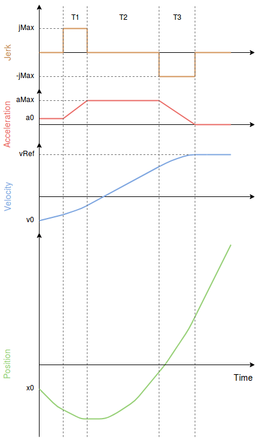

# 멀티콥터 저크 제한 유형 궤적

The Jerk-limited trajectory type provides smooth motion in autonomous flight e.g. for filming, mapping, cargo.
저크와 가속 제한이 항상 보장되는 부드러운 대칭 S-커브를 생성합니다.

This trajectory type is always enabled in autonomous modes like [Mission mode](../flight_modes_mc/mission.md).

## 궤적 생성기

아래의 그래프는 다음과 같은 제약 조건을 가진 일반적인 저크 제한 프로필을 나타냅니다.

- `jMax`: maximum jerk
- `a0`: initial acceleration
- `aMax`: maximum acceleration
- `a3`: final acceleration (always 0)
- `v0`: initial velocity
- `vRef`: desired velocity

The constraints `jMax`, `aMax` are configurable by the user via parameters and can be different in manual position control and auto mode.

결과 속도 프로파일을 "S-Curve"라고 합니다.

## 수동 모드

In manual position and altitude mode, jerk limiting is applied only to the vertical axis. Full throttle stick deflection commands the maximum vertical velocity which is [MPC_Z_VEL_MAX_UP](../advanced_config/parameter_reference.md#MPC_Z_VEL_MAX_UP) upwards and [MPC_Z_VEL_MAX_DN](../advanced_config/parameter_reference.md#MPC_Z_VEL_MAX_DN) downwards.

### 제약 조건

Z-axis

- `jMax`: [MPC_JERK_MAX](../advanced_config/parameter_reference.md#MPC_JERK_MAX)
- `aMax` (upward motion): [MPC_ACC_UP_MAX](../advanced_config/parameter_reference.md#MPC_ACC_UP_MAX)
- `aMax` (downward motion): [MPC_ACC_DOWN_MAX](../advanced_config/parameter_reference.md#MPC_ACC_DOWN_MAX)

## 자동 모드

In auto mode, the desired velocity is [MPC_XY_CRUISE](../advanced_config/parameter_reference.md#MPC_XY_CRUISE) but this value is automatically adjusted depending on the distance to the next waypoint, the maximum possible velocity in the waypoint and the maximum desired acceleration and jerk.
The vertical speed is defined by [MPC_Z_V_AUTO_UP](../advanced_config/parameter_reference.md#MPC_Z_V_AUTO_UP) (upward motion) and [MPC_Z_V_AUTO_DN](../advanced_config/parameter_reference.md#MPC_Z_V_AUTO_DN) (downward motion).

### 제약 조건

XY 평면

- `jMax`: [MPC_JERK_AUTO](../advanced_config/parameter_reference.md#MPC_JERK_AUTO)
- `aMax`: [MPC_ACC_HOR](../advanced_config/parameter_reference.md#MPC_ACC_HOR)

Z축

- `jMax`: [MPC_JERK_AUTO](../advanced_config/parameter_reference.md#MPC_JERK_AUTO)
- `aMax` (upward motion): [MPC_ACC_UP_MAX](../advanced_config/parameter_reference.md#MPC_ACC_UP_MAX)
- `aMax` (downward motion): [MPC_ACC_DOWN_MAX](../advanced_config/parameter_reference.md#MPC_ACC_DOWN_MAX)

웨이 포인트에 근접시 속도 증가 거리 :

- [MPC_XY_TRAJ_P](../advanced_config/parameter_reference.md#MPC_XY_TRAJ_P)

### 관련 매개변수

- [MPC_XY_VEL_MAX](../advanced_config/parameter_reference.md#MPC_XY_VEL_MAX)
- [MPC_Z_VEL_MAX_UP](../advanced_config/parameter_reference.md#MPC_Z_VEL_MAX_UP)
- [MPC_Z_VEL_MAX_DN](../advanced_config/parameter_reference.md#MPC_Z_VEL_MAX_DN)
- [MPC_TKO_SPEED](../advanced_config/parameter_reference.md#MPC_TKO_SPEED)
- [MPC_LAND_SPEED](../advanced_config/parameter_reference.md#MPC_LAND_SPEED)
- [MPC_LAND_ALT1](../advanced_config/parameter_reference.md#MPC_LAND_ALT1)
- [MPC_LAND_ALT2](../advanced_config/parameter_reference.md#MPC_LAND_ALT2)
