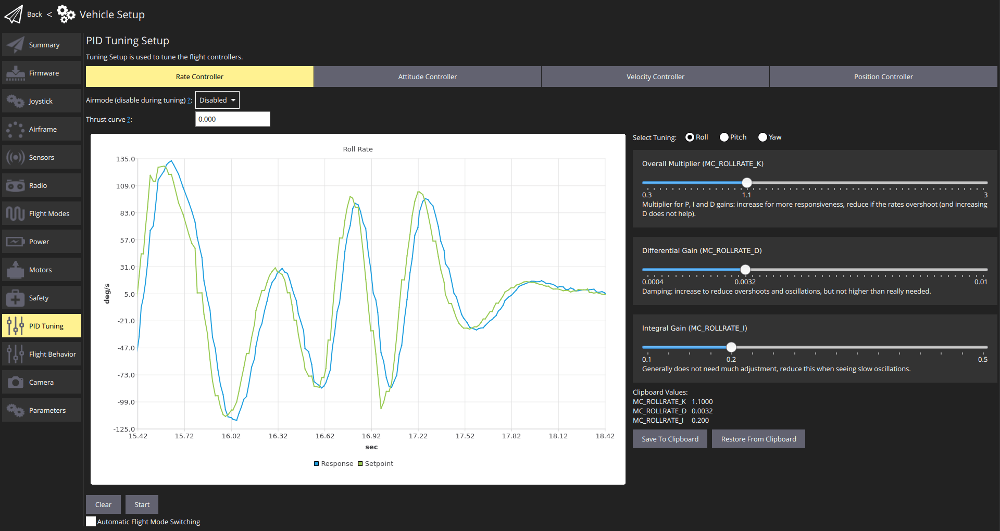
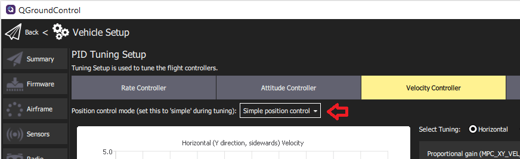

# 멀티콥터 PID 튜닝 가이드

This tutorial explains how to _manually_ tune the PID loops on PX4 for all [multicopter setups](../airframes/airframe_reference.md#copter) (Quads, Hexa, Octo etc).

:::tip
[Autotune](../config/autotune_mc.md) is recommended for most users, as it is far faster, easier and provides good tuning for most frames.
예를 들어, 새로운 ESC 또는 모터에는 다른 튜닝 게인이 필요합니다.
:::

Generally if you're using an appropriate [supported frame configuration](../airframes/airframe_reference.md#copter), the default tuning should allow you to fly the vehicle safely.
Tuning is recommended for all new vehicle setups to get the _very best_ performance, because relatively small hardware and assembly changes can affect the gains required tuning gains for optimal flight.
For example, different ESCs or motors change the optimal tuning gains.

## 소개

PX4 uses **P**roportional, **I**ntegral, **D**erivative (PID) controllers (these are the most widespread control technique).

The _QGroundControl_ **PID Tuning** setup provides real-time plots of the vehicle setpoint and response curves.
The goal of tuning is to set the P/I/D values such that the _Response_ curve matches the _Setpoint_ curve as closely as possible (i.e. a fast response without overshoots).

컨트롤러는 계층화되어 있어 상위 수준의 컨트롤러 결과를 하위 수준의 컨트롤러로 전달합니다.
The lowest-level controller is the **rate controller**, followed by the **attitude controller**, and finally the **velocity & position controller**.
PID 튜닝은 다른 모든 컨트롤러에 영향을 미치므로 속도 컨트롤러부터 시작하여 동일한 순서로 수행해야합니다.

The testing procedure for each controller (rate, attitude, velocity/position) and axis (yaw, roll, pitch) is always the same: create a fast setpoint change by moving the sticks very rapidly and observe the response.
가장 낮은 수준의 컨트롤러는 <strong x-id="1">속도 컨트롤러</strong>, <strong x-id="1">태도 컨트롤러</strong>, 마지막으로 <strong x-id="1">속도 &amp; 위치 컨트롤러</strong> 입니다.

:::tip

- 속도 컨트롤러 조정이 가장 중요하며 잘 조정된 경우 다른 컨트롤러는 종종 약간의 조정만 필요하거나 필요하지 않습니다.
- 일반적으로 롤 및 피치에 동일한 튜닝 게인을 사용할 수 있습니다.
- 곡예/안정화/고도 모드를 사용하여 속도 컨트롤러 조정
- Use [Position mode](../flight_modes_mc/position.md) to tune the _Velocity Controller_ and the _Position Controller_.
  Make sure to switch to the _Simple position control_ mode so you can generate step inputs.
  

:::

## 전제 조건

- You have selected the closest matching [default frame configuration](../config/airframe.md) for your vehicle.
  이것은 이미 비행한 기체를 제공할 것입니다.

- You should have done an [ESC calibration](../advanced_config/esc_calibration.md).

- If using PWM outputs their minimum values should be set correctly in the [Actuator Configuration](../config/actuators.md).
  These need to be set low, but such that the **motors never stop** when the vehicle is armed.

  This can be tested in [Acro mode](../flight_modes_mc/acro.md) or in [Stabilized mode](../flight_modes_mc/manual_stabilized.md):

  - 프로펠러 제거
  - 기체에 시동을 걸고 스로틀을 최소로 내립니다.
  - 차량을 모든 방향으로 60도 정도 기울입니다.
  - 모터가 꺼져 있는 지 확인합니다.

- PWM 출력을 사용하는 경우 : <a href="../advanced_config/parameter_reference.md#PWM_MIN">PWM_MIN</a>이 올바르게 설정되었습니다.
  낮게 설정해야하지만 기체 시동시에는 <strong x-id="1">모터가 절대 멈추지 않도록</strong>합니다.

- Disable [MC_AIRMODE](../advanced_config/parameter_reference.md#MC_AIRMODE) before tuning a vehicle (there is an options for this in the PID tuning screen).

:::warning
Poorly tuned vehicles are likely to be unstable, and easy to crash.
Make sure to have assigned a [Kill switch](../config/safety.md#emergency-switches).
:::

## 튜닝 절차

튜닝 절차는 다음과 같습니다.

1. Arm the vehicle, takeoff, and hover (typically in [Position mode](../flight_modes_mc/position.md)).

2. Open _QGroundControl_ **Vehicle Setup > PID Tuning**
  

3. Select the **Rate Controller** tab.

4. Confirm that the airmode selector is set to **Disabled**

5. Set the _Thrust curve_ value to: 0.3 (PWM, power-based controllers) or 1 (RPM-based ESCs)

  ::: info
  For PWM, power-based and (some) UAVCAN speed controllers, the control signal to thrust relationship may not be linear.
  그 결과 호버 추력에서 최적의 튜닝은 차량이 강한 추력으로 작동시 최적이 아닐 수 있습니다.

  추력 곡선 값을 사용하여 비선형성을 보상할 수 있습니다.

  - For PWM controllers, 0.3 is a good default (which may benefit from [further tuning](../config_mc/pid_tuning_guide_multicopter.md#thrust-curve)).
  - RPM 기반 컨트롤러의 경우 1을 사용합니다 (2 차 추력 곡선이 있으므로 추가 튜닝이 필요하지 않음).

  For more information see the [detailed PID tuning guide](../config_mc/pid_tuning_guide_multicopter.md#thrust-curve).

:::

6. Set the _Select Tuning_ radio button to: **Roll**.

7. (Optionally) Select the **Automatic Flight Mode Switching** checkbox.
  This will _automatically_ switch from [Position mode](../flight_modes_mc/position.md) to [Stabilised mode](../flight_modes_mc/manual_stabilized.md) when you press the **Start** button

8. For rate controller tuning switch to _Acro mode_, _Stabilized mode_ or _Altitude mode_ (unless automatic switching is enabled).

9. Select the **Start** button in order to start tracking the setpoint and response curves.

10. Rapidly move the _roll stick_ full range and observe the step response on the plots.
  :::tip
  Stop tracking to enable easier inspection of the plots.
  확대/축소/이동시 자동으로 발생합니다.
  Use the **Start** button to restart the plots, and **Clear** to reset them.

:::

11. Modify the three PID values using the sliders (for roll rate-tuning these affect `MC_ROLLRATE_K`, `MC_ROLLRATE_I`, `MC_ROLLRATE_D`) and observe the step response again.
  슬라이더를 움직이면 값이 기체에 저장됩니다.
  ::: info
  The goal is for the _Response_ curve to match the _Setpoint_ curve as closely as possible (i.e. a fast response without overshoots).

:::
  The PID values can be adjusted as follows:
  - P (비례) 또는 K 이득 :
    - 더 많은 응답을 위해 이것을 늘리십시오.
    - 응답이 오버 슈팅 및/또는 진동하는 경우 감소합니다 (특정 지점까지 D 게인 증가도 도움이 됨).
  - D (미분) 이득 :
    - 오버슈트 및 진동을 줄이기 위해이 값을 늘릴 수 있습니다.
    - 소음을 증폭하고 모터가 뜨거워 질 수 있으므로 필요한 만큼만 늘리십시오.
  - I (적분) 이득 :
    - 정상 상태 오류를 줄이는 데 사용
    - 너무 낮으면 응답이 설정 값에 도달하지 못할 수 있습니다 (예 : 바람)
    - 너무 높으면 느린 진동이 발생할 수 있습니다.

12. 피치와 요에 대해 위의 튜닝 프로세스를 반복합니다.
  - Use _Select Tuning_ radio button to select the axis to tune
  - 적절한 스틱을 이동합니다 (예 : 피치 스틱, 요 스틱).
  - 피치 튜닝의 경우 롤과 동일한 값으로 시작하십시오.
    :::tip
    Use the **Save to Clipboard** and **Reset from Clipboard** buttons to copy the roll settings for initial pitch settings.

:::

13. 모든 축에서 자세 콘트롤러에 대하여 튜닝 프로세스를 반복하십시오.

14. Repeat the tuning process for the velocity and positions controllers (on all the axes).

  - Use Position mode when tuning these controllers
  - Select the **Simple position control** option in the _Position control mode ..._ selector (this allows direct control for the generation of step inputs)

    

완료되었습니다 !
설정을 종료하기 전에 에어 모드를 다시 활성화하여야 합니다.
