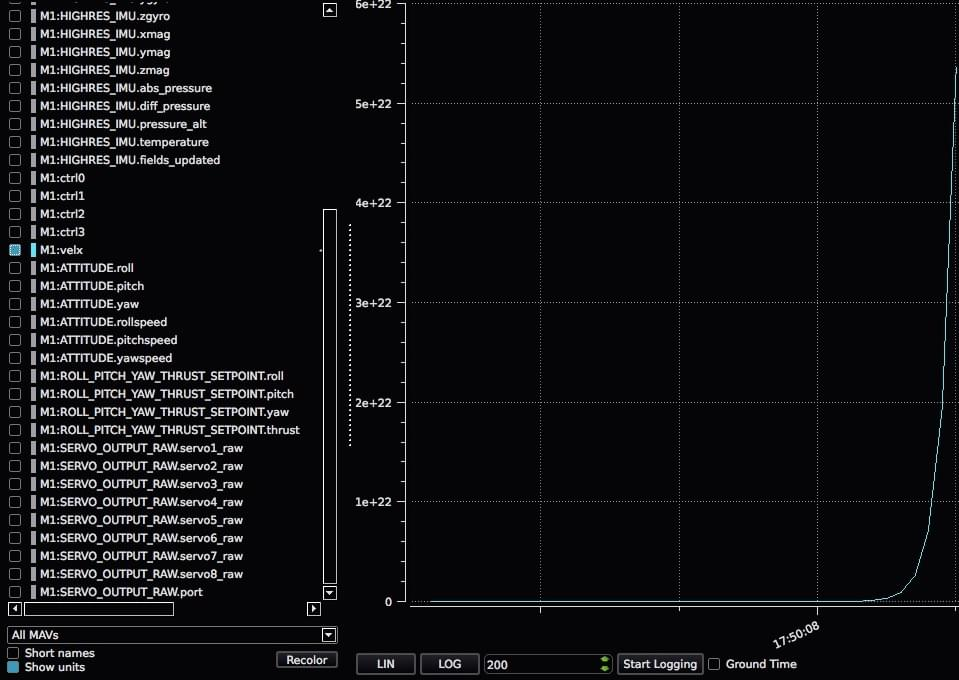

# 디버그 값 송수신

소프트웨어 개발시에 개별 중요 숫자를 출력하는 경우가 종종 있습니다.
This is where the generic `NAMED_VALUE_FLOAT`, `DEBUG` and `DEBUG_VECT` packets of MAVLink come in.

## MAVLink 디버그 메시지와 uORB 주제 간의 매핑

MAVLink 디버그 메시지는 uORB 주제로/에서 번역됩니다.
MAVLink 디버그 메시지를 보내거나 받으려면, 해당 주제를 각각 게시하거나 구독해야 합니다.
다음은 MAVLink 디버그 메시지와 uORB 주제 간의 매핑을 요약한 표입니다.

| MAVLink 메시지                                                 | uORB 주제                                                   |
| ----------------------------------------------------------- | --------------------------------------------------------- |
| NAMED_VALUE_FLOAT | debug_key_value |
| DEBUG                                                       | debug_value                          |
| DEBUG_VECT                             | debug_vect                           |

## 튜토리얼: 문자열 / 부동 소수점 쌍 보내기

This tutorial shows how to send the MAVLink message `NAMED_VALUE_FLOAT` using the associated uORB topic `debug_key_value`.

이 자습서의 코드는 다음에서 사용할 수 있습니다.

- [Debug Tutorial Code](https://github.com/PX4/PX4-Autopilot/blob/main/src/examples/px4_mavlink_debug/px4_mavlink_debug.cpp)
- [Enable the tutorial app](https://github.com/PX4/PX4-Autopilot/blob/main/boards/px4/fmu-v5/default.px4board) by ensuring the MAVLink debug app (**CONFIG_EXAMPLES_PX4_MAVLINK_DEBUG**) is in the config of your board and set set to 'y'.

디버그 게시를 설정에 필요한 것은 아래의 코드입니다.
먼저 헤더 파일을 추가합니다.

```C
#include <uORB/uORB.h>
#include <uORB/topics/debug_key_value.h>
#include <string.h>
```

그런 다음 디버그 값 주제를 광고합니다(공개된 다른 이름에 대해 하나의 광고로 충분함).
이 코드를 메인 루프 앞에 추가합니다.

```C
/* advertise debug value */
struct debug_key_value_s dbg;
strncpy(dbg.key, "velx", sizeof(dbg.key));
dbg.value = 0.0f;
orb_advert_t pub_dbg = orb_advertise(ORB_ID(debug_key_value), &dbg);
```

이렇게 하면 메인 루프에서 메시지 전송은 상당히 간단해 집니다.

```C
dbg.value = position[0];
orb_publish(ORB_ID(debug_key_value), pub_dbg, &dbg);
```

:::warning
Multiple debug messages must have enough time between their respective publishings for Mavlink to process them.
이는 코드가 여러 디버그 메시지 게시 사이에 대기하거나, 각 함수 호출 반복에서 메시지를 대체하는 것을 의미합니다.
:::

QGroundControl의 결과는 실시간 플롯에서 다음과 같습니다.



## 튜토리얼: 문자열 / 부동 소수점 쌍 수신

The following code snippets show how to receive the `velx` debug variable that was sent in the previous tutorial.

First, subscribe to the topic `debug_key_value`:

```C
#include <poll.h>
#include <uORB/topics/debug_key_value.h>

int debug_sub_fd = orb_subscribe(ORB_ID(debug_key_value));
[...]
```

이후 토픽을 폴링 처리하십시오:

```C
[...]
/* one could wait for multiple topics with this technique, just using one here */
px4_pollfd_struct_t fds[] = {
    { .fd = debug_sub_fd,   .events = POLLIN },
};

while (true) {
    /* wait for debug_key_value for 1000 ms (1 second) */
    int poll_ret = px4_poll(fds, 1, 1000);

    [...]
```

When a new message is available on the `debug_key_value` topic, do not forget to filter it based on its key attribute in order to discard the messages with key different than `velx`:

```C
    [...]
    if (fds[0].revents & POLLIN) {
        /* obtained data for the first file descriptor */
        struct debug_key_value_s dbg;

        /* copy data into local buffer */
        orb_copy(ORB_ID(debug_key_value), debug_sub_fd, &dbg);

        /* filter message based on its key attribute */
        if (strcmp(_sub_debug_vect.get().key, "velx") == 0) {
            PX4_INFO("velx:\t%8.4f", dbg.value);
        }
    }
}
```
